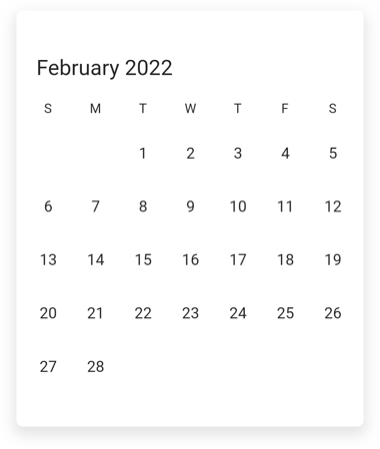
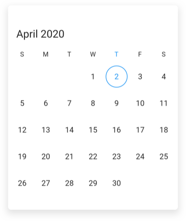
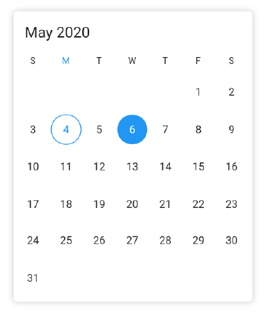
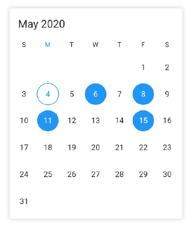
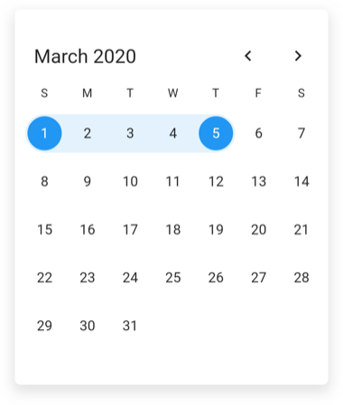
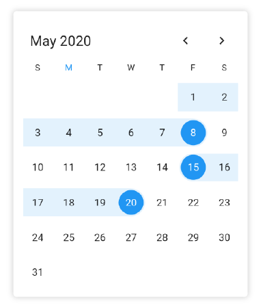
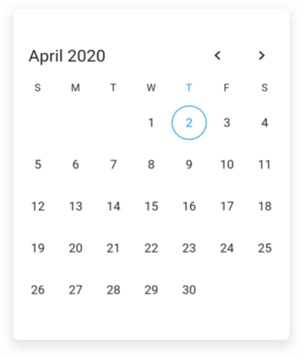

# Date Navigations in Flutter Date Range Picker (SfDateRangePicker)

## Programmatic date navigation
You can programmatically navigate dates in the calendar widget by using the [displayDate](https://pub.dev/documentation/syncfusion_flutter_datepicker/latest/datepicker/DateRangePickerController/displayDate.html)  property of [DateRangePickerController](https://pub.dev/documentation/syncfusion_flutter_datepicker/latest/datepicker/DateRangePickerController-class.html)




class MyAppState extends State<MyApp>{
         DateRangePickerController _datePickerController;
         @override
         initState(){
            _datePickerController = DateRangePickerController ();
            _datePickerController.displayDate = DateTime(2022, 02, 05);
            super.initState();
        }

@override
    Widget build(BuildContext context) {
       return MaterialApp(
           home: Scaffold(
           body: SfDateRangePicker(
           view: DateRangePickerView.month,
           controller: _datePickerController,
           ),
       ),
   );
}




## Programmatic view navigation
You can programmatically navigate view in the calendar widget by using the [view](https://pub.dev/documentation/syncfusion_flutter_datepicker/latest/datepicker/DateRangePickerController/view.html) property of `DateRangePickerController`.




class MyAppState extends State<MyApp>{
         DateRangePickerController _datePickerController;
         @override
         initState(){
            _datePickerController = DateRangePickerController ();
            _datePickerController.view =DateRangePickerView.month;
            super.initState();
       }

@override
     Widget build(BuildContext context) {
        return MaterialApp(
           home: Scaffold(
           body: SfDateRangePicker(
           controller: _datePickerController,
           ),
       ),
   );
}




## Programmatic date selection
You can programmatically select the dates in the calendar widget by using the  `DateRangePickerController` property.

### Single selection
Initially or during the run time,you can select the date programmatically by using the [selectedDate](https://pub.dev/documentation/syncfusion_flutter_datepicker/latest/datepicker/DateRangePickerController/selectedDate.html) of `DateRangePickerController` property. It is only applicable when the [selectionMode](https://pub.dev/documentation/syncfusion_flutter_datepicker/latest/datepicker/DateRangePickerSelectionMode-class.html) is set to `DateRangePickerSelectionMode.single`.




class MyApp extends StatefulWidget {
  @override
  _MyAppState createState() => _MyAppState();
}
class _MyAppState extends State<MyApp> {
  DateRangePickerController _datePickerController;

  @override
  initState() {
    _datePickerController = DateRangePickerController();
    _datePickerController.selectedDate =DateTime.now().add(Duration(days: 2));
    super.initState();
  }

  @override
  Widget build(BuildContext context) {
    return MaterialApp(
      home: Scaffold(
          body: SfDateRangePicker(
                view: DateRangePickerView.month,
                selectionMode: DateRangePickerSelectionMode.single,
                controller: _datePickerController,
              )
      ),
    );
  }
}




### Multi selection
Initially or during the run time, you can selects the multiple dates programmatically by using the [selectedDates](https://pub.dev/documentation/syncfusion_flutter_datepicker/latest/datepicker/DateRangePickerController/selectedDates.html) of `DateRangePickerController` property. It is only applicable when the `selectionMode` is set to `DateRangePickerSelectionMode.multiple`.




class MyApp extends StatefulWidget {
  @override
  _MyAppState createState() => _MyAppState();
}
class _MyAppState extends State<MyApp> {
  DateRangePickerController _datePickerController;

  @override
  initState() {
    _datePickerController = DateRangePickerController();
    _datePickerController.selectedDates =<DateTime>[
      DateTime.now().add(Duration(days: 2)),
      DateTime.now().add(Duration(days: 4)),
      DateTime.now().add(Duration(days: 7)),
      DateTime.now().add(Duration(days: 11))
    ];
    super.initState();
  }

  @override
  Widget build(BuildContext context) {
    return MaterialApp(
      home: Scaffold(
          body: SfDateRangePicker(
                view: DateRangePickerView.month,
                selectionMode: DateRangePickerSelectionMode.multiple,
                controller: _datePickerController,
              )
      ),
    );
  }
}




### Range selection
Initially or during run time, you can selects the single date range programmatically by using the [selectedRange](https://pub.dev/documentation/syncfusion_flutter_datepicker/latest/datepicker/DateRangePickerController/selectedRange.html) of `DateRangePickerController` property. It is only applicable when the `selectionMode` is set to `DateRangePickerSelectionMode.range`




class MyAppState extends State<MyApp>{
    DateRangePickerController _datePickerController;
    @override
    initState(){
      _datePickerController = DateRangePickerController ();
      _datePickerController.selectedRange = PickerDateRange(DateTime(2020,03,01),DateTime(2020,03,05));
      super.initState();
     }

    @override
    Widget build(BuildContext context) {
      return MaterialApp(
        home: Scaffold(
        body: SfDateRangePicker (
        view: DateRangePickerView.month,
        selectionMode: DateRangePickerSelectionMode.range,
        controller: _datePickerController,
        ),
      ),
    );
}




### Multi Range selection
Initially or during run time, you can selects more than one date range programmatically by using the [selectedRanges](https://pub.dev/documentation/syncfusion_flutter_datepicker/latest/datepicker/DateRangePickerController/selectedRanges.html) of `DateRangePickerController` property. It is only applicable when the `selectionMode` is set to `DateRangePickerSelectionMode.multiRange`.




class MyApp extends StatefulWidget {
  @override
  _MyAppState createState() => _MyAppState();
}
class _MyAppState extends State<MyApp> {
  DateRangePickerController _datePickerController;

  @override
  initState() {
    _datePickerController = DateRangePickerController();
    _datePickerController.selectedRanges =<PickerDateRange>[
      PickerDateRange(DateTime.now().subtract(Duration(days: 4)),
          DateTime.now().add(Duration(days: 4))),
      PickerDateRange(DateTime.now().add(Duration(days: 11)),
          DateTime.now().add(Duration(days: 16)))
    ];
    super.initState();
  }

  @override
  Widget build(BuildContext context) {
    return MaterialApp(
      home: Scaffold(
          body:SfDateRangePicker(
                view: DateRangePickerView.month,
                selectionMode: DateRangePickerSelectionMode.multiRange,
                controller: _datePickerController,
              )
      ),
    );
  }
}




## Programmatically change to adjacent dates
By default, the date can be navigated to next and previous views using the touch gesture, by swiping the control from right to left and left to right direction. The view can be also changed programmatically using the [forward](https://pub.dev/documentation/syncfusion_flutter_datepicker/latest/datepicker/DateRangePickerController/forward.html) and [backward](https://pub.dev/documentation/syncfusion_flutter_datepicker/latest/datepicker/DateRangePickerController/backward.html) methods that are available in the `DateRangePickerController`.

### Forward
You can use the `forward` method of `DateRangePickerController` for viewing the next immediate next visible dates in the `SfDateRangePicker`. It will move to next month if the calendar view is a month, similarly it will move to next week for week view and next day for day view.




class MyAppState extends State<MyApp> {
   DateRangePickerController _datePickerController;
   @override
   initState() {
      _datePickerController = DateRangePickerController ();
      super.initState();
   }

   @override
   Widget build(BuildContext context) {
       return MaterialApp(
          home: Scaffold(
          appBar: AppBar(
          title: Text('DateRangePicker Demo'),
          actions: <Widget>[
          IconButton(icon: Icon(Icons.arrow_forward),
         onPressed: () {
           _datePickerController.forward();
         },
      ),
   ],
),
        body: SfDateRangePicker(
        view: DateRangePickerView.month,
        controller: _datePickerController,
       ),
    ),
  );
}




### Backward
You can use the `backward` method of  `DateRangePickerController` for viewing the previous immediate previous visible dates in the `SfDateRangePicker`. It will move to the previous month if the calendar view is in month, similarly it will move to the previous week for week view and previous day for day view.




class MyAppState extends State<MyApp> {
   DateRangePickerController _datePickerController;

   @override
   initState() {
      _datePickerController = DateRangePickerController ();
      super.initState();
   }

   @override
   Widget build(BuildContext context) {
         return MaterialApp(
             home: Scaffold(
             appBar: AppBar(
             title: Text('DateRangePicker Demo'),
             actions: <Widget>[
             IconButton(
             icon: Icon(Icons.arrow_back),
             onPressed: () {
             _datePickerController.backward();
          },
       ),
    ],
),
            body: SfDateRangePicker(
            view: DateRangePickerView.month,
            controller: _datePickerController,
           ),
       ),
   );
}




## Navigation direction
You can navigate the Month, Year, Decade, and Century views either `Vertical` or `Horizontal` directions by setting the [navigationDirection](https://pub.dev/documentation/syncfusion_flutter_datepicker/latest/datepicker/SfDateRangePicker/navigationDirection.html) property of `DateRangePicker`.




@override
Widget build(BuildContext context) {
  return Scaffold(
    body: SfDateRangePicker(
        view: DateRangePickerView.month,
        navigationDirection: DateRangePickerNavigationDirection.vertical),
  );
}




## Show navigation arrow
Using the [showNavigationArrow](https://pub.dev/documentation/syncfusion_flutter_datepicker/latest/datepicker/SfDateRangePicker/showNavigationArrow.html) property of the `DateRangePicker` you can move to the next or previous views of the picker without swiping.




@override
Widget build(BuildContext context) {
  return Scaffold(
    body: SfDateRangePicker(
      view: DateRangePickerView.month,
      showNavigationArrow: true,
    ),
  );
}




