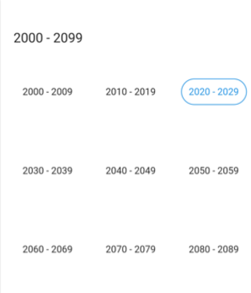
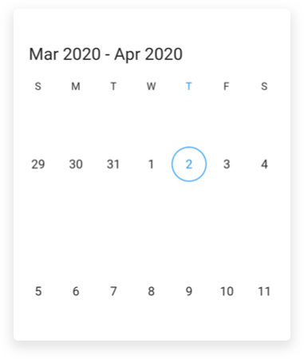

# Multiple picker Views in Flutter Date Range Picker (SfDateRangePicker)
The `SfDateRangePicker` widget provides four different types of views to display. It can be assigned to the widget constructor by using the [view](https://pub.dev/documentation/syncfusion_flutter_datepicker/latest/datepicker/SfDateRangePicker/view.html) property. Default view of the widget is month view. By default the current date will be displayed initially for all the date range picker views.

## Month view
This view displays the entire dates of a particular month. By default , the current month will be displayed on loading. The current date is provided with a separate color different from the rest of the dates color in `month view`.




@override
Widget build(BuildContext context) {
   return Scaffold(
        body: SfDateRangePicker(
       view: DateRangePickerView.month,
       )
   );
}




## Year view
This displays the entire month of a particular year. By default, the current year will be displayed on loading. You can navigate between months quickly by selecting the particular month in a `year view`.




@override
Widget build(BuildContext context) {
   return Scaffold(
             body: SfDateRangePicker(
             view: DateRangePickerView.year,
             )
      );
}




## Decade view
This view displays the period of 10 years. By default, the current year range of 10 years will be displayed on loading. You can easily navigate between month/year view to decade view by tapping the calendar header. The year can be navigated quickly by selecting a particular year from a  `decade view`.




@override
Widget build(BuildContext context) {
    return Scaffold(
               body: SfDateRangePicker(
               view: DateRangePickerView.decade,
              )
      );
}




## Century view
This view displays the period of 100 years. By default, the current year range of 100 years will be displayed on loading. You can easily navigate between month/year/decade view to century view by tapping the calendar header. You can easily navigate to a decade view by selecting decade years in `century view`.




@override
Widget build(BuildContext context) {
    return Scaffold(
               body: SfDateRangePicker(
               view: DateRangePickerView.century,
               )
      );
}




## Week view
The number of weeks in the month view can be customized by setting the [numberOfWeeksInView](https://pub.dev/documentation/syncfusion_flutter_datepicker/latest/datepicker/DateRangePickerMonthViewSettings/numberOfWeeksInView.html) property of DateRangePickerMonthViewSettings[https://pub.dev/documentation/syncfusion_flutter_datepicker/latest/datepicker/DateRangePickerMonthViewSettings-class.html].




@override
Widget build(BuildContext context) {
  return Scaffold(
    body: SfDateRangePicker(
        view: DateRangePickerView.month,
        monthViewSettings:
            DateRangePickerMonthViewSettings(numberOfWeeksInView: 2)),
  );
}




## Multi-date picker view
You can enable a multi-date range picker by using the [enableMultiView](https://pub.dev/documentation/syncfusion_flutter_datepicker/latest/datepicker/SfDateRangePicker/enableMultiView.html) property of `SfDateRangePicker`, which displays two date range pickers side by side, the space between the two date-range picker can be customized by using the [viewSpacing](https://pub.dev/documentation/syncfusion_flutter_datepicker/latest/datepicker/SfDateRangePicker/viewSpacing.html) property of `SfDateRangePicker`.




Widget build(BuildContext context) {
  return MaterialApp(
    home: Scaffold(
      body: SfDateRangePicker(
        enableMultiView: true,
        viewSpacing: 20,
      ),
    ),
  );
}




### Vertical picker
You can arrange the two date range picker views in the vertical direction by setting the [navigationDirection](https://pub.dev/documentation/syncfusion_flutter_datepicker/latest/datepicker/SfDateRangePicker/navigationDirection.html) as `DateRangePickerNavigationDirection.vertical` in the `SfDateRangePicker`.`




@override
Widget build(BuildContext context) {
  return MaterialApp(
    home: Scaffold(
        body: SfDateRangePicker(
      enableMultiView: true,
      navigationDirection: DateRangePickerNavigationDirection.vertical,
      viewSpacing: 10,
    )),
  );
}




## See also

[How to switch between the date range picker views in the Flutter date range picker (SfDateRangePicker)?](https://www.syncfusion.com/kb/11305/how-to-switch-between-the-date-range-picker-views-in-flutter-date-range-picker)

[How to get the current view dates in Flutter date range picker (SfDateRangePicker)?](https://www.syncfusion.com/kb/11331/how-to-get-the-current-view-dates-in-flutter-date-range-picker-sfdaterangepicker)
