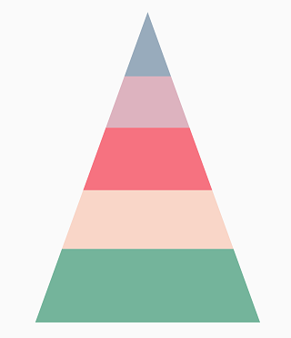
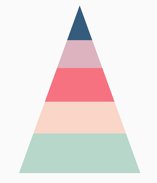

# Selection in SfPyramid Charts

The selection feature in chart let you to select a segment in a series or the series itself. This features allows you to select either individual or cluster of segments in the chart series.

 

    @override
      Widget build(BuildContext context) {
        return Scaffold(
          body: Center(
            child: Container(
              child: SfPyramidChart(
                series: PyramidSeries<SalesData, String>(
                    dataSource: chartData,
                    xValueMapper: (SalesData sales, _) =>   sales.year,
                    yValueMapper: (SalesData sales, _) => sales.sales,
                    selectionSettings: SelectionSettings(
                    // Enables the selection
                    enable: true)
                  )
              )
            )
          )
        );
      }



## Customizing the segments

You can customize the segments using the below properties.

* [`selectedColor`](https://pub.dev/documentation/syncfusion_flutter_charts/latest/charts/SelectionSettings/selectedColor.html) - used to change the background color of selected segment.
* [`unselectedColor`](https://pub.dev/documentation/syncfusion_flutter_charts/latest/charts/SelectionSettings/unselectedColor.html) - used to change the background color of unselected segment.
* [`selectedBorderColor`](https://pub.dev/documentation/syncfusion_flutter_charts/latest/charts/SelectionSettings/selectedBorderColor.html) - used to change the stroke color of the selected segment.
* [`selectedBorderWidth`](https://pub.dev/documentation/syncfusion_flutter_charts/latest/charts/SelectionSettings/selectedBorderWidth.html) - used to change the stroke width of the selected segment.
* [`unselectedBorderColor`](https://pub.dev/documentation/syncfusion_flutter_charts/latest/charts/SelectionSettings/unselectedBorderColor.html) - used to change the stroke color of the unselected segment.
* [`unselectedBorderWidth`](https://pub.dev/documentation/syncfusion_flutter_charts/latest/charts/SelectionSettings/unselectedBorderWidth.html) - used to change the stroke width of the unselected segment.
* [`selectedOpacity`](https://pub.dev/documentation/syncfusion_flutter_charts/latest/charts/SelectionSettings/selectedOpacity.html) - used to control the transparency of the selected segment.
* [`unselectedOpacity`](https://pub.dev/documentation/syncfusion_flutter_charts/latest/charts/SelectionSettings/unselectedOpacity.html) - used to control the transparency of the selected segment.

 

    @override
      Widget build(BuildContext context) {
        return Scaffold(
          body: Center(
            child: Container(
              child: SfPyramidChart(
                series: PyramidSeries<SalesData, String>(
                    dataSource: chartData,
                    xValueMapper: (SalesData sales, _) =>   sales.year,
                    yValueMapper: (SalesData sales, _) => sales.sales,
                    selectionSettings: SelectionSettings(
                    // Enables the selection
                    enable: true,
                    selectedColor: Colors.red,
                    unselectedColor: Colors.grey,
                    )
                  )
              )
            )
          )
        );
      }



## Multi-selection

Multiple selection can be enabled using the [`enableMultiSelection`](https://pub.dev/documentation/syncfusion_flutter_charts/latest/charts/SfPyramidChart/enableMultiSelection.html) property of chart.

 

    @override
    Widget build(BuildContext context) {
        return Scaffold(
            body: Center(
                child: Container(
                    child: SfPyramidChart(
                        // Enables multiple selection
                        enableMultiSelection: true
                    )
                )
            )
        );
    }



## Selection on initial rendering

You can select a point or series programmatically on a chart using [`initialSelectedDataIndexes`](https://pub.dev/documentation/syncfusion_flutter_charts/latest/charts/PyramidSeries/initialSelectedDataIndexes.html) property of chart.

 

    @override
    Widget build(BuildContext context) {
        return Scaffold(
            body: Center(
                child: Container(
                    child: SfPyramidChart(
                        initialSelectedDataIndexes: [2, 0]
                    )
                )
            )
        );
    }



Also refer [selection event](./events#onselectionchanged) for customizing the selection further.