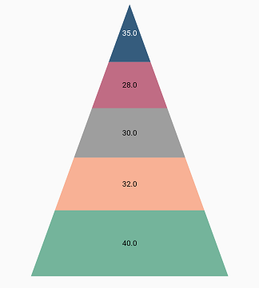
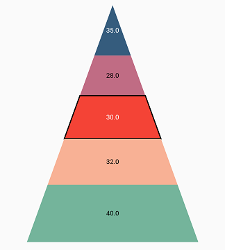
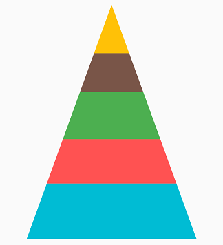

# Pyramid series customization 

## Animation

[`SfPyramidChart`](https://pub.dev/documentation/syncfusion_flutter_charts/latest/charts/SfPyramidChart-class.html) provides animation support for the series. Series will be animated while rendering. Animation is enabled by default, you can also control the duration of the animation using [`animationDuration`](https://pub.dev/documentation/syncfusion_flutter_charts/latest/charts/PyramidSeries/animationDuration.html) property. You can disable the animation by setting 0 value to that property.

 

    @override
    Widget build(BuildContext context) {
        return Scaffold(
            body: Center(
                child: Container(
                    child: SfPyramidChart(
                        series:PyramidSeries<ChartData, String>(
                            dataSource: chartData,
                            xValueMapper: (ChartData data, _) => data.x,
                            yValueMapper: (ChartData data, _) => data.y,
                            animationDuration: 1000,
                        )
                    )
                )
            )
        );
    }



## Empty points

The data points that has null value are considered as empty points. Empty data points are ignored and not plotted in the chart. By using [`emptyPointSettings`](https://pub.dev/documentation/syncfusion_flutter_charts/latest/charts/PyramidSeries/emptyPointSettings.html) property in series, you can decide the action taken for empty points. Available [`modes`](https://pub.dev/documentation/syncfusion_flutter_charts/latest/charts/EmptyPointMode-class.html) are [`gap`](https://pub.dev/documentation/syncfusion_flutter_charts/latest/charts/EmptyPointMode-class.html), [`zero`](https://pub.dev/documentation/syncfusion_flutter_charts/latest/charts/EmptyPointMode-class.html), [`drop`](https://pub.dev/documentation/syncfusion_flutter_charts/latest/charts/EmptyPointMode-class.html) and [`average`](https://pub.dev/documentation/syncfusion_flutter_charts/latest/charts/EmptyPointMode-class.html). Default mode of the empty point is [`gap`](https://pub.dev/documentation/syncfusion_flutter_charts/latest/charts/EmptyPointMode-class.html).

 

    @override
    Widget build(BuildContext context) {
        
         final List<ChartData> chartData = [
            ChartData('David', null),
            ChartData('Steve', 38),
            ChartData('Jack', 34),
            ChartData('Others', 52)
        ];
        return Scaffold(
            body: Center(
                child: SfPyramidChart(
                        series:PyramidSeries<ChartData, String>(
                            dataSource: chartData,
                            dataLabelSettings: DataLabelSettings(isVisible:true),
                            emptyPointSettings: EmptyPointSettings(mode: EmptyPointMode.average),
                            xValueMapper: (ChartData data, _) => data.x,
                            yValueMapper: (ChartData data, _) => data.y
                        )
                    )
                )
            );
        }



### Empty point customization

Specific color for empty point can be set by [`color`](https://pub.dev/documentation/syncfusion_flutter_charts/latest/charts/EmptyPointSettings/color.html) property in [`emptyPointSettings`](https://pub.dev/documentation/syncfusion_flutter_charts/latest/charts/PyramidSeries/emptyPointSettings.html). The [`borderWidth`](https://pub.dev/documentation/syncfusion_flutter_charts/latest/charts/EmptyPointSettings/borderWidth.html) property is used to change the stroke width of the empty point and [`borderColor`](https://pub.dev/documentation/syncfusion_flutter_charts/latest/charts/EmptyPointSettings/borderColor.html) is used to change the stroke color of the empty point.

 

    @override
    Widget build(BuildContext context) {
     final List<ChartData> chartData = [
      ChartData('David', null),
      ChartData('Steve', 38),
      ChartData('Jack', 34),
      ChartData('Others', 52)
    ];
    return Scaffold(
        body: Center(
            child: Container(
                child: SfPyramidChart(
                        series:PyramidSeries<ChartData, String>(
                            dataSource: chartData,
                            dataLabelSettings: DataLabelSettings(isVisible:true),
                            emptyPointSettings: EmptyPointSettings(mode: EmptyPointMode.average,
                            color: Colors.red,
                            borderColor: Colors.black,
                            borderWidth: 2),
                            xValueMapper: (ChartData data, _) => data.x,
                            yValueMapper: (ChartData data, _) => data.y
                        )
                    )
                )
            )
        );
    }



## Color mapping for data points   

The [`pointColorMapper`](https://pub.dev/documentation/syncfusion_flutter_charts/latest/charts/PyramidSeries/pointColorMapper.html) property is used to map the color field from the data source. 

 

    @override
     Widget build(BuildContext context) {
    static dynamic chartData = <SalesData>[
    SalesData('Rent', 1000,Colors.teal),
    SalesData('Food', 2500,Colors.lightBlue),
    SalesData('Savings', 760,Colors.brown),
    SalesData('Tax', 1897,Colors.grey),
    SalesData('Others', 2987,Colors.blueGrey)
     ];
        return Scaffold(
            body: Center(
                child: Container(
                    child: SfPyramidChart(
                        series:PyramidSeries<ChartData, String>(
                            dataSource: chartData,
                            xValueMapper: (ChartData data, _) => data.x,
                            yValueMapper: (ChartData data, _) => data.y,
                            //map Color for each dataPoint datasource.
                            pointColorMapper: (ChartData sales,_) => sales.color,
                        )
                    )
                )
            )
        );
    }



