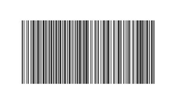

# Getting Started with Flutter Barcode Generator (SfBarcodeGenerator)

This section explains the steps required to add the barcode and set its symbology. This section covers only basic features needed to get started with Syncfusion barcode generator widget. 

## Add Flutter Barcode to an application

Create a simple project using the instructions given in the [Getting Started with your first Flutter app](https://flutter.dev/docs/get-started/test-drive?tab=vscode#create-app) documentation.

**Add dependency**

Add the Syncfusion Flutter Barcode dependency to your pubspec.yaml file.

 

    dependencies:

    syncfusion_flutter_barcodes: ^18.1.36-beta



**Get packages**

Run the following command to get the required packages.

 

    $ flutter pub get



**Import package**

Import the following package in your Dart code.

 

    import 'package:syncfusion_flutter_barcodes/barcodes.dart';



## Initialize the barcode

Add the Barcode Generator widget as a child of any widget. Here, the widget is added as a child of the container widget and the height to the container is specified (otherwise it will take full container height).

 

    @override
    Widget build(BuildContext context) {
        return MaterialApp(
            home: Scaffold(
                body: Center(
                    child: Container(
                         height: 150,
                        child:SfBarcodeGenerator(value:'http://www.syncfusion.com')
                        )
                    )
                )      
            );
        }



N> The default symbology of SfBarcodeGenerator is [`Code128`](https://pub.dev/documentation/syncfusion_flutter_barcodes/latest/barcodes/Code128-class.html).

## Initialize QR Code symbology

You can set the required symbology type to the barcode generator based on input value by initializing the [`symbology`](https://pub.dev/documentation/syncfusion_flutter_barcodes/latest/barcodes/Symbology-class.html) property. In the following code snippet, the QR code is set as the barcode symbology.

 

    @override
    Widget build(BuildContext context) {
        return MaterialApp(
            home: Scaffold(
                body: Center(
                    child: Container(
                        height: 350,
                        width: 350,
                        child:SfBarcodeGenerator(value:'http://www.syncfusion.com',
                         symbology: QRCode())
                        )
                    )
                )      
            );
        }



## Display input value

The provided input value can be displayed below the barcode by enabling the [`showValue`](https://pub.dev/documentation/syncfusion_flutter_barcodes/latest/barcodes/SfBarcodeGenerator/showValue.html) property of barcode as like the following code snippet,

 

    @override
    Widget build(BuildContext context) {
        return MaterialApp(
            home: Scaffold(
                body: Center(
                    child: Container(
                        height: 350,
                        width: 350,
                        child:SfBarcodeGenerator(value:'http://www.syncfusion.com',
                         showValue: true, textSpacing: 15,
                         symbology: QRCode())
                        )
                    )
                )      
            );
        }



