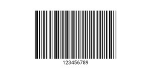
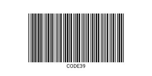
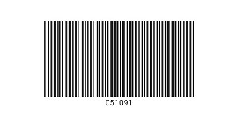

# One-dimensional symbology

The one-dimensional barcode represents the data by varying the widths and spacings of parallel lines. These types of barcode are also known as linear barcode types. The Syncfusion flutter barcode generator supports the following one-dimensional barcode types:

`Codabar`
`Code39`
`Code93`
`UPCA`
`UPCE`
`EAN8`
`EAN13`
`Code128`
`Code128A`
`Code128B`
`Code128C`

## Codabar

`Codabar` is a discrete numeric symbology that is used in libraries, blood banks and a variety of other information processing applications.

* Encodes only numeric characters and some special characters like dash (-), colon (:), slash (/), plus (+).

* Each character has three bars and four spaces.

* Uses characters of A, B, C, D as start and stop characters.

 

    @override
        Widget build(BuildContext context) {
            return Scaffold(
            backgroundColor: Colors.white,
            body: Center(
                child: Container(
                    height: 150,
                    child: SfBarcodeGenerator( 
                        value: '123456789',
                        showValue: true,
                        symbology: Codabar(module: 2),),
        )
      ),
    );
  }



## Code39

Code39 is a Symbology of Barcode that encodes alphanumeric characters into a series of bars. A special start / stop character is placed at the beginning and ending of each barcode. Code 39 is the only type of barcode that does not require a checksum for common use.

* Allows character set of digits (0-9), upper case alphabets (A-Z), and symbols like space, minus (-), plus (+), period (.), dollar sign ($), slash (/), and percent (%).

* Each character is encoded with 5 bars and 4 spaces where 3 are wide and 6 are narrow.

 

    @override
    Widget build(BuildContext context){
      return Scaffold(
        backgroundColor: Colors.white,
        body: Center(
          child: Container(
            height: 150,
             child: SfBarcodeGenerator( 
               value: 'CODE39',
               showValue: true,
                symbology: Code39(module: 2),),
            )
        ),
      );
    }



The `enableCheckSum` property of `Code39` barcode allows to add the check digit along with the input value. The default value of `enableCheckSum` property is true.

## Code39 Extended

`Code39 Extended` Symbology is an extended version of Code39 that supports full ASCII character set. So, it encodes lower case alphabets (a-z) as well as special characters on the keyboard.

 

    @override
    Widget build(BuildContext context) {
        return Scaffold(
            backgroundColor: Colors.white,
            body: Center(
                child: Container(
                    height: 150,
                    child: SfBarcodeGenerator(
                        value: '051091',
                        showValue: true,
                        symbology: Code39Extended(module: 2),
                    )
                ),
            )
        );
    }



As like `Code39`, the `code39 Extended` supports the 'enableCheckSum` property.

## Code93

`Code93` is designed to complement and improve upon `Code39`. It represents the full ASCII character set by using the combination of 2 characters. It is a continuous, variable-length symbology and it produces denser code.

* Encodes character set of uppercase alphabets (A-Z), digits (0-9), and special characters like asterisk (*), dash (-), dollar ($), percent (%), Space, dot (.), slash (/), and plus (+).

* The asterisk (*) is not a true encoding character, but it is the start and stop symbol for `Code93` Symbology.

 

    @override
    Widget build(BuildContext context) {
    return Scaffold(
      backgroundColor: Colors.white,
      body: Center(
        child: Container(
          height: 150,
          child: SfBarcodeGenerator(value: '01234567',
            showValue: true,
            symbology: Code93(module: 2),),
        )
      ),
    );
  }



## Code128

`Code128` is a variable length, high density, alphanumeric, linear Barcode Symbology. It is capable of encoding full ASCII character set and extended character sets. This symbol includes a checksum digit for verification and the Barcode may also be verified character-by-character for parity of each data byte. It is used majorly in shipping and packaging industries in worldwide.

The `Code128` symbology encodes the input symbols supported by `Code128A`, `Code128B`, `Code128C`. The default symbology type of barcode generator is `Code128`

 

    @override
    Widget build(BuildContext context) {
    return Scaffold(
      backgroundColor: Colors.white,
      body: Center(
        child: Container(
          height: 150,
          child: SfBarcodeGenerator(value: 'CODE128',
            showValue: true,
            symbology: Code128(module: 2),),
        )
      ),
    );
  }



## Code128A

`Code128A` (or Chars Set A) includes all the standard upper case U.S. alphanumeric keyboard characters and punctuation characters together with the control characters, (characters with ASCII values from 0 to 95 inclusive), and seven special characters.

 

    @override
    Widget build(BuildContext context) {
    return Scaffold(
      backgroundColor: Colors.white,
      body: Center(
        child: Container(
          height: 150,
          child: SfBarcodeGenerator(value: 'CODE128A',
            showValue: true,
            symbology: Code128A(module: 2),),
        )
      ),
    );
  }



## Code128B

`Code128B` (or Chars Set B) includes all the standard upper case alphanumeric keyboard characters and punctuation characters together with lower case alphabetic characters (characters with ASCII values from 32 to 127 inclusive), and seven special characters.

 

    @override
    Widget build(BuildContext context) {
    return Scaffold(
      backgroundColor: Colors.white,
      body: Center(
        child: Container(
          height: 150,
          child: SfBarcodeGenerator(value: 'CODE128B',
            showValue: true,
            symbology: Code128B(module: 2),),
        )
      ),
    );
  }



## Code128C

`Code128C` (or Chars Set C) includes a set of 100 digit pairs from 00 to 99 inclusive, as well as three special characters. This allows numeric data to be encoded as two data digits per symbol character effectively twice the density of standard data.

 

    @override
    Widget build(BuildContext context) {
    return Scaffold(
      backgroundColor: Colors.white,
      body: Center(
        child: Container(
          height: 150,
          child: SfBarcodeGenerator(value: '1234567890',
            showValue: true,
            symbology: Code128C(module: 2),),
        )
      ),
    );
  }



**Code 128 Special characters**

The last seven characters of Code Sets A and B (character values 96 - 102) and the last three characters of Code Set C (character values 100 - 102) are special non-data characters with no ASCII character equivalents that have a particular significance to the Barcode reading device.

## UPCA

`UPCA` symbology supports only numeric symbols. It encodes 11 digits of provided numeric data (0 to 9) along with the check digit at its end, for a total of 12 digits of input data. 

* This type is mainly used for tracking items and consumer goods.

 

    @override
    Widget build(BuildContext context) {
    return Scaffold(
      backgroundColor: Colors.white,
      body: Center(
        child: Container(
          height: 150,
          child: SfBarcodeGenerator(value: '72527273070',
            showValue: true,
            symbology: UPCA(module: 2),),
        )
      ),
    );
  }



## UPCE

As like `UPCA`, the `UPCE` symbology supports only numeric symbols. It is a zero suppressed version of `UPCA` symbology where it uses only 6 digits and does not use the middle guard.

* This type is mainly used on products with very small packaging details.

 

    @override
    Widget build(BuildContext context) {
    return Scaffold(
      backgroundColor: Colors.white,
      body: Center(
        child: Container(
          height: 150,
          child: SfBarcodeGenerator(value: '310194',
            showValue: true,
            symbology: UPCE(module: 2),),
        )
      ),
    );
  }



## EAN-13

`EAN13` is implemented based upon the `UPCA` standard. As like `UPCA`, it supports only the numeric character. It encodes the 12 digits of input data with the check digit at its end.

* This difference between the `UPCA` and `EAN13` is that number system used in the `EAN13` is 2 digits ranges from 00 to 99 whereas the number system used in `UPCA` is single digits range from 0 to 9.

 

    @override
        Widget build(BuildContext context) {
    return Scaffold(
      backgroundColor: Colors.white,
      body: Center(
        child: Container(
          height: 150,
          child: SfBarcodeGenerator(value: '9735940564824',
            showValue: true,
            symbology: EAN13(module: 2),),
        )
      ),
    );
  }



## EAN-8

`EAN8` is equivalent to the `UPCE` for small packaging details. It is shorter than the `EAN13` barcode and it is longer than `UPCE`.

As like `EAN13` and `UPCE`, it encodes 7 digits of numeric data with the check digit at its end.

 

    @override
    Widget build(BuildContext context) {
    return Scaffold(
      backgroundColor: Colors.white,
      body: Center(
        child: Container(
          height: 150,
          child: SfBarcodeGenerator(value: '11223344',
            showValue: true,
            symbology: EAN8(module: 2),),
        )
      ),
    );
  }



All the one dimensional symbology supports the `module` property. The property is used to define the size of the smallest line or dot of the barcode. If this property is not set, the size of the smallest line of the barcode is calculated based on the available size and total number of bars for the provided input value.