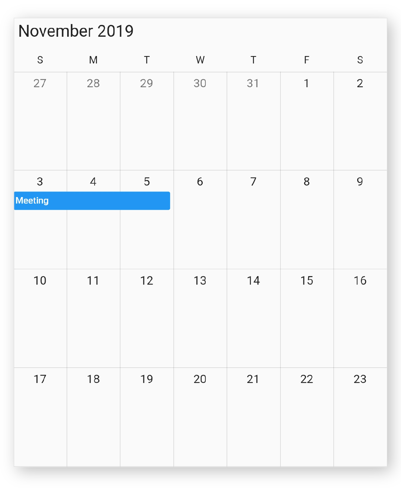
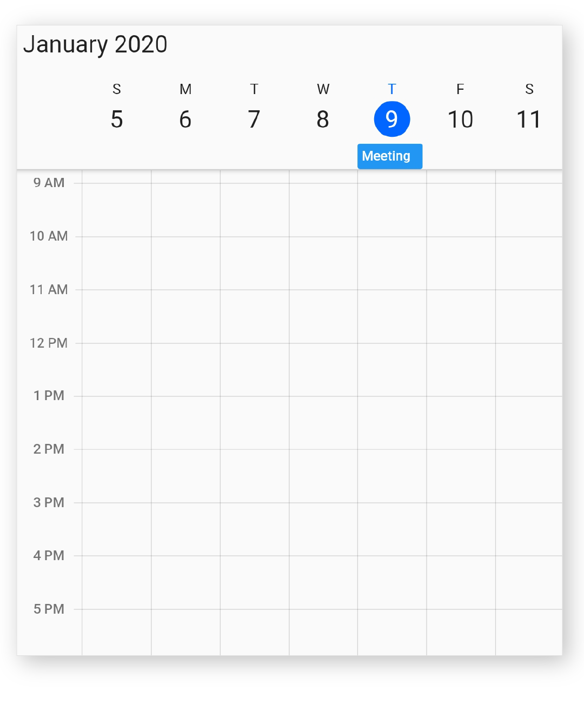
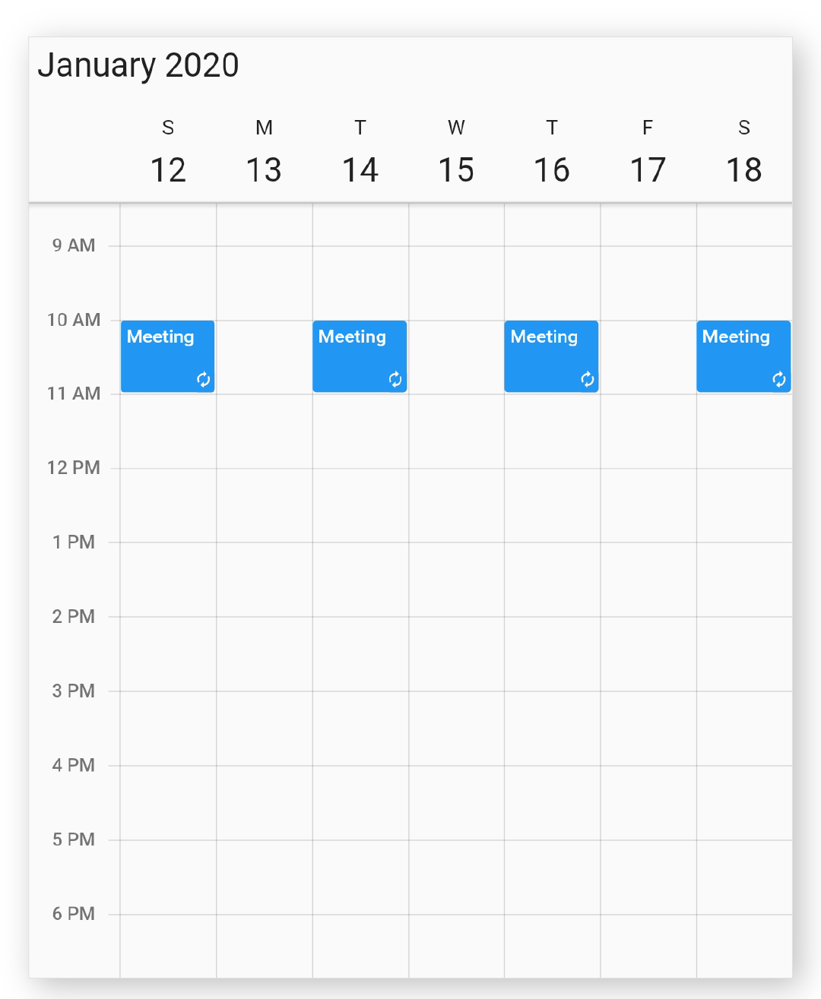
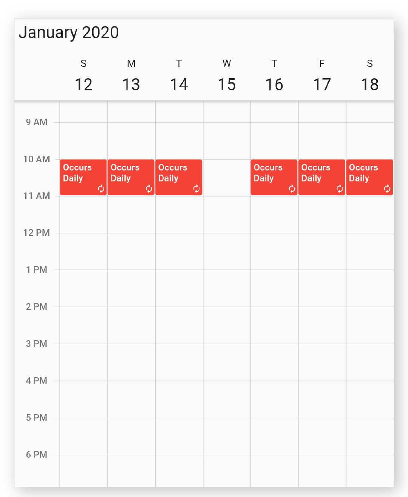
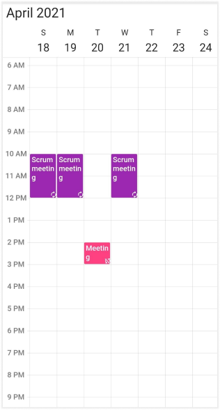
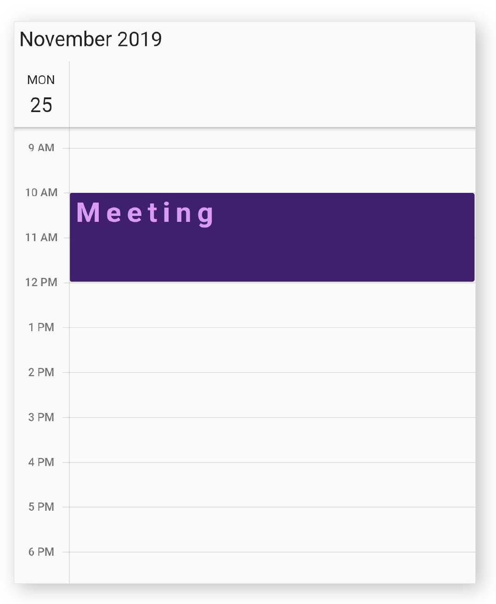
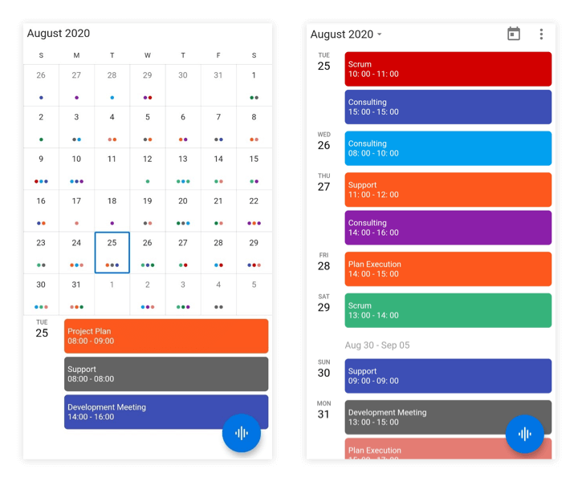

# Appointments in Flutter Event Calendar (SfCalendar)

SfCalendar widget has a built-in capability to handle the appointment arrangement internally based on the [CalendarDataSource](https://pub.dev/documentation/syncfusion_flutter_calendar/latest/calendar/CalendarDataSource-class.html). [Appointment](https://pub.dev/documentation/syncfusion_flutter_calendar/latest/calendar/Appointment-class.html) is a class, which holds the details about the appointment to be rendered in calendar.




@override
Widget build(BuildContext context) {
  return MaterialApp(
    home: Scaffold(
      body: Container(
        child: SfCalendar(
          view: CalendarView.week,
          dataSource: _getCalendarDataSource(),
        ),
      ),
    ),
  );
}

_AppointmentDataSource _getCalendarDataSource() {
  List<Appointment> appointments = <Appointment>[];
  appointments.add(Appointment(
    startTime: DateTime.now(),
    endTime: DateTime.now().add(Duration(minutes: 10)),
    subject: 'Meeting',
    color: Colors.blue,
    startTimeZone: '',
    endTimeZone: '',
  ));

  return _AppointmentDataSource(appointments);
}

class _AppointmentDataSource extends CalendarDataSource {
  _AppointmentDataSource(List<Appointment> source){
   appointments = source; 
  }
}




## Calendar data source and mapping

`CalendarDataSource` is an abstract class used to set the appointment datasource for calendar and has properties to map the custom appointments to the calendar `Appointment`. Calendar supports full data binding to any type of List source. Specify the corresponding property override method to map the properties in the underlying data source to the calendar appointments in `CalendarDataSource`.

| Property Name | Description |
|-------------------------------------------------------------------------------------------------------------------------------------------------------------------------------------------------------|--------------------------------------------------------------------------------------------------------------------------|
| [getStartTime](https://pub.dev/documentation/syncfusion_flutter_calendar/latest/calendar/CalendarDataSource/getStartTime.html) | Maps the property name of custom class, which is equivalent for `startTime` of `Appointment`. |
| [getEndTime](https://pub.dev/documentation/syncfusion_flutter_calendar/latest/calendar/CalendarDataSource/getEndTime.html) | Maps the property name of custom class, which is equivalent for `endTime` of `Appointment`. |
| [getStartTimeZone](https://pub.dev/documentation/syncfusion_flutter_calendar/latest/calendar/CalendarDataSource/getStartTimeZone.html) | Maps the property name of custom class, which is equivalent for `startTimeZone` of `Appointment`. |
| [getEndTimeZone](https://pub.dev/documentation/syncfusion_flutter_calendar/latest/calendar/CalendarDataSource/getEndTimeZone.html) | Maps the property name of custom class, which is equivalent for `endTimeZone` of `Appointment`. |
| [getSubject](https://pub.dev/documentation/syncfusion_flutter_calendar/latest/calendar/CalendarDataSource/getSubject.html) | Maps the property name of custom class, which is equivalent for `subject` of `Appointment`. |
| [getColor](https://pub.dev/documentation/syncfusion_flutter_calendar/latest/calendar/CalendarDataSource/getColor.html) | Maps the property name of custom class, which is equivalent for `color` of `Appointment`. |
| [isAllDay](https://pub.dev/documentation/syncfusion_flutter_calendar/latest/calendar/CalendarDataSource/isAllDay.html) | Maps the property name of custom class, which is equivalent for `isAllDay` of `Appointment`. |
| [getRecurrenceRule](https://pub.dev/documentation/syncfusion_flutter_calendar/latest/calendar/CalendarDataSource/getRecurrenceRule.html) | Maps the property name of custom class, which is equivalent for `recurrenceRule` of `Appointment`. |
| [getNotes](https://pub.dev/documentation/syncfusion_flutter_calendar/latest/calendar/CalendarDataSource/getNotes.html) | Maps the property name of custom class which is equivalent for `notes` of `Appointment`. |
| [getLocation](https://pub.dev/documentation/syncfusion_flutter_calendar/latest/calendar/CalendarDataSource/getLocation.html) | Maps the property name of custom class, which is equivalent for `location` of `Appointment`. |
| [getRecurrenceExceptionDates](https://pub.dev/documentation/syncfusion_flutter_calendar/latest/calendar/CalendarDataSource/getRecurrenceExceptionDates.html) | Maps the property name of custom class, which is equivalent for `recurrenceExceptionDates` of `Appointment`. |

>**NOTE**
* Custom appointment class should contain two date time fields as mandatory.




class MeetingDataSource extends CalendarDataSource {
  MeetingDataSource(List<Meeting> source){
    appointments = source;
  }

  @override
  DateTime getStartTime(int index) {
    return appointments![index].from;
  }

  @override
  DateTime getEndTime(int index) {
    return appointments![index].to;
  }

  @override
  bool isAllDay(int index) {
    return appointments![index].isAllDay;
  }

  @override
  String getSubject(int index) {
    return appointments![index].eventName;
  }

  @override
  String getStartTimeZone(int index) {
    return appointments![index].startTimeZone;
  }

  @override
  String getEndTimeZone(int index) {
    return appointments![index].endTimeZone;
  }

  @override
  Color getColor(int index) {
    return appointments![index].background;
  }
}




You must call the notifier of the `CalendarDataSource` when the datasource collection is modified to reflect the changes on UI that is an appointment added to the datasource or removed from the datasource.




events.dataSource.clear();
events.notifyListeners(CalendarDataSourceAction.reset, null);




## Creating business objects

You can create a custom class `Meeting` with mandatory fields `from`, and `to`.




class Meeting {
  Meeting({this.eventName = '', required this.from, required this.to, required this.background, this.isAllDay = false});

  String eventName;
  DateTime from;
  DateTime to;
  Color background;
  bool isAllDay;
}




You can map those properties of `Meeting` class with our calendar widget by using the `CalendarDataSource` override methods properties.




class MeetingDataSource extends CalendarDataSource {
  MeetingDataSource(List<Meeting> source){
    appointments = source;
  }

  @override
  DateTime getStartTime(int index) {
    return appointments![index].from;
  }

  @override
  DateTime getEndTime(int index) {
    return appointments![index].to;
  }

  @override
  bool isAllDay(int index) {
    return appointments![index].isAllDay;
  }

  @override
  String getSubject(int index) {
    return appointments![index].eventName;
  }

  @override
  String getStartTimeZone(int index) {
    return appointments![index].startTimeZone;
  }

  @override
  String getEndTimeZone(int index) {
    return appointments![index].endTimeZone;
  }

  @override
  Color getColor(int index) {
    return appointments![index].background;
  }
}




You can schedule meetings for a day by setting `From` and `To` of Meeting class. Create meetings of type `List<Meeting>` and assign those appointments collection Meetings to the [appointments](https://pub.dev/documentation/syncfusion_flutter_calendar/latest/calendar/CalendarDataSource/appointments.html) property of `CalendarDataSource`.




@override
Widget build(BuildContext context) {
  return MaterialApp(
    home: Scaffold(
      body: Container(
        child: SfCalendar(
          view: CalendarView.week,
          dataSource: _getCalendarDataSource(),
        ),
      ),
    ),
  );
}

MeetingDataSource _getCalendarDataSource() {
  List<Meeting> meetings = <Meeting>[];
  meetings.add(Meeting(
      eventName: 'meeting',
      from: DateTime(2019, 12, 18, 10),
      to: DateTime(2019, 12, 18, 12),
      background: Colors.green,
      isAllDay: false));

  return MeetingDataSource(meetings);
}




## Spanned appointments

Spanned Appointment is an appointment, which lasts more than 24 hours. It does not block out time slots in SfCalendar, it will render in `All-Day appointment panel` exclusively.




MeetingDataSource _getCalendarDataSource() {
  List<Meeting> meetings = <Meeting>[];
  meetings.add(Meeting(
      eventName: 'meeting',
      from: DateTime(2019, 11, 03, 10),
      to: DateTime(2019, 11, 05, 12),
      background: Colors.blue));

  return MeetingDataSource(meetings);
}




## All day appointment

All-Day appointment is an appointment which is scheduled for a whole day. It can be set by using the [isAllDay](https://pub.dev/documentation/syncfusion_flutter_calendar/latest/calendar/Appointment/isAllDay.html) property in the `Appointment`.




_AppointmentDataSource _getCalendarDataSource() {
  List<Appointment> appointments = <Appointment>[];
  appointments.add(Appointment(
    startTime: DateTime.now(),
    endTime: DateTime.now().add(Duration(minutes: 10)),
    subject: 'Meeting',
    color: Colors.blue,
    isAllDay: true,
  ));

  return _AppointmentDataSource(appointments);
}




>**NOTE**
* Appointment which lasts through an entire day (exact 24 hours) will be considered as all day appointment without setting the IsAllDay property. For example, 06/12/2019 12:00AM to 06/12/2019 12:00AM.

## Recurrence appointment

Recurring appointment on a daily, weekly, monthly, or yearly interval. Recurring appointments can be created by setting the [recurrenceRule](https://pub.dev/documentation/syncfusion_flutter_calendar/latest/calendar/Appointment/recurrenceRule.html) property in `Appointment`.

### Recurrence rule

The `recurrenceRule` is a string value (RRULE) that contains the details of the recurrence appointments such as repeat type - daily/weekly/monthly/yearly, how many times it needs to be repeated, the interval duration, also the time period to render the appointment, and more. The `recurrenceRule` has the following properties and based on this property value, the recurrence appointments are rendered in the SfCalendar widget with its respective time period.

| PropertyName | Purpose |
|--------------|----------------------------------------------------------------------------------------------------------------------------------------------------------------------------------------------------------------------------------------------------------------------------------------------------------------------------------------------------------------------------------------------------------------------------------------------------|
| FREQ | Maintains the Repeat type value of the appointment. (Example: Daily, Weekly, Monthly, Yearly, Every week day) Example: FREQ=DAILY;INTERVAL=1 |
| INTERVAL | Maintains the interval value of the appointments. For example, when you create the daily appointment at an interval of 2, the appointments are rendered on the days Monday, Wednesday and Friday. (creates the appointment on all days by leaving the interval of one day gap) Example: FREQ=DAILY;INTERVAL=1 |
| COUNT | It holds the appointment’s count value. For example, when the recurrence appointment count value is 10, it means 10 appointments are created in the recurrence series. Example: FREQ=DAILY;INTERVAL=1;COUNT=10 |
| UNTIL | This property is used to store the recurrence end date value. For example, when you set the end date of appointment as 6/30/2020, the UNTIL property holds the end date value when the recurrence actually ends. Example: FREQ=DAILY;INTERVAL=1;UNTIL=20200827T183000Z |
| BYDAY | It holds the “DAY” values of an appointment to render.For example, when you create the weekly appointment, select the day(s) from the day options (Monday/Tuesday/Wednesday/Thursday/Friday/Saturday/Sunday).  When Monday is selected, the first two letters of the selected day “MO” is stored in the “BYDAY” property.  When you select multiple days, the values are separated by commas. Example: FREQ=WEEKLY;INTERVAL=1;BYDAY=MO,WE;COUNT=10 |
| BYMONTHDAY | This property is used to store the date value of the Month while creating the Month recurrence appointment. For example, when you create a Monthly recurrence appointment in the date 3, it means the BYMONTHDAY holds the value 3 and creates the appointment on 3rd day of every month. Example: FREQ=MONTHLY;BYMONTHDAY=3;INTERVAL=1;COUNT=10 |
| BYMONTH | This property is used to store the index value of the selected Month while creating the yearly appointments. For example, when you create the yearly appointment in the Month June, it means the index value for June month is 6 and it is stored in the BYMONTH field.  The appointment is created on every 6th month of a year. Example: FREQ=YEARLY;BYMONTHDAY=16;BYMONTH=6;INTERVAL=1;COUNT=10 |
| BYSETPOS | This property is used to store the index value of the week. For example, when you create the monthly appointment in second week of the month, the index value of the second week (2) is stored in BYSETPOS. Example: FREQ=MONTHLY;BYDAY=MO;BYSETPOS=2;UNTIL=20200810T183000Z . If the property value is set to -1 and -2, the appointment will be added to the last week and second last week of the month.|

### Adding recurrence appointment

Calendar appointment recurrenceRule is used to populate the required recurring appointment collection in a specific pattern. RRULE can be directly set to the `recurrenceRule` property of `Appointment`.




@override
Widget build(BuildContext context) {
  return MaterialApp(
    home: Scaffold(
      body: Container(
        child: SfCalendar(
          view: CalendarView.week,
          dataSource: _getCalendarDataSource(),
        ),
      ),
    ),
  );
}

_AppointmentDataSource _getCalendarDataSource() {
  List<Appointment> appointments = <Appointment>[];

  appointments.add(Appointment(
      startTime: DateTime(2019, 12, 16, 10),
      endTime: DateTime(2019, 12, 16, 12),
      subject: 'Meeting',
      color: Colors.blue,
      recurrenceRule: 'FREQ=DAILY;INTERVAL=2;COUNT=10'));

  return _AppointmentDataSource(appointments);
}

class _AppointmentDataSource extends CalendarDataSource {
  _AppointmentDataSource(List<Appointment> source) {
    appointments = source;
  }
}




### Creating custom recurrence appointment

For creating custom recurrence appointment, you need to create a custom class `Meeting` with mandatory fields `from`, `to`, and `recurrenceRule`.




class Meeting {
  Meeting(
      {this.eventName = '',
      required this.from,
      required this.to,
      required this.background,
      this.isAllDay = false,
      this.recurrenceRule});

  String eventName;
  DateTime from;
  DateTime to;
  Color background;
  bool isAllDay;
  String? recurrenceRule;
}




You can map those properties of `Meeting` class with our calendar widget by using `CalendarDataSource`.




class MeetingDataSource extends CalendarDataSource {
  MeetingDataSource(List<Meeting> source){
    appointments = source;
  }

  @override
  DateTime getStartTime(int index) {
    return appointments![index].from;
  }

  @override
  DateTime getEndTime(int index) {
    return appointments![index].to;
  }

  @override
  bool isAllDay(int index) {
    return appointments![index].isAllDay;
  }

  @override
  String getSubject(int index) {
    return appointments![index].eventName;
  }

  @override
  Color getColor(int index) {
    return appointments![index].background;
  }

  @override
  String getRecurrenceRule(int index) {
    return appointments![index].recurrenceRule;
  }
}




You can schedule recurring meetings for daily, weekly, monthly, or yearly interval by setting `recurrenceRule` of `Meeting` class. Create meetings of type List <Meeting> and assign those appointments collection Meetings to the `appointments` property of `CalendarDataSource`.




@override
Widget build(BuildContext context) {
  return MaterialApp(
    home: Scaffold(
      body: Container(
        child: SfCalendar(
          view: CalendarView.week,
          dataSource: _getCalendarDataSource(),
        ),
      ),
    ),
  );
}

MeetingDataSource _getCalendarDataSource() {
  List<Meeting> meetings = <Meeting>[];
  meetings.add(Meeting(
      eventName: 'meeting',
      from: DateTime(2019, 12, 18, 10),
      to: DateTime(2019, 12, 18, 12),
      background: Colors.green,
      isAllDay: false,
      recurrenceRule: 'FREQ=WEEKLY;BYDAY=MO,WE,FR;INTERVAL=1;COUNT=10'));
  return MeetingDataSource(meetings);
}}

class MeetingDataSource extends CalendarDataSource {
  MeetingDataSource(List<Meeting> source){
    appointments = source;
  }

  @override
  DateTime getStartTime(int index) {
    return appointments![index].from;
  }

  @override
  DateTime getEndTime(int index) {
    return appointments![index].to;
  }

  @override
  bool isAllDay(int index) {
    return appointments![index].isAllDay;
  }

  @override
  String getSubject(int index) {
    return appointments![index].eventName;
  }

  @override
  Color getColor(int index) {
    return appointments![index].background;
  }

  @override
  String getRecurrenceRule(int index) {
    return appointments![index].recurrenceRule;
  }
}

class Meeting {
  Meeting({this.eventName = '',
    required this.from,
    required this.to,
    required this.background,
    this.isAllDay = false,
    this.recurrenceRule});

  String eventName;
  DateTime from;
  DateTime to;
  Color background;
  bool isAllDay;
  String? recurrenceRule;
}




### How to get the Recurrence editor field values from RRULE?

You can get the Recurrence properties form `RRULE` by using the [parseRRule](https://pub.dev/documentation/syncfusion_flutter_calendar/latest/calendar/SfCalendar/parseRRule.html) method from calendar.




DateTime dateTime = DateTime(2020, 03, 15);
RecurrenceProperties recurrenceProperties =
    SfCalendar.parseRRule('FREQ=DAILY;INTERVAL=1;COUNT=1', dateTime);




Recurrence properties retrieved from above method,
recurrenceProperties.recurrenceType = RecurrenceType.daily;
recurrenceProperties.interval = 1;
recurrenceProperties.recurrenceCount = 3;
recurrenceProperties.recurrenceRange = RecurrenceRange.count;

### How to get the recurrence dates from RRULE?

You can get the occurrences date time list of recurring appointment from RRULE using the [getRecurrenceDateTimeCollection](https://pub.dev/documentation/syncfusion_flutter_calendar/latest/calendar/SfCalendar/getRecurrenceDateTimeCollection.html) method of SfCalendar.




DateTime dateTime = DateTime(2020, 03, 15);
List<DateTime> dateCollection = SfCalendar.getRecurrenceDateTimeCollection(
    'FREQ=DAILY;INTERVAL=1;COUNT=3', dateTime);




The following occurrence dates can be retrieved from the given RRULE:
var date0 = 3/15/2019;
var date1 = 3/16/2019;
var date2 = 3/16/2019;

## Recurrence pattern exceptions

You can delete or change any recurrence pattern appointment by handling exception dates and exception appointments to that recurring appointment.

### Recurrence exception dates

You can delete any occurrence appointment, which exception from the recurrence pattern appointment by adding exception dates to the recurring appointment.

### Recurrence exception appointment

You can also change any occurrence appointment, which exception from recurrence pattern appointment by adding the recurrence exception appointment to the calendar `dataSource`.

### Create recurrence exceptions for calendar appointment

You can add the recurrence exception appointments and recurrence exception dates to `Appointment` or remove them from `Appointment` by using its [recurrenceExceptionDates](https://pub.dev/documentation/syncfusion_flutter_calendar/latest/calendar/Appointment/recurrenceExceptionDates.html) property.

### Delete occurrence from recurrence pattern appointment or adding exception dates to recurrence pattern appointment

You can delete any of occurrence, which is an exception from the recurrence pattern appointment by using the `recurrenceExceptionDates` property of `Appointment`. The deleted occurrence date will be considered as recurrence exception dates.




@override
Widget build(BuildContext context) {
  return MaterialApp(
    home: Scaffold(
      body: Container(
        child: SfCalendar(
          view: CalendarView.week,
          dataSource: _getCalendarDataSource(),
        ),
      ),
    ),
  );
}

_AppointmentDataSource _getCalendarDataSource() {
  List<Appointment> appointments = <Appointment>[];

  DateTime exceptionDate = DateTime(2019, 12, 20);
  appointments.add(Appointment(
      startTime: DateTime(2019, 12, 16, 10),
      endTime: DateTime(2019, 12, 16, 12),
      subject: 'Occurs daily',
      color: Colors.red,
      recurrenceRule: 'FREQ=DAILY;COUNT=20',
      recurrenceExceptionDates: <DateTime>[exceptionDate]));

  return _AppointmentDataSource(appointments);
}

class _AppointmentDataSource extends CalendarDataSource {
  _AppointmentDataSource(List<Appointment> source) {
    appointments = source;
  }
}




>**NOTE**
* Exception dates should be Universal Time Coordinates (UTC) time zone.

### Create recurrence exceptions for custom appointment

You can add the recurrence exception appointments and recurrence exception dates to the CustomAppointment or remove them from CustomAppointment, you can create a custom class `Meeting` with mandatory field `RecurrenceExceptionDates`.

### Delete occurrence from recurrence pattern appointment or adding exception dates to recurrence pattern appointment

You can delete any occurrence, which is an exception from the recurrence pattern appointment by using the `getRecurrenceExceptionDates` override method of `CalendarDataSource`, which is used to map the exception dates to the calendar recurrence appointment. The deleted occurrence date will be considered as recurrence exception dates.
To add the exception dates in the recurrence series of custom appointment, add the `recurrenceExceptionDates` property to custom class Meeting.




@override
Widget build(BuildContext context) {
    return MaterialApp(
      home: Scaffold(
        body: Container(
          child: SfCalendar(
            view: CalendarView.week,
            dataSource: _getCalendarDataSource(),
          ),
        ),
      ),
    );
}

MeetingDataSource _getCalendarDataSource() {
  List<Meeting> meetings = <Meeting>[];

  DateTime exceptionDate = DateTime(2019, 12, 24);
  meetings.add(Meeting(
      eventName: 'meeting',
      from: DateTime(2019, 12, 18, 10),
      to: DateTime(2019, 12, 18, 12),
      background: Colors.green,
      isAllDay: false,
      recurrenceRule: 'FREQ=DAILY;COUNT=20',
      exceptionDates: <DateTime>[exceptionDate]));

  return MeetingDataSource(meetings);
}

class MeetingDataSource extends CalendarDataSource {
  MeetingDataSource(List<Meeting> source) {
    appointments = source;
  }

  @override
  DateTime getStartTime(int index) {
    return appointments![index].from;
  }

  @override
  DateTime getEndTime(int index) {
    return appointments![index].to;
  }

  @override
  bool isAllDay(int index) {
    return appointments![index].isAllDay;
  }

  @override
  String getSubject(int index) {
    return appointments![index].eventName;
  }

  @override
  Color getColor(int index) {
    return appointments![index].background;
  }

  @override
  String getRecurrenceRule(int index) {
    return appointments![index].recurrenceRule;
  }

  @override
  List<DateTime> getRecurrenceExceptionDates(int index) {
    return appointments![index].exceptionDates;
  }
}

class Meeting {
  Meeting(
      {this.eventName = '',
      required this.from,
      required this.to,
      required this.background,
      this.isAllDay = false,
      this.recurrenceRule,
      this.exceptionDates});

  String eventName;
  DateTime from;
  DateTime to;
  Color background;
  bool isAllDay;
  String? recurrenceRule;
  List<DateTime>? exceptionDates;
}




>**NOTE**
* Exception dates should be Universal Time Coordinates (UTC) time zone.

### Add exception appointment to the recurrence series

Add an exception appointment that is changed or modified occurrence of the recurrence pattern appointment to the `dateSource` of the `SfCalendar`. To add a changed occurrence, ensure to set the [RecurrenceId](https://pub.dev/documentation/syncfusion_flutter_calendar/latest/calendar/Appointment/recurrenceId.html) of that occurrence, and add the date of that occurrence to the [RecurrenceExceptionDates](https://pub.dev/documentation/syncfusion_flutter_calendar/latest/calendar/Appointment/recurrenceExceptionDates.html) of recurrence pattern appointment. The `RecurrenceId` of the changed occurrence should hold the exact recurrence pattern appointment [Id](https://pub.dev/documentation/syncfusion_flutter_calendar/latest/calendar/Appointment/id.html). We can get the type of appointment from the [appointmentType](https://pub.dev/documentation/syncfusion_flutter_calendar/latest/calendar/Appointment/appointmentType.html) property. 




@override
  Widget build(BuildContext context) {
    return MaterialApp(
      home: Scaffold(
        body: Container(
          child: SfCalendar(
            view: CalendarView.week,
            dataSource: _getDataSource(),
          ),
        ),
      ),
    );
  }
AppointmentDataSource _getDataSource() {
  final List<Appointment> appointments = <Appointment>[];
  final DateTime exceptionDate = DateTime(2021, 04, 20);

  final Appointment recurrenceAppointment = Appointment(
    startTime: DateTime(2021, 04, 12, 10),
    endTime: DateTime(2021, 04, 12, 12),
    subject: 'Scrum meeting',
    id: '01',
    recurrenceRule: 'FREQ=DAILY;INTERVAL=1;COUNT=10',
    color: Colors.purple,
    recurrenceExceptionDates: <DateTime>[exceptionDate],
  );
  appointments.add(recurrenceAppointment);

  final Appointment exceptionAppointment = Appointment(
      startTime: exceptionDate.add(const Duration(hours: 14)),
      endTime: exceptionDate.add(const Duration(hours: 15)),
      subject: 'Meeting',
      id: '02',
      color: Colors.pinkAccent,
      recurrenceId: recurrenceAppointment.id);

  appointments.add(exceptionAppointment);

  return AppointmentDataSource(appointments);
}




>**NOTE**
* The RecurrenceId of the changed occurrence should hold the exact recurrence pattern appointment Id.
* The exception appointment should be a normal appointment, and should not be created as recurring appointment, since its occurrence is from recurrence pattern.
* The exception recurrence appointment does not have the RecurrenceRule, so for an exception appointment, it will be reset to empty.

## Appearance customization
The Calendar appointment text style can be customized by using the [appointmentTextStyle](https://pub.dev/documentation/syncfusion_flutter_calendar/latest/calendar/SfCalendar/appointmentTextStyle.html) property of the calendar.




@override
Widget build(BuildContext context) {
  return MaterialApp(
    home: Scaffold(
      body: Container(
        child: SfCalendar(
          view: CalendarView.day,
          dataSource: _getCalendarDataSource(),
          appointmentTextStyle: TextStyle(
              fontSize: 25,
              color: Color(0xFFd89cf6),
              letterSpacing: 5,
              fontWeight: FontWeight.bold),
        ),
      ),
    ),
  );
}




## Appointment time format
You can customize the displaying time format in the appointment widget in the month agenda view and schedule view of calendar by specifying the [appointmentTimeTextFormat](https://pub.dev/documentation/syncfusion_flutter_calendar/latest/calendar/SfCalendar/appointmentTimeTextFormat.html) property of the SfCalendar.



@override
 Widget build(BuildContext context) {
   return SfCalendar(
     view: CalendarView.month,
     dataSource: _calendarDataSource,
     appointmentTimeTextFormat: 'HH:mm',
     monthViewSettings: MonthViewSettings(
         showAgenda: true
     ),
   );
 }




## Appointment helper

### Get visible appointments

You can get the list of visible appointments by using the [getVisibleAppointments](https://pub.dev/documentation/syncfusion_flutter_calendar/latest/calendar/CalendarDataSource/getVisibleAppointments.html) method available in the Calendar data source.




@override
initState() {
  _calendarController = CalendarController();
  _dataSource = _getCalendarDataSource();
  super.initState();
}

@override
Widget build(BuildContext context) {
  return MaterialApp(
    home: Scaffold(
      body: SfCalendar(
        view: CalendarView.month,
        controller: _calendarController,
        dataSource: _dataSource,
        onViewChanged: (ViewChangedDetails details) {
          List<DateTime> dates = details.visibleDates;
          String calendarTimeZone = '';
          List<Object> appointment = _dataSource.getVisibleAppointments(
              dates[0], calendarTimeZone,
              dates[(details.visibleDates.length) - 1]);
         },
       ),
     ),
   );
 }
}




>**NOTE**
* The `startTime` is required for the starting date from which to obtain the appointments.

### Get occurrence appointment

Gets an occurrence at the specified date within a series of recurring appointments by using the [getOccurrenceAppointment](https://pub.dev/documentation/syncfusion_flutter_calendar/latest/calendar/CalendarDataSource/getOccurrenceAppointment.html). 




class MyAppState extends State<MyApp>{

 CalendarController _calendarController;
 _AppointmentDataSource _dataSource;
 Appointment recurrenceApp;
 
 @override
 Widget build(BuildContext context) {
   return MaterialApp(
     home: Scaffold(
       body: SfCalendar(
         view: CalendarView.month,
         controller: _calendarController,
		       dataSource: _dataSource,
		       onTap: (CalendarTapDetails details) {
         	DateTime date = details.date;
         	String calendarTimeZone = '';
         	Appointment appointment = _dataSource.getOccurrenceAppointment(
             	recurrenceApp, date, calendarTimeZone);
       },
       ),
     ),
   );
 }
}




>**NOTE**
* If there is no appointment occurring on the date specified, null is returned.
* The `patternAppointment` is required for the start appointment in a recurrence series from which the occurrence appointments are cloned with pattern appointment characteristics.
* The `date` is required for the occurrence appointment.

### Get pattern appointment

Gets the pattern appointment for the specified occurrence by using the [getPatternAppointment](https://pub.dev/documentation/syncfusion_flutter_calendar/latest/calendar/CalendarDataSource/getPatternAppointment.html).




class MyAppState extends State<MyApp>{

 CalendarController _calendarController;
 _AppointmentDataSource _dataSource;
 Appointment recurrenceApp;
 
 @override
 Widget build(BuildContext context) {
   return MaterialApp(
     home: Scaffold(
       body: SfCalendar(
         view: CalendarView.month,
         controller: _calendarController,
		       dataSource: _dataSource,
		       onTap: (CalendarTapDetails details) {
         	DateTime date = details.date;
         	String calendarTimeZone = '';
         	Appointment appointment = _dataSource.getPatternAppointment(
             	occurrenceAppointment, calendarTimeZone);
       },
       ),
     ),
   );
 }
}




>**NOTE**
* The `occurrenceAppointment` is required for which the Pattern appointment is obtained.

## See also

* [How to design and configure your appointment editor in event calendar widget Flutter](https://www.syncfusion.com/kb/11204/how-to-design-and-configure-your-appointment-editor-in-event-calendar-widget-flutter)
* [How to get appointment details from the OnTap event of the Flutter event calendar](https://www.syncfusion.com/kb/10999/how-to-get-appointment-details-from-the-ontap-event-of-the-flutter-event-calendar)
* [How to style the appointment in the Flutter event calendar (SfCalendar)](https://www.syncfusion.com/kb/12162/how-to-style-the-appointment-in-the-flutter-event-calendar-sfcalendar)
* [How to exclude the dates from recurrence appointments in the Flutter event calendar (SfCalendar)](https://www.syncfusion.com/kb/12161/how-to-exclude-the-dates-from-recurrence-appointments-in-the-flutter-event-calendar)
* [How to add recurring appointments until the specified date in the Flutter event calendar (SfCalendar)](https://www.syncfusion.com/kb/12158/how-to-add-recurring-appointments-until-the-specified-date-in-the-flutter-event-calendar)
* [How to add the appointments to the Fire base database using appointment editor in the Flutter event calendar (SfCalendar)](https://www.syncfusion.com/kb/12110/how-to-add-the-appointments-to-the-firebase-database-using-appointment-editor-in-the)
* [How to work with the Fire base database and the Flutter event calendar (SfCalendar) for appointments](https://www.syncfusion.com/kb/12067/how-to-work-with-the-firebase-database-and-the-flutter-event-calendar-sfcalendar-for)
* [How to add google calendar events to the Flutter event calendar (SfCalendar)](https://www.syncfusion.com/kb/12116/how-to-add-google-calendar-events-to-the-flutter-event-calendar-sfcalendar)
* [How to add additional attributes in events in the Flutter event calendar (SfCalendar)](https://www.syncfusion.com/kb/12209/how-to-add-additional-attributes-in-events-in-the-flutter-event-calendar-sfcalendar)
* [How to add the appointments using the onTap callback in the Flutter event calendar (SfCalendar)](https://www.syncfusion.com/kb/12300/how-to-add-the-appointments-using-the-ontap-callback-in-the-flutter-calendar)
* [How to set the arbitrary height to appointments in the Flutter event calendar (SfCalendar)](https://www.syncfusion.com/kb/12279/how-to-set-the-arbitrary-height-to-appointments-in-the-flutter-event-calendar-sfcalendar)
* [How to get the recurrence date collection in the Flutter event calendar (SfCalendar)](https://www.syncfusion.com/kb/12344/how-to-get-the-recurrence-date-collection-in-the-flutter-event-calendar-sfcalendar)
* [How to get the recurrence properties from RRULE in the Flutter calendar](https://www.syncfusion.com/kb/12370/how-to-get-the-recurrence-properties-from-rrule-in-the-flutter-calendar)
* [How to update blackout dates using onViewChanged callback in the Flutter calendar](https://www.syncfusion.com/kb/12368/how-to-update-blackout-dates-using-onviewchanged-callback-in-the-flutter-calendar)
* [How to use navigation drawer for view switching in the Flutter calendar](https://www.syncfusion.com/kb/12361/how-to-use-navigation-drawer-for-view-switching-in-the-flutter-calendar)
* [How to show the tapped appointment details on another page in the Flutter event calendar](https://www.syncfusion.com/kb/12358/how-to-show-the-tapped-appointment-details-on-another-page-in-the-flutter-event-calendar)
* [How to load appointments On-Demand in Flutter Calendar](https://www.syncfusion.com/kb/12658/how-to-load-appointments-on-demand-in-flutter-calendar)
* [How to load the google calendar events to the Flutter Calendar (SfCalendar) in iOS](https://www.syncfusion.com/kb/12647/how-to-load-the-google-calendar-events-to-the-flutter-calendar-sfcalendar-in-ios)
* [How to perform the CRUD operations in Flutter Calendar using Fire base database](https://www.syncfusion.com/kb/12623/how-to-perform-the-crud-operations-in-flutter-calendar-using-firebase-database)
* [How to add the appointments to Fire store Database using Flutter Calendar](https://www.syncfusion.com/kb/12616/how-to-add-the-appointments-to-firestore-database-using-flutter-calendar)
* [How to perform the CRUD operations in Flutter Calendar using Fire store database](https://www.syncfusion.com/kb/12661/how-to-perform-the-crud-operations-in-flutter-calendar-using-firestore-database)