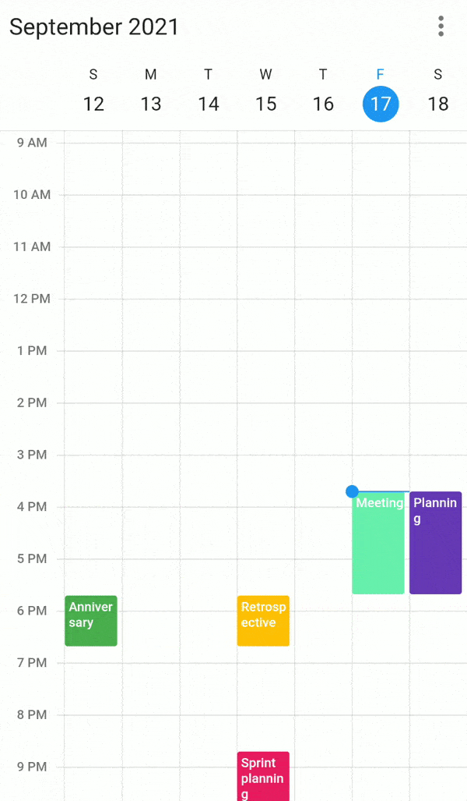
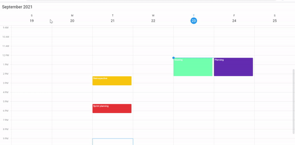

# Appointment Drag and Drop in Flutter Event Calendar (SfCalendar)

Appointments can be rescheduled using the drag and drop operation. To perform drag-and-drop operations within the calendar, enable the [allowDragAndDrop]() property of SfCalendar.




@override
Widget build(BuildContext context) {
  return MaterialApp(
    home: Scaffold(
      body: Container(
        child: SfCalendar(
            view: CalendarView.week,
            dataSource: _getCalendarDataSource(),
            allowDragAndDrop: true
        ),
      ),
    ),
  );
}




>**NOTE**
* It is not applicable for month view in mobile platform.

## onDragStart

[onDragStart]() callback was called whenever the appointment starts to drag in the SfCalendar. The [AppointmentDragStartDetails]() arguments contains the dragging appointment and associated resource details. 

[Appointment]() - Get the dragged appointment details. 
[Resource]() - Get the resource details.




@override
Widget build(BuildContext context) {
  return MaterialApp(
    home: Scaffold(
      body: Container(
        child: SfCalendar(
          view: CalendarView.week,
          dataSource: _getCalendarDataSource(),
		  allowDragAndDrop: true,
		  onDragStart: dragStart,
        ),
      ),
    ),
  );
}

void dragStart(AppointmentDragStartDetails appointmentDragStartDetails) {
  var appointment = appointmentDragStartDetails.appointment;
  var resource = appointmentDragStartDetails.resource;
}




## onDragUpdate

[onDragUpdate]() callback was called whenever the appointment is dragging in the SfCalendar. The [AppointmentDragUpdateDetails]() arguments contains the dragging appointment, dragging time, dragging offset, source resource and target resource details. 

[Appointment]() - Get the dragged appointment details. 
[Dragging time]() - Get the resource details.
[Dragging offset]() - Get the drag position.
[SourceResource]() - Get the source resource details.
[Target resource]() - Get the resource details.




@override
Widget build(BuildContext context) {
  return MaterialApp(
    home: Scaffold(
      body: Container(
        child: SfCalendar(
          view: CalendarView.week,
          dataSource: _getCalendarDataSource(),
		  allowDragAndDrop: true,
		  onDragUpdate: dragUpdate,
        ),
      ),
    ),
  );
}

void dragUpdate(AppointmentDragUpdateDetails appointmentDragUpdateDetails) {
  var appointment = appointmentDragUpdateDetails.appointment;
  var draggingTime = appointmentDragUpdateDetails.draggingTime;
  var draggingOffset = appointmentDragUpdateDetails.draggingPosition;
  var resource = appointmentDragUpdateDetails.sourceResource;
  var targetResource = appointmentDragUpdateDetails.targetResource;
}




## onDragEnd

[onDragEnd]() callback called when the dragging appointment is dropped in the SfCalendar. The [AppointmentDragEndDetails]() arguments contains the dropped appointment, dropping time, source and target resource details. 

[Appointment] - Get the dragged appointment details. 
[Drapping time] - Get the resource details.
[Resource] - Get the resource details.
[Target resource] - Get the target resource details.




@override
Widget build(BuildContext context) {
  return MaterialApp(
    home: Scaffold(
      body: Container(
        child: SfCalendar(
          view: CalendarView.week,
          dataSource: _getCalendarDataSource(),
		  allowDragAndDrop: true,
		  onDragUpdate: dragUpdate,
        ),
      ),
    ),
  );
}

void dragUpdate(AppointmentDragUpdateDetails appointmentDragUpdateDetails) {
  var appointment = appointmentDragUpdateDetails.appointment;
  var draggingTime = appointmentDragUpdateDetails.draggingTime;
  var draggingOffset = appointmentDragUpdateDetails.draggingPosition;
  var resource = appointmentDragUpdateDetails.sourceResource;
  var targetResource = appointmentDragUpdateDetails.targetResource;
}




## Disabling navigation when dragging appointment

You can restrict the dragging appointment navigation to the next/previous view when the appointment reaches the start/end point of the current view in calendar by using the [allowNavigation]() property of `DragDropSettings`. Default value of `allowNavigation` property is true.




@override
Widget build(BuildContext context) {
  return MaterialApp(
    home: Scaffold(
      body: Container(
        child: SfCalendar(
          view: CalendarView.week,
          dataSource: _getCalendarDataSource(),
          allowDragAndDrop: true,
          dragAndDropSettings: DragAndDropSettings(
              allowNavigation: true),
        ),
      ),
    ),
  );
}
	



## Disabling scroll when dragging appointment

You can restrict the timeslot views auto scroll when the appointment reaches the start/end point of the view port in the timeslot views of calendar by using the [allowScroll]() property of [DragDropSettings]().




@override
Widget build(BuildContext context) {
  return MaterialApp(
    home: Scaffold(
      body: Container(
        child: SfCalendar(
          view: CalendarView.week,
          dataSource: _getCalendarDataSource(),
          allowDragAndDrop: true,
          dragAndDropSettings: DragAndDropSettings(
              allowScroll: true),
        ),
      ),
    ),
  );
}
	



## Disabling dragging time indicator
[showTimeIndicator]() - Using this property can handle the time indicator whether it should visible or not, which shows the dragged appointment current position time in time text slots. Default value of the [ShowTimeIndicator]() property is true. Also you can set the time indicator style and format by using [indicatorTimeFormat]() and [timeIndicatorStyle]().




@override
Widget build(BuildContext context) {
  return MaterialApp(
    home: Scaffold(
      body: Container(
        child: SfCalendar(
          view: CalendarView.week,
          dataSource: _getCalendarDataSource(),
          allowDragAndDrop: true,
          dragAndDropSettings: DragAndDropSettings(
              indicatorTimeFormat: 'hh:mm',
              showTimeIndicator: true,
              timeIndicatorStyle: TextStyle(backgroundColor: Colors.red)),
        ),
      ),
    ),
  );
}
	



## Appointment resize
[allowAppointmentResize]() property allows to reschedule the appointment by resizing the appointment in desktop platforms.




@override
Widget build(BuildContext context) {
  return MaterialApp(
    home: Scaffold(
      body: Container(
        child: SfCalendar(
          view: CalendarView.week,
          dataSource: _getCalendarDataSource(),
		  allowAppointmentResize: true
        ),
      ),
    ),
  );
}




>**NOTE**
* It is not applicable for mobile platforms.

### onAppointmentResizeStart
[onAppointmentResizeStart]() callback was called whenever the appointment starts to resizing in SfCalendar. The [AppointmentResizeStartDetails]() arguments contains the resizing appointment, and resource details. 
[Resizing appointment]() - Get the resizing appointment details.
[Resource]() - Get the resource details.




@override
Widget build(BuildContext context) {
  return MaterialApp(
    home: Scaffold(
      body: Container(
        child: SfCalendar(
          view: CalendarView.week,
          dataSource: _getCalendarDataSource(),
		  allowAppointmentResize: true,
		  onAppointmentResizeStart: resizeStart,
        ),
      ),
    ),
  );
}

void resizeStart(AppointmentResizeStartDetails appointmentResizeStartDetails) {
  var appointment=appointmentResizeStartDetails.appointment;
  var resource = appointmentResizeStartDetails.resource;
}




### onAppointmentResizeUpdate
[onAppointmentResizeUpdate]() callback was called whenever the appointment resizing in SfCalendar. The [onAppointmentResizeUpdate]() arguments contains the resizing appointment, resizing time, resizing offset and resource details. 

[Resizing appointment]() - Get the resize appointment.
[Resizing time]() - Get the resize appointment time.
[Resizing offset]() - Get the offset value.
[Resource details]() - Get the resource details.




@override
Widget build(BuildContext context) {
  return MaterialApp(
    home: Scaffold(
      body: Container(
        child: SfCalendar(
          view: CalendarView.week,
          dataSource: _getCalendarDataSource(),
		  allowAppointmentResize: true,
		  onAppointmentResizeUpdate: resizeUpdate,
        ),
      ),
    ),
  );
}

void resizeUpdate(AppointmentResizeUpdateDetails appointmentResizeUpdateDetails) {
  var appointment = appointmentResizeUpdateDetails.appointment;
  var resizingTime = appointmentResizeUpdateDetails.resizingTime;
  var resizingOffset = appointmentResizeUpdateDetails.resizingOffset;
  var resourceDetails = appointmentResizeUpdateDetails.resource;
}




### onAppointmentResizeEnd
[onAppointmentResizeEnd]() callback was called whenever the appointment resizing end in the SfCalendar. The [onAppointmentResizeEnd]()  arguments contains the resized appointment, start time, end time and resource details. 

[Resized appointment]() - Get the resized appointment details.
[Start time]() -  Get the start time.
[End time]() - Get the end time.
[Resource details]() - Get the resource details.




@override
Widget build(BuildContext context) {
  return MaterialApp(
    home: Scaffold(
      body: Container(
        child: SfCalendar(
          view: CalendarView.week,
          dataSource: _getCalendarDataSource(),
		  allowAppointmentResize: true,
		  onAppointmentResizeEnd: resizeEnd,
        ),
      ),
    ),
  );
}

void resizeEnd(AppointmentResizeEndDetails appointmentResizeEndDetails) {
  var appointment = appointmentResizeEndDetails.appointment;
  var startTime = appointmentResizeEndDetails.startTime;
  var endTime = appointmentResizeEndDetails.endTime;
  var resourceDetails = appointmentResizeEndDetails.resource;
}


