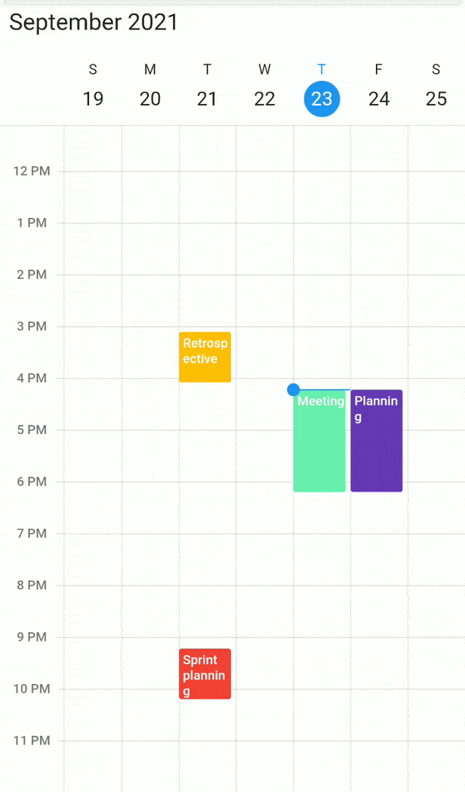

# Appointment Drag and Drop in Flutter Event Calendar (SfCalendar)

Appointments can be rescheduled using the drag and drop operation.

## Allow Drag and Drop

To perform drag-and-drop operations within the calendar, enable the [allowDragAndDrop]() property of SfCalendar.




@override
Widget build(BuildContext context) {
  return MaterialApp(
    home: Scaffold(
      body: Container(
        child: SfCalendar(
            view: CalendarView.week,
            dataSource: _getCalendarDataSource(),
            allowDragAndDrop: true
        ),
      ),
    ),
  );
}




>**NOTE**
* It is not applicable for month view in mobile platform.

## onDragStart

[onDragStart]() callback was called whenever the appointment starts to drag in the SfCalendar. The [AppointmentDragStartDetails]() arguments contains the dragging appointment and associated resource details. 

[appointment]() - Get the dragged appointment details. 
[Resource]() - Get the resource details.




@override
Widget build(BuildContext context) {
  return MaterialApp(
    home: Scaffold(
      body: Container(
        child: SfCalendar(
          view: CalendarView.week,
          dataSource: _getCalendarDataSource(),
		  allowDragAndDrop: true,
		  onDragStart: dragStart,
        ),
      ),
    ),
  );
}

void dragStart(AppointmentDragStartDetails appointmentDragStartDetails) {
  dynamic appointment = appointmentDragStartDetails.appointment;
  CalendarResource? resource = appointmentDragStartDetails.resource;
}




## onDragUpdate

[onDragUpdate]() callback was called whenever the appointment is dragging in the SfCalendar. The [AppointmentDragUpdateDetails]() arguments contains the dragging appointment, dragging time, dragging offset, source resource and target resource details. 

[appointment]() - Get the dragged appointment details. 
[draggingTime]() - Get the resource details.
[draggingPosition]() - Get the drag position.
[sourceResource]() - Get the source resource details.
[targetResource]() - Get the resource details.




@override
Widget build(BuildContext context) {
  return MaterialApp(
    home: Scaffold(
      body: Container(
        child: SfCalendar(
          view: CalendarView.week,
          dataSource: _getCalendarDataSource(),
		  allowDragAndDrop: true,
		  onDragUpdate: dragUpdate,
        ),
      ),
    ),
  );
}

void dragUpdate(AppointmentDragUpdateDetails appointmentDragUpdateDetails) {
  dynamic appointment = appointmentDragUpdateDetails.appointment;
  DateTime? draggingTime = appointmentDragUpdateDetails.draggingTime;
  Offset? draggingOffset = appointmentDragUpdateDetails.draggingPosition;
  CalendarResource? sourceResource = appointmentDragUpdateDetails.sourceResource;
  CalendarResource? targetResource = appointmentDragUpdateDetails.targetResource;
}




## onDragEnd

[onDragEnd]() callback called when the dragging appointment is dropped in the SfCalendar. The [AppointmentDragEndDetails]() arguments contains the dropped appointment, dropping time, source and target resource details. 

[appointment]() - Get the dragged appointment details. 
[droppingTime]() - Get the resource details.
[sourceResource]() - Get the resource details.
[targetResource]() - Get the target resource details.




@override
Widget build(BuildContext context) {
  return MaterialApp(
    home: Scaffold(
      body: Container(
        child: SfCalendar(
          view: CalendarView.week,
          dataSource: _getCalendarDataSource(),
		  allowDragAndDrop: true,
		  onDragEnd: dragEnd,
        ),
      ),
    ),
  );
}

void dragEnd(AppointmentDragEndDetails appointmentDragEndDetails) {
  dynamic appointment = appointmentDragEndDetails.appointment!;
  CalendarResource? sourceResource = appointmentDragEndDetails.sourceResource;
  CalendarResource? targetResource = appointmentDragEndDetails.targetResource;
  DateTime? droppingTime = appointmentDragEndDetails.droppingTime;
}




## Disabling navigation when dragging appointment

You can restrict the navigation to the next/previous view when the dragging appointment reaches the start/end point of the current view in calendar by using the [allowNavigation]() property of `DragDropSettings`. Default value of `allowNavigation` property is true.




@override
Widget build(BuildContext context) {
  return MaterialApp(
    home: Scaffold(
      body: Container(
        child: SfCalendar(
          view: CalendarView.week,
          dataSource: _getCalendarDataSource(),
          allowDragAndDrop: true,
          dragAndDropSettings: DragAndDropSettings(
              allowNavigation: true),
        ),
      ),
    ),
  );
}
	



## Disabling scroll when dragging appointment

You can restrict the timeslot views auto scroll when the appointment reaches the start/end point of the view port in the timeslot views of calendar by using the [allowScroll]() property of [DragDropSettings]().




@override
Widget build(BuildContext context) {
  return MaterialApp(
    home: Scaffold(
      body: Container(
        child: SfCalendar(
          view: CalendarView.week,
          dataSource: _getCalendarDataSource(),
          allowDragAndDrop: true,
          dragAndDropSettings: DragAndDropSettings(
              allowScroll: true),
        ),
      ),
    ),
  );
}
	



## Time indicator

[showTimeIndicator]() - This property handles whether to show the time indicator or not, which shows the dragging appointment current time position in time ruler. Default value of the [ShowTimeIndicator]() property is true.




@override
Widget build(BuildContext context) {
  return MaterialApp(
    home: Scaffold(
      body: Container(
        child: SfCalendar(
          view: CalendarView.week,
          dataSource: _getCalendarDataSource(),
          allowDragAndDrop: true,
          dragAndDropSettings: DragAndDropSettings(
              showTimeIndicator: true),
        ),
      ),
    ),
  );
}
	



## Customize appearance of dragging Time Indicator

Using [timeIndicatorStyle]() property you can customize the text style of the time indicator. Also using [indicatorTimeFormat]() property you can customize the indicator time format.




@override
Widget build(BuildContext context) {
  return MaterialApp(
    home: Scaffold(
      body: Container(
        child: SfCalendar(
          view: CalendarView.week,
          dataSource: _getCalendarDataSource(),
          allowDragAndDrop: true,
          dragAndDropSettings: DragAndDropSettings(
            indicatorTimeFormat: 'hh:mm',
            showTimeIndicator: true,
            timeIndicatorStyle: TextStyle(
              backgroundColor: Color(0xFFCEE5D0),
              color: Colors.black,
              fontSize: 15,
            ),
          ),
        ),
      ),
    ),
  );
}
	



## View Navigation Delay

Using [autoNavigateDelay]() property you can handle the navigation time when navigating to next/previous view while dragging the appointment.




@override
Widget build(BuildContext context) {
  return MaterialApp(
    home: Scaffold(
      body: Container(
        child: SfCalendar(
          view: CalendarView.week,
          dataSource: _getCalendarDataSource(),
          allowDragAndDrop: true,
          dragAndDropSettings: DragAndDropSettings(
              autoNavigateDelay: Duration(seconds: 1)),
        ),
      ),
    ),
  );
}
	

