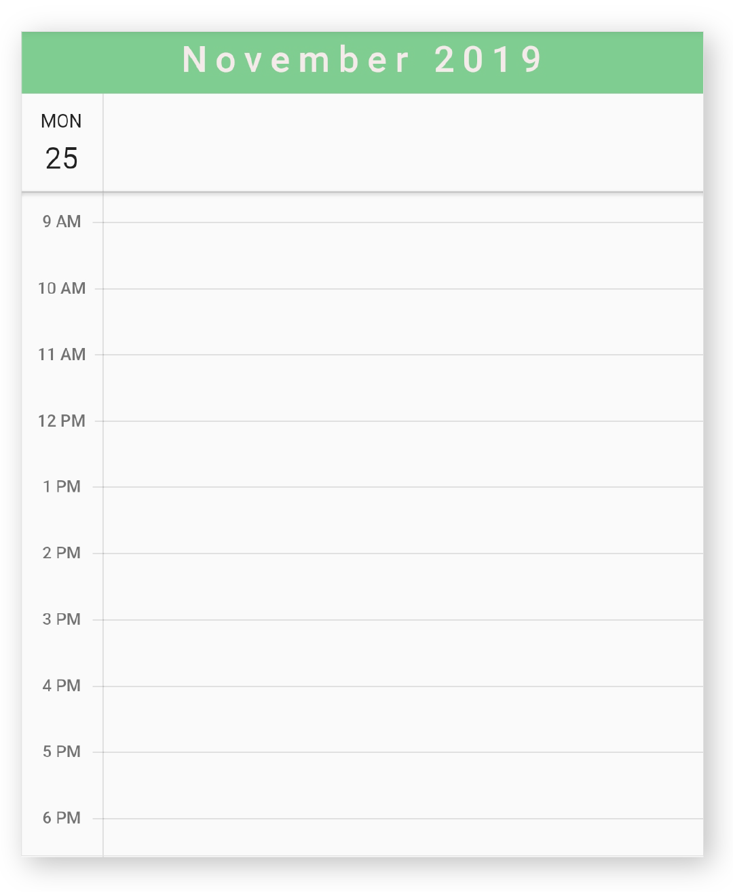
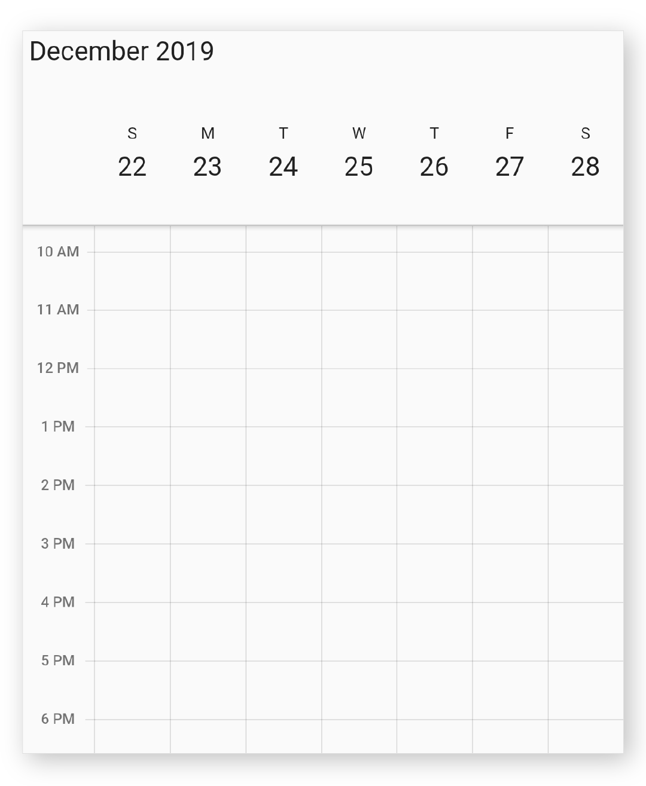
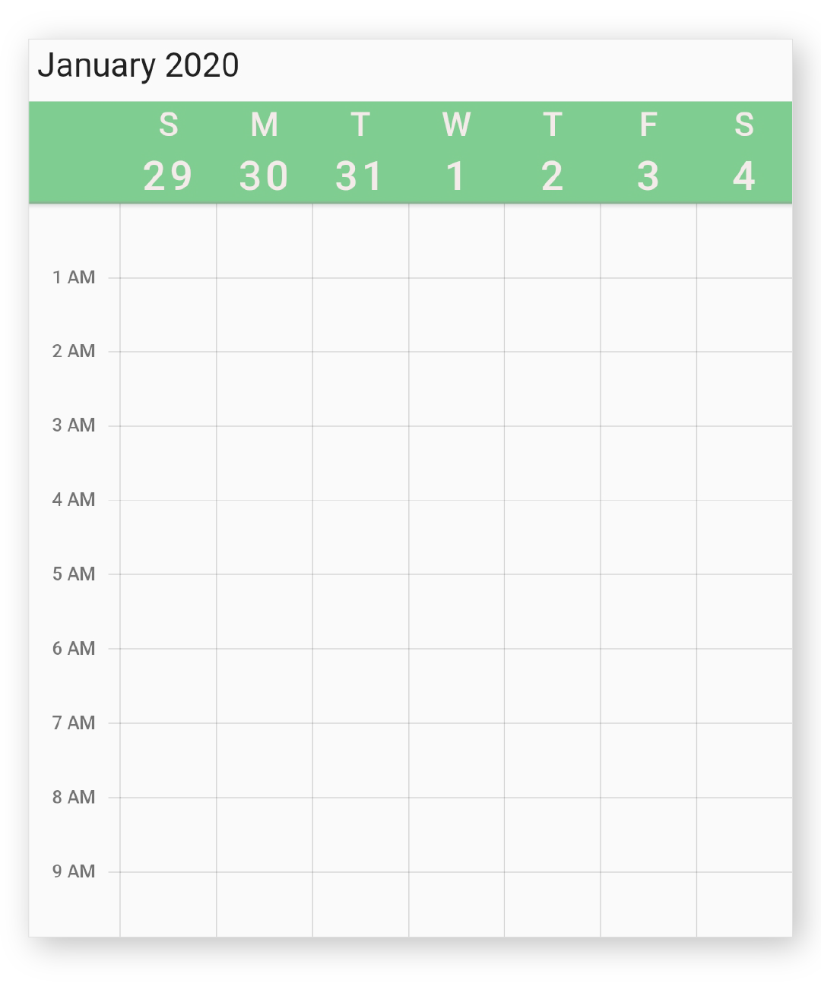

## Header

You can customize the header of the calendar using the [headerStyle](https://pub.dev/documentation/syncfusion_flutter_calendar/latest/calendar/SfCalendar/headerStyle.html) and [headerHeight](https://pub.dev/documentation/syncfusion_flutter_calendar/latest/calendar/SfCalendar/headerHeight.html) properties in calendar.

### Customize header height in calendar

You can customize the height for header in calendar using the `headerHeight` property in calendar.




@override
Widget build(BuildContext context) {
  return Container(
    child: SfCalendar(
      view: CalendarView.week,
      headerHeight: 100,
    ),
  );
}




### Header appearance
You can style the header using the [calendarHeaderStyle](https://pub.dev/documentation/syncfusion_flutter_calendar/latest/calendar/CalendarHeaderStyle-class.html) in calendar. You can change the background color, textStyle, and textAlignement using the properties such as [backgroundColor](https://pub.dev/documentation/syncfusion_flutter_calendar/latest/calendar/CalendarHeaderStyle/backgroundColor.html), [textStyle](https://pub.dev/documentation/syncfusion_flutter_calendar/latest/calendar/CalendarHeaderStyle/textStyle.html), and [textAlign](https://pub.dev/documentation/syncfusion_flutter_calendar/latest/calendar/CalendarHeaderStyle/textAlign.html) of header using the `headerStyle` property in calendar. 




@override
Widget build(BuildContext context) {
  return Container(
    child: SfCalendar(
      view: CalendarView.week,
      headerStyle: CalendarHeaderStyle(
          textAlign: TextAlign.center,
          backgroundColor: Color(0xFF7fcd91),
          textStyle: TextStyle(
              fontSize: 25,
              fontStyle: FontStyle.normal,
              letterSpacing: 5,
              color: Color(0xFFff5eaea),
              fontWeight: FontWeight.w500)),
    ),
  );
}




## View header

You can customize the view header of the calendar using the [viewHeaderStyle](https://pub.dev/documentation/syncfusion_flutter_calendar/latest/calendar/SfCalendar/viewHeaderStyle.html) and [viewHeaderHeight](https://pub.dev/documentation/syncfusion_flutter_calendar/latest/calendar/SfCalendar/viewHeaderHeight.html) properties in calendar.

### Customize view header height in calendar.

You can customize the height for view header in calendar using the `viewHeaderHeight` property in calendar.




@override
Widget build(BuildContext context) {
  return Container(
    child: SfCalendar(
      view: CalendarView.week,
      viewHeaderHeight: 100,
    ),
  );
}




### View header appearance

You can style the header using the [viewHeaderStyle](https://pub.dev/documentation/syncfusion_flutter_calendar/latest/calendar/ViewHeaderStyle-class.html) properties in calendar. You can change the background color, dayTextStyle, and dateTextStyle using properties such as [backgroundColor](https://pub.dev/documentation/syncfusion_flutter_calendar/latest/calendar/ViewHeaderStyle/backgroundColor.html), [dayTextStyle](https://pub.dev/documentation/syncfusion_flutter_calendar/latest/calendar/ViewHeaderStyle/dayTextStyle.html) and [dateTextStyle](https://pub.dev/documentation/syncfusion_flutter_calendar/latest/calendar/ViewHeaderStyle/dateTextStyle.html) of view header using the `viewHeaderStyle` property in calendar.




@override
Widget build(BuildContext context) {
  return Container(
    child: SfCalendar(
      view: CalendarView.week,
      viewHeaderStyle: ViewHeaderStyle(
          backgroundColor: Colors.grey,
          dayTextStyle: TextStyle(
              fontSize: 18,
              color: Color(0xFFff5eaea),
              fontWeight: FontWeight.w500),
          dateTextStyle: TextStyle(
              fontSize: 22,
              color: Color(0xFFff5eaea),
              letterSpacing: 2,
              fontWeight: FontWeight.w500)),
    ),
  );
}




>**NOTE**
* The `dateTextStyle` property not applicable for view header in month view of calendar.

## See Also

* [How to add custom header and view header in Flutter event calendar widget] (https://www.syncfusion.com/kb/10997/how-to-add-custom-header-and-view-header-in-flutter-event-calendar-widget)
