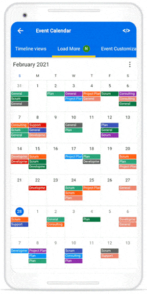

# Load more in flutter calendar

SfCalendar provides the support to display an interactive view when the calendar view changed, or the schedule view reaches its start/end offset. You can use the [loadMoreViewBuilder](https://pub.dev/documentation/syncfusion_flutter_calendar/latest/calendar/SfCalendar/loadMoreWidgetBuilder.html) builder to display the view while loading appointments in the calendar.

## Building load more widget

Build your own custom widget, that will be displayed as a loading indicator in calendar when the calendar view changes and in Calendar schedule view, the loading indicator will be displayed when it reaches the start or bottom position to load more appointments.
You can build the custom widget for loading indicator by using the `loadMoreWidgetBuilder` property in calendar.

You should use the `loadMoreWidgetBuilder` method to load more appointments and then notify the calendar about the changes. You can use the [loadMoreViewBuilder](https://pub.dev/documentation/syncfusion_flutter_calendar/latest/calendar/SfCalendar/loadMoreWidgetBuilder.html) builder to display the view while loading appointments in the calendar.

## Load appointments

Update the appointments on demand, when the loading indicator displaying in calendar by using the `loadMoreWidgetBuilder` method in the `CalendarDataSource`, which allows to add the appointments to the data source, update the data source and notify the listener to update the appointment on view.You should use the `loadMoreWidgetBuilder` method to load more appointments and then notify the calendar about the changes. The `loadMoreWidgetBuilder` can be called to load more appointments from this builder by using the [loadMoreAppointments](https://pub.dev/documentation/syncfusion_flutter_calendar/latest/calendar/LoadMoreWidgetBuilder.html) function which is passed as a parameter to `loadMoreViewBuilder`.




@override
Widget build(BuildContext context) {
    return MaterialApp(
      home: Scaffold(
        body: SfCalendar(
            controller: _controller,
            loadMoreWidgetBuilder:
                (BuildContext context, CalendarLoadMoreCallback loadMoreAppointments) {
              return FutureBuilder<String>(
                initialData: 'loading',
                future: loadMoreAppointments(),
                builder: (context, snapShot) {
                    return Container(
                        height: _controller.view == CalendarView.schedule ? 50 : double.infinity,
                        width: double.infinity,
                        color: Colors.white38,
                        alignment: Alignment.center,
                        child: CircularProgressIndicator(
                            valueColor:
                                AlwaysStoppedAnimation(Colors.deepPurple)));
                },
              );
            },
            dataSource: _dataSource),
      ),
    );
  }




You can get the complete load more sample from [here](https://github.com/SyncfusionExamples/lazily-loading-events-flutter-calendar).

>**NOTE**
* This callback will be called after the `onViewChanged` callback.
* The widget returned from this builder will be removed from the SfCalendar when the `CalendarDataSource.notifyListeners` is called.
