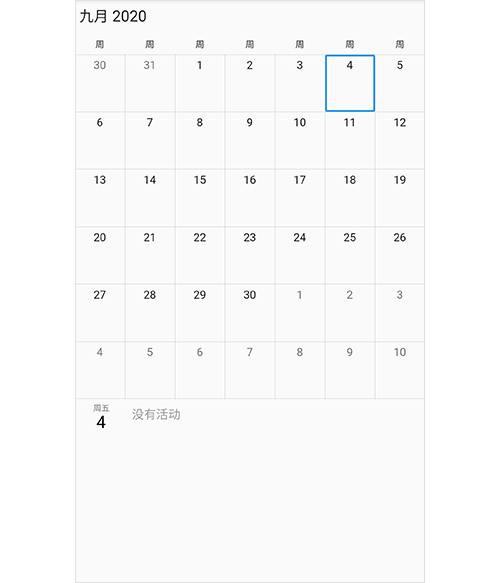

# Localization in Flutter Calendar (SfCalendar)

By default, the calendar widget supports US English localizations. You can change the other languages by specifying the `MaterialApp` properties and adding the `flutter_localizations` package to your application.

As of February 2020, [flutter package](https://flutter.dev/docs/development/accessibility-and-localization/internationalization) supports 77 languages.

To use `flutter_localizations`, add the package as dependency to `pubspec.yaml` file.



dependencies:
flutter_localizations:
sdk: flutter



Next, import the `flutter_localizations` library and specify `localizationsDelegates` and supportedLocales for `MaterialApp`.




import 'package:flutter_localizations/flutter_localizations.dart';

@override
Widget build(BuildContext context) {
return MaterialApp(
        localizationsDelegates: [
            GlobalMaterialLocalizations.delegate,
            GlobalWidgetsLocalizations.delegate,
        ],
        supportedLocales: [
            const Locale('zh'),
            const Locale('ar'),
            const Locale('ja'),
        ],
        locale: const Locale('zh'),
        title: 'Calendar Localization',
        home: Scaffold(
            appBar: AppBar(
            title: Text('Calendar'),
            ),
            body: SfCalendar(
            view: CalendarView.month,
            ),
    ),
)




## Localize the custom text in Calendar
Calendar custom text can be localized using the `syncfusion_localizations` package and specifying localizationsDelegates in `MaterialApp`.

To use `syncfusion_localizations`, add the package as dependency to `pubspec.yaml` file.



dependencies:
syncfusion_localizations:^18.1.0.36



Next, import the syncfusion_localizations library.



import 'package:syncfusion_localizations/syncfusion_localizations.dart';



Then, declare the `SfGlobalLocalizations.delegate` in the `localizationsDelegates`, which is used to localize the custom string (No events, No selected date) using in calendar and specify the supported locales as well.




@override
Widget build(BuildContext context) {
        return MaterialApp(
                localizationsDelegates: [
                        GlobalMaterialLocalizations.delegate,
                        GlobalWidgetsLocalizations.delegate,
                        SfGlobalLocalizations.delegate
                        ],
                supportedLocales: [
                        const Locale('zh'),
                        const Locale('ar'),
                        const Locale('ja'),
                        ],
                locale: const Locale('zh'),
                title: 'Calendar Localization',
                home: Scaffold(
                appBar: AppBar(
                    title: Text('Calendar'),
                    ),
                    body: SfCalendar(
                    view: CalendarView.month,
                ),
        ),
)




