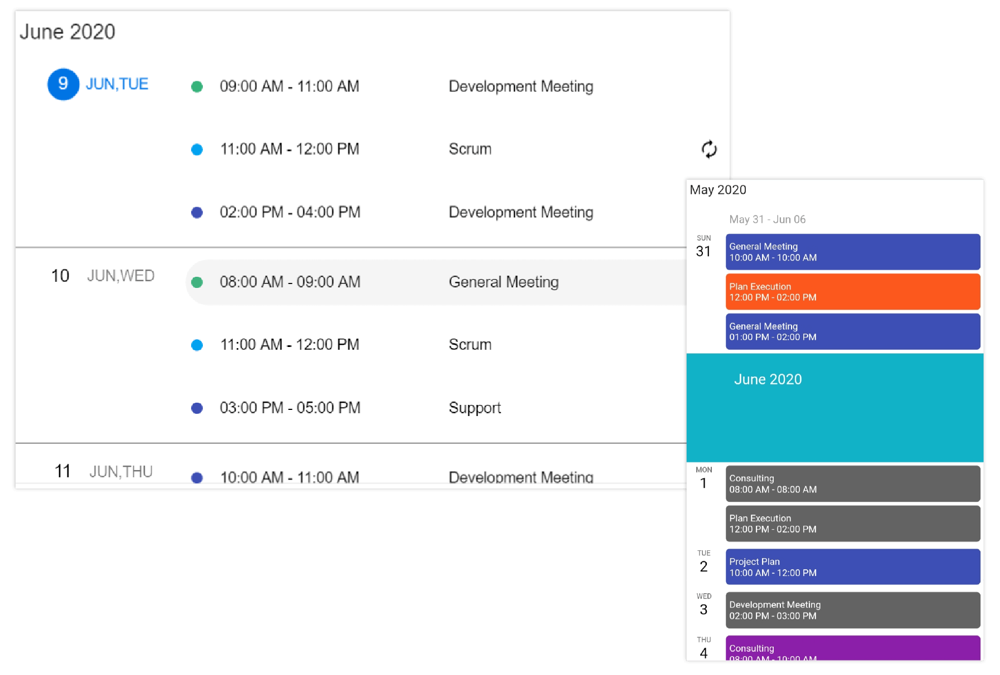
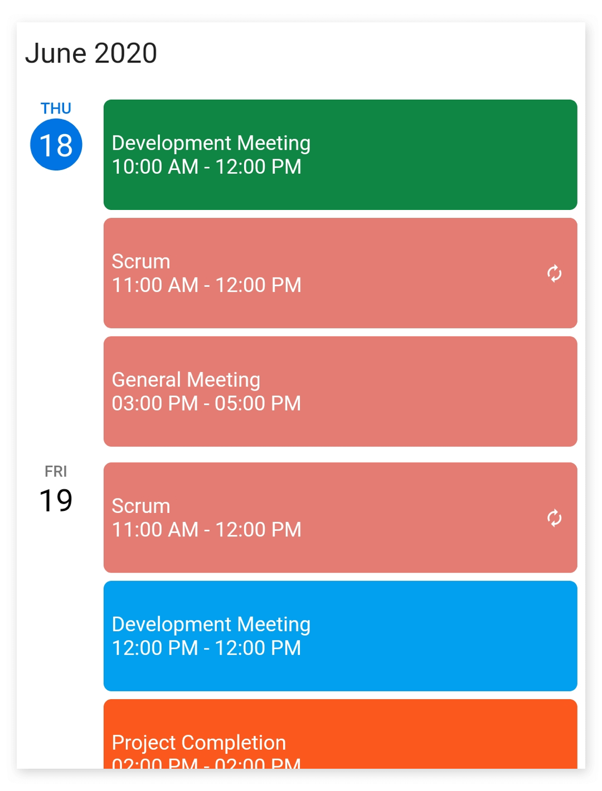
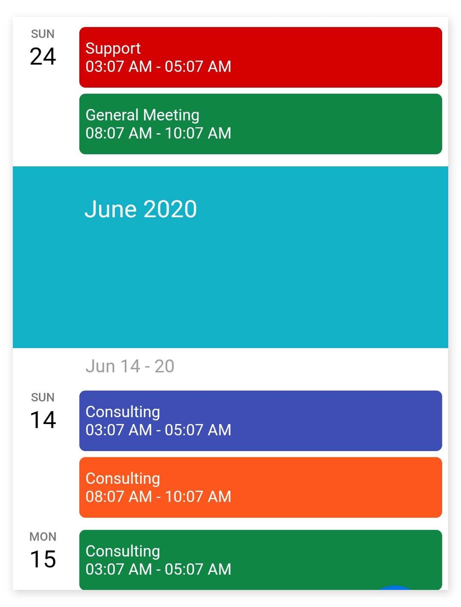
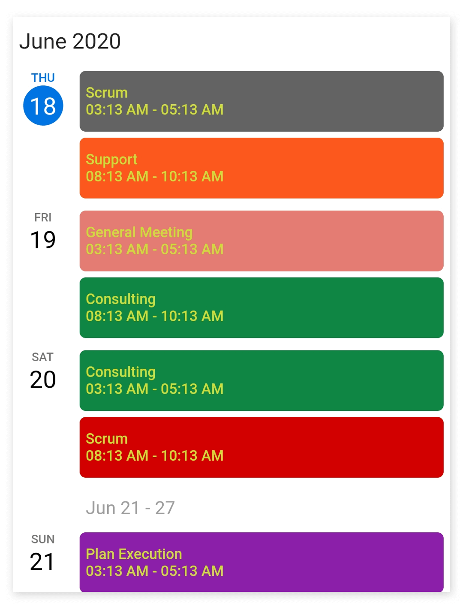
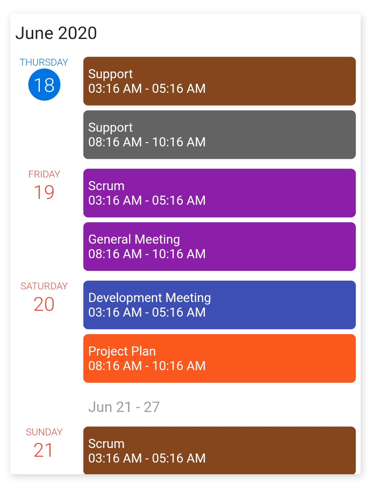
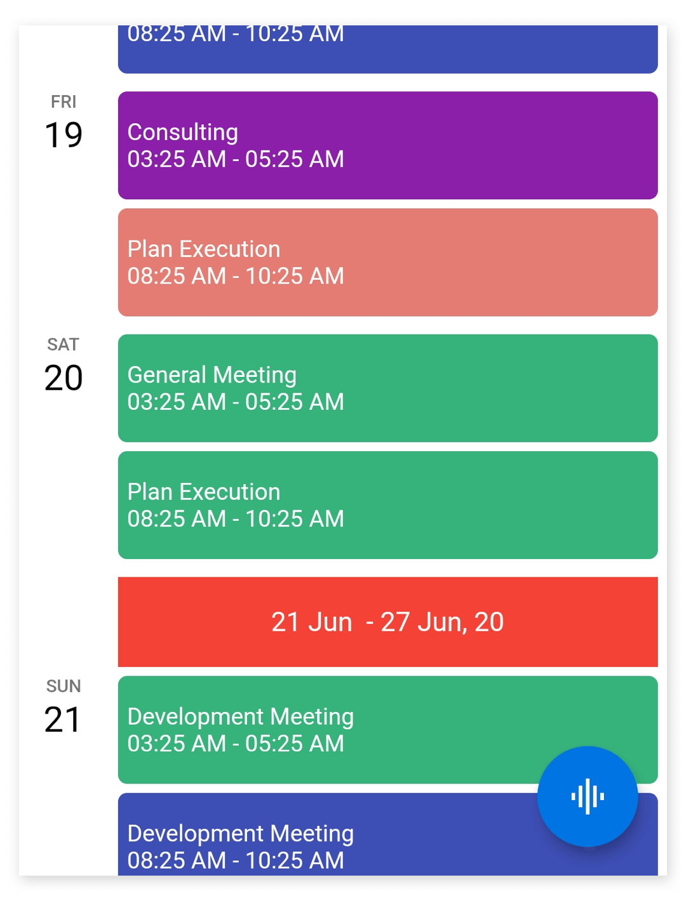
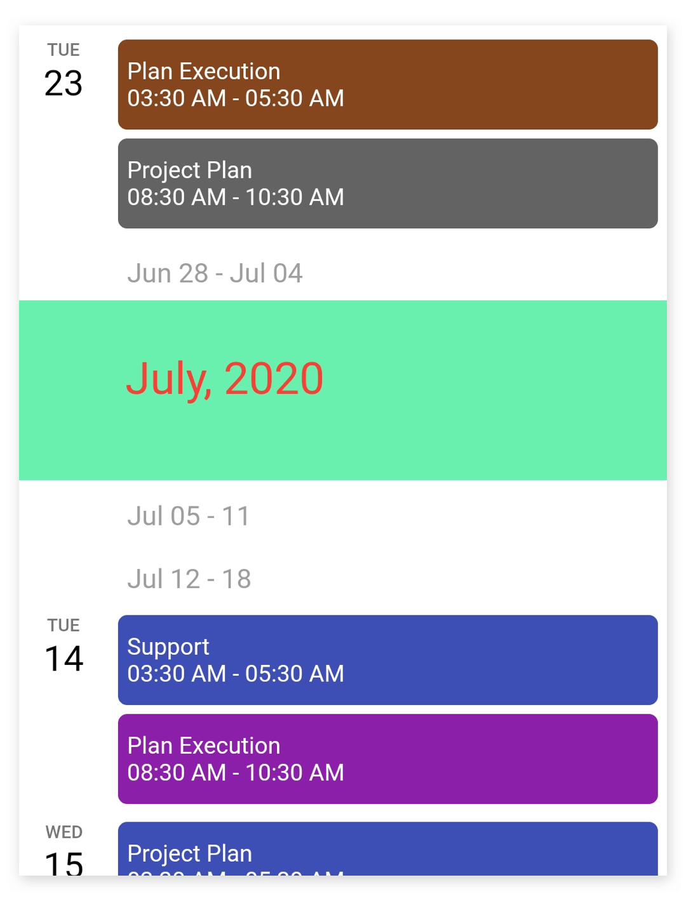

# Schedule view in flutter calendar

The `schedule` view of SfCalendar shows a list of scheduled appointments grouped by week, between min, and max dates, by default displaying the appointments from the current date. If the `DataSource` property of `SfCalendar` is null then the schedule view will display the month, week, and date headers alone in the view.

The schedule view display two different UI for mobile and web, for mobile it will display the month header, week header, and date header but for the web, it will display the appointments alone in the view.

>**NOTE** 
* If the web view width is less than `767` the calendar will render the mobile schedule UI for the web. 

## Appointment item height
You can customize the height of an appointment in a schedule view by using the [appointmentItemHeight]() property of [ScheduleViewSettings]().




@override
  Widget build(BuildContext context) {
    return Container(
      child: SfCalendar(
        view: CalendarView.schedule,
        scheduleViewSettings: ScheduleViewSettings(
          appointmentItemHeight: 70,
        ),
      ),
    );
  }




## Hide empty weeks
You can hide the weeks that do not have an appointment on it in schedule view, by using the [hideEmptyScheduleWeek]() property of  `scheduleViewSettings`.




@override
  Widget build(BuildContext context) {
    return Container(
      child: SfCalendar(
        view: CalendarView.schedule,
        scheduleViewSettings: ScheduleViewSettings(
          hideEmptyScheduleWeek: true,
        ),
      ),
    );
  }
  



## Appointment text customization
The appointment text style of schedule view can be customized by using the [appointmentTextStyle]() property of `scheduleViewSettings`.




@override
  Widget build(BuildContext context) {
    return Container(
      child: SfCalendar(
        view: CalendarView.schedule,
        scheduleViewSettings: ScheduleViewSettings(
            appointmentTextStyle: TextStyle(
                fontSize: 12, fontWeight: FontWeight.w500, color: Colors.lime)),
      ),
    );
  }




## Day header customization
The day header can be customized by using the [dayHeaderSettings]() property of `scheduleViewSettings`. 

The [DayHeaderSettings]() contains the properties to customize the day format, width, day text style, and date text style of the day header by using the [dayFormat](), [width](), [dayTextStyle](), and [dateTextStyle]() of `DayHeaderSettings`.




  @override
  Widget build(BuildContext context) {
    return Container(
      child: SfCalendar(
        view: CalendarView.schedule,
        scheduleViewSettings: ScheduleViewSettings(
            dayHeaderSettings: DayHeaderSettings(
                dayFormat: 'EEEE',
                width: 70,
                dayTextStyle: TextStyle(
                  fontSize: 10,
                  fontWeight: FontWeight.w300,
                  color: Colors.red,
                ),
                dateTextStyle: TextStyle(
                  fontSize: 20,
                  fontWeight: FontWeight.w300,
                  color: Colors.red,
                ))),
      ),
    );
  }




## Week header customization
The week header can be customized by using the [weekHeaderSettings]() property of `scheduleViewSettings`. 

The [WeekHeaderSettings]() contains the properties to customize the start and end date format, height, Text alignment, background color, and week text style of the week header by using the [startDateFormat](), [endDateFormat](), [height](), [textAlign](), [backgroundColor](), and [weekTextStyle]() of `WeekHeaderSettings`.




@override
  Widget build(BuildContext context) {
    return Container(
      child: SfCalendar(
        view: CalendarView.schedule,
        scheduleViewSettings: ScheduleViewSettings(
            weekHeaderSettings: WeekHeaderSettings(
                startDateFormat: 'dd MMM ',
                endDateFormat: 'dd MMM, yy',
                height: 50,
                textAlign: TextAlign.center,
                backgroundColor: Colors.red,
                weekTextStyle: TextStyle(
                  color: Colors.white,
                  fontWeight: FontWeight.w400,
                  fontSize: 15,
                ))),
      ),
    );
  }




## Month header customization
The month header can be customized by using the [monthHeaderSettings]() property of `scheduleViewSettings`. 

The [MonthHeaderSettings]() contains the properties to customize the month format, height, text alignment, background color, and month text style of the month header by using the [monthFormat](), [height](), [textAlign](), [backgroundColor](), and [monthTextStyle]() of `MonthHeaderSettings`.




@override
  Widget build(BuildContext context) {
    return Container(
      child: SfCalendar(
        view: CalendarView.schedule,
        scheduleViewSettings: ScheduleViewSettings(
            monthHeaderSettings: MonthHeaderSettings(
                monthFormat: 'MMMM, yyyy',
                height: 100,
                textAlign: TextAlign.left,
                backgroundColor: Colors.green,
                monthTextStyle: TextStyle(
                    color: Colors.red,
                    fontSize: 25,
                    fontWeight: FontWeight.w400))),
      ),
    );
  }




