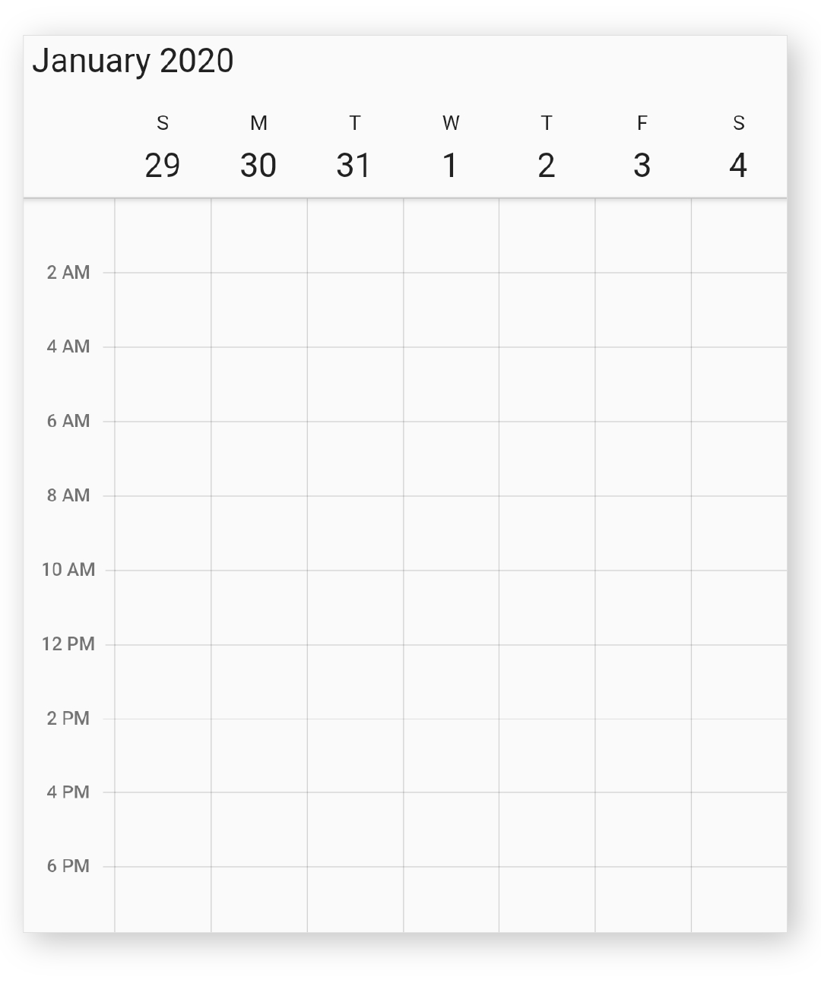
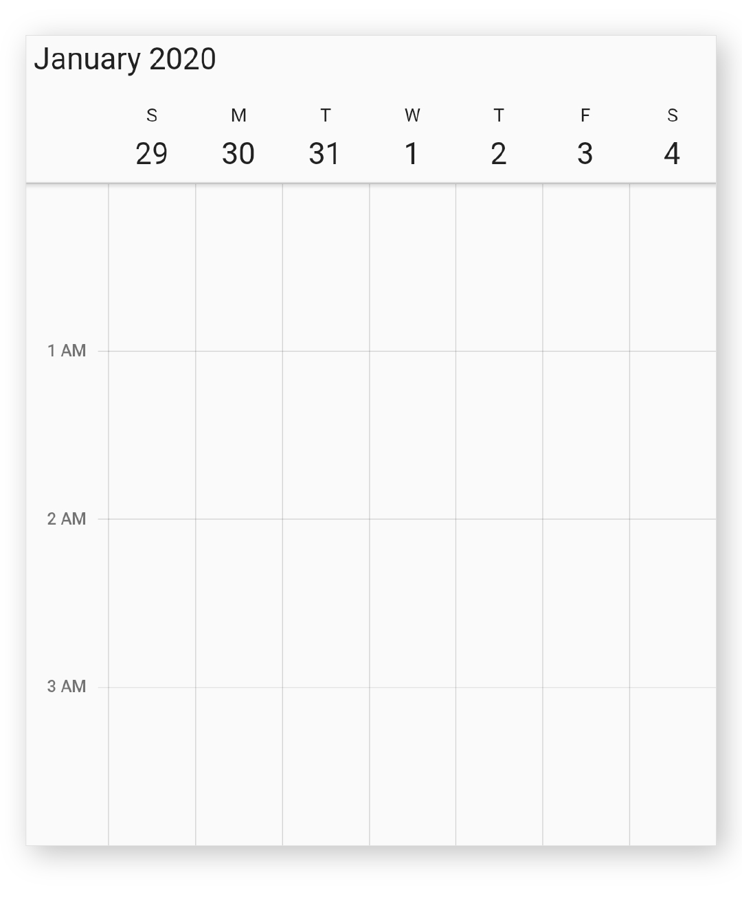
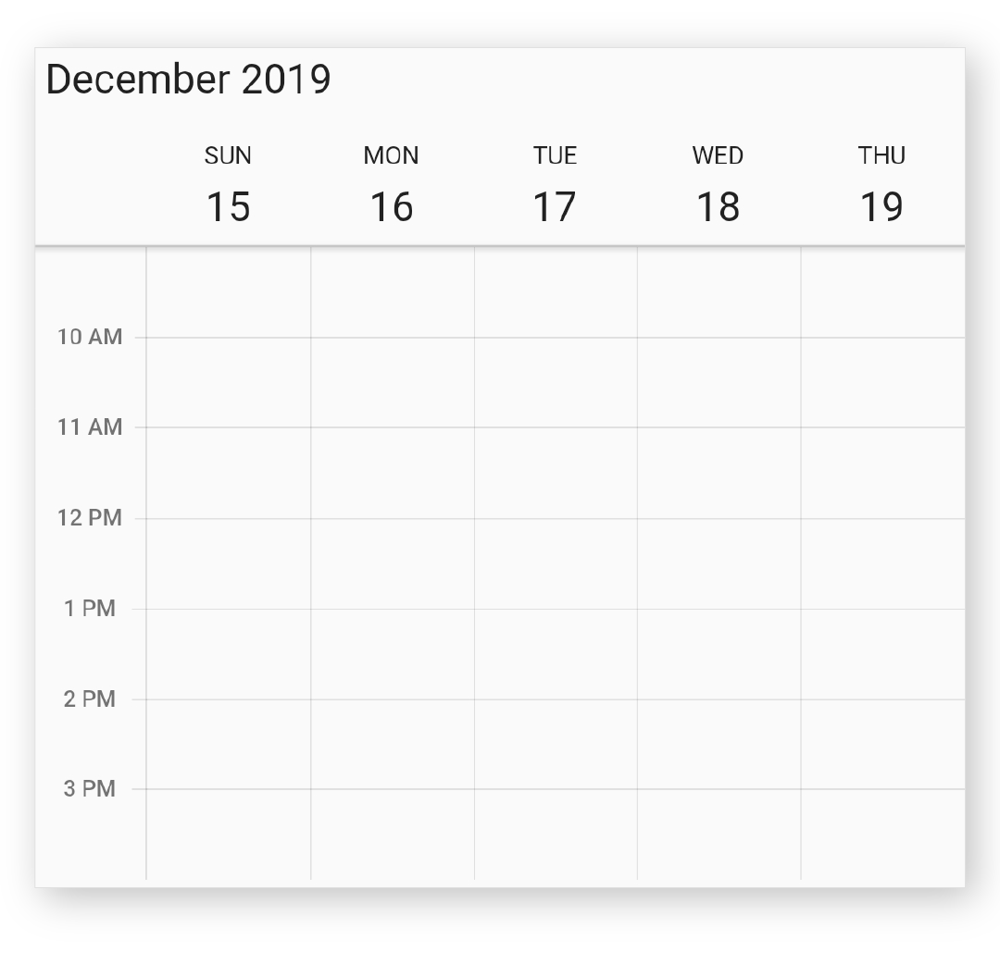
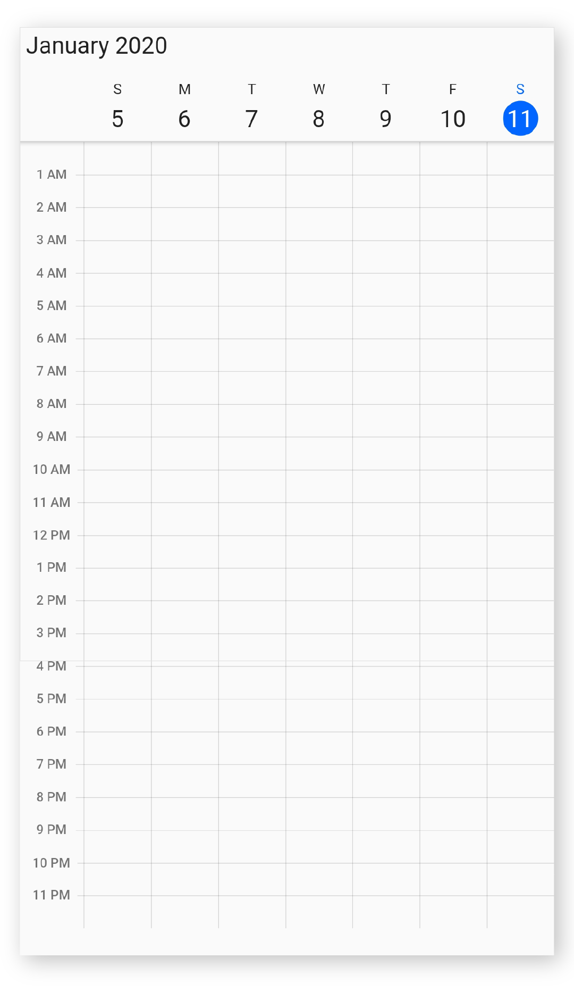
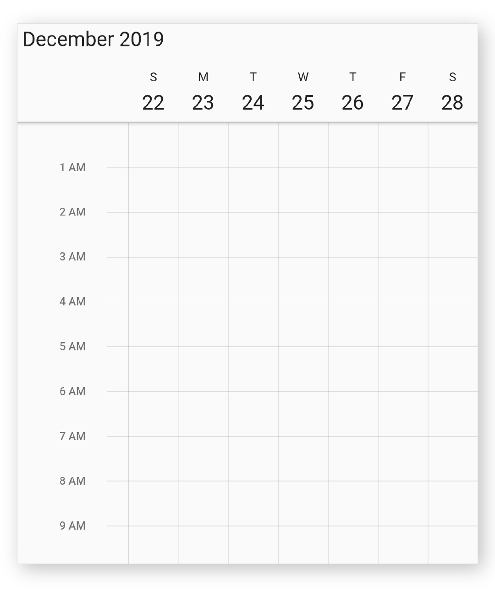
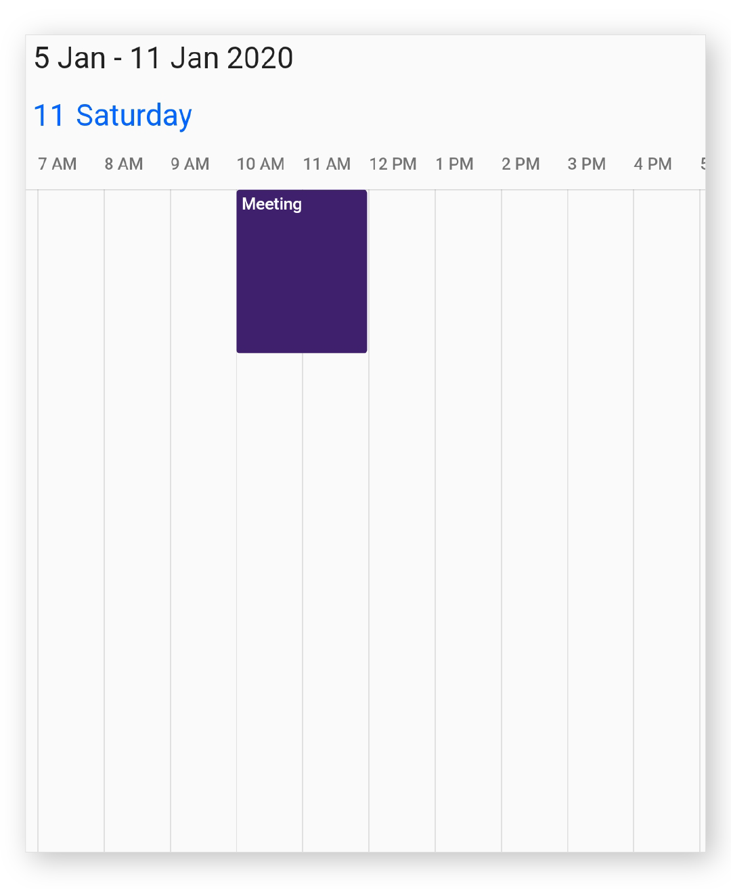
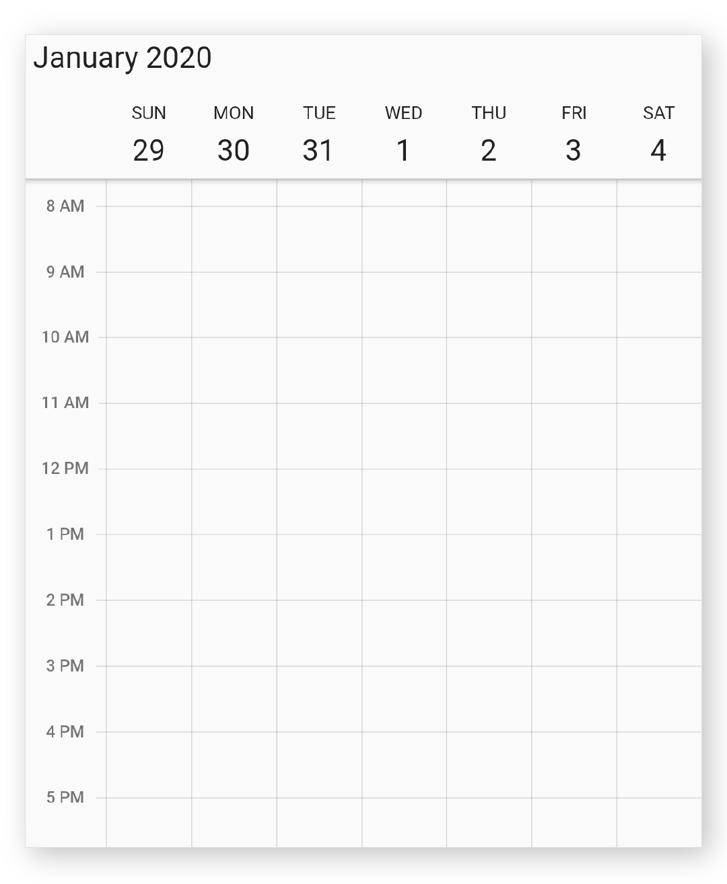
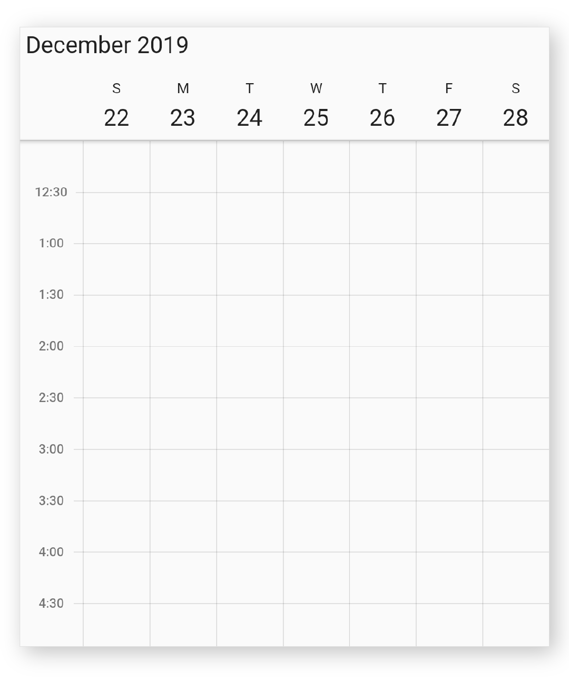
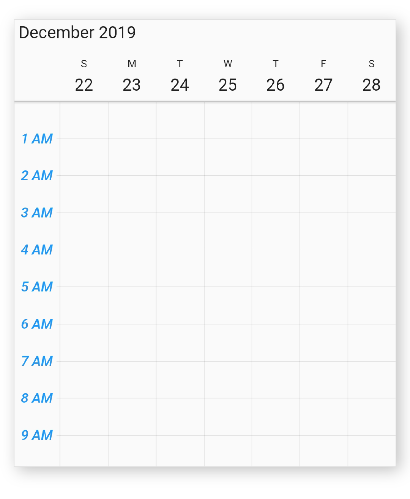

# Timeslot views
Calendar has six built-in time slot views used to display date, and the views will display based on the current day by default. Appointments on a specific day will be arranged in respective timeslots based on its duration.

* **Day view:** Displays a single day.
* **Week view:** Views all days of a week.
* **Work week view:** Views only working days of a week. By default, Saturday and Sunday are the non-working days. You can customize it with any days of a week.
* **Timeline day view:** Displays the single day in horizontal time axis.
* **Timeline week view:** Displays the days of a week in horizontal time axis. You can see the past or future dates by scrolling to right or left.
* **Timeline work week view:** Views only working days of a week in horizontal axis. By default, Saturday and Sunday are the non-working days. You can customize it with any days of a week.

## Change time interval

You can customize the interval of timeslots in all the timeslots view by using the [timeInterval](https://pub.dev/documentation/syncfusion_flutter_calendar/latest/calendar/TimeSlotViewSettings/timeInterval.html) property of [TimeSlotViewSettings](https://pub.dev/documentation/syncfusion_flutter_calendar/latest/calendar/TimeSlotViewSettings-class.html/).




@override
Widget build(BuildContext context) {
  return Container(
    child: SfCalendar(
      view: CalendarView.week,
      timeSlotViewSettings:
          TimeSlotViewSettings(timeInterval: Duration(hours: 2)),
    ),
  );
}




>**NOTE**
* If you modify the timeInterval value (in minutes), you need to change the time labels format by setting the timeFormat value to `hh:mm`. By default, timeFormat value is `h a`.

## Change time interval height

You can customize the time interval height of timeslots by using the [timeIntervalHeight](https://pub.dev/documentation/syncfusion_flutter_calendar/latest/calendar/TimeSlotViewSettings/timeIntervalHeight.html) property of `TimeSlotViewSettings`.




@override
Widget build(BuildContext context) {
  return Container(
    child: SfCalendar(
      view: CalendarView.week,
      timeSlotViewSettings: TimeSlotViewSettings(
        timeIntervalHeight: 100,
      ),
    ),
  );
}




## Flexible working days and working hours

The default values for [startHour](https://pub.dev/documentation/syncfusion_flutter_calendar/latest/calendar/TimeSlotViewSettings/startHour.html) and [endHour](https://pub.dev/documentation/syncfusion_flutter_calendar/latest/calendar/TimeSlotViewSettings/endHour.html) are 0 and 24 to show all the time slots in time slot views. You can to set the `startHour` and `endHour` properties of `timeSlotViewSettings` to show only the required time duration for users. You can set `startHour` and `endHour` in time duration to show the required time duration in minutes.

You can also customize the nonworking days of a week by using the [nonWorkingDays](https://pub.dev/documentation/syncfusion_flutter_calendar/latest/calendar/TimeSlotViewSettings/nonWorkingDays.html) property of `timeSlotViewSettings` to show only the required days for the users.




@override
Widget build(BuildContext context) {
  return Scaffold(
      body: SfCalendar(
    view: CalendarView.workWeek,
    timeSlotViewSettings: TimeSlotViewSettings(
        startHour: 9,
        endHour: 16,
        nonWorkingDays: <int>[DateTime.friday, DateTime.saturday]),
  ));
}




>**NOTE**
* The `nonWorkingDays` property will applicable only for `workWeek` and `timelineWorkWeek` views only, and not applicable for the remaining views.
* Calendar Appointments UI, which does not fall within the `startHour` and `endHour` will not be visible and if it falls partially, it will be clipped.
* No need to specify the decimal point values for `startHour` and `endHour`, if you don’t want to set the minutes.
* The number of time slots will be calculated based on total minutes of a day and time interval (total minutes of a day ((start hour - end hour) * 60) / time interval).
* If custom timeInterval is given, then the number of time slots calculated based on the given TimeInterval should result in integer value (total minutes % timeInterval = 0), otherwise next immediate time interval that result in integer value when divide total minutes of a day will be considered. For example, if timeInterval=2 Hours 15 minutes and total minutes = 1440 (24 Hours per day), then timeInterval will be changed to ‘144’ (1440%144=0) by considering (total minutes % timeInterval = 0), it will return integer value for time slots rendering.
* If the custom `startHour` and `endHour` are given, then the number of time slots calculated based on given `startHour` and `endHour` should result in integer value, otherwise next immediate `timeInterval` will be considered until the result is integer value. For example, if `startHour` is 9 (09:00AM), `endHour` is 18.25 (06:15 PM), `timeInterval` is 30 minutes, and total minutes = 555 ((18.25-9)*60), then the timeInterval will be changed to ’37 minutes’ (555%37=0) by considering (total minutes % timeInterval = 0). it will return integer value for time slots rendering.

## Full screen calendar

Calendar time interval height can be adjusted based on screen height by changing the value of timeIntervalHeight property to -1. It will auto-fit to the screen height and width.




@override
Widget build(BuildContext context) {
  return Container(
    child: SfCalendar(
      view: CalendarView.week,
      timeSlotViewSettings: TimeSlotViewSettings(
        timeIntervalHeight: -1,
      ),
    ),
  );
}




## Change time ruler size

You can customize the size of the time ruler view where the labels mentioning the time are placed by using the [timeRulerSize](https://pub.dev/documentation/syncfusion_flutter_calendar/latest/calendar/TimeSlotViewSettings/timeRulerSize.html) property of `TimeSlotViewSettings`.




@override
Widget build(BuildContext context) {
  return MaterialApp(
    home: Scaffold(
      body: Container(
        child: SfCalendar(
          view: CalendarView.week,
          timeSlotViewSettings: TimeSlotViewSettings(timeRulerSize: 100),
        ),
      ),
    ),
  );
}




## Minimum appointment duration

The [minimumAppointmentDuration](https://pub.dev/documentation/syncfusion_flutter_calendar/latest/calendar/TimeSlotViewSettings/minimumAppointmentDuration.html) property in timeSlotViewSettings is to set an arbitrary height to appointments when it has minimum duration, in timeslot views, so that the subject can be readable.




@override
Widget build(BuildContext context) {
  return MaterialApp(
    home: Scaffold(
      body: Container(
        child: SfCalendar(
          view: CalendarView.week,
          dataSource: _getCalendarDataSource(),
          timeSlotViewSettings: TimeSlotViewSettings(
              minimumAppointmentDuration: Duration(minutes: 30)),
        ),
      ),
    ),
  );
}

_AppointmentDataSource _getCalendarDataSource() {
  List<Appointment> appointments = <Appointment>[];
  appointments.add(Appointment(
    startTime: DateTime.now(),
    endTime: DateTime.now().add(Duration(minutes: 10)),
    subject: 'Meeting',
    color: Colors.blue,
    startTimeZone: '',
    endTimeZone: '',
  ));

  return _AppointmentDataSource(appointments);
}

class _AppointmentDataSource extends CalendarDataSource {
  _AppointmentDataSource(this.source);

  List<Appointment> source;

  @override
  List<dynamic> get appointments => source;
}




>**NOTE**
* `minimumAppointmentDuration` value will be set, when an appointment duration value lesser than `minimumAppointmentDuration`.
* Appointment duration value will be set, when the appointment duration value greater than `minimumAppointmentDuration`.
* `timeInterval` value will be set, when `minimumAppointmentDuration` greater than `timeInterval` with lesser appointment duration.
* All day Appointment does not support `minimumAppointmentDuration`.

## Timeline appointment height

You can customize the height of appointment in timeline views using the [timelineAppointmentHeight](https://pub.dev/documentation/syncfusion_flutter_calendar/latest/calendar/TimeSlotViewSettings/timelineAppointmentHeight.html) property of `TimeSlotViewSettings`.




@override
Widget build(BuildContext context) {
  return MaterialApp(
    home: Scaffold(
      body: Container(
        child: SfCalendar(
          view: CalendarView.timelineWeek,
          timeSlotViewSettings:
              TimeSlotViewSettings(timelineAppointmentHeight: 100),
        ),
      ),
    ),
  );
}




## View header text formatting

You can customize the date and day format of SfCalendar ViewHeader by using the [dateFormat](https://pub.dev/documentation/syncfusion_flutter_calendar/latest/calendar/TimeSlotViewSettings/dateFormat.html) and [dayFormat](https://pub.dev/documentation/syncfusion_flutter_calendar/latest/calendar/TimeSlotViewSettings/dayFormat.html) properties of `TimeSlotViewSettings`.




@override
Widget build(BuildContext context) {
  return MaterialApp(
    home: Scaffold(
      body: Container(
        child: SfCalendar(
          view: CalendarView.week,
          timeSlotViewSettings:
              TimeSlotViewSettings(dateFormat: 'dd', dayFormat: 'EEE'),
        ),
      ),
    ),
  );
}




## Time text formatting
You can customize the format for the labels mentioning the time, by setting the [timeFormat](https://pub.dev/documentation/syncfusion_flutter_calendar/latest/calendar/TimeSlotViewSettings/timeFormat.html) property of `timeSlotViewSettings` in calendar.




@override
Widget build(BuildContext context) {
  return MaterialApp(
    home: Scaffold(
      body: Container(
        child: SfCalendar(
          view: CalendarView.week,
          timeSlotViewSettings: TimeSlotViewSettings(
              timeInterval: Duration(minutes: 30), timeFormat: 'h:mm'),
        ),
      ),
    ),
  );
}




## Time text appearance

You can customize the text style for the labels mentioning the time, by setting the [timeTextStyle](https://pub.dev/documentation/syncfusion_flutter_calendar/latest/calendar/TimeSlotViewSettings/timeTextStyle.html) property of `timeSlotViewSettings` in calendar.




@override
Widget build(BuildContext context) {
  return MaterialApp(
    home: Scaffold(
      body: Container(
        child: SfCalendar(
          view: CalendarView.week,
          timeSlotViewSettings: TimeSlotViewSettings(
              timeTextStyle: TextStyle(
            fontWeight: FontWeight.w500,
            fontStyle: FontStyle.italic,
            fontSize: 15,
            color: Colors.blue,
          )),
        ),
      ),
    ),
  );
}




