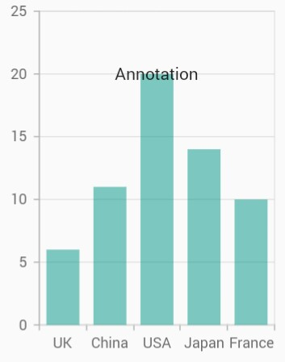
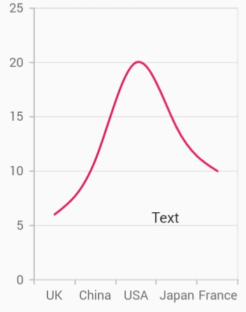
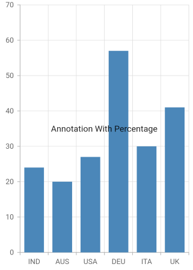
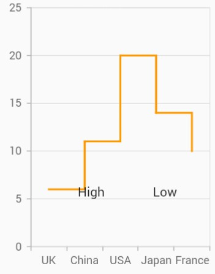
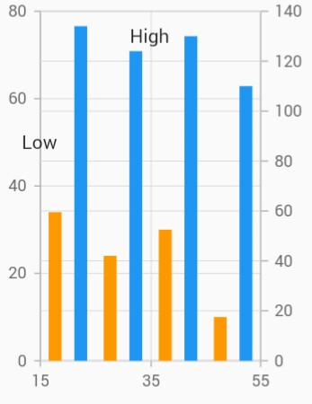
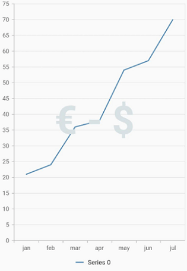

# Annotation in Flutter Cartesian Charts (SfCartesianChart)

Chart supports annotations which allows you to mark the specific area of interest in the chart area. You can add the custom widgets using this annotations feature as depicted below.

 

    @override
    Widget build(BuildContext context) {
      return Scaffold(
        body: SafeArea(
          child: Center(
            child: Container(
              child: SfCartesianChart(
                primaryXAxis: CategoryAxis(),
                annotations: <CartesianChartAnnotation>[
                  CartesianChartAnnotation(
                    widget: 
                      Container(
                        child: const Text('Annotation')
                      ),
                    coordinateUnit: CoordinateUnit.point,
                    x: 'USA',
                    y: 20
                  )
                ]
              )
            )
          )
        )
      );
    }



## Positioning the annotation

The [`x`](https://pub.dev/documentation/syncfusion_flutter_charts/latest/charts/CartesianChartAnnotation/x.html) and [`y`](https://pub.dev/documentation/syncfusion_flutter_charts/latest/charts/CartesianChartAnnotation/y.html) values can be specified with axis units or pixel units or percentage units, and these can be identified by using [`coordinateUnit`](https://pub.dev/documentation/syncfusion_flutter_charts/latest/charts/CartesianChartAnnotation/coordinateUnit.html) property. When logicalPixel is specified, the annotation will be placed with respect to pixel values whereas point is specified, then the annotation will be placed with respect to series point values.

**Positioning based on coordinateUnit as point**

To position the annotation based on axis, set the [`x`](https://pub.dev/documentation/syncfusion_flutter_charts/latest/charts/CartesianChartAnnotation/x.html) and [`y`](https://pub.dev/documentation/syncfusion_flutter_charts/latest/charts/CartesianChartAnnotation/y.html) properties based on axis range values, and set the [`coordinateUnit`](https://pub.dev/documentation/syncfusion_flutter_charts/latest/charts/CartesianChartAnnotation/coordinateUnit.html) value as [`point`](https://pub.dev/documentation/syncfusion_flutter_charts/latest/charts/CartesianChartAnnotation/coordinateUnit.html).

 

    @override
    Widget build(BuildContext context) {
      return Scaffold(
        body: SafeArea(
          child: Center(
            child: Container(
              child: SfCartesianChart(
                annotations: <CartesianChartAnnotation>[
                  CartesianChartAnnotation(
                    widget: Container(
                      child: const Text('Text')
                    ),
                    coordinateUnit: CoordinateUnit.point,
                    x: 20, // x position of annotation
                    y: 40 // y position of annotation
                  )
                ]
              )
            )
          )
        )
      );
    }



**Positioning based on coordinateUnit as pixels**

To position the annotation based on the pixel values, set the [`CoordinateUnit`](https://pub.dev/documentation/syncfusion_flutter_charts/latest/charts/CartesianChartAnnotation/coordinateUnit.html) value as [`logicalPixel`](https://pub.dev/documentation/syncfusion_flutter_charts/latest/charts/CartesianChartAnnotation/coordinateUnit.html), and the pixel values in [`x`](https://pub.dev/documentation/syncfusion_flutter_charts/latest/charts/CartesianChartAnnotation/x.html) and [`y`](https://pub.dev/documentation/syncfusion_flutter_charts/latest/charts/CartesianChartAnnotation/y.html) properties of annotation as shown in the following code snippet.

 

    @override
    Widget build(BuildContext context) {
      return Scaffold(
        body: SafeArea(
          child: Center(
            child: Container(
              child: SfCartesianChart(
                primaryXAxis: CategoryAxis(),
                annotations: <CartesianChartAnnotation>[
                  CartesianChartAnnotation(
                    widget: Container(
                      child: const Text('Text')
                    ),
                    // Coordinate unit type
                    coordinateUnit: CoordinateUnit.logicalPixel,
                    x: 150,
                    y: 200
                  )
                ]
              )
            )
          )
        )
      );
    }



**Positioning based on coordinateUnit as percentage**

To position the annotation based on the percentage values, set the [`CoordinateUnit`](https://pub.dev/documentation/syncfusion_flutter_charts/latest/charts/CartesianChartAnnotation/coordinateUnit.html) value as [`percentage`](https://pub.dev/documentation/syncfusion_flutter_charts/latest/charts/CartesianChartAnnotation/coordinateUnit.html), and the percentage values in [`x`](https://pub.dev/documentation/syncfusion_flutter_charts/latest/charts/CartesianChartAnnotation/x.html) and [`y`](https://pub.dev/documentation/syncfusion_flutter_charts/latest/charts/CartesianChartAnnotation/y.html) properties of annotation as shown in the following code snippet.

 

@override
Widget build(BuildContext context) {​​​​​
  const List<ChartData> chartData = [
    ChartData('IND', 24),
    ChartData('AUS', 20),
    ChartData('USA', 27),
    ChartData('DEU', 57),
    ChartData('ITA', 30),
    ChartData('UK', 41),
  ];

  return Scaffold(
      body: Center(
        child: SfCartesianChart(
          primaryXAxis: CategoryAxis(interval: 1),
            annotations: const <CartesianChartAnnotation>[
            CartesianChartAnnotation(
              coordinateUnit: CoordinateUnit.percentage,
              region: AnnotationRegion.plotArea,
               widget: Text('Annotation With Percentage',
                  style: TextStyle(
                  fontSize: 14,
                  )),
                  x: '50%',
                  y: '50%'
              )
            ],
            series: <ChartSeries<ChartData, String>>[
              ColumnSeries<ChartData, String>(
                  dataSource: chartData,
                  xValueMapper: (ChartData sales, _) => sales.x,
                  yValueMapper: (ChartData sales, _) => sales.y)
            ]
        ),
      )
  );
}​​​​​

  class ChartData {
    const ChartData(this.x, this.y);
    final String x;
    final int y;
  }



**Positioning based on region**

Annotations can be placed with respect to either [`AnnotationRegion.plotArea`](https://pub.dev/documentation/syncfusion_flutter_charts/latest/charts/AnnotationRegion-class.html)  or [`AnnotationRegion.chart`](https://pub.dev/documentation/syncfusion_flutter_charts/latest/charts/AnnotationRegion-class.html) using [`region`](https://pub.dev/documentation/syncfusion_flutter_charts/latest/charts/CartesianChartAnnotation/region.html) property.

 

    @override
    Widget build(BuildContext context) {
      return Scaffold(
        body: SafeArea(
          child: Center(
            child: Container(
              child: SfCartesianChart(
                annotations: <CartesianChartAnnotation>[
                  CartesianChartAnnotation(
                    widget: Container(
                      child: const Text('Text')
                    ),
                    region: AnnotationRegion.chartArea,
                    coordinateUnit: CoordinateUnit.logicalPixel,
                    x: 150,
                    y: 200
                  )
                ]
              )
            )
          )
        )
      );
    }



## Alignment of annotation

[`CartesianChartAnnotation`](https://pub.dev/documentation/syncfusion_flutter_charts/latest/charts/CartesianChartAnnotation-class.html) can be aligned to center, near and far using the [`horizontalAlignment`](https://pub.dev/documentation/syncfusion_flutter_charts/latest/charts/CartesianChartAnnotation/horizontalAlignment.html) and [`verticalAlignment`](https://pub.dev/documentation/syncfusion_flutter_charts/latest/charts/CartesianChartAnnotation/verticalAlignment.html) properties of annotation.

The following code example demonstrates how to set the [`horizontalAlignment`](https://pub.dev/documentation/syncfusion_flutter_charts/latest/charts/CartesianChartAnnotation/horizontalAlignment.html) for annotation



 @override
    Widget build(BuildContext context) {
      return Scaffold(
        body: SafeArea(
          child: Center(
            child: Container(
              child: SfCartesianChart(
                annotations: <CartesianChartAnnotation>[
                  CartesianChartAnnotation(
                    widget: Container(
                      child: const Text('Text')
                    ),
                    region: AnnotationRegion.chartArea,
                    coordinateUnit: CoordinateUnit.logicalPixel,
                    x: 150,
                    y: 200,
                    HorizontalAlignment: HorizontalAlignment.near,
                  )
                ]
              )
            )
          )
        )
      );
    }



## Adding multiple annotation

You can add multiple annotations to the Chart by adding multiple widgets to the [`annotations`](https://pub.dev/documentation/syncfusion_flutter_charts/latest/charts/CartesianChartAnnotation-class.html) property. as depicted in below code snippet.

 

    @override
    Widget build(BuildContext context) {
      return Scaffold(
        body: SafeArea(
          child: Center(
            child: Container(
              child: SfCartesianChart(
                primaryXAxis: CategoryAxis(),
                annotations: <CartesianChartAnnotation>[
               // first annotation
               CartesianChartAnnotation(
                  child: Container(child: const Text('High')),
                  coordinateUnit: CoordinateUnit.logicalPixel,
                  x: 90,
                  y: 200),
              // second annotation
              CartesianChartAnnotation(
                  child: Container(child: const Text('Low')),
                  coordinateUnit: CoordinateUnit.logicalPixel,
                  x: 170,
                  y: 200)
            ],
         )
       )
      )
    ),
  );
}



## Adding annotation for multiple axes

When there are multiple axes in the chart, annotation can be added for a particular axis by using the [`xAxisName`](https://pub.dev/documentation/syncfusion_flutter_charts/latest/charts/CartesianChartAnnotation/xAxisName.html) and [`yAxisName`](https://pub.dev/documentation/syncfusion_flutter_charts/latest/charts/CartesianChartAnnotation/yAxisName.html  ) properties. It is shown in the below code snippet.

 

    @override
    Widget build(BuildContext context) {
      final List<ChartData> chartData = [
        ChartData(10, 17, 132),
        ChartData(20, 34, 134),
        ChartData(30, 24, 124),
        ChartData(40, 30, 130),
        ChartData(50, 10, 110)
      ];

      return Scaffold(
        body: SafeArea(
          child: Center(
            child: Container(
              child: SfCartesianChart(
                primaryXAxis: CategoryAxis(),
                annotations: <CartesianChartAnnotation>[
                  CartesianChartAnnotation(
                    widget: Container(child: const Text('Low')),
                    coordinateUnit: CoordinateUnit.point,
                    x: 15,
                    y: 50
                  ),
                  CartesianChartAnnotation(
                    widget: Container(child: const Text('High')),
                    coordinateUnit: CoordinateUnit.point,
                    x: 35,
                    y: 130,
                    yAxisName: 'YAxis' // Refers to the additional axis
                  )
                ],
                primaryYAxis: NumericAxis(minimum: 0, maximum: 80),
                axes: <ChartAxis>[
                  NumericAxis(name: 'YAxis', opposedPosition: true)
                ],
                series: <CartesianSeries>[
                  ColumnSeries<ChartData, double>(
                    dataSource: chartData,
                    xValueMapper: (ChartData data, _) => data.x,
                    yValueMapper: (ChartData data, _) => data.y
                  ),
                  ColumnSeries<ChartData, double>(
                    dataSource: chartData,
                    xValueMapper: (ChartData data, _) => data.x,
                    yValueMapper: (ChartData data, _) => data.y2,
                    yAxisName: 'YAxis'
                  )
                ]
              )
            )
          )
        )
      );
    }

    class ChartData {
      ChartData(this.x, this.y, this.y2);
      final double x;
      final double y;
      final double y2;
    }



## Chart with watermark

Chart supports watermark which allows you to mark the specific area of interest in the chart area. You can add the custom widgets and watermarks using this annotations feature as depicted below.

 

    @override
    Widget build(BuildContext context) {
      return Scaffold(
        body: SafeArea(
          child: Center(
            child: Container(
              child: SfCartesianChart(
                annotations: <CartesianChartAnnotation>[
                 CartesianChartAnnotation(
                 child: Container(
                  child: const Text(
                    '€ - \$ ',
                  style: TextStyle(
                  color: Color.fromRGBO(216, 225, 227, 1),
                  fontWeight: FontWeight.bold,
                  fontSize: 80),
                    ),
                  ),
        coordinateUnit: CoordinateUnit.point,
        region: AnnotationRegion.chart,
        x: 3,
        y: 38,
                 )
                ] 
              )
            )
          )
        )
      );
    }



N> `chartData` in the above code snippets is a class type list and holds the data for binding to the chart series. Refer [Bind data source](https://help.syncfusion.com/flutter/cartesian-charts/getting-started#bind-data-source) topic for more details.