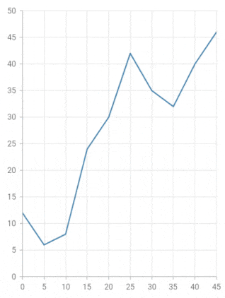
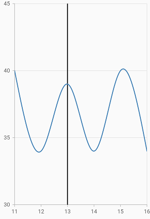
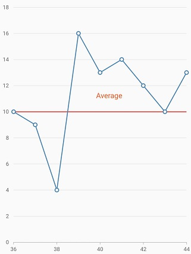
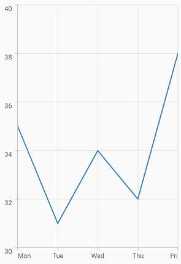
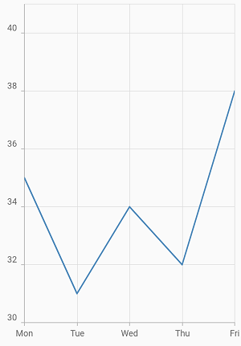

# Axis customization in Cartesian charts

## Common axis features

Customization of features such as axis title, labels, grid lines and tick lines are common to all the axes. Each of these features are explained in this section.

### Axis Visibility

Axis visibility can be controlled using the [`isVisible`](https://pub.dev/documentation/syncfusion_flutter_charts/latest/charts/ChartAxis/isVisible.html) property of axis. Default value of [`isVisible`](https://pub.dev/documentation/syncfusion_flutter_charts/latest/charts/ChartAxis/isVisible.html) is *true*. When the axis visibility is set to false, then the axis elements like ticks, labels, title, etc will be hidden.

 

    @override
    Widget build(BuildContext context) {
        return Scaffold(
            body: Center(
                child: Container(
                    child: SfCartesianChart(
                        primaryXAxis: NumericAxis(
                            // X axis is hidden now
                            isVisible: false
                        )
                    )
                )
            )
        );
    }



### Axis title

The [`title`](https://pub.dev/documentation/syncfusion_flutter_charts/latest/charts/ChartAxis/title.html) property in axis provides options to customize the text and font of axis title. Axis does not display title by default. The title can be customized using following properties,

* [`text`](https://pub.dev/documentation/syncfusion_flutter_charts/latest/charts/AxisTitle/text.html) – used to set the title for axis.
* [`textStyle`](https://pub.dev/documentation/syncfusion_flutter_charts/latest/charts/AxisTitle/textStyle.html) – used to change the text color, size, font family, font style, and font weight.
* [`color`](https://pub.dev/documentation/syncfusion_flutter_charts/latest/charts/ChartTextStyle/color.html) – used to change the color of the label.
* [`fontFamily`](https://pub.dev/documentation/syncfusion_flutter_charts/latest/charts/ChartTextStyle/fontFamily.html) - used to change the font family for the axis title.
* [`fontStyle`](https://pub.dev/documentation/syncfusion_flutter_charts/latest/charts/ChartTextStyle/fontStyle.html) - used to change the font style for the axis title.
* [`fontWeight`](https://pub.dev/documentation/syncfusion_flutter_charts/latest/charts/ChartTextStyle/fontWeight.html) - used to change the font weight for the axis title.
* [`fontSize`](https://pub.dev/documentation/syncfusion_flutter_charts/latest/charts/ChartTextStyle/fontSize.html) - used to change the font size for the axis title.

 

    @override
    Widget build(BuildContext context) {
        return Scaffold(
            body: Center(
                child: Container(
                    child: SfCartesianChart(
                        primaryXAxis: CategoryAxis(
                            title: AxisTitle(
                                text: 'X-Axis',
                                textStyle: ChartTextStyle(
                                    color: Colors.deepOrange,
                                    fontFamily: 'Roboto',
                                    fontSize: 16,
                                    fontStyle: FontStyle.italic,
                                    fontWeight: FontWeight.w300
                                )
                            )
                        )
                    )
                )
            )
        );
    }



### Axis label rotation

The [`labelRotation`](https://pub.dev/documentation/syncfusion_flutter_charts/latest/charts/ChartAxis/labelRotation.html) property of axis can be used to rotate the axis labels position. Default value of [`labelRotation`](https://pub.dev/documentation/syncfusion_flutter_charts/latest/charts/ChartAxis/labelRotation.html) property is 0d.

 

    @override
    Widget build(BuildContext context) {
        return Scaffold(
            body: Center(
                child: Container(
                    child: SfCartesianChart(
                        primaryXAxis: CategoryAxis(
                            // Axis labels will be rotated to 90 degree
                            labelRotation: 90
                        )
                    )
                )
            )
        );
    }



### Axis line customization

[`SfCartesianChart`](https://pub.dev/documentation/syncfusion_flutter_charts/latest/charts/SfCartesianChart-class.html) provides support to customize the style of the axis line by defining the [`axisLine`](https://pub.dev/documentation/syncfusion_flutter_charts/latest/charts/ChartAxis/axisLine.html) property as shown in the below code snippet.

* [`color`](https://pub.dev/documentation/syncfusion_flutter_charts/latest/charts/AxisLine/color.html) – used to change the stroke color of axis line.
* [`width`](https://pub.dev/documentation/syncfusion_flutter_charts/latest/charts/AxisLine/width.html) – used to change the stroke width of axis line.
* [`dashArray`](https://pub.dev/documentation/syncfusion_flutter_charts/latest/charts/AxisLine/dashArray.html) - used to render axis line series with dashes.

 

    @override
    Widget build(BuildContext context) {
        return Scaffold(
            body: Center(
                child: Container(
                    child: SfCartesianChart(
                        primaryXAxis: CategoryAxis(
                            axisLine: AxisLine(
                                color: Colors.deepOrange,
                                width: 2,
                                dashArray: <double>[5,5]
                            )
                        )
                    )
                )
            )
        );
    }



### Axis label customization

The [`labelStyle`](https://pub.dev/documentation/syncfusion_flutter_charts/latest/charts/ChartAxis/labelStyle.html) property in axis provides options to customize the font of axis label. The axis label can be customized using following properties,

* [`labelStyle`](https://pub.dev/documentation/syncfusion_flutter_charts/latest/charts/ChartAxis/labelStyle.html) – used to change the text color, size, font family, font style, and font weight.
* [`color`](https://pub.dev/documentation/syncfusion_flutter_charts/latest/charts/ChartTextStyle/color.html) – used to change the color of the axis label.
* [`fontFamily`](https://pub.dev/documentation/syncfusion_flutter_charts/latest/charts/ChartTextStyle/fontFamily.html) - used to change the font family for the axis label.
* [`fontStyle`](https://pub.dev/documentation/syncfusion_flutter_charts/latest/charts/ChartTextStyle/fontStyle.html) - used to change the font style for the axis label.
* [`fontWeight`](https://pub.dev/documentation/syncfusion_flutter_charts/latest/charts/ChartTextStyle/fontWeight.html) - used to change the font weight for the axis label.
* [`fontSize`](https://pub.dev/documentation/syncfusion_flutter_charts/latest/charts/ChartTextStyle/fontSize.html) - used to change the font size for the axis label.

 

    @override
    Widget build(BuildContext context) {
        return Scaffold(
            body: Center(
                child: Container(
                    child: SfCartesianChart(
                        primaryXAxis: NumericAxis(
                            labelStyle: ChartTextStyle(
                                color: Colors.deepOrange,
                                fontFamily: 'Roboto',
                                fontSize: 14,
                                fontStyle: FontStyle.italic,
                                fontWeight: FontWeight.w500
                            )
                        )
                    )
                )
            )
        );
    }



### Axis animation

The axis animation can be enabled using the `enableAxisAnimation` property of the chart. It defaults to false and this is applicable for all the primary and secondary axis in the chart.

On setting the `enableAxisAnimation` property to true, the axis elements like grid lines, tick lines, and labels will be animated when the axis range is changed dynamically. Axis visible range will be changed while zooming, panning, or while updating the data points.



    Widget build(BuildContext context) {
        return Container(
            child: SfCartesianChart(
                enableAxisAnimation: true,
            )
        );
    }



### Formatting axis label content

The [`labelFormat`](https://pub.dev/documentation/syncfusion_flutter_charts/latest/charts/NumericAxis/labelFormat.html) property is used to add prefix or suffix with the axis label.

 

    @override
    Widget build(BuildContext context) {
        return Scaffold(
            body: Center(
                child: Container(
                    child: SfCartesianChart(
                        primaryYAxis: NumericAxis(
                            // '°C' will be append to all the labels in Y axis
                            labelFormat: '{value}°C'
                        )
                    )
                )
            )
        );
    }



Also refer [number format](./axis-types#formatting-the-labels) and [date format](./axis-types#formatting-the-labels-1) for formatting the labels further.

### Label and tick positioning

Axis labels and ticks can be positioned inside or outside the chart area by using [`labelPosition`](https://pub.dev/documentation/syncfusion_flutter_charts/latest/charts/ChartAxis/labelPosition.html) and [`tickPosition`](https://pub.dev/documentation/syncfusion_flutter_charts/latest/charts/ChartAxis/tickPosition.html) properties of ChartAxis. By default labels and ticks will be positioned outside the chart area.

 

    @override
    Widget build(BuildContext context) {
        return Scaffold(
            body: Center(
                child: Container(
                    child: SfCartesianChart(
                        primaryXAxis: CategoryAxis(
                            labelPosition: LabelPosition.inside,
                            tickPosition: TickPosition.inside
                        )
                    )
                )
            )
        );
    }



### Edge label placement

Labels with long text at the edges of an axis may appear partially outside the chart. The [`edgeLabelPlacement`](https://pub.dev/documentation/syncfusion_flutter_charts/latest/charts/ChartAxis/edgeLabelPlacement.html) property can be used to avoid the partial appearance of labels at the corners. Default value of this property is *none*. Other available options of [`edgeLabelPlacement`](https://pub.dev/documentation/syncfusion_flutter_charts/latest/charts/ChartAxis/edgeLabelPlacement.html) are shift and hide. *shift* option will move the edge labels inside the axis bounds, where the *hide* option will hides the edge labels. 

 

    @override
    Widget build(BuildContext context) {
        return Scaffold(
            body: Center(
                child: Container(
                    child: SfCartesianChart(
                        primaryXAxis: NumericAxis(
                            // Edge labels will be shifted
                            edgeLabelPlacement: EdgeLabelPlacement.shift
                        ) 
                    )
                )
            )
        );
    }



### Grid lines customization

The [`width`](https://pub.dev/documentation/syncfusion_flutter_charts/latest/charts/MajorGridLines/width.html) property is used to control the visibility of grid lines. [`majorGridLines`](https://pub.dev/documentation/syncfusion_flutter_charts/latest/charts/ChartAxis/majorGridLines.html) and [`minorGridLines`](https://pub.dev/documentation/syncfusion_flutter_charts/latest/charts/ChartAxis/minorGridLines.html) properties in axis are used to customize the major grid lines and minor grid lines of an axis respectively. We have provided options to change the width, dashes, color of grid lines. By default minor grid lines will not be visible.

 

    @override
    Widget build(BuildContext context) {
        return Scaffold(
            body: Center(
                child: Container(
                    child: SfCartesianChart(
                        primaryXAxis: NumericAxis(
                            majorGridLines: MajorGridLines(
                                width: 1,
                                color: Colors.red,
                                dashArray: <double>[5,5]
                            ),
                            minorGridLines: MinorGridLines(
                                width: 1,
                                color: Colors.green,
                                dashArray: <double>[5,5]
                            ),
                            minorTicksPerInterval:2
                        )
                    )
                )
            )
        );
    }



### Tick lines customization

The [`majorTickLines`](https://pub.dev/documentation/syncfusion_flutter_charts/latest/charts/ChartAxis/majorTickLines.html) and [`minorTickLines`](https://pub.dev/documentation/syncfusion_flutter_charts/latest/charts/ChartAxis/minorTickLines.html) properties in axis are used to customize the major tick lines of an axis and minor tick lines of an axis respectively. We have provided options to change the [`width`](https://pub.dev/documentation/syncfusion_flutter_charts/latest/charts/MajorTickLines/width.html), [`size`](https://pub.dev/documentation/syncfusion_flutter_charts/latest/charts/MajorTickLines/size.html), [`color`](https://pub.dev/documentation/syncfusion_flutter_charts/latest/charts/MajorTickLines/color.html) and [`minorTicksPerInterval`](https://pub.dev/documentation/syncfusion_flutter_charts/latest/charts/ChartAxis/minorTicksPerInterval.html) of tick lines. By default minor tick lines will not be visible.

 

    @override
    Widget build(BuildContext context) {
        return Scaffold(
            body: Center(
                child: Container(
                    child: SfCartesianChart(
                        primaryXAxis: NumericAxis(
                            majorTickLines: MajorTickLines(
                                size: 6,
                                width: 2,
                                color: Colors.red
                            ),
                            minorTickLines: MinorTickLines(
                                size: 4,
                                width: 2,
                                color: Colors.blue
                            ),
                            minorTicksPerInterval:2
                        )
                    )
                )
            )
        );
    }



### Inversing axis

Axis can be inversed using the [`isInversed`](https://pub.dev/documentation/syncfusion_flutter_charts/latest/charts/ChartAxis/isInversed.html) property of an axis. Default value of [`isInversed`](https://pub.dev/documentation/syncfusion_flutter_charts/latest/charts/ChartAxis/isInversed.html) property is *false*.

 

    @override
    Widget build(BuildContext context) {
        return Scaffold(
            body: Center(
                child: Container(
                    child: SfCartesianChart(
                        primaryXAxis: NumericAxis(
                            // X axis will be inversed
                            isInversed: true
                        )
                    )
                )
            )
        );
    }



### Placing axes at the opposite side

The [`opposedPosition`](https://pub.dev/documentation/syncfusion_flutter_charts/latest/charts/ChartAxis/opposedPosition.html) property of axis can be used to place the axis at the opposite side of its default position. Default value of [`opposedPosition`](https://pub.dev/documentation/syncfusion_flutter_charts/latest/charts/ChartAxis/opposedPosition.html) property is *false*.

 

    @override
    Widget build(BuildContext context) {
        return Scaffold(
            body: Center(
                child: Container(
                    child: SfCartesianChart(
                        primaryXAxis: NumericAxis(
                            // X axis will be opposed
                            opposedPosition: true
                        )
                    )
                )
            )
        );
    }



### Offset the rendering

The [`plotOffset`](https://pub.dev/documentation/syncfusion_flutter_charts/latest/charts/ChartAxis/plotOffset.html) property is used to offset the rendering of the axis at start and end position. The following code snippet demonstrates to apply the plot offset of an axis.

 

    @override
    Widget build(BuildContext context) {
        return Scaffold(
            body: Center(
                child: Container(
                    child: SfCartesianChart(
                        primaryXAxis: NumericAxis(
                            // 20 logical pixels gap will be left at the start and end of the x axis
                            plotOffset: 20
                        )
                    )
                )
            )
        );
    }



### Maximum number of labels per 100 logical pixels

By default, a maximum of 3 labels are displayed for each 100 logical pixels in axis. The maximum number of labels that should be present within 100 logical pixels length can be customized using the [`maximumLabels`](https://pub.dev/documentation/syncfusion_flutter_charts/latest/charts/ChartAxis/maximumLabels.html) property of an axis. This property is applicable only for automatic range calculation and will not work if you set value for **interval** property of an axis.

 

    @override
    Widget build(BuildContext context) {
        return Scaffold(
            body: Center(
                child: Container(
                    child: SfCartesianChart(
                        primaryXAxis: CategoryAxis(
                            maximumLabels: 3
                        )
                    )
                )
            )
        );
    }



### Visible minimum

The [`visibleMinimum`](https://pub.dev/documentation/syncfusion_flutter_charts/latest/charts/NumericAxis/visibleMinimum.html) property is used to set the minimum visible range of an axis. When panning is enabled, you can pan to the actual minimum range of an axis.

 

    @override
    Widget build(BuildContext context) {
        return Scaffold(
            body: Center(
                child: Container(
                    child: SfCartesianChart(
                        primaryXAxis: NumericAxis(
                            visibleMinimum: 2
                        )
                    )
                )
            )
        );
    }



Also refer [minimum](./axis-types) and [maximum](./axis-types) range of an axis.

### Visible maximum

The [`visibleMaximum`](https://pub.dev/documentation/syncfusion_flutter_charts/latest/charts/NumericAxis/visibleMaximum.html) property is used to set the minimum visible range of an axis.When panning is enabled, you can pan to the actual maximum range of an axis.

 

    @override
    Widget build(BuildContext context) {
        return Scaffold(
            body: Center(
                child: Container(
                    child: SfCartesianChart(
                        primaryXAxis: NumericAxis(
                            visibleMaximum: 4
                        )
                    )
                )
            )
        );
    }



## Smart axis labels

Axis labels may overlap with each other based on chart dimensions and label size. The [`labelIntersectAction`](https://pub.dev/documentation/syncfusion_flutter_charts/latest/charts/ChartAxis/labelIntersectAction.html) property of axis is used to avoid overlapping of axis labels. The default value of the [`labelIntersectAction`](https://pub.dev/documentation/syncfusion_flutter_charts/latest/charts/ChartAxis/labelIntersectAction.html) is [`hide`](https://pub.dev/documentation/syncfusion_flutter_charts/latest/charts/AxisLabelIntersectAction-class.html). Other available values are [`none`](https://pub.dev/documentation/syncfusion_flutter_charts/latest/charts/AxisLabelIntersectAction-class.html), [`wrap`](https://pub.dev/documentation/syncfusion_flutter_charts/latest/charts/AxisLabelIntersectAction-class.html), [`multipleRows`](https://pub.dev/documentation/syncfusion_flutter_charts/latest/charts/AxisLabelIntersectAction-class.html), [`rotate45`](https://pub.dev/documentation/syncfusion_flutter_charts/latest/charts/AxisLabelIntersectAction-class.html) and [`rotate90`](https://pub.dev/documentation/syncfusion_flutter_charts/latest/charts/AxisLabelIntersectAction-class.html).

 

    @override
    Widget build(BuildContext context) {
        return Scaffold(
            body: Center(
                child: Container(
                    child: SfCartesianChart(
                        primaryXAxis: CategoryAxis(
                            // Axis labels will be placed in multiple rows, if it is intersected
                            labelIntersectAction: AxisLabelIntersectAction.multipleRows
                        )
                    )
                )
            )
        );
    }



## Axis crossing

Axis can be positioned anywhere in the plot area using the [`crossesAt`](https://pub.dev/documentation/syncfusion_flutter_charts/latest/charts/ChartAxis/crossesAt.html) property. This property specifies where the horizontal axis should intersect or cross the vertical axis, or vice-versa. The default value of the [`crossesAt`](https://pub.dev/documentation/syncfusion_flutter_charts/latest/charts/ChartAxis/crossesAt.html) property is *null*.

 
   
    @override
    Widget build(BuildContext context) {
        return Scaffold(
            body: Center(
                child: Container(
                    child: SfCartesianChart(
                        primaryXAxis:NumericAxis(
                            crossesAt: 0
                        ),
                        primaryYAxis:NumericAxis(
                            crossesAt: 0
                        )
                    )
                )
            )
        );
    }



### Crossing in category axis

For crossing in horizontal category axis, index value should be provided for the [`crossesAt`](https://pub.dev/documentation/syncfusion_flutter_charts/latest/charts/ChartAxis/crossesAt.html) property of vertical axis.



    @override
    Widget build(BuildContext context) {
        return Scaffold(
            body: Center(
                child: Container(
                    child: SfCartesianChart(
                        primaryXAxis:CategoryAxis(),
                        primaryYAxis:NumericAxis(
                            crossesAt: 3
                        )
                    )
                )
            )
        );
    }



### Crossing in date-time axis

For crossing in horizontal date-time axis, date value should be provided for the [`crossesAt`](https://pub.dev/documentation/syncfusion_flutter_charts/latest/charts/ChartAxis/crossesAt.html) property of vertical axis.



    @override
    Widget build(BuildContext context) {
        return Scaffold(
            body: Center(
                child: Container(
                    child: SfCartesianChart(
                        primaryXAxis:DateTimeAxis(),
                        primaryYAxis:NumericAxis(
                            crossesAt: DateTime(2018, 4, 1)
                        )
                    )
                )
            )
        );
    }

  

### Positioning the axis labels when crossing

The [`placeLabelsNearAxisLine`](https://pub.dev/documentation/syncfusion_flutter_charts/latest/charts/ChartAxis/placeLabelsNearAxisLine.html) property is used to determine whether the axis labels of crossed axis should be placed near to the axis line or not. The default value of [`placeLabelsNearAxisLine`](https://pub.dev/documentation/syncfusion_flutter_charts/latest/charts/ChartAxis/placeLabelsNearAxisLine.html) property is *false*.



    @override
    Widget build(BuildContext context) {
        return Scaffold(
            body: Center(
                child: Container(
                    child: SfCartesianChart(
                        primaryXAxis:NumericAxis(
                            placeLabelNearToAxisLine: false
                        ),
                        primaryYAxis:NumericAxis(
                            placeLabelNearToAxisLine: false
                        )
                    )
                )
            )
        );
    } 
    


## Plot bands

Plot bands are also known as strip lines, which are used to shade the different ranges in plot area with different colors to improve the readability of the chart. You can also add a text to indicate what that particular region indicates. You can enable the plot bands to be drawn repeatedly at regular intervals. This will be useful when you need to mark an event that occurs recursively along the timeline of the chart.

Since plot bands are drawn based on the axis, you have to add plot bands using the [`plotBands`](https://pub.dev/documentation/syncfusion_flutter_charts/latest/charts/ChartAxis/plotBands.html) property of the respective axis. You can also add multiple plot bands to an axis.

The following properties are used to configure the plot bands:

* [`start`](https://pub.dev/documentation/syncfusion_flutter_charts/latest/charts/PlotBand/start.html) – Changes the start position of the plot band.
* [`end`](https://pub.dev/documentation/syncfusion_flutter_charts/latest/charts/PlotBand/end.html) – Changes the end position of the plot band.
* [`size`](https://pub.dev/documentation/syncfusion_flutter_charts/latest/charts/PlotBand/size.html) – Changes how long plot band should be expanded. This is applicable only when end is not specified.
* [`sizeType`](https://pub.dev/documentation/syncfusion_flutter_charts/latest/charts/PlotBand/sizeType.html) – Changes the date-time unit of the value specified in the size property. The values can be Year, Month, Day, Hour, Minute, Second, and Millisecond.
* [`text`](https://pub.dev/documentation/syncfusion_flutter_charts/latest/charts/PlotBand/text.html) – Changes the text of the plot band.
* [`textAngle`](https://pub.dev/documentation/syncfusion_flutter_charts/latest/charts/PlotBand/textAngle.html) – Changes the angle of the text.
* [`color`](https://pub.dev/documentation/syncfusion_flutter_charts/latest/charts/PlotBand/color.html) – Changes the color of the plot band.
* [`gradient`](https://pub.dev/documentation/syncfusion_flutter_charts/latest/charts/PlotBand/gradient.html) – Applies gradient color for plot band.
* [`opacity`](https://pub.dev/documentation/syncfusion_flutter_charts/latest/charts/PlotBand/opacity.html) – Changes the opacity of the plot band.
* [`borderWidth`](https://pub.dev/documentation/syncfusion_flutter_charts/latest/charts/PlotBand/borderWidth.html) – Changes the stroke width of the plot band.
* [`borderColor`](https://pub.dev/documentation/syncfusion_flutter_charts/latest/charts/PlotBand/borderColor.html) – Changes the stroke color of the plot band.
* [`horizontalTextAlignment`](https://pub.dev/documentation/syncfusion_flutter_charts/latest/charts/PlotBand/horizontalTextAlignment.html) – Aligns the text horizontally.
* [`verticalTextAlignment`](https://pub.dev/documentation/syncfusion_flutter_charts/latest/charts/PlotBand/verticalTextAlignment.html) – Aligns the text vertically.
* [`isVisible`](https://pub.dev/documentation/syncfusion_flutter_charts/latest/charts/PlotBand/isVisible.html) – Changes the visibility of the plot band in chart axis.
* [`shouldRenderAboveSeries`](https://pub.dev/documentation/syncfusion_flutter_charts/latest/charts/PlotBand/shouldRenderAboveSeries.html) – Changes the rendering order of the plot band.

### Add plot band for category axis

Plot band can be added to the category axis by specifying index values to the [`start`](https://pub.dev/documentation/syncfusion_flutter_charts/latest/charts/PlotBand/start.html) and [`end`](https://pub.dev/documentation/syncfusion_flutter_charts/latest/charts/PlotBand/end.html) properties.



    @override
    Widget build(BuildContext context) {
        return Scaffold(
            body: Center(
                child: Container(
                    child: SfCartesianChart(
                        primaryXAxis:CategoryAxis(
                            plotBands: <PlotBand>[
                            PlotBand(
                            isVisible: true,
                            start: 1,
                            end: 2,
                        ),
                    )
                )
            )
        );
    }

    

### Add plot band for date-time axis

Plot band can be added to the date-time axis by specifying date values to the [`start`](https://pub.dev/documentation/syncfusion_flutter_charts/latest/charts/PlotBand/start.html) and [`end`](https://pub.dev/documentation/syncfusion_flutter_charts/latest/charts/PlotBand/end.html) properties.



    @override
    Widget build(BuildContext context) {
        return Scaffold(
            body: Center(
                child: Container(
                    child: SfCartesianChart(
                        primaryXAxis:DateTimeAxis(
                            plotBands: <PlotBand>[
                            PlotBand(
                            isVisible: true,
                            start: DateTime(2018, 2, 1),
                            end:  DateTime(2018, 4, 1),
                        ),
                    )
                )
            )
        );
    }



### Recursive plot band

This feature is used to enable the plot bands to be drawn repeatedly at the regular intervals. This will be useful when you need to mark an event that occurs recursively along the timeline of the chart. The following properties are used to configure this feature:

* [`repeatEvery`](https://pub.dev/documentation/syncfusion_flutter_charts/latest/charts/PlotBand/repeatEvery.html) – Changes the frequency of the plot band being repeated.
* [`repeatUntil`](https://pub.dev/documentation/syncfusion_flutter_charts/latest/charts/PlotBand/repeatUntil.html) – Specifies the end value at which point strip line has to stop repeating.

The following code snippet and screenshot demonstrate this feature by highlighting weekends.



    @override
    Widget build(BuildContext context) {
        return Scaffold(
            body: Center(
                child: Container(
                    child: SfCartesianChart(
                        primaryXAxis:DateTimeAxis(
                            plotBands: <PlotBand>[
                            PlotBand(
                            isVisible: true,
                            isRepeatable: true,
                            repeatEvery: 2,
                            size: 1,
                            sizeType: DateTimeIntervalType.months,
                            repeatUntil: DateTime(2018, 6, 1),
                        ),
                    )
                )
            )
        );
    }



### Segmented plot band

Typically, if you draw a plot band for a vertical axis, the height of the plot band is determined by the start and end properties, and the end of the plot band is equivalent to the end of its associated horizontal axis, i.e., plot band is drawn horizontally to the entire stretch of its associated horizontal axis. Similarly, for horizontal axis, width is determined by the Start and Width properties, and vertically, it is drawn to the entire stretch of the associated vertical axis.

Suppose, you need to draw a plot band that should not stretch along its associated axis, you have to set the [`associatedAxisStart`](https://pub.dev/documentation/syncfusion_flutter_charts/latest/charts/PlotBand/associatedAxisStart.html) and [`associatedAxisEnd`](https://pub.dev/documentation/syncfusion_flutter_charts/latest/charts/PlotBand/associatedAxisEnd.html) properties. The values provided in these two properties correspond to its associated axis specified by the [`associatedAxisName`](https://pub.dev/documentation/syncfusion_flutter_charts/latest/charts/ChartAxis/associatedAxisName.html) property in the axis.



    @override
    Widget build(BuildContext context) {
        return Scaffold(
            body: Center(
                child: Container(
                    child: SfCartesianChart(
                        primaryXAxis:DateTimeAxis(
                            plotBands: <PlotBand>[
                            PlotBand(
                            isVisible: true,
                            start: DateTime(2018,2,1),
                            end: DateTime(2018,6,1),
                            associatedAxisStart: 8,
                            associatedAxisEnd: 15,
                            shouldRenderAboveSeries: true,
                            color: const Color.fromRGBO(224, 155, 0, 1)
                        ),
                    )
                )
            )
        );
    }



### Plot line

When you specify the same value for both [`start`](https://pub.dev/documentation/syncfusion_flutter_charts/latest/charts/PlotBand/start.html) and [`end`](https://pub.dev/documentation/syncfusion_flutter_charts/latest/charts/PlotBand/end.html), it will draw a line. You can customize the line using the  [`borderWidth`](https://pub.dev/documentation/syncfusion_flutter_charts/latest/charts/PlotBand/borderWidth.html) and [`borderColor`](https://pub.dev/documentation/syncfusion_flutter_charts/latest/charts/PlotBand/borderColor.html) properties.



    @override
    Widget build(BuildContext context) {
        return Scaffold(
            body: Center(
                child: Container(
               child: SfCartesianChart(
                    primaryXAxis: NumericAxis(
                      plotBands: <PlotBand>[
                        PlotBand(
                          isVisible: true,
                          start: 13,
                          end: 13,
                          borderWidth: 2,
                        )
                      ]
                    )
                   )
                )
              );  
           }



### Plot band padding

Padding to the plot band text can be added using the [`verticalTextPadding`]() or [`horizontalTextPadding`]() properties. The [`verticalTextPadding`]() is used to move the plot band text vertically and [`horizontalTextPadding`]() is used to move the plot band text horizontally.

These properties takes pixel or percentage value. For pixel input should be like `10px` and for percentage input should be like `10%`. If no suffix is specified (`10`), it will be considered as pixel value. Percentage value refers to the overall width of the chart. i.e 100% is equal to the width of the chart. 

This is applicable for both vertical and horizontal axis. Positive value for this property moves the text to right and negative value moves to left.

If [`verticalTextAlignment`](https://pub.dev/documentation/syncfusion_flutter_charts/latest/charts/PlotBand/verticalTextAlignment.html) or [`horizontalTextAlignment`](https://pub.dev/documentation/syncfusion_flutter_charts/latest/charts/PlotBand/horizontalTextAlignment.html) is specified, text padding will be calculated from that modified position. Defaults to `null`.

 

    @override
    Widget build(BuildContext context) {
      return Container(
        child: SfCartesianChart(
            primaryXAxis: NumericAxis(
                plotBands: <PlotBand>[
                    PlotBand(
                        verticalTextPadding:'5%',
                        horizontalTextPadding: '5%',
                        text: 'Average',
                        textAngle: 0,
                        start: 10,
                        end: 10, 
                        textStyle: TextStyle(color: Colors.deepOrange, fontSize: 16),
                        borderColor: Colors.red,
                        borderWidth: 2
                    )
                ]
            )
        )
      );
    }



## Multiple axes

By default, the chart is rendered with primary x axis and primary y axis. But, the users can add n number of axis to the chart. An additional horizontal or vertical axis can be added to the chart using the [`axes`](https://pub.dev/documentation/syncfusion_flutter_charts/latest/charts/SfCartesianChart/axes.html) property, and then you can associate it to a series by specifying the name of the axis to the [`xAxisName`](https://pub.dev/documentation/syncfusion_flutter_charts/latest/charts/CartesianSeries/xAxisName.html) or [`yAxisName`](https://pub.dev/documentation/syncfusion_flutter_charts/latest/charts/CartesianSeries/yAxisName.html) property in the series.

 

    @override
    Widget build(BuildContext context) {
        return Scaffold(
            body: Center(
                child: Container(
                    child: SfCartesianChart(
                        primaryXAxis: CategoryAxis(
                            title: AxisTitle(text: 'Primary X Axis')
                        ),
                        primaryYAxis: NumericAxis(
                            title: AxisTitle(
                                text: 'Primary Y Axis'
                            )
                        ),
                        // adding multiple axis
                        axes: <ChartAxis>[
                            NumericAxis(
                                name: 'xAxis',
                                opposedPosition: true,
                                interval:1,
                                minimum: 0,
                                maximum: 5,
                                title: AxisTitle(
                                    text: 'Secondary X Axis'
                                )
                            ),
                            NumericAxis(
                                name: 'yAxis',
                                opposedPosition: true,
                                title: AxisTitle(
                                    text: 'Secondary Y Axis'
                                )
                            )
                        ],
                        series: <ChartSeries>[
                            LineSeries<SalesData, String>(
                                dataSource: [
                                    SalesData('Jan', 35),
                                    SalesData('Feb', 28),
                                    SalesData('Mar', 34),
                                    SalesData('Apr', 32),
                                    SalesData('May', 40)
                                ],
                                xValueMapper: (SalesData sales, _) => sales.year,
                                yValueMapper: (SalesData sales, _) => sales.sales
                            ),
                            LineSeries<SalesData, double>(
                                dataSource: [
                                    SalesData('Jan', 15, 1),
                                    SalesData('Feb', 11, 2),
                                    SalesData('Mar', 14, 3),
                                    SalesData('Apr', 12, 4),
                                ],
                                xValueMapper: (SalesData sales, _) => sales.numeric,
                                yValueMapper: (SalesData sales, _) => sales.sales,
                                xAxisName: 'xAxis',
                                yAxisName: 'yAxis'
                            )
                        ]
                    )
                )
            )
        );
    }



## Axis label alignment

The position of axis label can be aligned using the [`labelAlignment`](https://pub.dev/documentation/syncfusion_flutter_charts/latest/charts/DataLabelSettings/labelAlignment.html) property.The following options are available in axis label alignment.

* [`start`]() - If it is a horizontal axis, aligns the labels before the gridline and if it is a vertical axis, aligns the labels below the gridline.

* [`end`]() - If it is a horizontal axis, aligns the labels after the gridline and if it is a vertical axis, align the labels above the gridline.

* [`center`]() - Aligns the axis label to the center of the gridlines.

### Center

Aligns the axis label to the center of the gridlines.

 

    @override
    Widget build(BuildContext context) {
        return Scaffold(
            body: Center(
                child: Container(
                        child: SfCartesianChart(
                            primaryXAxis: DateTimeAxis(),
                            primaryYAxis:
                                NumericAxis(
                                    //Aligns the y-axis labels
                                    labelAlignment: LabelAlignment.center
                                ),
                        )
                )
            )
        );
    }
     


### Start

If it is a horizontal axis, aligns the labels before the gridline and if it is a vertical axis, aligns the labels below the gridline.

 

    @override
    Widget build(BuildContext context) {
        return Scaffold(
            body: Center(
                child: Container(
                        child: SfCartesianChart(
                            primaryXAxis: DateTimeAxis(),
                            primaryYAxis: NumericAxis(
                                //Aligns the y-axis labels
                                labelAlignment:LabelAlignment.start),
                        )
                ) 
            )
        );
    }
     


### End

If it is a horizontal axis, aligns the labels after the gridline and if it is a vertical axis, align the labels above the gridline.

 

    @override
    Widget build(BuildContext context) {
        return Scaffold(
            body: Center(
                child: Container(
                        child: SfCartesianChart(
                            primaryXAxis: DateTimeAxis(),
                            primaryYAxis: NumericAxis(
                                //Aligns the y-axis labels
                                labelAlignment: LabelAlignment.end
                            ),
                        )
                )
            )
        );
    }
     


## See Also

* [Rendering a particular part of a data using visible minimum and visible maximum in the Cartesian chart](https://www.syncfusion.com/kb/11308/how-to-render-particular-part-of-a-data-in-cartesian-charts-sfcartesianchart).
