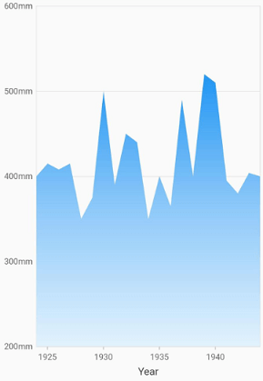
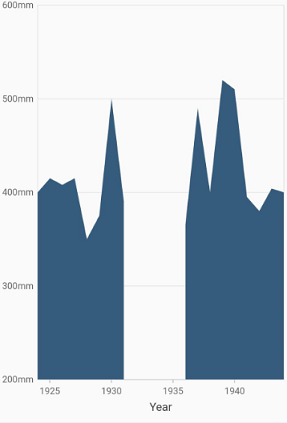

# Area Chart in Flutter Cartesian Charts (SfCartesianChart)

To render an area chart, create an instance of [`AreaSeries`](https://pub.dev/documentation/syncfusion_flutter_charts/latest/charts/AreaSeries-class.html), and add it to the [`series`](https://pub.dev/documentation/syncfusion_flutter_charts/latest/charts/SfCartesianChart/series.html) collection property of [`SfCartesianChart`](https://pub.dev/documentation/syncfusion_flutter_charts/latest/charts/SfCartesianChart/SfCartesianChart.html). The area chart shows the filled area to represent the data, but when there are more than a series, this may hide the other series. To get rid of this, increase or decrease the transparency of the series. 

The following properties can be used to customize the appearance:

* [`color`](https://pub.dev/documentation/syncfusion_flutter_charts/latest/charts/CartesianSeries/color.html) - changes the color of the series.
* [`opacity`](https://pub.dev/documentation/syncfusion_flutter_charts/latest/charts/CartesianSeries/opacity.html) - controls the transparency of the chart series.
* [`borderWidth`](https://pub.dev/documentation/syncfusion_flutter_charts/latest/charts/CartesianSeries/borderWidth.html) - changes the stroke width of the series.
* [`borderColor`](https://pub.dev/documentation/syncfusion_flutter_charts/latest/charts/CartesianSeries/borderColor.html) - changes the stroke color of the series.

 

    @override
    Widget build(BuildContext context) {
        return Scaffold(
            body: Center(
                child: Container(
                    child: SfCartesianChart(
                        primaryXAxis: DateTimeAxis(),
                        series: <ChartSeries>[
                            // Renders area chart
                            AreaSeries<SalesData, dateTime>(
                                dataSource: chartData,
                                xValueMapper: (SalesData sales, _) => sales.year,
                                yValueMapper: (SalesData sales, _) => sales.sales
                            )
                        ]
                    )
                )
            )
        );
    }



###	Border customization

The borders of the area chart can be customized using the [`borderDrawMode`](https://pub.dev/documentation/syncfusion_flutter_charts/latest/charts/AreaSeries/borderDrawMode.html) property. The default value of the [`borderDrawMode`](https://pub.dev/documentation/syncfusion_flutter_charts/latest/charts/AreaSeries/borderDrawMode.html) property is [`top`](https://pub.dev/documentation/syncfusion_flutter_charts/latest/charts/BorderDrawMode-class.html). The other values are [`all`](https://pub.dev/documentation/syncfusion_flutter_charts/latest/charts/BorderDrawMode-class.html) and [`excludeBottom`](https://pub.dev/documentation/syncfusion_flutter_charts/latest/charts/BorderDrawMode-class.html).

 

    @override
    Widget build(BuildContext context) {
        return Scaffold(
            body: Center(
                child: Container(
                    child: SfCartesianChart(
                        primaryXAxis: DateTimeAxis(),
                        series: <ChartSeries>[
                            AreaSeries<SalesData, DateTime>(
                                dataSource: chartData,
                                color: Colors.deepOrange[300],
                                borderMode: AreaBorderMode.excludeBottom,
                                borderColor: Colors.green,
                                borderWidth: 2,
                                xValueMapper: (SalesData sales, _) => sales.year,
                                yValueMapper: (SalesData sales, _) => sales.sales
                            )
                        ]
                    )
                )
            )
        );
    }



Also refer, [color palette](./series-customization#color-palette), [color mapping](./series-customization#color-mapping-for-data-points), [animation](./series-customization#animation), [gradient](./series-customization#gradient-fill) and [empty points](./series-customization#empty-points) for customizing the area series further.

## Area with gradients

The [`gradient`](https://pub.dev/documentation/syncfusion_flutter_charts/latest/charts/CartesianSeries/gradient.html) property is used to define the gradient colors. The colors from this property is used for series.

 

    @override
    Widget build(BuildContext context) {
         final List<Color> color = <Color>[];
        color.add(Colors.blue[50]!);
        color.add(Colors.blue[200]!);
        color.add(Colors.blue);

        final List<double> stops = <double>[];
        stops.add(0.0);
        stops.add(0.5);
        stops.add(1.0);

        final LinearGradient gradientColors =
            LinearGradient(colors: color, stops: stops);
        
        return Scaffold(
            body: Center(
                child: Container(
                    child: SfCartesianChart(
                        primaryXAxis: DateTimeAxis(),
                        series: <ChartSeries>[
                            // Renders area chart
                            AreaSeries<SalesData, DateTime>(
                                dataSource: chartData,
                                xValueMapper: (SalesData sales, _) => sales.year,
                                yValueMapper: (SalesData sales, _) => sales.sales,
                                 gradient: gradientColors
                            )
                        ]
                    )
                )
            )
        );
    }



## Area with empty points

Data points with a null value are considered empty points. Empty data points are ignored and are not plotted in the chart. By using [`emptyPointSettings`](https://pub.dev/documentation/syncfusion_flutter_charts/latest/charts/CartesianSeries/emptyPointSettings.html) property in series, you can decide the action taken for empty points. Available [`modes`](https://pub.dev/documentation/syncfusion_flutter_charts/latest/charts/EmptyPointMode-class.html) are [`gap`](https://pub.dev/documentation/syncfusion_flutter_charts/latest/charts/EmptyPointMode-class.html), [`zero`](https://pub.dev/documentation/syncfusion_flutter_charts/latest/charts/EmptyPointMode-class.html), [`drop`](https://pub.dev/documentation/syncfusion_flutter_charts/latest/charts/EmptyPointMode-class.html) and [`average`](https://pub.dev/documentation/syncfusion_flutter_charts/latest/charts/EmptyPointMode-class.html). Default mode of the empty point is [`gap`](https://pub.dev/documentation/syncfusion_flutter_charts/latest/charts/EmptyPointMode-class.html).

 

    @override
    Widget build(BuildContext context) {
        return Scaffold(
            body: Center(
                child: Container(
                    child: SfCartesianChart(
                        primaryXAxis: DateTimeAxis(),
                        series: <ChartSeries>[
                            AreaSeries<SalesData, DateTime>(
                                dataSource: chartData,
                                xValueMapper: (SalesData sales, _) => sales.year,
                                yValueMapper: (SalesData sales, _) => sales.sales
                            )
                        ]
                    )
                )
            )
        );
    }



## Vertical area chart

The [`isTransposed`](https://pub.dev/documentation/syncfusion_flutter_charts/latest/charts/SfCartesianChart/isTransposed.html) property of [`CartesianSeries`](https://pub.dev/documentation/syncfusion_flutter_charts/latest/charts/CartesianSeries-class.html) is used to transpose the horizontal and vertical axes, to view the data in a different perspective. Using this feature, you can render vertical area chart.

 

    @override
    Widget build(BuildContext context) {
        return Scaffold(
            body: Center(
                child: Container(
                    child: SfCartesianChart(
                        isTransposed: true,
                        primaryXAxis: DateTimeAxis(),
                        series: <ChartSeries>[
                            AreaSeries<SalesData, DateTime>(
                                dataSource: chartData,
                                xValueMapper: (SalesData sales, _) => sales.year,
                                yValueMapper: (SalesData sales, _) => sales.sales
                            )
                        ]
                    )
                )
            )
        );
    }



