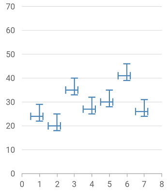
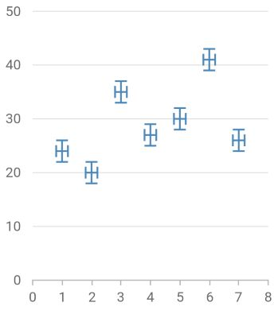
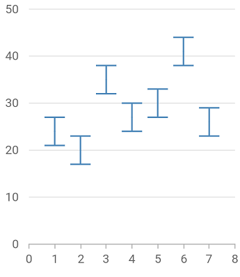

# Error bar chart in Flutter Cartesian Charts (SfCartesianChart)

Error bars are graphical representations of the variability of data and used on graphs to indicate the error or uncertainty in a reported measurement.

To render an error bar chart, create an instance of `ErrorBarSeries`, and add it to the [`series`](https://pub.dev/documentation/syncfusion_flutter_charts/latest/charts/XyDataSeries-class.html) collection property of [`SfCartesianChart`](https://pub.dev/documentation/syncfusion_flutter_charts/latest/charts/SfCartesianChart/SfCartesianChart.html). The following properties can be used to customize the appearance:

* [`color`](https://pub.dev/documentation/syncfusion_flutter_charts/latest/charts/CartesianSeries/color.html) - changes the stroke width of the line.
* [`opacity`](https://pub.dev/documentation/syncfusion_flutter_charts/latest/charts/CartesianSeries/opacity.html) - controls the transparency of the chart series.
* [`width`](https://pub.dev/documentation/syncfusion_flutter_charts/latest/charts/CartesianSeries/width.html) - changes the stroke width of the line.
* [`dashArray`](https://pub.dev/documentation/syncfusion_flutter_charts/latest/charts/CartesianSeries/dashArray.html) - renders error bar with dashes.
* [`pointColorMapper`](https://pub.dev/documentation/syncfusion_flutter_charts/latest/charts/CartesianSeries/pointColorMapper.html)- maps the individual colors to the data point.

[`Marker`](https://pub.dev/documentation/syncfusion_flutter_charts/latest/charts/MarkerSettings/MarkerSettings.html), [`data label`](https://pub.dev/documentation/syncfusion_flutter_charts/latest/charts/DataLabelSettings-class.html), [`trendline`](https://pub.dev/documentation/syncfusion_flutter_charts/latest/charts/Trendline-class.html), [`Technical indicators`](https://pub.dev/documentation/syncfusion_flutter_charts/latest/charts/TechnicalIndicators-class.html), and other user interaction features are not applicable for error bar series. And events like [`onPointTap`](https://pub.dev/documentation/syncfusion_flutter_charts/latest/charts/CartesianSeries/onPointTap.html), [`onPointDoubleTap`](https://pub.dev/documentation/syncfusion_flutter_charts/latest/charts/CartesianSeries/onPointDoubleTap.html) and [`onPointLongPress`](https://pub.dev/documentation/syncfusion_flutter_charts/latest/charts/CartesianSeries/onPointLongPress.html) are not applicable for this series.



    @override
    Widget build(BuildContext context) {
      final dynamic chartData = [
        ChartData(1, 24),
        ChartData(2, 20),
        ChartData(3, 35),
        ChartData(4, 27),
        ChartData(5, 30),
        ChartData(6, 41),
        ChartData(7, 26)
      ];

      return Scaffold(
        body: SfCartesianChart(
      series: <ChartSeries<ChartData, int>>[
        ErrorBarSeries<ChartData, int>(
          width: 3.0,
          opacity: 0.7,
          color: Color.fromRGBO(246, 114, 128, 1),
          dataSource: chartData,
          xValueMapper: (ChartData data, _) => data.x,
          yValueMapper: (ChartData data, _) => data.y,
        )
      ],
    )
    );
    }

    class ChartData {
      ChartData(this.x, this.y);
      final int x;
      final int y;
    }



## Type

The `type` property is used to define the error bar type value. The default value of this property is `fixed`, and other values are `custom`, `percentage`, `standardDeviation` and `standardError`.

You can customize the error bar depending on the error value by setting the values for `horizontalErrorValue` and `verticalErrorValue` for all types except `custom`.

* `horizontalErrorValue` - This property horizontally depicts the error value in positive and negative directions. The default value of `horizontalErrorValue` is `1`.
* `verticalErrorValue` - This property vertically depicts the error value in positive and negative directions. The default value of `verticalErrorValue` is `3`.



    @override
    Widget build(BuildContext context) {
      final dynamic chartData = [
        ChartData(1, 24),
        ChartData(2, 20),
        ChartData(3, 35),
        ChartData(4, 27),
        ChartData(5, 30),
        ChartData(6, 41),
        ChartData(7, 26)
      ];

      return Scaffold(
        body: SfCartesianChart(
      series: <ChartSeries<ChartData, int>>[
        ErrorBarSeries<ChartData, int>(
          dataSource: chartData,
          xValueMapper: (ChartData data, _) => data.x,
          yValueMapper: (ChartData data, _) => data.y,
          width: 1.5,
          type: ErrorBarType.standardError
        )
      ],
    )
    );
    }

    class ChartData {
      ChartData(this.x, this.y);
      final int x;
      final int y;
    }



### Custom type

For `custom` type, you can customize the error bar depending on the error value by setting the values for `horizontalPositiveErrorValue`, `horizontalNegativeErrorValue`, `verticalPositiveErrorValue` and `verticalNegativeErrorValue`.

* `horizontalPositiveErrorValue` - This property horizontally depicts the error value in positive direction. The default value of `horizontalPositiveErrorValue` is `1`.
* `horizontalNegativeErrorValue` - This property horizontally depicts the error value in negative direction. The default value of `horizontalNegativeErrorValue` is `1`.
* `verticalPositiveErrorValue` - This property vertically depicts the error value in positive direction. The default value of `verticalPositiveErrorValue` is `3`.
* `verticalNegativeErrorValue` - This property vertically depicts the error value in negative direction. The default value of `verticalNegativeErrorValue` is `3`.



    @override
    Widget build(BuildContext context) {
      final dynamic chartData = [
        ChartData(1, 24),
        ChartData(2, 20),
        ChartData(3, 35),
        ChartData(4, 27),
        ChartData(5, 30),
        ChartData(6, 41),
        ChartData(7, 26)
      ];

      return Scaffold(
        body: SfCartesianChart(
      series: <ChartSeries<ChartData, int>>[
        ErrorBarSeries<ChartData, int>(
          dataSource: chartData,
          xValueMapper: (ChartData data, _) => data.x,
          yValueMapper: (ChartData data, _) => data.y,
          width: 1.5,
          type: ErrorBarType.custom,
          mode: RenderingMode.both,
          verticalPositiveErrorValue: 5,
          verticalNegativeErrorValue: 2,
          horizontalPositiveErrorValue: 0.2,
          horizontalNegativeErrorValue: 0.5
        )
      ],
    )
    );
    }

    class ChartData {
      ChartData(this.x, this.y);
      final int x;
      final int y;
    }



## Mode

The error bar `mode` specifies whether the error bar should be drawn `horizontally`, `vertically`, or `both` ways. Use the `mode` option to switch the error bar mode. The default value of the `mode` is `RenderingMode.vertical`. You can use the following properties to customize the `mode`,

* `vertical` - This property displays vertical error value only.
* `horizontal` - This property displays horizontal error value only.
* `both`  - This property displays both vertical and horizontal error values.



    @override
    Widget build(BuildContext context) {
      final dynamic chartData = [
        ChartData(1, 24),
        ChartData(2, 20),
        ChartData(3, 35),
        ChartData(4, 27),
        ChartData(5, 30),
        ChartData(6, 41),
        ChartData(7, 26)
      ];

      return Scaffold(
        body: SfCartesianChart(
      series: <ChartSeries<ChartData, int>>[
        ErrorBarSeries<ChartData, int>(
          dataSource: chartData,
          xValueMapper: (ChartData data, _) => data.x,
          yValueMapper: (ChartData data, _) => data.y,
          width: 1.5,
          mode:RenderingMode.both,
          verticalErrorValue:2,
          horizontalErrorValue:0.2
        )
      ],
    )
    );
    }

    class ChartData {
      ChartData(this.x, this.y);
      final int x;
      final int y;
    }



## Direction

Using the `direction` option, you can alter the error bar direction to `plus`, `minus`, or `both` sides. The default value of the `direction` is `Direction.both`. You can use the following properties to customize the `direction`,

* `both` - Used to set error value in positive and negative directions.
* `minus` - Used to set error value in a negative direction.
* `plus` - Used to set error value in a positive direction.



    @override
    Widget build(BuildContext context) {
      final dynamic chartData = [
        ChartData(1, 24),
        ChartData(2, 20),
        ChartData(3, 35),
        ChartData(4, 27),
        ChartData(5, 30),
        ChartData(6, 41),
        ChartData(7, 26)
      ];

      return Scaffold(
        body: SfCartesianChart(
      series: <ChartSeries<ChartData, int>>[
        ErrorBarSeries<ChartData, int>(
          dataSource: chartData,
          xValueMapper: (ChartData data, _) => data.x,
          yValueMapper: (ChartData data, _) => data.y,
          width: 1.5,
          direction: Direction.minus
        )
      ],
    )
    );
    }

    class ChartData {
      ChartData(this.x, this.y);
      final int x;
      final int y;
    }



## Cap length

The `capLength` property is used to customize the length of the error bar's cap. The default value is `10`.



    @override
    Widget build(BuildContext context) {
      final dynamic chartData = [
        ChartData(1, 24),
        ChartData(2, 20),
        ChartData(3, 35),
        ChartData(4, 27),
        ChartData(5, 30),
        ChartData(6, 41),
        ChartData(7, 26)
      ];

      return Scaffold(
        body: SfCartesianChart(
      series: <ChartSeries<ChartData, int>>[
        ErrorBarSeries<ChartData, int>(
          dataSource: chartData,
          xValueMapper: (ChartData data, _) => data.x,
          yValueMapper: (ChartData data, _) => data.y,
          width: 1.5,
          capLength: 20.0
        )
      ],
    )
    );
    }

    class ChartData {
      ChartData(this.x, this.y);
      final int x;
      final int y;
    }



## See also

[color palette](https://help.syncfusion.com/flutter/cartesian-charts/series-customization#color-palette), [color mapping](https://help.syncfusion.com/flutter/cartesian-charts/series-customization#color-mapping-for-data-points), [animation](https://help.syncfusion.com/flutter/cartesian-charts/series-customization#animation), [sorting](https://help.syncfusion.com/flutter/cartesian-charts/series-customization#sorting) and [empty points](https://help.syncfusion.com/flutter/cartesian-charts/series-customization#empty-points) for customizing the error bar series further.