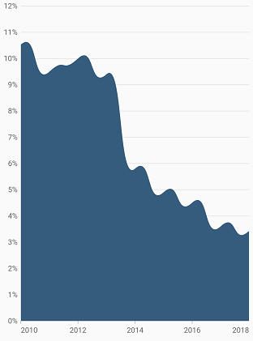
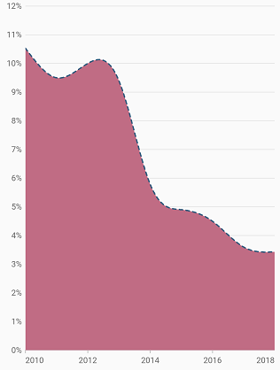

# Spline area Chart in Flutter Cartesian Charts (SfCartesianChart)

To render a spline area chart, create an instance of [`SplineAreaSeries`](https://pub.dev/documentation/syncfusion_flutter_charts/latest/charts/SplineAreaSeries-class.html), and add it to the [`series`](https://pub.dev/documentation/syncfusion_flutter_charts/latest/charts/SfCartesianChart/series.html) collection property of [`SfCartesianChart`](https://pub.dev/documentation/syncfusion_flutter_charts/latest/charts/SfCartesianChart/SfCartesianChart.html). The following properties can be used to customize the appearance of spline area chart:

* [`color`](https://pub.dev/documentation/syncfusion_flutter_charts/latest/charts/CartesianSeries/color.html) - changes the color of the series.
* [`opacity`](https://pub.dev/documentation/syncfusion_flutter_charts/latest/charts/CartesianSeries/opacity.html) - controls the transparency of the chart series.
* [`width`](https://pub.dev/documentation/syncfusion_flutter_charts/latest/charts/CartesianSeries/width.html) - changes the stroke width of the series.

 

    @override
    Widget build(BuildContext context) {
            final List<ChartData> chartData = <ChartData>[
            ChartData(2010, 10.53, 3.3),
            ChartData(2011, 9.5, 5.4),
            ChartData(2012, 10, 2.65),
            ChartData(2013, 9.4, 2.62),
            ChartData(2014, 5.8, 1.99),
            ChartData(2015, 4.9, 1.44),
            ChartData(2016, 4.5, 2),
            ChartData(2017, 3.6, 1.56),
            ChartData(2018, 3.43, 2.1),
            ];
        return Scaffold(
            body: Center(
                    child: SfCartesianChart(
                        series: <ChartSeries>[
                            SplineAreaSeries<ChartData, int>(
                                dataSource: chartData,
                                xValueMapper: (ChartData data, _) => data.x,
                                yValueMapper: (ChartData data, _) => data.y
                            ),
                            SplineAreaSeries<ChartData, int>(
                                dataSource: chartData,
                                xValueMapper: (ChartData data, _) => data.x,
                                yValueMapper: (ChartData data, _) => data.y1
                            ),
                        ]
                    )
                )
            );
        }
    class ChartData {
      ChartData(this.x, this.y, this.y1);
      final int x;
      final double y;
      final double y1;
    }



##	Spline area rendering types

The `splineType` allows you to change the spline area curve in series. The following types can be used in `SplineAreaSeries`:

* natural
* monotonic
* cardinal
* clamped

By default, the value of `splineType` is `natural`.

The following code sample demonstrates how to set the `splineType` value to `cardinal`. When you set the cardinal type, you can specify the desired line tension of the `cardinal` spline using the `cardinalSplineTension` property. The value of this property ranges from 0 to 1.

 
    
    @override
    Widget build(BuildContext context) {
        final List<ChartData> chartData = <ChartData>[
            ChartData(2010, 10.53),
            ChartData(2011, 9.5),
            ChartData(2012, 10),
            ChartData(2013, 9.4),
            ChartData(2014, 5.8),
            ChartData(2015, 4.9),
            ChartData(2016, 4.5),
            ChartData(2017, 3.6),
            ChartData(2018, 3.43),
        ];
        return Scaffold(
            body: Center(
                child: Container(
                    child: SfCartesianChart(
                        series: <ChartSeries>[
                            SplineAreaSeries<ChartData, int>(
                                dataSource: chartData,
                                splineType: SplineType.cardinal,
                                cardinalSplineTension: 0.9,
                                xValueMapper: (ChartData data, _) => data.x,
                                yValueMapper: (ChartData data, _) => data.y
                            )
                        ]
                    )
                )
            )
        );
    }



## Dashed spline area

The [`dashArray`](https://pub.dev/documentation/syncfusion_flutter_charts/latest/charts/CartesianSeries/dashArray.html) property of the [`SplineAreaSeries`](https://pub.dev/documentation/syncfusion_flutter_charts/latest/charts/SplineAreaSeries-class.html) is used to render spline area series with dashes. Odd value is considered as rendering size and even value is considered as gap.

 
    
    @override
    Widget build(BuildContext context) {
        final List<ChartData> chartData = <ChartData>[
            ChartData(2010, 10.53),
            ChartData(2011, 9.5),
            ChartData(2012, 10),
            ChartData(2013, 9.4),
            ChartData(2014, 5.8),
            ChartData(2015, 4.9),
            ChartData(2016, 4.5),
            ChartData(2017, 3.6),
            ChartData(2018, 3.43),
        ];
        return Scaffold(
            body: Center(
                child: Container(
                    child: SfCartesianChart(
                        series: <ChartSeries>[
                            SplineAreaSeries<ChartData, int>(
                                dataSource: chartData,
                                dashArray: <double>[5, 5],
                                xValueMapper: (ChartData data, _) => data.x,
                                yValueMapper: (ChartData data, _) => data.y
                            )
                        ]
                    )
                )
            )
        );
    }



#### See Also

 * [color palette](./cartesian-charts/series-customization#color-palette) 
 * [color mapping](./cartesian-charts/series-customization#color-mapping-for-data-points)
 * [animation](./cartesian-charts/series-customization#animation)
 * [gradient](./cartesian-charts/series-customization#gradient-fill)
 * [empty points](./cartesian-charts/series-customization#empty-points)
 * [Sorting](./cartesian-charts/series-customization##sorting)