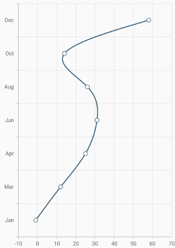

# Spline Chart in Flutter Cartesian Charts (SfCartesianChart)

To render a spline chart, create an instance of [`SplineSeries`](https://pub.dev/documentation/syncfusion_flutter_charts/latest/charts/SplineSeries-class.html), and add it to the [`series`](https://pub.dev/documentation/syncfusion_flutter_charts/latest/charts/SfCartesianChart/series.html) collection property of [`SfCartesianChart`](https://pub.dev/documentation/syncfusion_flutter_charts/latest/charts/SfCartesianChart/SfCartesianChart.html). The following properties can be used to customize the appearance of spline segment:

* [`color`](https://pub.dev/documentation/syncfusion_flutter_charts/latest/charts/CartesianSeries/color.html) - changes the color of the series.
* [`opacity`](https://pub.dev/documentation/syncfusion_flutter_charts/latest/charts/CartesianSeries/opacity.html) - controls the transparency of the chart series.
* [`width`](https://pub.dev/documentation/syncfusion_flutter_charts/latest/charts/CartesianSeries/width.html) - changes the stroke width of the series.

 

    @override
    Widget build(BuildContext context) {
        return Scaffold(
            body: Center(
                child: Container(
                    child: SfCartesianChart(
                        primaryXAxis: DateTimeAxis(),
                        series: <ChartSeries>[
                            // Renders spline chart
                            SplineSeries<SalesData, DateTime>(
                                dataSource: chartData,
                                xValueMapper: (SalesData sales, _) => sales.year,
                                yValueMapper: (SalesData sales, _) => sales.sales
                            )
                        ]
                    )
                )
            )
        );
    }



## Dashed spline

The [`dashArray`](https://pub.dev/documentation/syncfusion_flutter_charts/latest/charts/CartesianSeries/dashArray.html) property of the [`SplineSeries`](https://pub.dev/documentation/syncfusion_flutter_charts/latest/charts/SplineSeries/SplineSeries.html) is used to render spline series with dashes. Odd value is considered as rendering size and even value is considered as gap.

 
    
    @override
    Widget build(BuildContext context) {
        return Scaffold(
            body: Center(
                child: Container(
                    child: SfCartesianChart(
                        primaryXAxis: DateTimeAxis(),
                        series: <ChartSeries>[
                            SplineSeries<SalesData, DateTime>(
                                dataSource: chartData,
                                // Dash values for spline
                                dashArray: <double>[5, 5],
                                xValueMapper: (SalesData sales, _) => sales.year,
                                yValueMapper: (SalesData sales, _) => sales.sales
                            )
                        ]
                    )
                )
            )
        );
    }



###	Spline rendering types

The [`splineType`](https://pub.dev/documentation/syncfusion_flutter_charts/latest/charts/SplineSeries/splineType.html) allows you to change the spline curve in series. The following types can be used in [`SplineSeries`](https://pub.dev/documentation/syncfusion_flutter_charts/latest/charts/SplineSeries/SplineSeries.html):

* natural
* monotonic
* cardinal
* clamped

By default, the value of [`splineType`](https://pub.dev/documentation/syncfusion_flutter_charts/latest/charts/SplineSeries/splineType.html) is [`natural`](https://pub.dev/documentation/syncfusion_flutter_charts/latest/charts/SplineType-class.html).

The following code sample demonstrates how to set the [`splineType`](https://pub.dev/documentation/syncfusion_flutter_charts/latest/charts/SplineSeries/splineType.html) value to [`cardinal`](https://pub.dev/documentation/syncfusion_flutter_charts/latest/charts/SplineType-class.html). When you set the cardinal type, you can specify the desired line tension of the [`cardinal`](https://pub.dev/documentation/syncfusion_flutter_charts/latest/charts/SplineType-class.html) spline using the [`cardinalSplineTension`](https://pub.dev/documentation/syncfusion_flutter_charts/latest/charts/SplineSeries/cardinalSplineTension.html) property. The value of this property ranges from 0 to 1.

 
    
    @override
    Widget build(BuildContext context) {
        return Scaffold(
            body: Center(
                child: Container(
                    child: SfCartesianChart(
                        primaryXAxis: DateTimeAxis(),
                        series: <ChartSeries>[
                            SplineSeries<SalesData, DateTime>(
                                dataSource: chartData,
                                // Type of spline
                                splineType: SplineType.cardinal,
                                cardinalSplineTension: 0.9,
                                xValueMapper: (SalesData sales, _) => sales.year,
                                yValueMapper: (SalesData sales, _) => sales.sales
                            )
                        ]
                    )
                )
            )
        );
    }



Also refer, [color palette](./series-customization#color-palette), [color mapping](./series-customization#color-mapping-for-data-points), [animation](./series-customization#animation), [gradient](./series-customization#gradient-fill) and [empty points](./series-customization#empty-points) for customizing the spline series further.

## Vertical spline chart

The [`isTransposed`](https://pub.dev/documentation/syncfusion_flutter_charts/latest/charts/SfCartesianChart/isTransposed.html) property of [`CartesianSeries`](https://pub.dev/documentation/syncfusion_flutter_charts/latest/charts/CartesianSeries-class.html) is used to transpose the horizontal and vertical axes, to view the data in a different perspective. Using this feature, you can render vertical Spline chart.

 

    @override
    Widget build(BuildContext context) {
        return Scaffold(
            body: Center(
                child: Container(
                    child: SfCartesianChart(
                        isTransposed: true,
                        primaryXAxis: CategoryAxis(),
                        series: <ChartSeries>[
                            SplineSeries<SalesData, String>(
                                dataSource: chartData,
                                xValueMapper: (SalesData sales, _) => sales.year,
                                yValueMapper: (SalesData sales, _) => sales.sales
                            )
                        ]
                    )
                )
            )
        );
    }



