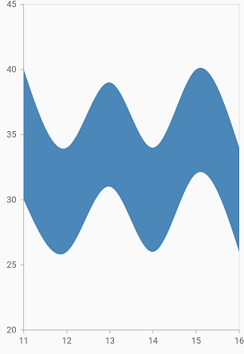
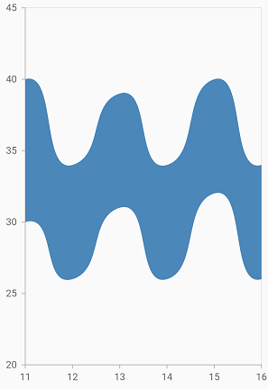

# Spline range area Chart in Flutter Cartesian Charts (SfCartesianChart)

To create a Flutter spline range area chart quickly, you can check this video.

<iframe id='flutterSplinerangecolumnChartTutorial' src='https://www.youtube.com/embed/uSsKhlRzC2Q'></iframe>

To render a spline range area chart, create an instance of the [`SplineRangeAreaSeries`](https://pub.dev/documentation/syncfusion_flutter_charts/latest/charts/SplineRangeAreaSeries-class.html), and add to the series collection property of [`SfCartesianChart`](https://pub.dev/documentation/syncfusion_flutter_charts/latest/charts/SfCartesianChart/SfCartesianChart.html).

 `SplineRangeAreaSeries` requires two Y values for a point, data should contain high and low values. The high and low values specify the maximum and minimum ranges of a point.

* [`highValueMapper`](https://pub.dev/documentation/syncfusion_flutter_charts/latest/charts/CartesianSeries/highValueMapper.html) - field in the data source, which is considered as high value for the data points.
* [`lowValueMapper`](https://pub.dev/documentation/syncfusion_flutter_charts/latest/charts/CartesianSeries/lowValueMapper.html) - field in the data source, which is considered as low value for the data points.

 

    @override
    Widget build(BuildContext context) {
        return Scaffold(
            body: Center(
                child: Container(
                    child: SfCartesianChart(
                        series: <CartesianSeries<SalesData, num>>[
                        SplineRangeAreaSeries<SalesData, num>(
                          dataSource: chartData,
                          xValueMapper: (SalesData sales, _) => sales.xValue,
                          lowValueMapper: (SalesData sales, _) =>
                              sales.lowValue,
                          highValueMapper: (SalesData sales, _) =>
                              sales.highValue,),
                    ]
                )
             )
          )
       );
    }



###	Spline rendering types

The [`splineType`](https://pub.dev/documentation/syncfusion_flutter_charts/latest/charts/SplineSeries/splineType.html) allows you to change the spline curve in series. The following types can be used in [`SplineRangeAreaSeries`](https://pub.dev/documentation/syncfusion_flutter_charts/latest/charts/SplineRangeAreaSeries-class.html).

* natural
* monotonic
* cardinal
* clamped

By default, the value of [`splineType`](https://pub.dev/documentation/syncfusion_flutter_charts/latest/charts/SplineSeries/splineType.html) is [`natural`](https://pub.dev/documentation/syncfusion_flutter_charts/latest/charts/SplineType-class.html).

The following code sample demonstrates how to set the [`splineType`](https://pub.dev/documentation/syncfusion_flutter_charts/latest/charts/SplineSeries/splineType.html) value to [`cardinal`](https://pub.dev/documentation/syncfusion_flutter_charts/latest/charts/SplineType-class.html). When you set the cardinal type, you can specify the desired line tension of the [`cardinal`](https://pub.dev/documentation/syncfusion_flutter_charts/latest/charts/SplineType-class.html) spline using the [`cardinalSplineTension`](https://pub.dev/documentation/syncfusion_flutter_charts/latest/charts/SplineSeries/cardinalSplineTension.html) property. The value of this property ranges from 0 to 1.

 

    @override
    Widget build(BuildContext context) {
        return Scaffold(
            body: Center(
                child: Container(
                    child: SfCartesianChart(
                        series: <CartesianSeries<SalesData, num>>[
                            SplineRangeAreaSeries<SalesData, num>(
                                dataSource: chartData,
                                splineType: SplineType.cardinal,
                                cardinalSplineTension: 0.8,
                                xValueMapper: (SalesData sales, _) => sales.xValue,
                                lowValueMapper: (SalesData sales, _) => sales.lowValue,
                                highValueMapper: (SalesData sales, _) => sales.highValue
                            )
                        ]
                    )
                )
            )
        );
    }



## Border customization

The borders of the spline range area chart can be customized using the [`borderDrawMode`](https://pub.dev/documentation/syncfusion_flutter_charts/latest/charts/SplineRangeAreaSeries/borderDrawMode.html) property. The default value of the [`borderDrawMode`](https://pub.dev/documentation/syncfusion_flutter_charts/latest/charts/SplineRangeAreaSeries/borderDrawMode.html) property is `all` and the other value is `excludeSides`.

 

    @override
    Widget build(BuildContext context) {
        return Scaffold(
            body: Center(
                child: Container(
                    child: SfCartesianChart(
                        series: <CartesianSeries<SalesData, num>>[
                            SplineRangeAreaSeries<SalesData, num>(
                                borderDrawMode: RangeAreaBorderMode.all,
                                borderWidth:2,
                                borderColor: Colors.red
                            )
                        ]
                    )
                )
            )
        );
    }



N> You can refer to our [Flutter Spline Range Area Chart](https://www.syncfusion.com/flutter-widgets/flutter-charts/chart-types/spline-range-area-chart) feature tour page for its groundbreaking feature representations. You can also explore our [Flutter Spline Range Area Chart example](https://flutter.syncfusion.com/#/cartesian-charts/chart-types/spline-range-area) that shows how to easily configure with built-in support for creating stunning visual effects.