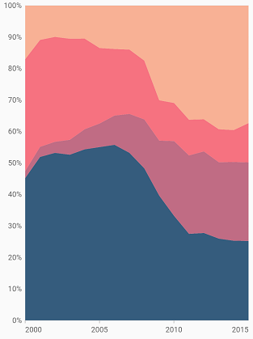

# 100% Stacked area Chart in Flutter Cartesian Charts (SfCartesianChart)

To create a Flutter 100% stacked area chart quickly, you can check this video.

<iframe id='flutter100stackedareaChartTutorial' src='https://www.youtube.com/embed/NCUDBD_ClHo'></iframe>

To render a 100% stacked area chart, create an instance of `StackingArea100Series` and add to the [`series`](https://pub.dev/documentation/syncfusion_flutter_charts/latest/charts/SfCartesianChart/series.html) collection property of [`SfCartesianChart`](https://pub.dev/documentation/syncfusion_flutter_charts/latest/charts/SfCartesianChart-class.html). You can use the following properties to customize the 100% stacked area appearance.

* [`color`](https://pub.dev/documentation/syncfusion_flutter_charts/latest/charts/CartesianSeries/color.html) - changes the color of the series.
* [`opacity`](https://pub.dev/documentation/syncfusion_flutter_charts/latest/charts/CartesianSeries/opacity.html) - controls the transparency of the chart series.
* [`borderWidth`](https://pub.dev/documentation/syncfusion_flutter_charts/latest/charts/CartesianSeries/borderWidth.html) - changes the stroke width of the series.
* [`borderColor`](https://pub.dev/documentation/syncfusion_flutter_charts/latest/charts/CartesianSeries/borderColor.html) - changes the stroke color of the series.
* [`borderDrawMode`](https://pub.dev/documentation/syncfusion_flutter_charts/latest/charts/StackedArea100Series/borderDrawMode.html) - specifies the type of the border mode and it defaults to [`top`](https://pub.dev/documentation/syncfusion_flutter_charts/latest/charts/BorderDrawMode.html).

 

    @override
    Widget build(BuildContext context) {
        return Scaffold(
            body: Center(
                child: Container(
                    child: SfCartesianChart(
                        primaryXAxis: DateTimeAxis(),
                        series: <ChartSeries>[
                            StackedArea100Series<ChartData, DateTime>(
                                dataSource: chartData,
                                xValueMapper: (ChartData data, _) => data.x,
                                yValueMapper: (ChartData data, _) => data.y1
                            ),
                            StackedArea100Series<ChartData, DateTime>(
                                dataSource: chartData,
                                xValueMapper: (ChartData data, _) => data.x,
                                yValueMapper: (ChartData data, _) => data.y2
                            ),
                            StackedArea100Series<ChartData, DateTime>(
                                dataSource: chartData,
                                xValueMapper: (ChartData data, _) => data.x,
                                yValueMapper: (ChartData data, _) => data.y3
                            ),
                            StackedArea100Series<ChartData, DateTime>(
                                dataSource: chartData,
                                xValueMapper: (ChartData data, _) => data.x,
                                yValueMapper: (ChartData data, _) => data.y4
                            )
                        ]
                    )
                )
            )
        );
    }



#### See Also

* [color palette](/flutter/cartesian-charts/series-customization#color-palette) 
* [color mapping](/flutter/cartesian-charts/series-customization#color-mapping-for-data-points)
* [animation](/flutter/cartesian-charts/series-customization#animation)
* [gradient](/flutter/cartesian-charts/series-customization#gradient-fill)
* [empty points](/flutter/cartesian-charts/series-customization#empty-points)