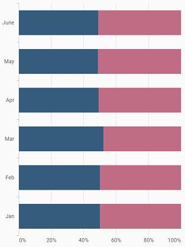

# 100% Stacked bar Chart in Flutter Cartesian Charts (SfCartesianChart)

To create a Flutter 100% stacked bar chart quickly, you can check this video.

<iframe id='flutter100stackedbarChartTutorial' src='https://www.youtube.com/embed/NCUDBD_ClHo'></iframe>

To render a 100% stacked bar chart, create an instance of [`StackedBar100Series`](https://pub.dev/documentation/syncfusion_flutter_charts/latest/charts/StackedBar100Series-class.html), and add it to the [`series`](https://pub.dev/documentation/syncfusion_flutter_charts/latest/charts/SfCartesianChart/series.html) collection property of [`SfCartesianChart`](https://pub.dev/documentation/syncfusion_flutter_charts/latest/charts/SfCartesianChart/SfCartesianChart.html). The following properties can be used to customize the appearance:

* [`color`](https://pub.dev/documentation/syncfusion_flutter_charts/latest/charts/CartesianSeries/color.html) - changes the color of the series.
* [`opacity`](https://pub.dev/documentation/syncfusion_flutter_charts/latest/charts/CartesianSeries/opacity.html) - controls the transparency of the chart series.
* [`borderWidth`](https://pub.dev/documentation/syncfusion_flutter_charts/latest/charts/CartesianSeries/borderWidth.html) - changes the stroke width of the series.
* [`borderColor`](https://pub.dev/documentation/syncfusion_flutter_charts/latest/charts/CartesianSeries/borderColor.html) - changes the stroke color of the series.
* [`borderRadius`](https://pub.dev/documentation/syncfusion_flutter_charts/latest/charts/StackedBar100Series/borderRadius.html) -  used to add the rounded corners to the rectangle.

 
    
    @override
    Widget build(BuildContext context) {
        return Scaffold(
            body: Center(
                child: Container(
                    child: SfCartesianChart(
                        primaryXAxis: CategoryAxis(),
                        series: <ChartSeries>[
                            StackedBar100Series<ChartData, String>(
                                dataSource: chartData,
                                xValueMapper: (ChartData data, _) => data.x,
                                yValueMapper: (ChartData data, _) => data.y
                            ),
                            StackedBar100Series<ChartData, String>(
                                dataSource: chartData,
                                xValueMapper: (ChartData data, _) => data.x,
                                yValueMapper: (ChartData data, _) => data.y2
                            ),
                            StackedBar100Series<ChartData, String>(
                                dataSource: chartData,
                                xValueMapper: (ChartData data, _) => data.x,
                                yValueMapper: (ChartData data, _) => data.y3
                            ),
                            StackedBar100Series<ChartData, String>(
                                dataSource: chartData,
                                xValueMapper: (ChartData data, _) => data.x,
                                yValueMapper: (ChartData data, _) => data.y4
                            )
                        ]
                    )
                )      
            )
        );
    }



## Bar width and spacing

The [`spacing`](https://pub.dev/documentation/syncfusion_flutter_charts/latest/charts/StackedBar100Series/spacing.html) property is used to change the spacing between two segments. The default value of spacing is 0, and the value ranges from 0 to 1. Here, 1 and 0 correspond to 100% and 0% of the available space, respectively.

The [`width`](https://pub.dev/documentation/syncfusion_flutter_charts/latest/charts/CartesianSeries/width.html) property is used to change the width of the rectangle. The default value of the width is 0.7, and the value ranges from 0 to 1. Here, 1 and 0 correspond to 100% and 0% of the available width, respectively.

 
    
    @override
    Widget build(BuildContext context) {
        return Scaffold(
            body: Center(
                child: Container(
                    child: SfCartesianChart(
                        primaryXAxis: CategoryAxis(),
                        series: <ChartSeries>[
                            StackedBar100Series<ChartData, String>(
                                dataSource: chartData,
                                xValueMapper: (ChartData data, _) => data.x,
                                yValueMapper: (ChartData data, _) => data.y,
                                width: 0.8, 
                                spacing: 0.2 
                            ),
                            StackedBar100Series<ChartData, String>(
                                dataSource: chartData,
                                xValueMapper: (ChartData data, _) => data.x,
                                yValueMapper: (ChartData data, _) => data.y2,
                                width: 0.8, 
                                spacing: 0.2 
                            )
                        ]
                    )
                )   
            )
        );
    }



#### See Also

* [Color palette](/flutter/cartesian-charts/series-customization#color-palette) 
* [Color mapping](/flutter/cartesian-charts/series-customization#color-mapping-for-data-points)
* [Animation](/flutter/cartesian-charts/series-customization#animation)
* [Gradient](/flutter/cartesian-charts/series-customization#gradient-fill)
* [Empty points](/flutter/cartesian-charts/series-customization#empty-points)
* [Sorting](/flutter/cartesian-charts/series-customization##sorting)