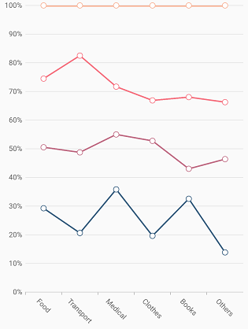
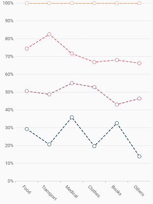

# 100% Stacked line Chart in Flutter Cartesian Charts (SfCartesianChart)

To create a Flutter 100% stacked line chart quickly, you can check this video.

<iframe id='flutter100stackedlineChartTutorial' src='https://www.youtube.com/embed/NCUDBD_ClHo'></iframe>

To render a 100% stacked line chart, create an instance of [`StackedLine100Series`](https://pub.dev/documentation/syncfusion_flutter_charts/latest/charts/StackedLine100Series-class.html), and add it to the [`series`](https://pub.dev/documentation/syncfusion_flutter_charts/latest/charts/SfCartesianChart/series.html) collection property of [`SfCartesianChart`](https://pub.dev/documentation/syncfusion_flutter_charts/latest/charts/SfCartesianChart/SfCartesianChart.html). The following properties can be used to customize the appearance:

* [`color`](https://pub.dev/documentation/syncfusion_flutter_charts/latest/charts/CartesianSeries/color.html) - changes the color of the line.
* [`opacity`](https://pub.dev/documentation/syncfusion_flutter_charts/latest/charts/CartesianSeries/opacity.html) - controls the transparency of the chart series.
* [`width`](https://pub.dev/documentation/syncfusion_flutter_charts/latest/charts/CartesianSeries/width.html) - changes the stroke width of the line.

 

    @override
    Widget build(BuildContext context) {
        return Scaffold(
            body: Center(
                child: Container(
                    child: SfCartesianChart(
                        primaryXAxis: CategoryAxis(),
                        series: <ChartSeries>[
                            StackedLine100Series<ChartData, String>(
                                dataSource: chartData,
                                xValueMapper: (ChartData data, _) => data.x,
                                yValueMapper: (ChartData data, _) => data.y
                            ),
                            StackedLine100Series<ChartData, String>(
                                dataSource: chartData,
                                xValueMapper: (ChartData data, _) => data.x,
                                yValueMapper: (ChartData data, _) => data.y2
                            ),
                            StackedLine100Series<ChartData, String>(
                                dataSource: chartData,
                                xValueMapper: (ChartData data, _) => data.x,
                                yValueMapper: (ChartData data, _) => data.y3
                            ),
                            StackedLine100Series<ChartData, String>(
                                dataSource: chartData,
                                xValueMapper: (ChartData data, _) => data.x,
                                yValueMapper: (ChartData data, _) => data.y4
                            )
                        ]
                    )
                )
            )
        );
    }



## Dashed line

The [`dashArray`](https://pub.dev/documentation/syncfusion_flutter_charts/latest/charts/StackedLine100Series/dashArray.html) property of [`StackedLine100Series`](https://pub.dev/documentation/syncfusion_flutter_charts/latest/charts/StackedLine100Series-class.html) is used to render line series with dashes. Odd value is considered as rendering size and even value is considered as gap.


    
    @override
    Widget build(BuildContext context) {
        return Scaffold(
            body: Center(
                child: Container(
                    child: SfCartesianChart(
                        primaryXAxis: CategoryAxis(),
                        series: <ChartSeries>[
                            StackedLine100Series<ChartData, String>(
                                dataSource: chartData,
                                dashArray: <double>[5,5],
                                xValueMapper: (ChartData data, _) => data.x,
                                yValueMapper: (ChartData data, _) => data.y
                            ),
                            StackedLine100Series<ChartData, String>(
                                dataSource: chartData,
                                dashArray: <double>[5,5],
                                xValueMapper: (ChartData data, _) => data.x,
                                yValueMapper: (ChartData data, _) => data.y2
                            ),
                            StackedLine100Series<ChartData, String>(
                                dataSource: chartData,
                                dashArray: <double>[5,5],
                                xValueMapper: (ChartData data, _) => data.x,
                                yValueMapper: (ChartData data, _) => data.y3
                            ),
                            StackedLine100Series<ChartData, String>(
                                dataSource: chartData,
                                dashArray: <double>[5,5],
                                xValueMapper: (ChartData data, _) => data.x,
                                yValueMapper: (ChartData data, _) => data.y4
                            )
                        ]
                    )
                )
            )
        );
    }



#### See Also

* [color palette](/flutter/cartesian-charts/series-customization#color-palette) 
* [color mapping](/flutter/cartesian-charts/series-customization#color-mapping-for-data-points)
* [animation](/flutter/cartesian-charts/series-customization#animation)
* [gradient](/flutter/cartesian-charts/series-customization#gradient-fill)
* [empty points](/flutter/cartesian-charts/series-customization#empty-points) 