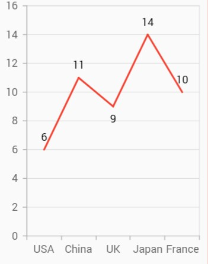
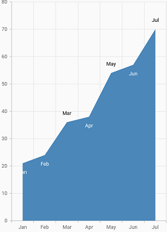
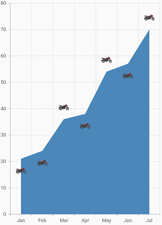

# Marker and data label

## Marker

Markers are used to provide information about the exact point location. You can add a shape to adorn each data point. Markers can be enabled by using the [`isVisible`](https://pub.dev/documentation/syncfusion_flutter_charts/latest/charts/MarkerSettings/isVisible.html) property of [`markerSettings`](https://pub.dev/documentation/syncfusion_flutter_charts/latest/charts/CartesianSeries/markerSettings.html). You can use the following properties to customize the appearance.

* [`color`](https://pub.dev/documentation/syncfusion_flutter_charts/latest/charts/MarkerSettings/color.html) – used to change the color of the marker shape.
* [`borderWidth`](https://pub.dev/documentation/syncfusion_flutter_charts/latest/charts/MarkerSettings/borderWidth.html) – used to change the stroke width of the marker shape.
* [`borderColor`](https://pub.dev/documentation/syncfusion_flutter_charts/latest/charts/MarkerSettings/borderColor.html) – used to change the stroke color of the marker shape.
* [`height`](https://pub.dev/documentation/syncfusion_flutter_charts/latest/charts/MarkerSettings/height.html) - used to change the height of the marker shape.
* [`width`](https://pub.dev/documentation/syncfusion_flutter_charts/latest/charts/MarkerSettings/width.html) - used to change the width of the marker shape.

 

    @override
    Widget build(BuildContext context) {
        return Scaffold(
            body: Center(
                child: Container(
                    child: SfCartesianChart(
                        series: <CartesianSeries>[
                            LineSeries<ChartData, double>(
                                dataSource: chartData,
                                xValueMapper: (ChartData data, _) => data.x,
                                yValueMapper: (ChartData data, _) => data.y,
                                // Renders the marker 
                                markerSettings: MarkerSettings(
                                    isVisible: true
                                )
                            )
                        ]
                    )
                )
            )
        );
    }



### Customizing marker shapes

Markers can be assigned with different shapes using the [`shape`](https://pub.dev/documentation/syncfusion_flutter_charts/latest/charts/MarkerSettings/shape.html) property. By default, markers are rendered with [`circle`](https://pub.dev/documentation/syncfusion_flutter_charts/latest/charts/DataMarkerType-class.html) shape. The shapes of markers are listed below.

* circle
* rectangle
* image
* pentagon
* verticalLine
* horizontalLine
* diamond
* triangle
* invertedTriangle

 

    @override
    Widget build(BuildContext context) {
        return Scaffold(
            body: Center(
                child: Container(
                    child: SfCartesianChart(
                        series: <CartesianSeries>[
                            LineSeries<ChartData, double>(
                                dataSource: chartData,
                                xValueMapper: (ChartData data, _) => data.x,
                                yValueMapper: (ChartData data, _) => data.y,
                                markerSettings: MarkerSettings(
                                    isVisible: true,
                                    // Marker shape is set to diamond
                                    shape: DataMarkerType.diamond
                                )
                            )
                        ]
                    )
                )
            )
        );
    }



### Image marker

The markers can be rendered with desired image as shape. For this you have to specify the [`shape`](https://pub.dev/documentation/syncfusion_flutter_charts/latest/charts/MarkerSettings/shape.html) as [`image`](https://pub.dev/documentation/syncfusion_flutter_charts/latest/charts/MarkerSettings/image.html) and refer the image path using [`imageUrl`](https://pub.dev/documentation/syncfusion_flutter_charts/latest/charts/MarkerSettings/imageUrl.html) property.

 

    @override
    Widget build(BuildContext context) {
        return Scaffold(
            body: Center(
                child: Container(
                    child: SfCartesianChart(
                        series: <CartesianSeries>[
                            LineSeries<ChartData, double>(
                                dataSource: chartData,
                                xValueMapper: (ChartData data, _) => data.x,
                                yValueMapper: (ChartData data, _) => data.y,
                                markerSettings: MarkerSettings(
                                    isVisible: true,
                                    shape: DataMarkerType.image,
                                    // Renders the image as marker
                                    imageUrl: 'images/livechart.png'
                                )
                            )
                        ]
                    )
                )
            )
        );
    }



## Data label

Data label can be added to a chart series by enabling the [`isVisible`](https://pub.dev/documentation/syncfusion_flutter_charts/latest/charts/DataLabelSettings/isVisible.html) option in the [`dataLabelSettings`](https://pub.dev/documentation/syncfusion_flutter_charts/latest/charts/CartesianSeries/dataLabelSettings.html). You can use the following properties to customize the appearance.

* [`color`](https://pub.dev/documentation/syncfusion_flutter_charts/latest/charts/DataLabelSettings/color.html) – used to change the background color of the data label shape.
* [`borderWidth`](https://pub.dev/documentation/syncfusion_flutter_charts/latest/charts/DataLabelSettings/borderWidth.html) – used to change the stroke width of the data label shape.
* [`borderColor`](https://pub.dev/documentation/syncfusion_flutter_charts/latest/charts/DataLabelSettings/borderColor.html) – used to change the stroke color of the data label shape.
* [`alignment`](https://pub.dev/documentation/syncfusion_flutter_charts/latest/charts/DataLabelSettings/alignment.html) - aligns the data label text to [`near`](https://pub.dev/documentation/syncfusion_flutter_charts/latest/charts/ChartAlignment-class.html), [`center`](https://pub.dev/documentation/syncfusion_flutter_charts/latest/charts/ChartAlignment-class.html) and [`far`](https://pub.dev/documentation/syncfusion_flutter_charts/latest/charts/ChartAlignment-class.html).
* [`textStyle`](https://pub.dev/documentation/syncfusion_flutter_charts/latest/charts/DataLabelSettings/textStyle.html) – used to change the data label text color, size, font family, font style, and font weight.
* [`color`](https://pub.dev/documentation/syncfusion_flutter_charts/latest/charts/DataLabelSettings/color.html) – used to change the color of the data label.
* [`fontFamily`](https://pub.dev/documentation/syncfusion_flutter_charts/latest/charts/ChartTextStyle/fontFamily.html) - used to change the font family for the data label.
* [`fontStyle`](https://pub.dev/documentation/syncfusion_flutter_charts/latest/charts/ChartTextStyle/fontStyle.html) - used to change the font style for the data label.
* [`fontWeight`](https://pub.dev/documentation/syncfusion_flutter_charts/latest/charts/ChartTextStyle/fontWeight.html) - used to change the font weight for the data label.
* [`fontSize`](https://pub.dev/documentation/syncfusion_flutter_charts/latest/charts/ChartTextStyle/fontSize.html) - used to change the font size for the data label.
* [`margin`](https://pub.dev/documentation/syncfusion_flutter_charts/latest/charts/DataLabelSettings/margin.html) - used to change the margin size for data labels.
* [`opacity`](https://pub.dev/documentation/syncfusion_flutter_charts/latest/charts/DataLabelSettings/opacity.html) - used to control the transparency of the data label.
* [`labelAlignment`](https://pub.dev/documentation/syncfusion_flutter_charts/latest/charts/DataLabelSettings/labelAlignment.html) - used to align the Cartesian data label positions. The available options to customize the positions are [`outer`](https://pub.dev/documentation/syncfusion_flutter_charts/latest/charts/ChartDataLabelAlignment-class.html), [`auto`](https://pub.dev/documentation/syncfusion_flutter_charts/latest/charts/ChartDataLabelAlignment-class.html), [`top`](https://pub.dev/documentation/syncfusion_flutter_charts/latest/charts/ChartDataLabelAlignment-class.html), [`bottom`](https://pub.dev/documentation/syncfusion_flutter_charts/latest/charts/ChartDataLabelAlignment-class.html) and [`middle`](https://pub.dev/documentation/syncfusion_flutter_charts/latest/charts/ChartDataLabelAlignment-class.html).
* [`borderRadius`](https://pub.dev/documentation/syncfusion_flutter_charts/latest/charts/DataLabelSettings/borderRadius.html) - used to add the rounded corners to the data label shape.
* [`angle`](https://pub.dev/documentation/syncfusion_flutter_charts/latest/charts/DataLabelSettings/angle.html) - used to rotate the labels.

 

    @override
    Widget build(BuildContext context) {
        return Scaffold(
            body: Center(
                child: Container(
                    child: SfCartesianChart(
                        series: <CartesianSeries>[
                            LineSeries<ChartData, double>(
                                dataSource: chartData,
                                xValueMapper: (ChartData data, _) => data.x,
                                yValueMapper: (ChartData data, _) => data.y,
                                dataLabelSettings: DataLabelSettings(
                                    // Renders the data label
                                    isVisible: true
                                )
                            )
                        ]
                    )
                )
            )
        );
    }



### Formatting label content

Data label considers the format used in the vertical axis by default. In the below code snippet, we have specified format to y-axis and you can see the same format is applied to the data label.

 

    @override
    Widget build(BuildContext context) {
        return Scaffold(
            body: Center(
                child: Container(
                    child: SfCartesianChart(
                        // Applies currency format for y axis labels and also for data labels
                        primaryYAxis: NumericAxis(numberFormat: NumberFormat.simpleCurrency()),
                        series: <CartesianSeries>[
                            LineSeries<ChartData, double>(
                                dataSource: chartData,
                                color: Colors.red,
                                xValueMapper: (ChartData data, _) => data.x,
                                yValueMapper: (ChartData data, _) => data.y,
                                dataLabelSettings: DataLabelSettings(
                                    isVisible: true
                                )
                            )
                        ]
                    )
                )
            )
        );
    }



### Label position

The [`labelAlignment`](https://pub.dev/documentation/syncfusion_flutter_charts/latest/charts/ChartDataLabelAlignment-class.html) property is used to position the Cartesian chart type data labels at [`top`](https://pub.dev/documentation/syncfusion_flutter_charts/latest/charts/ChartDataLabelAlignment-class.html), [`bottom`](https://pub.dev/documentation/syncfusion_flutter_charts/latest/charts/ChartDataLabelAlignment-class.html), [`auto`](https://pub.dev/documentation/syncfusion_flutter_charts/latest/charts/ChartDataLabelAlignment-class.html), [`outer`](https://pub.dev/documentation/syncfusion_flutter_charts/latest/charts/ChartDataLabelAlignment-class.html) and [`middle`](https://pub.dev/documentation/syncfusion_flutter_charts/latest/charts/ChartDataLabelAlignment-class.html) position of the actual data point position. By default, labels are [`auto`](https://pub.dev/documentation/syncfusion_flutter_charts/latest/charts/ChartDataLabelAlignment-class.html) positioned. You can move the labels horizontally and vertically using OffsetX and OffsetY properties respectively.

 

    @override
    Widget build(BuildContext context) {
        return Scaffold(
            body: Center(
                child: Container(
                    child: SfCartesianChart(
                        series: <CartesianSeries>[
                            AreaSeries<ChartData, double>(
                                dataSource: chartData,
                                xValueMapper: (ChartData data, _) => data.x,
                                yValueMapper: (ChartData data, _) => data.y,
                                dataLabelSettings: DataLabelSettings(
                                    isVisible: true,
                                    // Positioning the data label
                                    labelAlignment: ChartDataLabelAlignment.top
                                )
                            )
                        ]
                    )
                )
            )
        );
    }



### Apply series color

The [`useSeriesColor`](https://pub.dev/documentation/syncfusion_flutter_charts/latest/charts/DataLabelSettings/useSeriesColor.html) property is used to apply the series color to background color of the data labels. The default value of this property is *false*.

 

    @override
    Widget build(BuildContext context) {
        return Scaffold(
            body: Center(
                child: Container(
                    child: SfCartesianChart(
                        series: <CartesianSeries>[
                            AreaSeries<ChartData, double>(
                                dataSource: chartData,
                                xValueMapper: (ChartData data, _) => data.x,
                                yValueMapper: (ChartData data, _) => data.y,
                                dataLabelSettings: DataLabelSettings(
                                    isVisible: true,
                                    // Positioning the data label
                                    useSeriesColor: true,
                                )
                            )
                        ]
                    )
                )
            )
        );
    }



### Point text mapping

The [`dataLabelMapper`](https://pub.dev/documentation/syncfusion_flutter_charts/latest/charts/CircularSeries/dataLabelMapper.html) property is used to map the text from data source. 

 

    @override
    Widget build(BuildContext context) {
        final List<ChartData> chartData =[
        ChartData('jan', 21),
        ChartData('feb', 24),
        ChartData('mar', 36),
        ChartData('apr', 38),
        ChartData('may', 54),
        ChartData('jun', 57),
        ChartData('jul', 70)
     ];

        return Scaffold(
            body: Center(
                child: Container(
                    child:SfCartesianChart(
                        series: <CartesianSeries>[
                            AreaSeries<ChartData, String>(
                                dataSource: chartData,
                                xValueMapper: (ChartData data, _) => data.x,
                                yValueMapper: (ChartData data, _) => data.y,
                                // Map the data label text for each point from the data source
                                dataLabelMapper: (ChartData data, _) => data.x,
                                dataLabelSettings: DataLabelSettings(
                                    isVisible: true
                                )
                            )
                        ]
                    )
                )
            )
        );
    }

    class ChartData {
        ChartData(this.x, this.y);
        final String x;
        final double y;
    }



### Label template

You can customize the appearance of the data label with your own template using the [`builder`](https://pub.dev/documentation/syncfusion_flutter_charts/latest/charts/DataLabelSettings/builder.html) property of [`dataLabelSettings`](https://pub.dev/documentation/syncfusion_flutter_charts/latest/charts/CartesianSeries/dataLabelSettings.html).

 

    @override
    Widget build(BuildContext context) {
        return Scaffold(
            body: Center(
                child: Container(
                    child:SfCartesianChart(
                        series: <CartesianSeries>[
                            AreaSeries<ChartData, String>(
                                dataSource: chartData,
                                xValueMapper: (ChartData data, _) => data.x,
                                yValueMapper: (ChartData data, _) => data.y,
                                dataLabelMapper: (ChartData data, _) => data.x,
                                dataLabelSettings: DataLabelSettings(
                                    isVisible: true,
                                    // Templating the data label
                                    builder: (dynamic data, dynamic point, dynamic series, int pointIndex, int seriesIndex) {
                                        return Container(
                                        height: 30,
                                        width: 30,
                                        child: Image.asset('images/livechart.png')
                                        );
                                    }
                                )
                            )
                        ]
                    )
                )
            )
        );
    }



### Hide data label for 0 value

Data label in cartesian charts if the data label hide for point value is 0.Connector line should also be hidden for this case when labels are placed outside.

[`showZeroValue`]() - used to hide the data label for 0 values.

 

    @override
    Widget build(BuildContext context) {
        return Scaffold(
            body: Center(
                    child:SfCartesianChart(
                        series: <CartesianSeries<SalesData,num>>[SplineSeries<SalesData, num>(
                        dataSource: chartData,
                        xValueMapper: (SalesData sales, _) => sales.xValue,
                        yValueMapper: (SalesData sales, _) => sales.yValue,
                       dataLabelSettings: DataLabelSettings(
                            showZeroValue: false, isVisible: true),
                        )
                  ]
                )
              )
            );
          }


