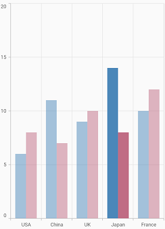
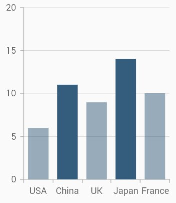
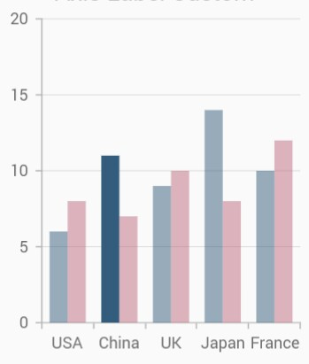

# Selection in Cartesian charts

The selection feature in chart let you to select a segment in a series or the series itself. This features allows you to select either individual or cluster of segments in the chart series.

 
    SelectionBehavior _selectionBehavior;

    void initState(){
      _selectionBehavior =  SelectionBehavior(
                                    // Enables the selection
                                    enable: true
                                );
        super.initState(); 
    }

    @override
    Widget build(BuildContext context) {
        return Scaffold(
            body: Center(
                child: Container(
                    child: SfCartesianChart(
                        series: <CartesianSeries>[
                            ColumnSeries<ChartData, double>(
                                dataSource: chartData,
                                xValueMapper: (ChartData data, _) => data.x,
                                yValueMapper: (ChartData data, _) => data.y,
                                selectionBehavior: _selectionBehavior
                            )
                        ]
                    )
                )
            )
        );  
    }



## Customizing the segments

You can customize the segments using the below properties.

* [`selectedColor`](https://pub.dev/documentation/syncfusion_flutter_charts/latest/charts/SelectionBehavior/selectedColor.html) - used to change the background color of selected segment.
* [`unselectedColor`](https://pub.dev/documentation/syncfusion_flutter_charts/latest/charts/SelectionBehavior/unselectedColor.html) - used to change the background color of unselected segment.
* [`selectedBorderColor`](https://pub.dev/documentation/syncfusion_flutter_charts/latest/charts/SelectionBehavior/selectedBorderColor.html) - used to change the stroke color of the selected segment.
* [`selectedBorderWidth`](https://pub.dev/documentation/syncfusion_flutter_charts/latest/charts/SelectionBehavior/selectedBorderWidth.html) - used to change the stroke width of the selected segment.
* [`unselectedBorderColor`](https://pub.dev/documentation/syncfusion_flutter_charts/latest/charts/SelectionBehavior/unselectedBorderColor.html) - used to change the stroke color of the unselected segment.
* [`unselectedBorderWidth`](https://pub.dev/documentation/syncfusion_flutter_charts/latest/charts/SelectionBehavior/unselectedBorderWidth.html) - used to change the stroke width of the unselected segment.
* [`selectedOpacity`](https://pub.dev/documentation/syncfusion_flutter_charts/latest/charts/SelectionBehavior/selectedOpacity.html) - used to control the transparency of the selected segment.
* [`unselectedOpacity`](https://pub.dev/documentation/syncfusion_flutter_charts/latest/charts/SelectionBehavior/unselectedOpacity.html) - used to control the transparency of the unselected segment.

 
    
    SelectionBehavior _selectionBehavior;

    void initState(){
     _selectionBehavior =  SelectionBehavior(
                                    enable: true,
                                    selectedColor: Colors.red,
                                    unselectedColor: Colors.grey
                                );
        super.initState(); 
    }

    @override
    Widget build(BuildContext context) {
        return Scaffold(
            body: Center(
                child: Container(
                    child: SfCartesianChart(
                        series: <CartesianSeries>[
                            ColumnSeries<ChartData, double>(
                                selectionBehavior: _selectionBehavior
                            )
                        ]
                    )
                )
            )
        );
    }



## Selection modes

The selection features allows you to select segments in following modes using [`selectionType`](https://pub.dev/documentation/syncfusion_flutter_charts/latest/charts/SfCartesianChart/selectionType.html) property of chart.

* [`Point`](https://pub.dev/documentation/syncfusion_flutter_charts/latest/charts/SelectionType-class.html) - selects the individual data point.
* [`Series`](https://pub.dev/documentation/syncfusion_flutter_charts/latest/charts/SelectionType-class.html) - selects the entire series.
* [`Cluster`](https://pub.dev/documentation/syncfusion_flutter_charts/latest/charts/SelectionType-class.html) - selects the cluster of points of different series i.e selects the points with same index in each series.

 

    @override
    Widget build(BuildContext context) {
        return Scaffold(
            body: Center(
                child: Container(
                    child: SfCartesianChart(
                        // Mode of selection
                        selectionType: SelectionType.cluster
                    )
                )
            )
        );
    }



## Multi-selection

Multiple selection can be enabled using the [`enableMultiSelection`](https://pub.dev/documentation/syncfusion_flutter_charts/latest/charts/SfCartesianChart/enableMultiSelection.html) property of chart.

 

    @override
    Widget build(BuildContext context) {
        return Scaffold(
            body: Center(
                child: Container(
                    child: SfCartesianChart(
                        // Enables multiple selection
                        enableMultiSelection: true
                    )
                )
            )
        );
    }



## Selection on initial rendering

You can select a point or series programmatically on a chart using [`initialSelectedDataIndexes`](https://pub.dev/documentation/syncfusion_flutter_charts/latest/charts/SfCartesianChart/initialSelectedDataIndexes.html) property of chart.

 
    
    SelectionBehavior _selectionBehavior;

    void initState(){
    _selectionBehavior =  SelectionBehavior(
                                    // Enables the selection
                                    enable: true
                                );
        super.initState(); 
    }

    @override
    Widget build(BuildContext context) {
        return Scaffold(
            body: Center(
                child: Container(
                    child: SfCartesianChart(
                        series: <CartesianSeries>[
                            ColumnSeries<ChartData, double>(
                                // Initially selected the data at point index - 1.
                                initialSelectedDataIndexes: <int>[1],
                                dataSource: chartData1,
                                xValueMapper: (ChartData data, _) => data.x,
                                yValueMapper: (ChartData data, _) => data.y,
                                selectionBehavior: _selectionBehavior
                            ),
                            ColumnSeries<ChartData, double>(
                                dataSource: chartData2,
                                xValueMapper: (ChartData data, _) => data.x,
                                yValueMapper: (ChartData data, _) => data.y,
                                selectionBehavior: _selectionBehavior
                            )
                        ]
                    )
                )
            )
        );
    }



Also refer [selection event](./events#onselectionchanged) for customizing the selection further.