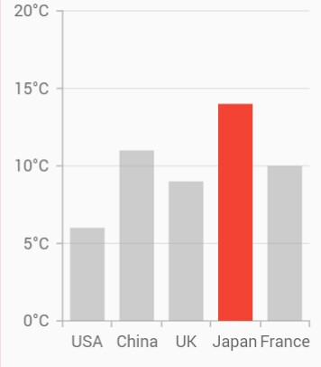
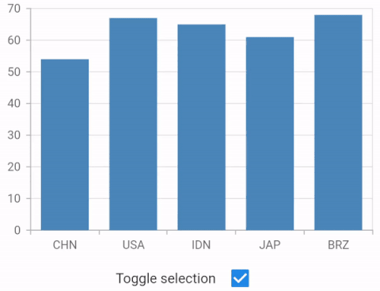

# Selection in Flutter Cartesian Charts (SfCartesianChart)

The selection feature in chart let you to select a segment in a series or the series itself. This features allows you to select either individual or cluster of segments in the chart series.

 
    
    late SelectionBehavior _selectionBehavior;

    @override
    void initState(){
      _selectionBehavior = SelectionBehavior(
        // Enables the selection
        enable: true);
        super.initState(); 
    }

    @override
    Widget build(BuildContext context) {
        final List<ChartData> chartData = [
            ChartData('USA', 6),
            ChartData('China', 11),
            ChartData('UK', 9),
            ChartData('Japan', 14),
            ChartData('France', 10),
        ];
        return Scaffold(
            body: Center(
                child: Container(
                    child: SfCartesianChart(
                        series: <CartesianSeries>[
                            ColumnSeries<ChartData, double>(
                                dataSource: chartData,
                                xValueMapper: (ChartData data, _) => data.x,
                                yValueMapper: (ChartData data, _) => data.y,
                                selectionBehavior: _selectionBehavior
                            )
                        ]
                    )
                )
            )
        );  
    }

    class ChartData {
        ChartData(this.x, this.y);
        final double x;
        final double? y;
      }



## Customizing the segments

You can customize the segments using the below properties.

* [`selectedColor`](https://pub.dev/documentation/syncfusion_flutter_charts/latest/charts/SelectionBehavior/selectedColor.html) - used to change the background color of selected segment.
* [`unselectedColor`](https://pub.dev/documentation/syncfusion_flutter_charts/latest/charts/SelectionBehavior/unselectedColor.html) - used to change the background color of unselected segment.
* [`selectedBorderColor`](https://pub.dev/documentation/syncfusion_flutter_charts/latest/charts/SelectionBehavior/selectedBorderColor.html) - used to change the stroke color of the selected segment.
* [`selectedBorderWidth`](https://pub.dev/documentation/syncfusion_flutter_charts/latest/charts/SelectionBehavior/selectedBorderWidth.html) - used to change the stroke width of the selected segment.
* [`unselectedBorderColor`](https://pub.dev/documentation/syncfusion_flutter_charts/latest/charts/SelectionBehavior/unselectedBorderColor.html) - used to change the stroke color of the unselected segment.
* [`unselectedBorderWidth`](https://pub.dev/documentation/syncfusion_flutter_charts/latest/charts/SelectionBehavior/unselectedBorderWidth.html) - used to change the stroke width of the unselected segment.
* [`selectedOpacity`](https://pub.dev/documentation/syncfusion_flutter_charts/latest/charts/SelectionBehavior/selectedOpacity.html) - used to control the transparency of the selected segment.
* [`unselectedOpacity`](https://pub.dev/documentation/syncfusion_flutter_charts/latest/charts/SelectionBehavior/unselectedOpacity.html) - used to control the transparency of the unselected segment.
* [`selectionController`](https://pub.dev/documentation/syncfusion_flutter_charts/latest/charts/SelectionBehavior/selectionController.html) - to customize the minimum range of selected series or points.

 
    
    late SelectionBehavior _selectionBehavior;
    
    @override
    void initState(){
     _selectionBehavior = SelectionBehavior(
            enable: true,
            selectedColor: Colors.red,
            unselectedColor: Colors.grey);
        super.initState(); 
    }

    @override
    Widget build(BuildContext context) {
        final List<ChartData> chartData = [
            ChartData('USA', 6),
            ChartData('China', 11),
            ChartData('UK', 9),
            ChartData('Japan', 14),
            ChartData('France', 10),
        ];
        return Scaffold(
            body: Center(
                child: Container(
                    child: SfCartesianChart(
                        primaryXAxis: CategoryAxis(),
                        series: <CartesianSeries>[
                            series: <ChartSeries<ChartData, String>>[
                        ColumnSeries<ChartData, String>(
                            dataSource: chartData,
                            selectionBehavior: _selectionBehavior
                            xValueMapper: (ChartData data, _) => data.x,
                            yValueMapper: (ChartData data, _) => data.y)
                        ]
                    )
                )
            )
        );
    }

    class ChartData {
        ChartData(this.x, this.y);
        final String x;
        final double? y;
      }



## Selection modes

The selection features allows you to select segments in following modes using [`selectionType`](https://pub.dev/documentation/syncfusion_flutter_charts/latest/charts/SfCartesianChart/selectionType.html) property of chart.

* [`SelectionType.Point`](https://pub.dev/documentation/syncfusion_flutter_charts/latest/charts/SelectionType.html) - selects the individual data point.
* [`SelectionType.Series`](https://pub.dev/documentation/syncfusion_flutter_charts/latest/charts/SelectionType.html) - selects the entire series.
* [`SelectionType.Cluster`](https://pub.dev/documentation/syncfusion_flutter_charts/latest/charts/SelectionType.html) - selects the cluster of points of different series i.e selects the points with same index in each series.

 

    late SelectionBehavior _selectionBehavior;
    
    @override
    void initState(){
     _selectionBehavior = SelectionBehavior(
            enable: true);
        super.initState(); 
    }

    @override
    Widget build(BuildContext context) {
        final List<ChartData> chartData = [
            ChartData('USA', 6, 8),
            ChartData('China', 11, 7),
            ChartData('UK', 9, 10),
            ChartData('Japan', 14, 8),
            ChartData('France', 10, 12),
        ];
        return Scaffold(
            body: Center(
                child: Container(
                    child: SfCartesianChart(
                        // Mode of selection
                        selectionType: SelectionType.cluster,
                        series: <ChartSeries<ChartData, String>>[
                        ColumnSeries<ChartData, String>(
                            dataSource: chartData,
                            selectionBehavior: _selectionBehavior
                            xValueMapper: (ChartData data, _) => data.x,
                            yValueMapper: (ChartData data, _) => data.y),
                        ColumnSeries<ChartData, String>(
                            dataSource: chartData,
                            selectionBehavior: _selectionBehavior
                            xValueMapper: (ChartData data, _) => data.x,
                            yValueMapper: (ChartData data, _) => data.y1),
                        ],
                    )
                )
            )
        );
    }
    class ChartData {
        ChartData(this.x, this.y, this.y1);
        final String x;
        final double y;
        final double y1;
    }



## Multi-selection

Multiple selection can be enabled using the [`enableMultiSelection`](https://pub.dev/documentation/syncfusion_flutter_charts/latest/charts/SfCartesianChart/enableMultiSelection.html) property of chart.

 
    late SelectionBehavior _selectionBehavior;
    
    @override
    void initState(){
     _selectionBehavior = SelectionBehavior(
            enable: true);
        super.initState(); 
    }

    @override
    Widget build(BuildContext context) {
        final List<ChartData> chartData = [
            ChartData('USA', 6),
            ChartData('China', 11),
            ChartData('UK', 9),
            ChartData('Japan', 14),
            ChartData('France', 10),
        ];

        return Scaffold(
            body: Center(
                child: Container(
                    child: SfCartesianChart(
                        // Enables multiple selection
                        enableMultiSelection: true,
                        series: <ChartSeries<ChartData, String>>[
                        ColumnSeries<ChartData, String>(
                            dataSource: chartData,
                            selectionBehavior: _selectionBehavior
                            xValueMapper: (ChartData data, _) => data.x,
                            yValueMapper: (ChartData data, _) => data.y),
                        ]
                    )
                )
            )
        );
    }



## Selection on initial rendering

You can select a point or series programmatically on a chart using [`initialSelectedDataIndexes`](https://pub.dev/documentation/syncfusion_flutter_charts/latest/charts/CartesianSeries/initialSelectedDataIndexes.html) property of the [`CartesianSeries`](https://pub.dev/documentation/syncfusion_flutter_charts/latest/charts/CartesianSeries-class.html).

 
    
    late SelectionBehavior _selectionBehavior;
    
    @override
    void initState(){
     _selectionBehavior = SelectionBehavior(
            enable: true);
        super.initState(); 
    }

    @override
    Widget build(BuildContext context) {
        final List<ChartData> chartData = [
            ChartData('USA', 6, 8),
            ChartData('China', 11, 7),
            ChartData('UK', 9, 10),
            ChartData('Japan', 14, 8),
            ChartData('France', 10, 12),
        ];
        return Scaffold(
            body: Center(
                child: Container(
                    child: SfCartesianChart(
                        // Mode of selection
                        selectionType: SelectionType.cluster,
                        series: <ChartSeries<ChartData, String>>[
                        ColumnSeries<ChartData, String>(
                            dataSource: chartData,
                            initialSelectedDataIndexes: <int>[1],
                            selectionBehavior: _selectionBehavior
                            xValueMapper: (ChartData data, _) => data.x,
                            yValueMapper: (ChartData data, _) => data.y),
                        ColumnSeries<ChartData, String>(
                            dataSource: chartData,
                            selectionBehavior: _selectionBehavior
                            xValueMapper: (ChartData data, _) => data.x,
                            yValueMapper: (ChartData data, _) => data.y1),
                        ],
                    )
                )
            )
        );
    }
    class ChartData {
        ChartData(this.x, this.y, this.y1);
        final String x;
        final double y;
        final double y1;
    }


## Toggle selection

You can decide, whether to deselect the selected data point/series or remain selected when interacted with it again by setting the [`toggleSelection`](https://pub.dev/documentation/syncfusion_flutter_charts/latest/charts/SelectionBehavior/toggleSelection.html) property `true` or `false`. If set to true, deselection will be performed else the point will not get deselected.
This works even while calling public methods, in various selection modes, with multi-selection, and also on dynamic changes.
Defaults to `true`.

 
    
    late selectionBehavior _selectionBehavior;

    @override
    void initState(){
      _selectionBehavior =  SelectionBehavior(
                           enable: true,
                           toggleSelection: false,
                        );
      super.initState(); 
    }

    @override
    Widget build(BuildContext context) {
        final List<ChartData> chartData = [
            ChartData('CHN', 52),
            ChartData('USA', 69),
            ChartData('IDN', 68),
            ChartData('JAP', 61),
            ChartData('BRA', 69),
        ];
        return Scaffold(
            body: Center(
                child: Container(
                    child: SfCartesianChart(
                        series: <ColumnSeries<ChartData, String>>[
                          ColumnSeries<ChartData, String>(
                           dataSource: chartData1,
                           xValueMapper: (ChartData data, _) => data.x,
                           yValueMapper: (ChartData data, _) => data.y,
                           selectionBehavior: _selectionBehavior)
                    ]
                )
            )
        )
      );
    }



Also refer [selection event](./events#onselectionchanged) for customizing the selection further.

#### See Also

* [Dynamically selecting the data points in a chart](https://www.syncfusion.com/kb/11811/how-to-select-the-data-points-dynamically-in-cartesian-charts-sfcartesianchart).

>**NOTE**: `chartData` in the above code snippets is a class type list and holds the data for binding to the chart series. Refer [Bind data source](https://help.syncfusion.com/flutter/cartesian-charts/getting-started#bind-data-source) topic for more details.
