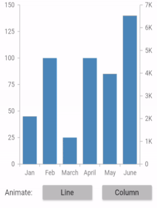
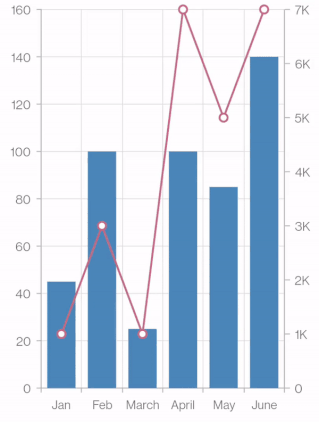
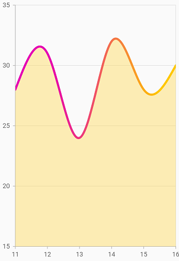

# Series customization in Flutter Cartesian Charts (SfCartesianChart)

## Animation

[`SfCartesianChart`](https://pub.dev/documentation/syncfusion_flutter_charts/latest/charts/SfCartesianChart-class.html) provides animation support for the series. Series will be animated while rendering. Animation is enabled by default, you can also control the duration of the animation using [`animationDuration`](https://pub.dev/documentation/syncfusion_flutter_charts/latest/charts/CartesianSeries/animationDuration.html) property. You can disable the animation by setting this property to 0.

 

    @override
    Widget build(BuildContext context) {
        return Scaffold(
            body: Center(
                child: Container(
                    child: SfCartesianChart(
                        primaryXAxis: CategoryAxis(),
                        series: <CartesianSeries>[
                            ColumnSeries<ChartData, String>(
                                dataSource: chartData,
                                xValueMapper: (ChartData data, _) => data.x,
                                yValueMapper: (ChartData data, _) => data.y,
                                // Duration of series animation
                                animationDuration: 1000
                            )
                        ]
                    )
                )
            )
        );
    }

    class ChartData {
        ChartData(this.x, this.y);
        final String x;
        final double? y;
    }



### Dynamic series animation

[`SfCartesianChart`](https://pub.dev/documentation/syncfusion_flutter_charts/latest/charts/SfCartesianChart-class.html) also provides dynamic animation support for the series.

If you wish to perform the initial rendering animation again in the existing series, this method should be called. On calling this method, this particular series will be animated again based on the  [`animationDuration`](https://pub.dev/documentation/syncfusion_flutter_charts/latest/charts/ChartSeries/animationDuration.html) property's value in the series. If this property's value is 0, then the animation will not be performed.

 

    @override
    Widget build(BuildContext context) {
        ChartSeriesController? _chartSeriesController1, _chartSeriesController2;

        return Column(children: <Widget>[
        Container(
            child: SfCartesianChart(
            primaryXAxis: CategoryAxis(),
            axes: <ChartAxis>[
              NumericAxis(
                numberFormat: NumberFormat.compact(),
                majorGridLines: const MajorGridLines(width: 0),
                opposedPosition: true,
                name: 'yAxis1',
                interval: 1000,
                minimum: 0,
                maximum: 7000)
                ],
            series: <ChartSeries<_ChartSampleData, String>>[
            ColumnSeries<_ChartSampleData, String>(
                animationDuration: 2000,
                onRendererCreated: (ChartSeriesController controller) {
                    _chartSeriesController1 = controller;
                },
                dataSource: chartData,
                xValueMapper: (_ChartSampleData sales, _) => sales.x,
                yValueMapper: (_ChartSampleData sales, _) => sales.y,
                name: 'Unit Sold'),
            LineSeries<_ChartSampleData, String>(
                animationDuration: 4500,
                dataSource: chartData,
                onRendererCreated: (ChartSeriesController controller) {
                    _chartSeriesController2 = controller;
                },
                xValueMapper: (_ChartSampleData sales, _) => sales.x,
                yValueMapper: (_ChartSampleData sales, _) =>
                    sales.secondSeriesYValue,
                yAxisName: 'yAxis1',
                markerSettings: MarkerSettings(isVisible: true),
                name: 'Total Transaction')
            ],
        )),
        Container(
            child: Row(
            children: [
                Container(
                    child: RaisedButton(
                color: Colors.grey[400],
                onPressed: () {
                    _chartSeriesController2?.animate();
                },
                child: Text('Line'),
                )),
                Container(
                    child: RaisedButton(
                color: Colors.grey[400],
                onPressed: () {
                    _chartSeriesController1?.animate();
                },
                child: Text('Column'),
                ))
            ],
            ),
        )
        ]);
    }

    class _ChartSampleData{
        _ChartSampleData(this.x, this.y, this.secondSeriesYValue);
        final String x;
        final double? y;
        final double? secondSeriesYValue;
    }



## Animation delay
The `animationDelay` property is used to specify the delay duration of the series animation. This takes a millisecond value as input. By default, the series will get animated for the specified duration. If `animationDelay` is specified, then the series will begin to animate after the specified duration.
Defaults to `0` for all the series except `ErrorBarSeries`. The default value for the `ErrorBarSeries` is `1500`.



    import 'package:intl/intl.dart';
    
    @override
    Widget build(BuildContext context) {
        ChartSeriesController? _chartSeriesController1, _chartSeriesController2;
        
        final List<ChartData> chartData = <ChartData>[
          ChartData(x: 'Jan', yValue1: 45, yValue2: 1000),
          ChartData(x: 'Feb', yValue1: 100, yValue2: 3000),
          ChartData(x: 'March', yValue1: 25, yValue2: 1000),
          ChartData(x: 'April', yValue1: 100, yValue2: 7000),
          ChartData(x: 'May', yValue1: 85, yValue2: 5000),
          ChartData(x: 'June', yValue1: 140, yValue2: 7000)
        ];
        
        return Column(children: <Widget>[
        Container(
          child: SfCartesianChart(
            primaryXAxis: CategoryAxis(),
            axes: <ChartAxis>[
              NumericAxis(
                numberFormat: NumberFormat.compact(),
                majorGridLines: const MajorGridLines(width: 0),
                opposedPosition: true,
                name: 'yAxis1',
                interval: 1000,
                minimum: 0,
                maximum: 7000)
                ],
            series: <ChartSeries<ChartData, String>>[
            ColumnSeries<ChartData, String>(
                animationDuration: 2000,
                onRendererCreated: (ChartSeriesController controller) {
                    _chartSeriesController1 = controller;
                },
                dataSource: chartData,
                xValueMapper: (ChartData sales, _) => sales.x,
                yValueMapper: (ChartData sales, _) => sales.yValue1,
                name: 'Unit Sold'),
            LineSeries<ChartData, String>(
                animationDuration: 4500,
                animationDelay: 2000,
                dataSource: chartData,
                onRendererCreated: (ChartSeriesController controller) {
                    _chartSeriesController2 = controller;
                },
                xValueMapper: (ChartData sales, _) => sales.x,
                yValueMapper: (ChartData sales, _) => sales.yValue2,
                yAxisName: 'yAxis1',
                markerSettings: MarkerSettings(isVisible: true),
                name: 'Total Transaction')
            ],)),
        ]);
    }

    class ChartData {
      ChartData({this.x, this.yValue1, this.yValue2});
      final String? x;
      final double? yValue1;
      final double? yValue2;
    }



**Note**
* The animation delay is applicable for series, trendline, and indicators.

#### See Also

* [Create dynamic animated series on addition of data points in the series](https://www.syncfusion.com/kb/12290/how-to-create-flutter-animated-charts-using-the-charts-widget-sfcartesianchart).

* [Dynamically animate chart using public methods](https://www.syncfusion.com/kb/12205/how-to-animate-the-chart-series-dynamically-using-the-public-method-sfcartesianchart).

## Transpose the series

The [`isTransposed`](https://pub.dev/documentation/syncfusion_flutter_charts/latest/charts/SfCartesianChart/isTransposed.html) property of [`CartesianSeries`](https://pub.dev/documentation/syncfusion_flutter_charts/latest/charts/CartesianSeries-class.html) is used to transpose the horizontal and vertical axes, to view the data in a different perspective. Using this feature, you can render vertical charts.

 

    @override
    Widget build(BuildContext context) {
        return Scaffold(
            body: Center(
                child: Container(
                    child: SfCartesianChart(
                        // Transpose the chart
                        isTransposed: true,
                        primaryXAxis: CategoryAxis(),
                        series: <CartesianSeries>[
                            SplineSeries<ChartData, String>(
                                dataSource: chartData,
                                xValueMapper: (ChartData data, _) => data.x,
                                yValueMapper: (ChartData data, _) => data.y,
                            )
                        ]
                    )
                )
            )
        );
    }

    class ChartData {
        ChartData(this.x, this.y)'
        final String x;
        final double? y;
    }



## Color palette

The [`palette`](https://pub.dev/documentation/syncfusion_flutter_charts/latest/charts/SfCartesianChart/palette.html) property is used to define the colors for the series available in chart. By default, a set of 10 colors are predefined for applying it to the series. If the colors specified in the series are less than the number of series, than the remaining series are filled with the specified palette colors rotationally.

 

    @override
    Widget build(BuildContext context) {
        return Scaffold(
            body: Center(
                child: Container(
                    child: SfCartesianChart(
                        primaryXAxis: CategoryAxis(),
                        // Palette colors
                        palette: <Color>[
                            Colors.teal,
                            Colors.orange,
                            Colors.brown
                        ],
                        series: <CartesianSeries>[
                            ColumnSeries<ChartData, String>(
                                dataSource: chartData,
                                xValueMapper: (ChartData data, _) => data.x,
                                yValueMapper: (ChartData data, _) => data.y
                            ),
                            ColumnSeries<ChartData, String>(
                                dataSource: chartData,
                                xValueMapper: (ChartData data, _) => data.x,
                                yValueMapper: (ChartData data, _) => data.y1
                            ),
                            ColumnSeries<ChartData, String>(
                                dataSource: chartData,
                                xValueMapper: (ChartData data, _) => data.x,
                                yValueMapper: (ChartData data, _) => data.y2
                            )
                        ]
                    )
                )
            )
        );
    }

    class ChartData {
     ChartData(this.x, this.y, this.y1, this.y2);
     final String x;
     final double? y;
     final double? y1;
     final double? y2;
    } 
     



## Color mapping for data points   

The [`pointColorMapper`](https://pub.dev/documentation/syncfusion_flutter_charts/latest/charts/CartesianSeries/pointColorMapper.html) property is used to map the color field from the data source. 

 

    @override
    Widget build(BuildContext context) {
        final List<ChartData> chartData = [
            ChartData('Germany', 118, Colors.teal),
            ChartData('Russia', 123, Colors.orange),
            ChartData('Norway', 107, Colors.brown),
            ChartData('USA', 87, Colors.deepOrange)
        ];
        return Scaffold(
            body: Center(
                child: Container(
                    child: SfCartesianChart(
                        primaryXAxis: CategoryAxis(),
                        series: <CartesianSeries>[
                            ColumnSeries<ChartData, String>(
                                dataSource: chartData,
                                xValueMapper: (ChartData data, _) => data.x,
                                yValueMapper: (ChartData data, _) => data.y,
                                // Map color for each data points from the data source
                                pointColorMapper: (ChartData data, _) => data.color
                            )
                        ]
                    )
                )
            )
        );
    }

    class ChartData {
        ChartData(this.x, this.y, this.color);
            final String x;
            final double? y;
            final Color? color;
    }



## Gradient fill

The [`gradient`](https://pub.dev/documentation/syncfusion_flutter_charts/latest/charts/CartesianSeries/gradient.html) property is used to define the gradient colors. The colors from this property are used for series. Also, you can use the transform property available in [`LinearGradient`](https://api.flutter.dev/flutter/painting/LinearGradient/LinearGradient.html) to transform the applied gradient colors.

 

    @override
    Widget build(BuildContext context) {
        final List<Color> color = <Color>[];
        color.add(Colors.deepOrange[50]!);
        color.add(Colors.deepOrange[200]!);
        color.add(Colors.deepOrange);

        final List<double> stops = <double>[];
        stops.add(0.0);
        stops.add(0.5);
        stops.add(1.0);

        final LinearGradient gradientColors =
            LinearGradient(colors: color, stops: stops);

        return Scaffold(
            body: Center(
                child: Container(
                    child: SfCartesianChart(
                        series: <CartesianSeries>[
                            SplineRangeAreaSeries<ChartData, double>(
                            dataSource: chartData,
                            xValueMapper: (ChartData data, _) => data.x,
                            yValueMapper: (ChartData data, _) => data.y,
                            // Applies gradient color
                            gradient: gradientColors)
                        ]
                    )
                )
            )
        );
    }

    class ChartData {
        ChartData(this.x, this.y);
        final double x;
        final double? y;
      }



#### See Also

* [Rotating the gradient applied to a chart in Cartesian charts](https://www.syncfusion.com/kb/12054/how-to-apply-and-rotate-gradient-in-the-chart-sfcartesainchart).

N>: The gradient is not applicable for spline, step line, candle, hilo, hilo open close, and line type charts. However, in line type gradient is applicable for [`FastLineSeries`](https://pub.dev/documentation/syncfusion_flutter_charts/latest/charts/FastLineSeries-class.html) alone.

### Gradient stroke
 
The [`borderGradient`](https://pub.dev/documentation/syncfusion_flutter_charts/latest/charts/CartesianSeries/borderGradient.html) property is used to define the gradient color for the border of the applicable series. 

If the properties of both [`borderColor`](https://pub.dev/documentation/syncfusion_flutter_charts/latest/charts/ChartSeries/borderColor.html) and [`borderGradient`](https://pub.dev/documentation/syncfusion_flutter_charts/latest/charts/CartesianSeries/borderGradient.html) are defined then [`borderGradient`](https://pub.dev/documentation/syncfusion_flutter_charts/latest/charts/CartesianSeries/borderGradient.html) is considered.

 

    @override
    Widget build(BuildContext context) {
        return Scaffold(
            body: Center(
                child: Container(
                    child: SfCartesianChart(
                        series: <CartesianSeries>[
                            AreaSeries<ChartData, double>(
                                dataSource: chartData,
                                xValueMapper: (ChartData data, _) => data.x,
                                yValueMapper: (ChartData data, _) => data.y,
                                borderWidth: 4,
                                borderGradient: const LinearGradient(
                                    colors: <Color>[
                                                    Color.fromRGBO(230, 0, 180, 1),
                                                    Color.fromRGBO(255, 200, 0, 1)
                                            ], 
                                    stops: <double>[
                                                    0.2,
                                                    0.9
                                            ]
                                ),
                            )
                        ]
                    )
                )
            )
        );
    }

    class ChartData {
        ChartData(this.x, this.y);
        final double x;
        final double? y;
      }



## Empty points

The data points that has null value are considered as empty points. Empty data points are ignored and not plotted in the chart. By using [`emptyPointSettings`](https://pub.dev/documentation/syncfusion_flutter_charts/latest/charts/CartesianSeries/emptyPointSettings.html) property in series, you can decide the action taken for empty points. Available [`modes`](https://pub.dev/documentation/syncfusion_flutter_charts/latest/charts/EmptyPointMode-class.html) are [`gap`](https://pub.dev/documentation/syncfusion_flutter_charts/latest/charts/EmptyPointMode-class.html), [`zero`](https://pub.dev/documentation/syncfusion_flutter_charts/latest/charts/EmptyPointMode-class.html), [`drop`](https://pub.dev/documentation/syncfusion_flutter_charts/latest/charts/EmptyPointMode-class.html) and [`average`](https://pub.dev/documentation/syncfusion_flutter_charts/latest/charts/EmptyPointMode-class.html). Default mode of the empty point is [`gap`](https://pub.dev/documentation/syncfusion_flutter_charts/latest/charts/EmptyPointMode-class.html).

 

    @override
    Widget build(BuildContext context) {
        
        final List<ChartData> chartData = [
            ChartData(1, 112),
            ChartData(2, null),
            ChartData(3, 107),
            ChartData(4, 87)
        ];

        return Scaffold(
            body: Center(
                child: Container(
                    child: SfCartesianChart(
                        series: <CartesianSeries>[
                            ColumnSeries<ChartData, double>(
                                dataSource: chartData,
                                xValueMapper: (ChartData data, _) => data.x,
                                yValueMapper: (ChartData data, _) => data.y,
                                emptyPointSettings: EmptyPointSettings(
                                    // Mode of empty point
                                    mode: EmptyPointMode.average
                                )
                            )      
                        ]
                    )
                )
            )
        );
    }

    class ChartData {
        ChartData(this.x, this.y);
        final double x;
        final double? y;
      }



### Empty point customization

Specific color for empty point can be set by [`color`](https://pub.dev/documentation/syncfusion_flutter_charts/latest/charts/EmptyPointSettings/color.html) property in [`emptyPointSettings`](https://pub.dev/documentation/syncfusion_flutter_charts/latest/charts/CartesianSeries/emptyPointSettings.html). The [`borderWidth`](https://pub.dev/documentation/syncfusion_flutter_charts/latest/charts/EmptyPointSettings/borderWidth.html) property is used to change the stroke width of the empty point and [`borderColor`](https://pub.dev/documentation/syncfusion_flutter_charts/latest/charts/EmptyPointSettings/borderColor.html) is used to change the stroke color of the empty point.

 

    @override
    Widget build(BuildContext context) {
        
        final List<ChartData> chartData = [
            ChartData(1, 112),
            ChartData(2, null),
            ChartData(3, 107),
            ChartData(4, 87)
        ];

        return Scaffold(
            body: Center(
                child: Container(
                    child: SfCartesianChart(
                        series: <CartesianSeries>[
                            ColumnSeries<ChartData, double>(
                                dataSource: chartData,
                                xValueMapper: (ChartData data, _) => data.x,
                                yValueMapper: (ChartData data, _) => data.y,
                                borderColor: Colors.blue,
                                borderWidth: 5,
                                emptyPointSettings: EmptyPointSettings(
                                    mode: EmptyPointMode.average, 
                                    color: Colors.red, 
                                    borderColor: Colors.black,
                                    borderWidth: 2
                                )
                            )
                        ]
                    )
                )
            )
        );
    }

    class ChartData {
        ChartData(this.x, this.y);
        final double x;
        final double? y;
      }



## Sorting

The chart’s data source can be sorted using the [`sortingOrder`](https://pub.dev/documentation/syncfusion_flutter_charts/latest/charts/CartesianSeries/sortingOrder.html) and [`sortFieldValueMapper`](https://pub.dev/documentation/syncfusion_flutter_charts/latest/charts/CartesianSeries/sortFieldValueMapper.html) properties of series. The [`sortingOrder`](https://pub.dev/documentation/syncfusion_flutter_charts/latest/charts/CartesianSeries/sortingOrder.html) property determines whether the data points in the sequence should be sorted in [`ascending`](https://pub.dev/documentation/syncfusion_flutter_charts/latest/charts/SortingOrder-class.html) or [`descending`](https://pub.dev/documentation/syncfusion_flutter_charts/latest/charts/SortingOrder-class.html) order. The data points will be rendered in the specified order if [`sortingOrder`](https://pub.dev/documentation/syncfusion_flutter_charts/latest/charts/CartesianSeries/sortingOrder.html) is set to [`none`](https://pub.dev/documentation/syncfusion_flutter_charts/latest/charts/SortingOrder-class.html). The [`sortFieldValueMapper`](https://pub.dev/documentation/syncfusion_flutter_charts/latest/charts/CartesianSeries/sortFieldValueMapper.html) specifies the field in the data source, which is considered for sorting the data points.

 

    @override
    Widget build(BuildContext context) {
        
         final List<ChartData> chartData = [
            ChartData('USA', 112),
            ChartData('China', 97),
            ChartData('Japan', 107),
            ChartData('Africa', 87),
        ];

        return Scaffold(
            body: Center(
                child: Container(
                    child: SfCartesianChart(
                        primaryXAxis: CategoryAxis(),
                        series: <CartesianSeries>[
                            ColumnSeries<ChartData, String>(
                                dataSource: chartData,
                                xValueMapper: (ChartData data, _) => data.x,
                                yValueMapper: (ChartData data, _) => data.y,
                                sortingOrder: SortingOrder.descending,
                                // Sorting based on the specified field
                                sortFieldValueMapper: (ChartData data, _) => data.x
                            )
                        ]
                    )
                )
            )
        );
    }

    class ChartData {
        ChartData(this.x, this.y);
        final String x;
        final double? y;
      }



#### See Also

* [Rendering a chart using JSON data retrieved from a fire base](https://www.syncfusion.com/kb/11883/how-to-render-chart-using-json-data-stored-in-firebase-database-sfcartesianchart).

N> `chartData` in the above code snippets is a class type list and holds the data for binding to the chart series. Refer [Bind data source](https://help.syncfusion.com/flutter/cartesian-charts/getting-started#bind-data-source) topic for more details.