# Technical indicators in Flutter Cartesian Charts (SfCartesianChart)

The different types of technical indicators available in chart are follows:

* [`Accumulation distribution indicator`](https://pub.dev/documentation/syncfusion_flutter_charts/latest/charts/AccumulationDistributionIndicator-class.html) - AD
*	[`Average true range indicator`](https://pub.dev/documentation/syncfusion_flutter_charts/latest/charts/AtrIndicator-class.html) - ATR
*	[`Bollinger band indicator`](https://pub.dev/documentation/syncfusion_flutter_charts/latest/charts/BollingerBandIndicator-class.html)
*	[`Exponential moving average indicator`](https://pub.dev/documentation/syncfusion_flutter_charts/latest/charts/EmaIndicator-class.html) - EMA
* [`Moving average convergence divergence`](https://pub.dev/documentation/syncfusion_flutter_charts/latest/charts/MacdIndicator-class.html) - MACD
*	[`Momentum indicator`](https://pub.dev/documentation/syncfusion_flutter_charts/latest/charts/MomentumIndicator-class.html)
*	[`Relative strength index indicator`](https://pub.dev/documentation/syncfusion_flutter_charts/latest/charts/RsiIndicator-class.html) - RSI 
*	[`Simple moving average indicator`](https://pub.dev/documentation/syncfusion_flutter_charts/latest/charts/SmaIndicator-class.html) - SMA 
*	[`Stochastic indicator`](https://pub.dev/documentation/syncfusion_flutter_charts/latest/charts/StochasticIndicator-class.html)
*	[`Triangular moving average indicator`](https://pub.dev/documentation/syncfusion_flutter_charts/latest/charts/TmaIndicator-class.html) - TMA 

## Adding Technical indicator into Chart
 
To render any indicator, add it to the [`TechnicalIndicators`](https://pub.dev/documentation/syncfusion_flutter_charts/latest/charts/TechnicalIndicators-class.html) collection using the indicators in [`SfCartesianChart`](https://pub.dev/documentation/syncfusion_flutter_charts/latest/charts/SfCartesianChart-class.html).The following properties can be used to customize the appearance:

* [`isVisible`](https://pub.dev/documentation/syncfusion_flutter_charts/latest/charts/TechnicalIndicators/isVisible.html) - To check the visibility of the indicator.
* [`period`](https://pub.dev/documentation/syncfusion_flutter_charts/latest/charts/TechnicalIndicators/period.html)- Used to indicates the moving average period.
* [`signalLineColor`](https://pub.dev/documentation/syncfusion_flutter_charts/latest/charts/TechnicalIndicators/signalLineColor.html)- Used to defines the color for the respective indicator line.
* [`signalLineWidth`](https://pub.dev/documentation/syncfusion_flutter_charts/latest/charts/TechnicalIndicators/signalLineWidth.html) - Used to change the signal line width.
* [`seriesName`](https://pub.dev/documentation/syncfusion_flutter_charts/latest/charts/TechnicalIndicators/seriesName.html) - Used to bind the data source of chart series to technical indicators, including x and y axis.
* [`xAxisName`](https://pub.dev/documentation/syncfusion_flutter_charts/latest/charts/TechnicalIndicators/xAxisName.html),[`yAxisName`](https://pub.dev/documentation/syncfusion_flutter_charts/latest/charts/TechnicalIndicators/yAxisName.html) - Used to set the x and y axes 
* [`animationDuration`](https://pub.dev/documentation/syncfusion_flutter_charts/latest/charts/TechnicalIndicators/animationDuration.html) - To control the duration of animation.
* `animationDelay` - Used to specify the delay duration of the indicator animation. This takes a millisecond value as input. By default, the indicator will get animated for the specified duration. If `animationDelay` is specified, then the indicator will begin to animate after the specified duration.
* [`dataSource`](https://pub.dev/documentation/syncfusion_flutter_charts/latest/charts/TechnicalIndicators/dataSource.html) - Directly bind the values such as [`xValueMapper`](https://pub.dev/documentation/syncfusion_flutter_charts/latest/charts/TechnicalIndicators/xValueMapper.html),[`lowValueMapper`](https://pub.dev/documentation/syncfusion_flutter_charts/latest/charts/TechnicalIndicators/lowValueMapper.html),[`highValueMapper`](https://pub.dev/documentation/syncfusion_flutter_charts/latest/charts/TechnicalIndicators/highValueMapper.html),[`openValueMapper`](https://pub.dev/documentation/syncfusion_flutter_charts/latest/charts/TechnicalIndicators/openValueMapper.html),[`closeValueMapper`](https://pub.dev/documentation/syncfusion_flutter_charts/latest/charts/TechnicalIndicators/closeValueMapper.html)
* [`isVisibleInLegend`](https://pub.dev/documentation/syncfusion_flutter_charts/latest/charts/TechnicalIndicators/isVisibleInLegend.html),[`legendItemText`](https://pub.dev/documentation/syncfusion_flutter_charts/latest/charts/TechnicalIndicators/legendItemText.html),[`legendIconType`](https://pub.dev/documentation/syncfusion_flutter_charts/latest/charts/TechnicalIndicators/legendIconType.html) - Used to change the legend visibility,text and Icon type
* [`name`](https://pub.dev/documentation/syncfusion_flutter_charts/latest/charts/TechnicalIndicators/name.html) - Used to define the label for corresponding indicators.
* [`dashArray`](https://pub.dev/documentation/syncfusion_flutter_charts/latest/charts/TechnicalIndicators/dashArray.html) - Used to render the indicators with dashes.

>**Note**: If you giving series and indicator in the chart, you can add the same [`seriesName`](https://pub.dev/documentation/syncfusion_flutter_charts/latest/charts/TechnicalIndicators/seriesName.html) to the series and indicator, otherwise you can directly bind the [`dataSource`](https://pub.dev/documentation/syncfusion_flutter_charts/latest/charts/TechnicalIndicators/dataSource.html) to the [`indicators`](https://pub.dev/documentation/syncfusion_flutter_charts/latest/charts/SfCartesianChart/indicators.html) property.

## Indicator Types

###  Accumulation distribution indicator (AD)

Accumulation distribution indicator is a volume-based indicator designed to measure the accumulative flow of money into and out of a security. It requires [`volumeValueMapper`](https://pub.dev/documentation/syncfusion_flutter_charts/latest/charts/AccumulationDistributionIndicator/volumeValueMapper.html) property additionally with the data source to calculate the signal line.

Refer the following example,




     @override
     Widget build(BuildContext context) {
       return Scaffold(
        body: Center(
          child: SfCartesianChart(
            primaryXAxis: DateTimeAxis(),
            legend: Legend(isVisible: true),
            indicators: <TechnicalIndicators<ChartData,DateTime>>[AccumulationDistributionIndicator<ChartData, DateTime>(
                  seriesName: 'HiloOpenClose')],
            series: <ChartSeries<ChartData, DateTime>>[
              HiloOpenCloseSeries<ChartData, DateTime>(
              dataSource: ChartData,
              xValueMapper: (ChartData data, _) => data.x,
              lowValueMapper: (ChartData data, _) => data.low,
              highValueMapper: (ChartData data, _) => data.high,
              openValueMapper: (ChartData data, _) => data.open,
              closeValueMapper: (ChartData data, _) => data.close,
              name: 'HiloOpenClose'),
              ]
            )
          )
        );
      }

      class ChartData {
        ChartData(this.x, this.low, this.high, this.open, this.close);
        final DateTime x;
        final double? low;
        final double? high;
        final double? open;
        final double? close;
      }




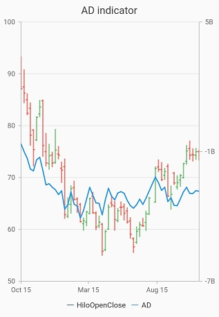

### Average true range indicator(ATR)

ATR indicator is a technical analysis volatility indicator. This indicator does not indicate the price trend. simply the degree of price volatility. The average true range is an N-day smoothed moving average (SMMA) of the true range values.

Refer the following example,




    @override
    Widget build(BuildContext context) {
     return Scaffold(
        body: Center(
         child: SfCartesianChart(
          primaryXAxis: DateTimeAxis(),
          legend: Legend(isVisible: true),
          indicators:
          <TechnicalIndicators<dynamic,   dynamic>>[
          AtrIndicator<dynamic, dynamic>(
            period: 3,
            seriesName: 'HiloOpenClose')],
    series: <CartesianSeries<ChartData, DateTime>>[
            HiloOpenCloseSeries<ChartData, DateTime>(
              name: 'HiloOpenClose')
              ]
            )
          )
        );
      }
      class ChartData {
        ChartData(this.x, this.low, this.high, this.open, this.close);
        final DateTime x;
        final double? low;
        final double? high;
        final double? open;
        final double? close;
      }




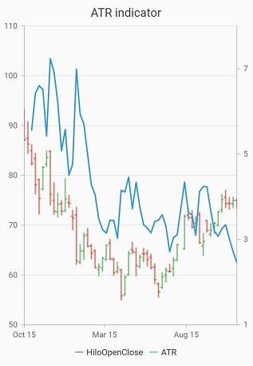

### Bollinger band Indicator

This indicator also has [`upperLineColor`](https://pub.dev/documentation/syncfusion_flutter_charts/latest/charts/BollingerBandIndicator/upperLineColor.html) and [`lowerLineColor`](https://pub.dev/documentation/syncfusion_flutter_charts/latest/charts/BollingerBandIndicator/lowerLineColor.html) properties that can be used to define the brushes for the indicator lines.

Also, we can specify standard deviation values for the BollingerBand indicator using [`standardDeviation`](https://pub.dev/documentation/syncfusion_flutter_charts/latest/charts/BollingerBandIndicator/standardDeviation.html) property.

Refer the following example,




    @override
    Widget build(BuildContext context) {
     return Scaffold(
       body: Center(
         child: SfCartesianChart(
           primaryXAxis: DateTimeAxis(),
           legend: Legend(isVisible: true),
           indicators:        <TechnicalIndicators<dynamic, dynamic>[ BollingerBandIndicator<dynamic, dynamic>(
                  period: 3,
                  seriesName: 'HiloOpenClose')],
           series: <CartesianSeries<ChartData, DateTime>>[
              HiloOpenCloseSeries<ChartData, DateTime>(name: 'HiloOpenClose')
              ]
            )
          )
        );         
      }

      class ChartData {
        ChartData(this.x, this.low, this.high, this.open, this.close);
        final DateTime x;
        final double? low;
        final double? high;
        final double? open;
        final double? close;
      }




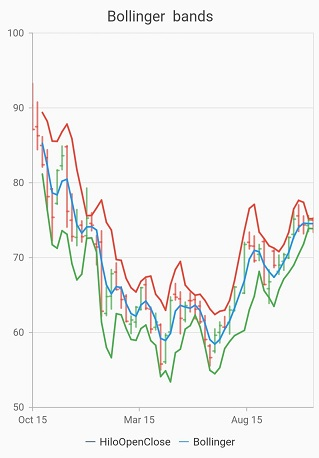

### Exponential moving average indicator (EMA)

An EMA indicator is a simple, arithmetic moving average that is calculated by adding the closing price for the number of time periods and dividing the total value by the number of periods.

It also has a [`valueField`](https://pub.dev/documentation/syncfusion_flutter_charts/latest/charts/EmaIndicator/valueField.html) property. Based on this property Indicator will render.

Refer the following example,




    @override
    Widget build(BuildContext context) {
      return Scaffold(
        body: Center(
          child: SfCartesianChart(
            primaryXAxis: DateTimeAxis(),
            legend: Legend(isVisible: true),
            indicators: <TechnicalIndicators<dynamic, dynamic>>[
        EmaIndicator<dynamic, dynamic>(
            seriesName: 'HiloOpenClose',
            valueField: 'high',)],
            series: <ChartSeries<ChartData, DateTime>>[
        HiloOpenCloseSeries<ChartData, DateTime>(
            name: 'HiloOpenClose')
            ]
          )
        )
      );
    }

    class ChartData {
        ChartData(this.x, this.low, this.high, this.open, this.close);
        final DateTime x;
        final double? low;
        final double? high;
        final double? open;
        final double? close;
      }




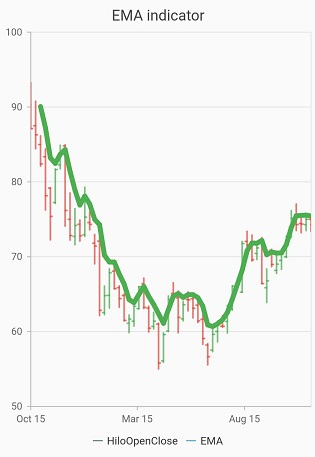

### Moving average convergence divergence (MACD)

This is mostly using indicator having [`shortPeriod`](https://pub.dev/documentation/syncfusion_flutter_charts/latest/charts/MacdIndicator/shortPeriod.html) and [`longPeriod`](https://pub.dev/documentation/syncfusion_flutter_charts/latest/charts/MacdIndicator/longPeriod.html) for defining the motion of the indicator.

Also you can draw [`MacdType.line`](https://pub.dev/documentation/syncfusion_flutter_charts/latest/charts/MacdType.html), [`MacdType.histogram`](https://pub.dev/documentation/syncfusion_flutter_charts/latest/charts/MacdType.html) MACD or [`MacdType.both`](https://pub.dev/documentation/syncfusion_flutter_charts/latest/charts/MacdType.html) types using the  [`macdType`](https://pub.dev/documentation/syncfusion_flutter_charts/latest/charts/MacdIndicator/macdType.html) property,

The [`macdLineColor`](https://pub.dev/documentation/syncfusion_flutter_charts/latest/charts/MacdIndicator/macdLineColor.html) property is used to define the color for the MACD line and the [`histogramNegativeColor`](https://pub.dev/documentation/syncfusion_flutter_charts/latest/charts/MacdIndicator/histogramNegativeColor.html) and [`histogramPositiveColor`](https://pub.dev/documentation/syncfusion_flutter_charts/latest/charts/MacdIndicator/histogramPositiveColor.html) property is used to define the color for the MACD histogram.

Refer the following example,



    
    @override
    Widget build(BuildContext context) {
     return Scaffold(
       body: Center(
          child: SfCartesianChart(
            primaryXAxis: DateTimeAxis(),
            legend: Legend(isVisible: true),
            indicators: <TechnicalIndicators<dynamic, dynamic>>[
          MacdIndicator<dynamic, dynamic>(
              longPeriod: 5,
              shortPeriod: 2,
              seriesName: 'HiloOpenClose')],
            series: <CartesianSeries<ChartData, DateTime>>[
          HiloOpenCloseSeries<ChartData, DateTime>(
            name: 'HiloOpenClose')
           ]
          )
        )
      );
    }

     class ChartData {
        ChartData(this.x, this.low, this.high, this.open, this.close);
        final DateTime x;
        final double? low;
        final double? high;
        final double? open;
        final double? close;
      }




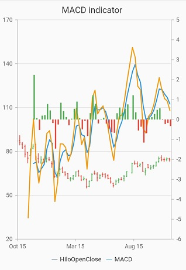

### Momentum Indicator

This indicator also has a centerline. The [`centerLineColor`](https://pub.dev/documentation/syncfusion_flutter_charts/latest/charts/MomentumIndicator/centerLineColor.html) and [`centerLineWidth`](https://pub.dev/documentation/syncfusion_flutter_charts/latest/charts/MomentumIndicator/centerLineWidth.html) properties are used to define center line.

Refer the following example,




    @override
    Widget build(BuildContext context) {
      return Scaffold(
        body: Center(
          child: SfCartesianChart(
            primaryXAxis: DateTimeAxis(),
            legend: Legend(isVisible: true),
            indicators: <TechnicalIndicators<dynamic, dynamic>>[
          MomentumIndicator<dynamic, dynamic>(
            period: 3,
            seriesName: 'HiloOpenClose',)],
           series: <ChartSeries<ChartData, DateTime>>[
          HiloOpenCloseSeries<ChartData, DateTime>(name: 'HiloOpenClose')
            ]
          )
        )
      );
    }

     class ChartData {
        ChartData(this.x, this.low, this.high, this.open, this.close);
        final DateTime x;
        final double? low;
        final double? high;
        final double? open;
        final double? close;
      }




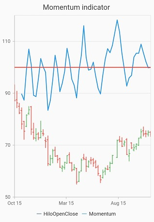

### Relative strength index Indicator(RSI)
The RSI indicator has an additional two lines other than the signal line.They indicate the [`overBought`](https://pub.dev/documentation/syncfusion_flutter_charts/latest/charts/RsiIndicator/overbought.html) and [`overSold`](https://pub.dev/documentation/syncfusion_flutter_charts/latest/charts/RsiIndicator/oversold.html) region.

The [`upperLineColor`](https://pub.dev/documentation/syncfusion_flutter_charts/latest/charts/RsiIndicator/upperLineColor.html) property is used to define the color for the line that indicates [`overBought`](https://pub.dev/documentation/syncfusion_flutter_charts/latest/charts/RsiIndicator/overbought.html) region, and the [`lowerLineColor`](https://pub.dev/documentation/syncfusion_flutter_charts/latest/charts/RsiIndicator/lowerLineColor.html) property is used to define the color for the line that indicates [`overSold`](https://pub.dev/documentation/syncfusion_flutter_charts/latest/charts/RsiIndicator/oversold.html) region.

Refer the following example,




    @override
    Widget build(BuildContext context) {
      return Scaffold(
        body: Center(
          child: SfCartesianChart(
            primaryXAxis: DateTimeAxis(),
            legend: Legend(isVisible: true),
             indicators: <TechnicalIndicators<dynamic, dynamic>>[
          RsiIndicator<dynamic, dynamic>(
            period: 3,
            seriesName: 'HiloOpenClose',
            overbought: 70,
            oversold: 30)],
            series: <ChartSeries<ChartData, DateTime>>[
          HiloOpenCloseSeries<ChartData, DateTime>(name: 'HiloOpenClose')
            ]
          )
        )
      );
     }

      class ChartData {
        ChartData(this.x, this.low, this.high, this.open, this.close);
        final DateTime x;
        final double? low;
        final double? high;
        final double? open;
        final double? close;
      }




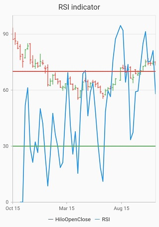

### Simple moving average indicator(SMA)

The [`Simple moving average indicator`](https://pub.dev/documentation/syncfusion_flutter_charts/latest/charts/SmaIndicator-class.html) is similar to [`Exponential moving average indicator`](https://pub.dev/documentation/syncfusion_flutter_charts/latest/charts/EmaIndicator-class.html) and this can be defined using the following code examples.




    @override
    Widget build(BuildContext context) {
      return Scaffold(
        body: Center(
          child: SfCartesianChart(
            primaryXAxis: DateTimeAxis(),
            legend: Legend(isVisible: true),
            indicators: <TechnicalIndicators<dynamic, dynamic>>[
          SmaIndicator<dynamic, dynamic>(
            seriesName: 'HiloOpenClose',
            valueField: 'close')],
           series: <ChartSeries<ChartData, DateTime>>[
          HiloOpenCloseSeries<ChartData, DateTime>(
            name: 'HiloOpenClose')
            ]
          )
        )
      );
    }

     class ChartData {
        ChartData(this.x, this.low, this.high, this.open, this.close);
        final DateTime x;
        final double? low;
        final double? high;
        final double? open;
        final double? close;
      }




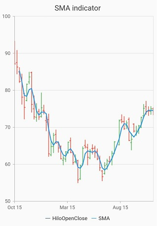

### Stochastic indicator

This indicator is used to measure the range and momentum of price movements. It contains [`kPeriod`](https://pub.dev/documentation/syncfusion_flutter_charts/latest/charts/StochasticIndicator/kPeriod.html) and [`dPeriod`](https://pub.dev/documentation/syncfusion_flutter_charts/latest/charts/StochasticIndicator/dPeriod.html) property defining the ‘k’ percentage and ‘d’ percentage respectively.

In this indicator [`upperLineColor`](https://pub.dev/documentation/syncfusion_flutter_charts/latest/charts/StochasticIndicator/upperLineColor.html),[`lowerLineColor`](https://pub.dev/documentation/syncfusion_flutter_charts/latest/charts/StochasticIndicator/lowerLineColor.html) and [`periodLineColor`](https://pub.dev/documentation/syncfusion_flutter_charts/latest/charts/StochasticIndicator/periodLineColor.html) property are used to define the color for the Stochastic indicator lines.

Refer the following example,




    @override
    Widget build(BuildContext context) {
      return Scaffold(
        body: Center(
          child: SfCartesianChart(
            primaryXAxis: DateTimeAxis(),
            legend: Legend(isVisible: true),
            indicators: <TechnicalIndicators<dynamic, dynamic>>[
          StochasticIndicator<dynamic, dynamic>(   
              seriesName: 'HiloOpenClose',,
              kPeriod: 2,
              dPeriod: 3)],
             series: <ChartSeries<ChartData, DateTime>>[
          HiloOpenCloseSeries<ChartData, DateTime>(name: 'HiloOpenClose')
            ]
          )
        )
      );
    }

     class ChartData {
        ChartData(this.x, this.low, this.high, this.open, this.close);
        final DateTime x;
        final double? low;
        final double? high;
        final double? open;
        final double? close;
      }




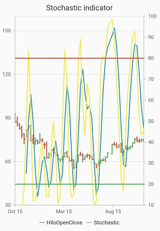

### Triangular moving average indicator (TMA)

A TMA indicator is simply a double-smoothed simple moving average of data calculated over a period where the middle portion of the data has more weight.

Refer the following example,




    @override
    Widget build(BuildContext context) {
      return Scaffold(
        body: Center(
          child: SfCartesianChart(
            primaryXAxis: DateTimeAxis(),
            legend: Legend(isVisible: true),
            indicators: <TechnicalIndicators<dynamic, dynamic>>[
          TmaIndicator<ChartData, dynamic>(
              seriesName: 'HiloOpenClose',
              valueField: 'low')],
            series: <ChartSeries<ChartData, DateTime>>[
          HiloOpenCloseSeries<ChartData, DateTime>(
            name: 'HiloOpenClose')
            ]
          )
        )
      );
    }

     class ChartData {
        ChartData(this.x, this.low, this.high, this.open, this.close);
        final DateTime x;
        final double? low;
        final double? high;
        final double? open;
        final double? close;
      }



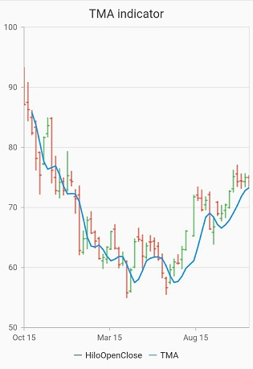

## Legend for technical indicators

Legend provides information about the series rendered in the chart. Legend for the indicator is rendered along with the series legend when the legend is set to be visible. Also when the  [ `name` ](https://pub.dev/documentation/syncfusion_flutter_charts/latest/charts/TechnicalIndicators/name.html) property is given to an indicator, the legend name is changed based on the indicator name.[`legendItemText`](https://pub.dev/documentation/syncfusion_flutter_charts/latest/charts/TechnicalIndicators/legendItemText.html) can also be provided for changing the name of the legend. In default rendering the [`legendIconType`](https://pub.dev/documentation/syncfusion_flutter_charts/latest/charts/TechnicalIndicators/legendIconType.html) will be a horizontal line.

The following code example can define the legend.




    @override
    Widget build(BuildContext context){
      return Scaffold(
        body: Center(
          child: SfCartesianChart(
            primaryXAxis: DateTimeAxis(),
            indicators: <TechnicalIndicators<dynamic, dynamic>>[
              MomentumIndicator<dynamic, dynamic>(
                  seriesName: 'HiloOpenClose',
                  legendIconType: LegendIconType.diamond,
                  legendItemText: 'Indicator')],
            series: <ChartSeries<ChartData, DateTime>>[
              HiloOpenCloseSeries<ChartData, DateTime>(
                  name: 'HiloOpenClose')
                  ]
                )
              )
            );
          }

      class ChartData {
        ChartData(this.x, this.low, this.high, this.open, this.close);
        final DateTime x;
        final double? low;
        final double? high;
        final double? open;
        final double? close;
      }




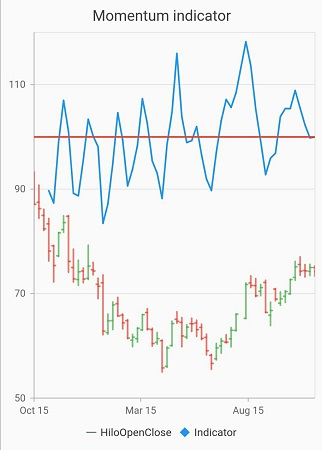

Also refer [`technical indicators event`](https://pub.dev/documentation/syncfusion_flutter_charts/latest/charts/IndicatorRenderArgs-class.html) for customizing the tooltip further.

## Tooltip for technical indicators

The chart will display the segment information through the tooltip. It is used to show information about the segment when you tap on the segment. The technical indicator tooltip has the same [`ActivationMode`](https://pub.dev/documentation/syncfusion_flutter_charts/latest/charts/TooltipBehavior/activationMode.html) that has been given in the [`TooltipBehavior`](https://pub.dev/documentation/syncfusion_flutter_charts/latest/charts/TooltipBehavior-class.html) of the series.



   
   late TooltipBehavior _tooltipBehavior;
    
    @override
    void initState(){
      _tooltipBehavior = TooltipBehavior(enable: true, shared: true);
    super.initState();
    }

    @override
    Widget build(BuildContext context){
      return Scaffold(
        body: Center(
          child: SfCartesianChart(
            primaryXAxis: DateTimeAxis(),
            tooltipBehavior: _tooltipBehavior,
            indicators: <TechnicalIndicators<dynamic, dynamic>>[
              ATRIndicator<dynamic, dynamic>(
                  seriesName: 'HiloOpenClose',
                  )
                ],
            series: <ChartSeries<ChartData, DateTime>>[
              HiloOpenCloseSeries<ChartData, DateTime>(
                  enableTooltip: true,
                  name: 'HiloOpenClose')
              ]
            )
          )
        );
      }

       class ChartData {
        ChartData(this.x, this.low, this.high, this.open, this.close);
        final DateTime x;
        final double? low;
        final double? high;
        final double? open;
        final double? close;
      }




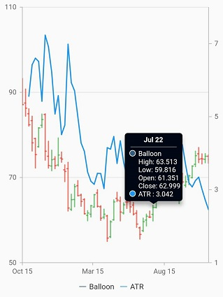

## Binding data source to indicators

In order to use [`TechnicalIndicators`](https://pub.dev/documentation/syncfusion_flutter_charts/latest/charts/TechnicalIndicators-class.html) for line, area chart etc., you need to bind the data source of the chart to indicator's [`xValueMapper`](https://pub.dev/documentation/syncfusion_flutter_charts/latest/charts/TechnicalIndicators/xValueMapper.html), [`lowValueMapper`](https://pub.dev/documentation/syncfusion_flutter_charts/latest/charts/TechnicalIndicators/lowValueMapper.html), [`highValueMapper`](https://pub.dev/documentation/syncfusion_flutter_charts/latest/charts/TechnicalIndicators/highValueMapper.html), [`openValueMapper`](https://pub.dev/documentation/syncfusion_flutter_charts/latest/charts/TechnicalIndicators/openValueMapper.html), [`closeValueMapper`](https://pub.dev/documentation/syncfusion_flutter_charts/latest/charts/TechnicalIndicators/closeValueMapper.html) respectively. 

Refer the following example below




    @override
    Widget build(BuildContext context){
      return Scaffold(
        body: Center(
          child: SfCartesianChart(
            indicators: <TechnicalIndicators>[
            MomentumIndicator<ChartData, num>(
                period: 5,
                dataSource: chartData,
                xValueMapper: (ChartData data, _) => data.x,
                highValueMapper: (ChartData data, _) => data.high,
                lowValueMapper: (ChartData data, _) => data.low,
                openValueMapper: (ChartData data, _) => data.open,
                closeValueMapper: (ChartData data, _) => data.close,
              )
            ], 
            series: <ChartSeries<ChartData, num>>[
              LineSeries<ChartData, num>(
                  color: Colors.purple,
                  dataSource: chartData,
                  xValueMapper: (ChartData1 data, _) => data.x,
                  yValueMapper: (ChartData1 data, _) => data.y,
              )
            ]
          )
        )
      );
    }

     class ChartData {
        ChartData(this.x, this.low, this.high, this.open, this.close);
        final num x;
        final double? low;
        final double? high;
        final double? open;
        final double? close;
      }

      class ChartData1{
        ChartData1(this.x, this.y);
        final num x;
        final double y;
      }




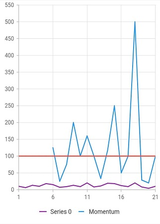

#### See Also

* [Refer this link for technical indicators callback](https://help.syncfusion.com/flutter/cartesian-charts/callbacks#onrenderdetailsupdate).

* [Bind data source to technical indicators in Flutter Cartesian chart](https://www.syncfusion.com/kb/12966/bind-data-source-to-technical-indicators-in-flutter-cartesian-chart).

>**Note**: Each indicators has their own number of value mappers available,
* [`Accumulation distribution indicator`](https://pub.dev/documentation/syncfusion_flutter_charts/latest/charts/AccumulationDistributionIndicator-class.html) (AD) - can be rendered with five value mappers ([`xValueMapper`](https://pub.dev/documentation/syncfusion_flutter_charts/latest/charts/TechnicalIndicators/xValueMapper.html), [`lowValueMapper`](https://pub.dev/documentation/syncfusion_flutter_charts/latest/charts/TechnicalIndicators/lowValueMapper.html), [`highValueMapper`](https://pub.dev/documentation/syncfusion_flutter_charts/latest/charts/TechnicalIndicators/highValueMapper.html), [`closeValueMapper`](https://pub.dev/documentation/syncfusion_flutter_charts/latest/charts/TechnicalIndicators/closeValueMapper.html), [`volumeValueMapper`](https://pub.dev/documentation/syncfusion_flutter_charts/latest/charts/AccumulationDistributionIndicator/volumeValueMapper.html)).

*	[`Average true range indicator`](https://pub.dev/documentation/syncfusion_flutter_charts/latest/charts/AtrIndicator-class.html) (ATR) - can be rendered with four value mappers ([`xValueMapper`](https://pub.dev/documentation/syncfusion_flutter_charts/latest/charts/TechnicalIndicators/xValueMapper.html), [`lowValueMapper`](https://pub.dev/documentation/syncfusion_flutter_charts/latest/charts/TechnicalIndicators/lowValueMapper.html), [`highValueMapper`](https://pub.dev/documentation/syncfusion_flutter_charts/latest/charts/TechnicalIndicators/highValueMapper.html), [`closeValueMapper`](https://pub.dev/documentation/syncfusion_flutter_charts/latest/charts/TechnicalIndicators/closeValueMapper.html)).

*	[`Bollinger band indicator`](https://pub.dev/documentation/syncfusion_flutter_charts/latest/charts/BollingerBandIndicator-class.html) - can be rendered with two value mappers ([`xValueMapper`](https://pub.dev/documentation/syncfusion_flutter_charts/latest/charts/TechnicalIndicators/xValueMapper.html) and [`closeValueMapper`](https://pub.dev/documentation/syncfusion_flutter_charts/latest/charts/TechnicalIndicators/closeValueMapper.html)).

*	[`Exponential moving average indicator`](https://pub.dev/documentation/syncfusion_flutter_charts/latest/charts/EmaIndicator-class.html) (EMA) - can be rendered with five value mappers ([`xValueMapper`](https://pub.dev/documentation/syncfusion_flutter_charts/latest/charts/TechnicalIndicators/xValueMapper.html), [`lowValueMapper`](https://pub.dev/documentation/syncfusion_flutter_charts/latest/charts/TechnicalIndicators/lowValueMapper.html), [`highValueMapper`](https://pub.dev/documentation/syncfusion_flutter_charts/latest/charts/TechnicalIndicators/highValueMapper.html), [`openValueMapper`](https://pub.dev/documentation/syncfusion_flutter_charts/latest/charts/TechnicalIndicators/openValueMapper.html), [`closeValueMapper`](https://pub.dev/documentation/syncfusion_flutter_charts/latest/charts/TechnicalIndicators/closeValueMapper.html)).

* [`Moving average convergence divergence`](https://pub.dev/documentation/syncfusion_flutter_charts/latest/charts/MacdIndicator-class.html) (MACD) - can be rendered with two value mappers ([`xValueMapper`](https://pub.dev/documentation/syncfusion_flutter_charts/latest/charts/TechnicalIndicators/xValueMapper.html) and [`closeValueMapper`](https://pub.dev/documentation/syncfusion_flutter_charts/latest/charts/TechnicalIndicators/closeValueMapper.html)).

*	[`Momentum indicator`](https://pub.dev/documentation/syncfusion_flutter_charts/latest/charts/MomentumIndicator-class.html) - can be rendered with five value mappers ([`xValueMapper`](https://pub.dev/documentation/syncfusion_flutter_charts/latest/charts/TechnicalIndicators/xValueMapper.html), [`lowValueMapper`](https://pub.dev/documentation/syncfusion_flutter_charts/latest/charts/TechnicalIndicators/lowValueMapper.html), [`highValueMapper`](https://pub.dev/documentation/syncfusion_flutter_charts/latest/charts/TechnicalIndicators/highValueMapper.html), [`openValueMapper`](https://pub.dev/documentation/syncfusion_flutter_charts/latest/charts/TechnicalIndicators/openValueMapper.html), [`closeValueMapper`](https://pub.dev/documentation/syncfusion_flutter_charts/latest/charts/TechnicalIndicators/closeValueMapper.html)).

*	[`Relative strength index indicator`](https://pub.dev/documentation/syncfusion_flutter_charts/latest/charts/RsiIndicator-class.html) (RSI) - can be rendered with four value mappers ([`xValueMapper`](https://pub.dev/documentation/syncfusion_flutter_charts/latest/charts/TechnicalIndicators/xValueMapper.html), [`lowValueMapper`](https://pub.dev/documentation/syncfusion_flutter_charts/latest/charts/TechnicalIndicators/lowValueMapper.html), [`highValueMapper`](https://pub.dev/documentation/syncfusion_flutter_charts/latest/charts/TechnicalIndicators/highValueMapper.html), [`closeValueMapper`](https://pub.dev/documentation/syncfusion_flutter_charts/latest/charts/TechnicalIndicators/closeValueMapper.html)).

*	[`Simple moving average indicator`](https://pub.dev/documentation/syncfusion_flutter_charts/latest/charts/SmaIndicator-class.html) (SMA) - can be rendered with five value mappers ([`xValueMapper`](https://pub.dev/documentation/syncfusion_flutter_charts/latest/charts/TechnicalIndicators/xValueMapper.html), [`lowValueMapper`](https://pub.dev/documentation/syncfusion_flutter_charts/latest/charts/TechnicalIndicators/lowValueMapper.html), [`highValueMapper`](https://pub.dev/documentation/syncfusion_flutter_charts/latest/charts/TechnicalIndicators/highValueMapper.html), [`openValueMapper`](https://pub.dev/documentation/syncfusion_flutter_charts/latest/charts/TechnicalIndicators/openValueMapper.html), [`closeValueMapper`](https://pub.dev/documentation/syncfusion_flutter_charts/latest/charts/TechnicalIndicators/closeValueMapper.html)).

*	[`Stochastic indicator`](https://pub.dev/documentation/syncfusion_flutter_charts/latest/charts/StochasticIndicator-class.html) - can be rendered with five value mappers ([`xValueMapper`](https://pub.dev/documentation/syncfusion_flutter_charts/latest/charts/TechnicalIndicators/xValueMapper.html), [`lowValueMapper`](https://pub.dev/documentation/syncfusion_flutter_charts/latest/charts/TechnicalIndicators/lowValueMapper.html), [`highValueMapper`](https://pub.dev/documentation/syncfusion_flutter_charts/latest/charts/TechnicalIndicators/highValueMapper.html), [`openValueMapper`](https://pub.dev/documentation/syncfusion_flutter_charts/latest/charts/TechnicalIndicators/openValueMapper.html), [`closeValueMapper`](https://pub.dev/documentation/syncfusion_flutter_charts/latest/charts/TechnicalIndicators/closeValueMapper.html)).

*	[`Triangular moving average indicator`](https://pub.dev/documentation/syncfusion_flutter_charts/latest/charts/TmaIndicator-class.html) (TMA) - can be rendered with five value mappers ([`xValueMapper`](https://pub.dev/documentation/syncfusion_flutter_charts/latest/charts/TechnicalIndicators/xValueMapper.html), [`lowValueMapper`](https://pub.dev/documentation/syncfusion_flutter_charts/latest/charts/TechnicalIndicators/lowValueMapper.html), [`highValueMapper`](https://pub.dev/documentation/syncfusion_flutter_charts/latest/charts/TechnicalIndicators/highValueMapper.html), [`openValueMapper`](https://pub.dev/documentation/syncfusion_flutter_charts/latest/charts/TechnicalIndicators/openValueMapper.html), [`closeValueMapper`](https://pub.dev/documentation/syncfusion_flutter_charts/latest/charts/TechnicalIndicators/closeValueMapper.html)).

>**Note**: `chartData` in the above code snippets is a class type list and holds the data for binding to the chart series. Refer [Bind data source](https://help.syncfusion.com/flutter/cartesian-charts/getting-started#bind-data-source) topic for more details.
