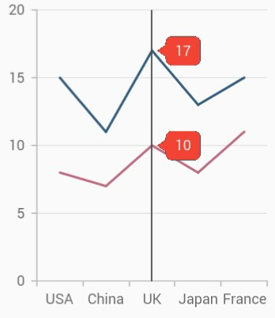
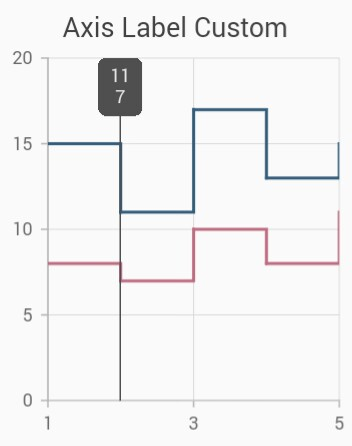
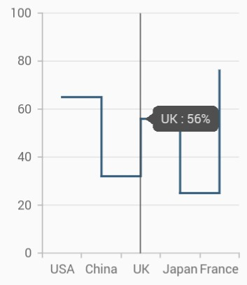
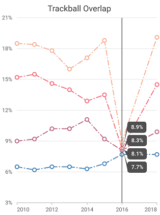
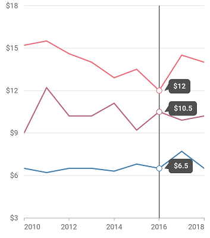
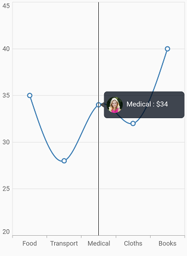
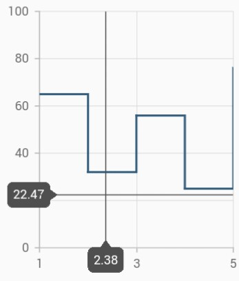
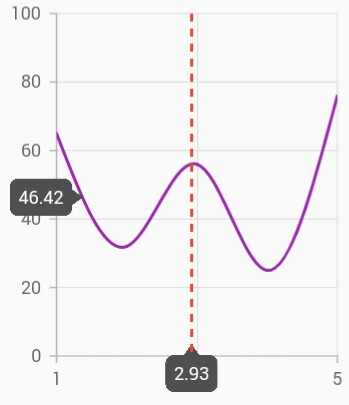

# Trackball and Crosshair

## Trackball

Trackball feature displays the tooltip for the data points that are closer to the point where you touch on the chart area. This feature, especially, can be used instead of data label feature when you cannot show data labels for all data points due to space constraint. This feature can be enabled using [`enable`](https://pub.dev/documentation/syncfusion_flutter_charts/latest/charts/TrackballBehavior/enable.html) property of [`trackballBehavior`](https://pub.dev/documentation/syncfusion_flutter_charts/latest/charts/SfCartesianChart/trackballBehavior.html). Trackball will be activated once you long-press anywhere on the chart area. Once it is activated, it will appear in the UI and move based on your touch movement until you stop touching on the chart.

You can use the following properties to customize the appearance of trackball tooltip.

* [`lineType`](https://pub.dev/documentation/syncfusion_flutter_charts/latest/charts/TrackballBehavior/lineType.html) - specifies the type of trackball line. By default, vertical line will be displayed.
* [`lineColor`](https://pub.dev/documentation/syncfusion_flutter_charts/latest/charts/TrackballBehavior/lineColor.html) - specifies the color of the trackball line.
* [`lineWidth`](https://pub.dev/documentation/syncfusion_flutter_charts/latest/charts/TrackballBehavior/lineWidth.html) - specifies the stroke width of the trackball line.
* [`lineDashArray`](https://pub.dev/documentation/syncfusion_flutter_charts/latest/charts/TrackballBehavior/lineDashArray.html)- used to render trackball line with dashes.
* [`shouldAlwaysShow`](https://pub.dev/documentation/syncfusion_flutter_charts/latest/charts/TrackballBehavior/shouldAlwaysShow.html) - used to show the trackball even after the touch end.
* [`tooltipSettings.borderWidth`](https://pub.dev/documentation/syncfusion_flutter_charts/latest/charts/InteractiveTooltip/borderWidth.html) – used to change the stroke width of the axis tooltip.
* [`tooltipSettings.borderColor`](https://pub.dev/documentation/syncfusion_flutter_charts/latest/charts/InteractiveTooltip/borderColor.html) – used to change the stroke color of the axis tooltip.
* [`tooltipSettings.arrowLength`](https://pub.dev/documentation/syncfusion_flutter_charts/latest/charts/InteractiveTooltip/arrowLength.html) - specifies the length of the tooltip arrow.
* [`tooltipSettings.arrowWidth`](https://pub.dev/documentation/syncfusion_flutter_charts/latest/charts/InteractiveTooltip/arrowWidth.html) - specifies the width of the tooltip arrow.
* [`tooltipSettings.format`](https://pub.dev/documentation/syncfusion_flutter_charts/latest/charts/InteractiveTooltip/format.html) - by default, axis value will be displayed in the tooltip, and it can be customized by adding desired text as prefix or suffix.
* [`tooltipSettings.textStyle`](https://pub.dev/documentation/syncfusion_flutter_charts/latest/charts/InteractiveTooltip/textStyle.html) – used to change the text color, size, font family, fontStyle, and font weight.
* [`tooltipSettings.textStyle.color`](https://pub.dev/documentation/syncfusion_flutter_charts/latest/charts/ChartTextStyle/color.html) – used to change the color of the tooltip text.
* [`tooltipSettings.textStyle.fontFamily`](https://pub.dev/documentation/syncfusion_flutter_charts/latest/charts/ChartTextStyle/fontFamily.html) - used to change the font family for tooltip text.
* [`tooltipSettings.textStyle.fontStyle`](https://pub.dev/documentation/syncfusion_flutter_charts/latest/charts/ChartTextStyle/fontStyle.html) – used to change the font style for tooltip text.
* [`tooltipSettings.textStyle.fontSize`](https://pub.dev/documentation/syncfusion_flutter_charts/latest/charts/ChartTextStyle/fontSize.html) - used to change the font size for tooltip text.
* `hideDelay` - used to specify disappear delay for trackball.

N> The above mentioned properties are only applicable for SfCartesian types of charts.

 

    @override
    Widget build(BuildContext context) {
      return Scaffold(
        body: SafeArea(
          child: Center(
            child: Container(
              child: SfCartesianChart(
                trackballBehavior: TrackballBehavior(
                  // Enables the trackball
                  enable: true,
                  tooltipSettings: InteractiveTooltip(
                    enable: true,
                    color: Colors.red
                  )
                )
              )
            )
          )
        )
      );
    }



### Label display mode

The [`tooltipDisplayMode`](https://pub.dev/documentation/syncfusion_flutter_charts/latest/charts/TrackballBehavior/tooltipDisplayMode.html) property is used to specify whether to display label for all the data points along the vertical line or display only single label. Following are the options you can set to this property,

* [`floatAllPoints`](https://pub.dev/documentation/syncfusion_flutter_charts/latest/charts/TrackballDisplayMode-class.html) – Displays label for all the data points along the tracker line.
* [`nearestPoint`](https://pub.dev/documentation/syncfusion_flutter_charts/latest/charts/TrackballDisplayMode-class.html) – Displays label for single data point that is nearer to the touch contact position.
* [`groupAllPoints`](https://pub.dev/documentation/syncfusion_flutter_charts/latest/charts/TrackballDisplayMode-class.html) – Displays label for all the data points grouped and positioned at the top of the chart area.
* [`none`](https://pub.dev/documentation/syncfusion_flutter_charts/latest/charts/TrackballDisplayMode-class.html) - Doesn't display the label.

 

    @override
    Widget build(BuildContext context) {
      return Scaffold(
        body: SafeArea(
          child: Center(
            child: Container(
              child: SfCartesianChart(
                trackballBehavior: TrackballBehavior(
                  enable: true,
                  // Display mode of trackball tooltip
                  tooltipDisplayMode: TrackballDisplayMode.floatAllPoints
                )
              )
            )
          )
        )
      );
    }



### Label alignment

The position of trackball tooltip can be changed using the [`tooltipAlignment`](https://pub.dev/documentation/syncfusion_flutter_charts/latest/charts/TrackballBehavior/tooltipAlignment.html) property of [`trackballBehavior`](https://pub.dev/documentation/syncfusion_flutter_charts/latest/charts/SfCartesianChart/trackballBehavior.html). The following options are available in [`tooltipAlignment`](https://pub.dev/documentation/syncfusion_flutter_charts/latest/charts/TrackballBehavior/tooltipAlignment.html).

* [`near`](https://pub.dev/documentation/syncfusion_flutter_charts/latest/charts/ChartAlignment-class.html) - aligns the trackball tooltip to the top position of plot area.
* [`far`](https://pub.dev/documentation/syncfusion_flutter_charts/latest/charts/ChartAlignment-class.html) - aligns the trackball tooltip to the bottom position of plot area.
* [`center`](https://pub.dev/documentation/syncfusion_flutter_charts/latest/charts/ChartAlignment-class.html) - aligns the trackball tooltip to the center position of plot area. 

 

    @override
    Widget build(BuildContext context) {
      return Scaffold(
        body: SafeArea(
          child: Center(
            child: Container(
              child: SfCartesianChart(
                trackballBehavior: TrackballBehavior(
                  enable: true,
                  tooltipAlignment: ChartAlignment.near,
                  tooltipDisplayMode: TrackballDisplayMode.groupAllPoints
                )
              )
            )
          )
        )
      );
    }



N> This is applicable only when the [`tooltipDisplayMode`](https://pub.dev/documentation/syncfusion_flutter_charts/latest/charts/TrackballBehavior/tooltipDisplayMode.html) is set to [`groupAllPoints`](https://pub.dev/documentation/syncfusion_flutter_charts/latest/charts/TrackballDisplayMode-class.html).

### Label format

By default, axis value will be displayed in the tooltip, and it can be customized using [`format`](https://pub.dev/documentation/syncfusion_flutter_charts/latest/charts/TooltipBehavior/format.html) property by adding desired text as prefix or suffix.

 

    @override
    Widget build(BuildContext context) {
      return Scaffold(
        body: SafeArea(
          child: Center(
            child: Container(
              child: SfCartesianChart(
                trackballBehavior: TrackballBehavior(
                  enable: true,
                  tooltipSettings: InteractiveTooltip(
                    // Formatting trackball tooltip text
                    format: 'point.x : point.y%'
                  )
                )
              )
            )
          )
        )
      );
    }



###	Activation mode

The [`activationMode`](https://pub.dev/documentation/syncfusion_flutter_charts/latest/charts/TrackballBehavior/activationMode.html) property is used to restrict the visibility of trackball based on the touch actions. The default value of this property is [`ActivationMode.longPress`](https://pub.dev/documentation/syncfusion_flutter_charts/latest/charts/ActivationMode-class.html).

The ActivationMode enum contains the following values:

* [`longPress`](https://pub.dev/documentation/syncfusion_flutter_charts/latest/charts/ActivationMode-class.html) – Activates trackball only when performing the long press action.
* [`singleTap`](https://pub.dev/documentation/syncfusion_flutter_charts/latest/charts/ActivationMode-class.html) – Activates trackball only when performing single tap action.
* [`doubleTap`](https://pub.dev/documentation/syncfusion_flutter_charts/latest/charts/ActivationMode-class.html) - Activates trackball only when performing double tap action.
* [`none`](https://pub.dev/documentation/syncfusion_flutter_charts/latest/charts/ActivationMode-class.html) – Hides the visibility of trackball when setting activation mode to none. It will be activated when calling the [`show`](https://pub.dev/documentation/syncfusion_flutter_charts/latest/charts/TrackballBehavior/show.html) method.

 

    @override
    Widget build(BuildContext context) {
      return Scaffold(
        body: SafeArea(
          child: Center(
            child: Container(
              child: SfCartesianChart(
                trackballBehavior: TrackballBehavior(
                  enable: true,
                    // Displays the trackball on single tap
                    activationMode: ActivationMode.singleTap
                )
              )
            )
          )
        )
      );
    }



### Trackball tooltip overlap

[`SfCartesianChart`](https://pub.dev/documentation/syncfusion_flutter_charts/latest/charts/SfCartesianChart-class.html) provides support to avoid the overlapping of two or more tooltips of the trackball and no API is required for this feature as it will be done by default. For example, If we have 2 or more series data points rendered close to each other then, the trackball tooltips of each data point will not be overlap with each other.

 

    @override
    Widget build(BuildContext context) {
      return Scaffold(
          child: Center(
            child: Container(
              child: SfCartesianChart(
                trackballBehavior: TrackballBehavior(
                  enable: true
                )
                <LineSeries<SalesData, double>>[
                      LineSeries<SalesData, double>(
                          dataSource: data,
                          markerSettings: MarkerSettings(enable: true),
                          xValueMapper: (SalesData sales, _) => sales.year,
                          yValueMapper: (SalesData sales, _) => sales.sales)
                      LineSeries<SalesData, double>(
                          dataSource: data2,
                          markerSettings: MarkerSettings(enable: true),
                          xValueMapper: (SalesData sales, _) => sales.year,
                          yValueMapper: (SalesData sales, _) => sales.sales),
                      LineSeries<SalesData, double>(
                          dataSource:data3,
                          markerSettings: MarkerSettings(enable: true),
                          xValueMapper: (SalesData sales, _) => sales.year,
                          yValueMapper: (SalesData sales, _) => sales.sales),
                      LineSeries<SalesData, double>(
                          dataSource:data4,
                          markerSettings: MarkerSettings(enable: true),
                          xValueMapper: (SalesData sales, _) => sales.year,
                          yValueMapper: (SalesData sales, _) => sales.sales)
                ]
              )
            )
        )
      );
    }



### Trackball marker

Trackball markers are used to provide information about the exact point location. You can add a shape to adorn each data point when the trackball is visible. Trackball markers can be enabled by using the [`markerVisibility`](https://pub.dev/documentation/syncfusion_flutter_charts/latest/charts/TrackballMarkerSettings/markerVisibility.html) property of [`TrackballMarkerSettings`](https://pub.dev/documentation/syncfusion_flutter_charts/latest/charts/TrackballMarkerSettings-class.html). The below [`markerVisibility`](https://pub.dev/documentation/syncfusion_flutter_charts/latest/charts/TrackballMarkerSettings/markerVisibility.html) property values determines whether the trackball marker should be visible or not when the trackball is enabled in the chart

* [`TrackballVisibilityMode.auto`](https://pub.dev/documentation/syncfusion_flutter_charts/latest/charts/TrackballVisibilityMode-class.html) – If the [`isVisible`](https://pub.dev/documentation/syncfusion_flutter_charts/latest/charts/MarkerSettings/isVisible.html) property in the series [`markerSettings`](https://pub.dev/documentation/syncfusion_flutter_charts/latest/charts/MarkerSettings-class.html) is set  to true, then the trackball marker will also be displayed for that particular series, else it will not be displayed.
* [`TrackballVisibilityMode.visible`](https://pub.dev/documentation/syncfusion_flutter_charts/latest/charts/TrackballVisibilityMode-class.html) – Makes the trackball marker visible for all the series irrespective of considering the [`isVisible`](https://pub.dev/documentation/syncfusion_flutter_charts/latest/charts/MarkerSettings/isVisible.html) property's value in the [`markerSettings`](https://pub.dev/documentation/syncfusion_flutter_charts/latest/charts/MarkerSettings-class.html).
* [`TrackballVisibilityMode.hidden`](https://pub.dev/documentation/syncfusion_flutter_charts/latest/charts/TrackballVisibilityMode-class.html) – Hides the trackball marker for all the series.

Also refer, [marker customization](./marker-datalabel#Marker) for customizing the appearance of trackball marker.  

 

    @override
    Widget build(BuildContext context) {
      return Scaffold(
          child: Center(
            child: Container(
              child: SfCartesianChart(
                trackballBehavior: TrackballBehavior(
                  enable: true,
                  markerSettings: TrackballMarkerSettings(
                    markerVisibility: TrackballVisibilityMode.visible
                  )
                )
                <LineSeries<SalesData, double>>[
                      LineSeries<SalesData, double>(
                          dataSource: data,
                          xValueMapper: (SalesData sales, _) => sales.year,
                          yValueMapper: (SalesData sales, _) => sales.sales)
                      LineSeries<SalesData, double>(
                          dataSource: data2,
                          xValueMapper: (SalesData sales, _) => sales.year,
                          yValueMapper: (SalesData sales, _) => sales.sales),
                      LineSeries<SalesData, double>(
                          dataSource:data3,
                          xValueMapper: (SalesData sales, _) => sales.year,
                          yValueMapper: (SalesData sales, _) => sales.sales),
                ]
              )
            )
          )
      );
    }



### Trackball tooltip template

You can customize the appearance of the trackball tooltip with your own widgets by using the [`builder`](https://pub.dev/documentation/syncfusion_flutter_charts/latest/charts/TrackballBehavior/builder.html) property of [`trackballBehavior`](https://pub.dev/documentation/syncfusion_flutter_charts/latest/charts/TrackballBehavior-class.html). Here you can specify the content that needs to be displayed in the trackball tooltip.

 

    @override
    Widget build(BuildContext context) {
     return Scaffold(
       child: Center(
         child: Container(
            child: SfCartesianChart(
              trackballBehavior: TrackballBehavior(
                    enable: true,
                    builder: (BuildContext context,
                        TrackballDetails trackballDetails) {
                      return Container(
                          height: 50,
                          width: 150,
                          decoration: BoxDecoration(
                            color: Color.fromRGBO(0, 8, 22, 0.75),
                            borderRadius:
                                BorderRadius.all(Radius.circular(6.0)),
                          ),
                          child: Row(children: [
                            Padding(
                                padding: EdgeInsets.only(left: 5),
                                child: SizedBox(
                                  child:
                                      Image.asset('images/People_Circle16.png'),
                                  height: 30,
                                  width: 30,
                                )),
                            Center(
                                child: Container(
                                    padding: EdgeInsets.only(top: 11, left: 7),
                                    height: 40,
                                    width: 100,
                                    child: Text(
                                        '${trackballDetails.point.x.toString()} : \$${trackballDetails.point.y.toString()}',
                                        style: TextStyle(
                                            fontSize: 13,
                                            color: Color.fromRGBO(
                                                255, 255, 255, 1)))))
                          ]));
                    },
                  ),
              series: <CartesianChart<SalesData,            String>>[
                SplineSeries<SalesData, double>(
                    dataSource: data,
                    xValueMapper: (SalesData sales, _) => sales.year,
                    yValueMapper: (SalesData sales, _) => sales.sales)
                ]
              )
            )
          )
      );
    }



## Crosshair

Crosshair has a vertical and horizontal line to view the value of the axis. 

Crosshair lines can be enabled by using [`enable`](https://pub.dev/documentation/syncfusion_flutter_charts/latest/charts/CrosshairBehavior/enable.html) property in the [`crosshairBehavior`](https://pub.dev/documentation/syncfusion_flutter_charts/latest/charts/CrosshairBehavior/CrosshairBehavior.html). Likewise tooltip label for an axis can be enabled by using [`enable`](https://pub.dev/documentation/syncfusion_flutter_charts/latest/charts/CrosshairBehavior/enable.html) property of [`crosshairTooltip`](https://pub.dev/documentation/syncfusion_flutter_charts/latest/charts/ChartAxis/crosshairTooltip.html) in the corresponding axis. The `hideDelay` property can be used to specify a disappear delay for the crosshair.

N> The above mentioned properties are only   applicable for SfCartesian types of charts.

 

    @override
    Widget build(BuildContext context) {
      return Scaffold(
        body: SafeArea(
          child: Center(
            child: Container(
              child: SfCartesianChart(
                primaryXAxis: NumericAxis(
                  crosshairTooltip: InteractiveTooltip(
                    // Enables the crosshair tooltip
                    enable: true
                  )
                ),
                crosshairBehavior: CrosshairBehavior(
                  // Enables the crosshair
                  enable: true
                )
              )
            )
          )
        )
      );
    }



### Track line customization

The appearance of the track line in crosshair can be customized using the following properties.

* [`lineType`](https://pub.dev/documentation/syncfusion_flutter_charts/latest/charts/CrosshairBehavior/lineType.html) - specifies the type of crosshair line.
* [`lineColor`](https://pub.dev/documentation/syncfusion_flutter_charts/latest/charts/CrosshairBehavior/lineColor.html) - specifies the color of the crosshair line.
* [`lineWidth`](https://pub.dev/documentation/syncfusion_flutter_charts/latest/charts/CrosshairBehavior/lineWidth.html) - specifies the stroke width of the crosshair line.
* [`lineDashArray`](https://pub.dev/documentation/syncfusion_flutter_charts/latest/charts/CrosshairBehavior/lineDashArray.html) - used to render crosshair line with dashes.

 

    @override
    Widget build(BuildContext context) {
      return Scaffold(
        body: SafeArea(
        child: Center(
          child: Container(
            child: SfCartesianChart(
              crosshairBehavior: CrosshairBehavior(
                  enable: true,
                  lineColor: Colors.red,
                  lineDashArray: <double>[5,5],
                  lineWidth: 2,
                  lineType: CrosshairLineType.vertical
                )
              )
            )
          )
        )
      );
    }



### Show axis tooltip

The axis tooltip can be enabled using [`enable`](https://pub.dev/documentation/syncfusion_flutter_charts/latest/charts/InteractiveTooltip/enable.html) property of [`crosshairTooltip`](https://pub.dev/documentation/syncfusion_flutter_charts/latest/charts/ChartAxis/crosshairTooltip.html). You can customize the appearance of axis tooltip using the following properties.

* [`enable`](https://pub.dev/documentation/syncfusion_flutter_charts/latest/charts/InteractiveTooltip/enable.html) - used to enable the axis tooltip.
* [`borderWidth`](https://pub.dev/documentation/syncfusion_flutter_charts/latest/charts/InteractiveTooltip/borderWidth.html) – used to change the stroke width of the axis tooltip.
* [`borderColor`](https://pub.dev/documentation/syncfusion_flutter_charts/latest/charts/InteractiveTooltip/borderColor.html) – used to change the stroke color of the axis tooltip.
* [`format`](https://pub.dev/documentation/syncfusion_flutter_charts/latest/charts/InteractiveTooltip/format.html) - by default, axis value will be displayed in the tooltip, and it can be customized by adding desired text as prefix or suffix.
* [`textStyle`](https://pub.dev/documentation/syncfusion_flutter_charts/latest/charts/InteractiveTooltip/textStyle.html) – used to change the text color, size, font family, fontStyle, and font weight.
* [`textStyle.color`](https://pub.dev/documentation/syncfusion_flutter_charts/latest/charts/ChartTextStyle/color.html) – used to change the color of the text.
* [`textStyle.fontFamily`](https://pub.dev/documentation/syncfusion_flutter_charts/latest/charts/ChartTextStyle/fontFamily.html) - used to change the font family for chart title. 
* [`textStyle.fontStyle`](https://pub.dev/documentation/syncfusion_flutter_charts/latest/charts/ChartTextStyle/fontStyle.html) – used to change the font style for the chart title.
* [`textStyle.fontSize`](https://pub.dev/documentation/syncfusion_flutter_charts/latest/charts/ChartTextStyle/fontSize.html) - used to change the font size for the chart title.

### Activation mode

The [`activationMode`](https://pub.dev/documentation/syncfusion_flutter_charts/latest/charts/TrackballBehavior/activationMode.html) property is used to restrict the visibility of trackball based on the touch actions. The default value of this property is [`ActivationMode.longPress`](https://pub.dev/documentation/syncfusion_flutter_charts/latest/charts/ActivationMode-class.html).

The ActivationMode enum contains the following values:

* [`longPress`](https://pub.dev/documentation/syncfusion_flutter_charts/latest/charts/ActivationMode-class.html) – Activates crosshair only when performing the long press action.
* [`singleTap`](https://pub.dev/documentation/syncfusion_flutter_charts/latest/charts/ActivationMode-class.html) – Activates crosshair only when performing single tap action.
* [`doubleTap`](https://pub.dev/documentation/syncfusion_flutter_charts/latest/charts/ActivationMode-class.html) - Activates crosshair only when performing double tap action.
* [`none`](https://pub.dev/documentation/syncfusion_flutter_charts/latest/charts/ActivationMode-class.html) – Hides the visibility of crosshair when setting activation mode to none. It will be activated when calling the [`show`](https://pub.dev/documentation/syncfusion_flutter_charts/latest/charts/CrosshairBehavior/show.html) method.

 

    @override
    Widget build(BuildContext context) {
      return Scaffold(
        body: SafeArea(
          child: Center(
            child: Container(
              child: SfCartesianChart(
                crosshairBehavior: CrosshairBehavior(
                  enable: true,
                  // Displays the crosshair on single tap
                  activationMode: ActivationMode.singleTap
                )
              )
            )
          )
        )
      );
    }



Also refer [crosshair](./events#oncrosshairpositionchanging) and [trackball](./events#ontrackballpositionchanging) events for customizing the crosshair and trackball further.

## See Also

* [Disabling trackball tooltip for particular series in Cartesian chart](https://www.syncfusion.com/kb/11638/how-to-disable-trackball-tooltip-for-particular-series-in-cartesian-charts-sfcartesianchart).