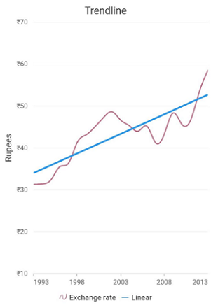
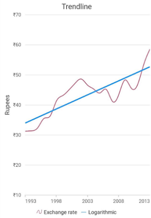
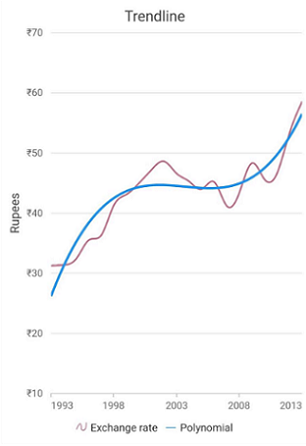
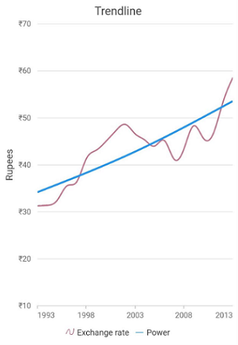
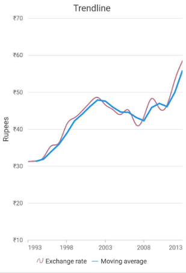
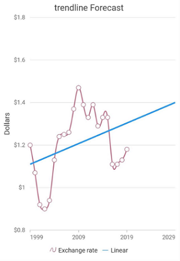
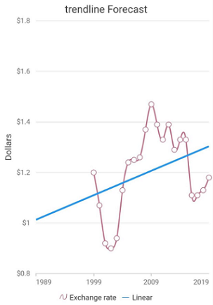
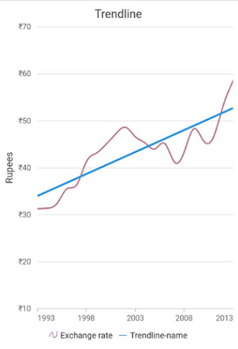
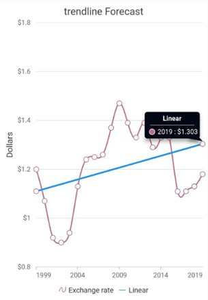

# Trendlines in Cartesian charts

Trendlines are used to show the direction and speed of price.

Trendlines can be generated for the Cartesian type series (Line, Column, Scatter, Area, Candle, HiLo, etc.) except bar type series. You can add more than one trendline to a series.

You can use the following properties to customize the behavior and appearance of trendlines.

* [`type`](https://pub.dev/documentation/syncfusion_flutter_charts/latest/charts/TrendlineType-class.html) - Specifies the type of trendline that must be added to the series.
* [`isVisible`](https://pub.dev/documentation/syncfusion_flutter_charts/latest/charts/Trendline/isVisible.html) -Used to toggle the visibility of trendlines in a series.
* [`width`](https://pub.dev/documentation/syncfusion_flutter_charts/latest/charts/Trendline/width.html) -Used to determine the width of trendline.
* [`backwardForecast`](https://pub.dev/documentation/syncfusion_flutter_charts/latest/charts/Trendline/backwardForecast.html) -Used to specify the range of backward forecast for the trendline.
* [`forwardForecast`](https://pub.dev/documentation/syncfusion_flutter_charts/latest/charts/Trendline/forwardForecast.html) -Used to specify the range of forward forecast for the trendline.
* [`intercept`](https://pub.dev/documentation/syncfusion_flutter_charts/latest/charts/Trendline/intercept.html) - Used to provide the trendline intercept values
* [`period`](https://pub.dev/documentation/syncfusion_flutter_charts/latest/charts/Trendline/period.html) -Used to determine the starting point for the trendline.
* [`polynomialOrder`](https://pub.dev/documentation/syncfusion_flutter_charts/latest/charts/Trendline/polynomialOrder.html) -used to provide the polynomial order for polynomial type trendlines.
* [` animationDuration`](https://pub.dev/documentation/syncfusion_flutter_charts/latest/charts/Trendline/animationDuration.html) - Used to animate the trendlines. By default, animationDuration has a value of 1500. When animationDuration is set to zero no animation takes place.
* [`dashArray`](https://pub.dev/documentation/syncfusion_flutter_charts/latest/charts/AxisLine/dashArray.html) - pattern of dashes and gaps used to stroke the trendline.
* [`opacity`](https://pub.dev/documentation/syncfusion_flutter_charts/latest/charts/Trendline/opacity.html) - opacity of the trendline.
* [`valueField`](https://pub.dev/documentation/syncfusion_flutter_charts/latest/charts/Trendline/valueField.html) - used to choose the valueField(low or high) to render the trendline. Defaults to low.
* [`isVisibleInLegend`](https://pub.dev/documentation/syncfusion_flutter_charts/latest/charts/Trendline/isVisibleInLegend.html) - show/hides the legend for trenline.
* [`legendIconType`](https://pub.dev/documentation/syncfusion_flutter_charts/latest/charts/Trendline/legendIconType.html) - specifies the type of legend icon for trendline

## Types of trendlines

Chart supports 6 types of trendlines.

### Linear

A linear trendline is a best fit straight line that is used with simpler data sets. To render a linear trendline, use trendline type as Linear.

 

    @override
    Widget build(BuildContext context) {
        return Scaffold(
            body: Center(
                child: Container(
                    child: SfCartesianChart(
                        series: <ChartSeries>[
                            // Renders spline chart
                            SplineSeries<SalesData, double>(
                                dataSource: chartData,
                                trendlines:<Trendline>[
                                 Trendline(
                                type: TrendlineType.linear, 
                                color: Colors.blue)
                             ]
                        ]
                    )
                )
            )
        );
    }



### Exponential

An exponential trendline is a curved line that is most useful when data values rise or fall at increasingly higher rates. You cannot create an exponential trendline if your data contains zero or negative values.

To render an exponential trendline, use trendline type as Exponential.



    @override
    Widget build(BuildContext context) {
        return Scaffold(
            body: Center(
                child: Container(
                    child: SfCartesianChart(
                        series: <ChartSeries>[
                            // Renders spline chart
                            SplineSeries<SalesData, double>(
                                dataSource: chartData,
                                trendlines:<Trendline>[
                                 Trendline(
                                type: TrendlineType.exponential, 
                                color: Colors.blue)
                             ],
                        ]
                    )
                )
            )
        );
    }



### Logarithmic

A logarithmic trendline is a best-fit curved line that is most useful when the rate of change in the data increases or decreases quickly and then levels out. A logarithmic trendline can use negative and/or positive values.

To render a logarithmic trendline, use trendline type as Logarithmic 



    @override
    Widget build(BuildContext context) {
        return Scaffold(
            body: Center(
                child: Container(
                    child: SfCartesianChart(
                        series: <ChartSeries>[
                            // Renders spline chart
                            SplineSeries<SalesData, double>(
                                dataSource: chartData,
                                trendlines:<Trendline>[
                                 Trendline(
                                type: TrendlineType.logarithmic, 
                                color: Colors.blue)
                             ],
                        ]
                    )
                )
            )
        );
    }


 

### Polynomial
A polynomial trendline is a curved line that is used when data fluctuates.

To render a polynomial trendline, use trendline type as Polynomial.



    @override
    Widget build(BuildContext context) {
        return Scaffold(
            body: Center(
                child: Container(
                    child: SfCartesianChart(
                        series: <ChartSeries>[
                            // Renders spline chart
                            SplineSeries<SalesData, double>(
                                dataSource: chartData,
                                trendlines:<Trendline>[
                                 Trendline(
                                type: TrendlineType.polynomial, 
                                color: Colors.blue)
                             ],
                        ]
                    )
                )
            )
        );
    }



### Power
A power trendline is a curved line that is best used with data sets that compare measurements that increase at a specific rate.

To render a power trendline, use trendline type as Power



    @override
    Widget build(BuildContext context) {
        return Scaffold(
            body: Center(
                child: Container(
                    child: SfCartesianChart(
                        series: <ChartSeries>[
                            // Renders spline chart
                            SplineSeries<SalesData, double>(
                                dataSource: chartData,
                                trendlines:<Trendline>[
                                 Trendline(
                                type: TrendlineType.power, 
                                color: Colors.blue)
                             ],
                        ]
                    )
                )
            )
        );
    }



### Moving Average
A moving average trendline smoothen out fluctuations in data to show a pattern or trend more clearly.

To render a moving average trendline, use trendline type as MovingAverage 



    @override
    Widget build(BuildContext context) {
        return Scaffold(
            body: Center(
                child: Container(
                    child: SfCartesianChart(
                        series: <ChartSeries>[
                            // Renders spline chart
                            SplineSeries<SalesData, double>(
                                dataSource: chartData,
                                trendlines:<Trendline>[
                                 Trendline(
                                type: TrendlineType.MovingAverage,
                                color: Colors.blue)
                             ],
                        ]
                    )
                )
            )
        );
    }



## Forecasting

Trendline forecasting is the prediction of future/past situations.

Forward Forecasting and Backward Forecasting are the two types of forecasting.

### Forward Forecasting

The value set for forwardForecast is used to determine the distance moving towards the future trend.



    @override
    Widget build(BuildContext context) {
        return Scaffold(
            body: Center(
                child: Container(
                    child: SfCartesianChart(
                        series: <ChartSeries>[
                            // Renders spline chart
                            SplineSeries<SalesData, double>(
                                dataSource: chartData,
                                trendlines:<Trendline>[
                                 Trendline(
                                type: TrendlineType.linear, 
                                forwardForecast:10,
                                color: Colors.blue),
                             ],
                        ]
                    )
                )
            )
        );
    }



### Backward Forecasting

The value set for the backwardForecast is used to determine the past trends.



    @override
    Widget build(BuildContext context) {
        return Scaffold(
            body: Center(
                child: Container(
                    child: SfCartesianChart(
                        series: <ChartSeries>[
                            // Renders spline chart
                            SplineSeries<SalesData, double>(
                                dataSource: chartData,
                                trendlines:<Trendline>[
                                 Trendline(
                                type: TrendlineType.linear, 
                                backwardForecast:10,
                                color: Colors.blue)
                             ],
                        ]
                    )
                )
            )
        );
    }



## Legend for TrendLine

Legend for trendline gets rendered together with the series legend when the legend is set to be visible. Also when the [name](https://pub.dev/documentation/syncfusion_flutter_charts/latest/charts/Trendline/name.html) property is assigned to a trendline, the name of the legend is changed based on the name of the trendlines.



    @override
    Widget build(BuildContext context) {
        return Scaffold(
            body: Center(
                child: Container(
                    child: SfCartesianChart(
                        series: <ChartSeries>[
                            // Renders spline chart
                            SplineSeries<SalesData, double>(
                                dataSource: chartData,
                                trendlines:<Trendline>[
                                 Trendline(
                                type: TrendlineType.linear, 
                                name:'trendline-name',
                                legendIconType: LegendIconType.diamond,
                                color: Colors.blue)
                             ],
                        ]
                    )
                )
            )
        );
    }



## Markers

Data markers are used to provide information about the data points in the series. You can add a shape to adorn each data point.Trendlines support markers that can be enabled using the property [`markerSettings`](https://pub.dev/documentation/syncfusion_flutter_charts/latest/charts/Trendline/markerSettings.html) .



    @override
    Widget build(BuildContext context) {
        return Scaffold(
            body: Center(
                child: Container(
                    child: SfCartesianChart(
                        series: <ChartSeries>[
                            // Renders spline chart
                            SplineSeries<SalesData, double>(
                                dataSource: chartData,
                                trendlines:<Trendline>[
                                 Trendline(
                                type: TrendlineType.linear, 
                                name:'trendline-name',
                                markerSettings: MarkerSettings(isVisible:true),
                                color: Colors.blue)
                                ],
                            ),
                        ]
                    )
                )
            )
        );
    }



## Tooltip for Trendline

Chart will display details about the points through tooltip, when user interaction is done over the point.Trendline Tooltip has the same [`ActivationMode`](https://pub.dev/documentation/syncfusion_flutter_charts/latest/charts/TooltipBehavior/activationMode.html)  that has been given in the [`TooltipBehavior`](https://pub.dev/documentation/syncfusion_flutter_charts/latest/charts/TooltipBehavior-class.html)  of the series.



    TooltipBehavior _tooltipBehavior;
    
    @override
    void initState(){
      _tooltipBehavior = TooltipBehavior(
                enable: true);
    super.initState();
    }

    @override
    Widget build(BuildContext context) {
        return Scaffold(
            body: Center(
                child: Container(
                    child: SfCartesianChart(
                        tooltipBehavior: _tooltipBehavior,
                        series: <ChartSeries>[
                            // Renders spline chart
                            SplineSeries<SalesData, double>(
                                dataSource: chartData,
                                trendlines:<Trendline>[
                                 Trendline(
                                type: TrendlineType.linear, 
                                name:'trendline-name',
                                 enableTooltip: true,
                                 markerSettings: MarkerSettings(isVisible:true),
                                color: Colors.blue)
                                ],
                            )    
                        ]
                    )
                )
            )
        );
    }



Also refer [`trendline event`](https://pub.dev/documentation/syncfusion_flutter_charts/latest/charts/TrendlineRenderArgs-class.html) for customizing the tooltip further.