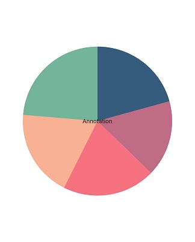

# Annotation in Flutter Circular Charts (SfCircularChart)

Chart supports annotations which allows you to mark the specific area of interest in the chart area. You can add the custom widgets using this annotations feature as depicted below.

 

    @override
    Widget build(BuildContext context) {
      return Scaffold(
        body: SafeArea(
          child: Center(
            child: Container(
              child: SfCircularChart(
                annotations: <CircularChartAnnotation>[
                  CircularChartAnnotation(
                    widget: 
                      Container(
                        child: const Text('Annotation')
                      ),
                  )
                ]
              )
            )
          )
        )
      );
    }



## Positioning the annotation

The [`horizontalAlignment`](https://pub.dev/documentation/syncfusion_flutter_charts/latest/charts/CircularChartAnnotation/horizontalAlignment.html) and [`verticalAlignment`](https://pub.dev/documentation/syncfusion_flutter_charts/latest/charts/CircularChartAnnotation/verticalAlignment.html) values can be specified to align the annotation widget either horizontally or vertically, and the also the property [`radius`](https://pub.dev/documentation/syncfusion_flutter_charts/latest/charts/CircularChartAnnotation/radius.html) can be used for placing the annotation whose values range from '0%' to '100%'. Defaults to `0%`.

**Positioning based on Alignment and Radius**

To place the annotation based on the radius values, set the [`Radius`](https://pub.dev/documentation/syncfusion_flutter_charts/latest/charts/CircularChartAnnotation/radius.html), and for changing the alignment of the annotation use the [`horizontalAlignment`](https://pub.dev/documentation/syncfusion_flutter_charts/latest/charts/CircularChartAnnotation/horizontalAlignment.html) and [`verticalAlignment`](https://pub.dev/documentation/syncfusion_flutter_charts/latest/charts/CircularChartAnnotation/verticalAlignment.html) properties of annotation are shown in the following code snippet.

 

    @override
    Widget build(BuildContext context) {
      return Scaffold(
        body: SafeArea(
          child: Center(
            child: Container(
              child: SfCircularChart(
                annotations: <CircularChartAnnotation>[
                  CircularChartAnnotation(
                    widget: Container(
                      child: const Text('Text')
                    ),
                    radius: '50%',
                    verticalAlignment: ChartAlignment.center,
                    horizontalAlignment: ChartAlignment.far  
                  )
                ]
              )
            )
          )
        )
      );
    }



## Chart with watermark

Chart supports watermark which allows you to mark the specific area of interest in the chart area. You can add the custom widgets and watermarks using this annotations feature as depicted below.

 

    @override
    Widget build(BuildContext context) {
      return Scaffold(
        body: SafeArea(
          child: Center(
            child: Container(
                  child: SfCircularChart(
                      annotations: <CircularChartAnnotation>[
                      CircularChartAnnotation(
                        widget: Container(
                        child: const Text(
                        '€ - \$ ',
                        style: TextStyle(
                        color: Color.fromRGBO(216, 225, 227, 1),
                        fontWeight: FontWeight.bold,
                        fontSize: 80)),
                        ),
                      )
                    ],
                    series: <PieSeries<ChartData, String>>[
                    PieSeries<ChartData, String>(
                      dataSource: <ChartData>[
                      ChartData('jan', 37),
                      ChartData('feb', 24),
                      ChartData('mar', 36),
                      ChartData('apr', 38),
                      ChartData('may', 40),
                      ],
                      xValueMapper: (ChartData sales, _) => sales.year,
                      yValueMapper: (ChartData sales, _) => sales.sales),
                      ],
                    )
                  )
                )
              )
            );
          }
        }

        class ChartData {
          ChartData(this.year, this.sales);
          final String year;
          final double sales;
        }
        


