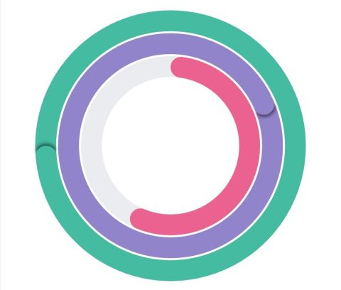

# Radial bar Chart in Flutter Circular Charts (SfCircularChart)

To create a Flutter radial bar chart quickly, you can check this video.

<iframe id='flutterRadialbarChartTutorial' src='https://www.youtube.com/embed/VJxPp7-2nGk'></iframe>

The radial bar chart is used for showing the comparisons among the categories using the circular shapes. To render a radial bar chart, create an instance of [`RadialBarSeries`](https://pub.dev/documentation/syncfusion_flutter_charts/latest/charts/RadialBarSeries-class.html), and add to the [`series`](https://pub.dev/documentation/syncfusion_flutter_charts/latest/charts/SfCircularChart/series.html) collection property of [`SfCircularChart`](https://pub.dev/documentation/syncfusion_flutter_charts/latest/charts/SfCircularChart-class.html). The following properties can be used to customize the appearance of radial bar segment:

* [`opacity`](https://pub.dev/documentation/syncfusion_flutter_charts/latest/charts/CircularSeries/opacity.html) - controls the transparency of the chart series.
* [`strokeWidth`](https://pub.dev/documentation/syncfusion_flutter_charts/latest/charts/ChartPoint/strokeColor.html) - changes the stroke width of the series.
* [`strokeColor`](https://pub.dev/documentation/syncfusion_flutter_charts/latest/charts/ChartPoint/strokeWidth.html) - changes the stroke color of the series.
* [`pointColorMapper`](https://pub.dev/documentation/syncfusion_flutter_charts/latest/charts/CircularSeries/pointColorMapper.html) - maps the color for individual points from the data source.
* [`gap`](https://pub.dev/documentation/syncfusion_flutter_charts/latest/charts/CircularSeries/gap.html) - changes the spacing between two individual segments. The default value of spacing is 1%.
* [`maximumValue`](https://pub.dev/documentation/syncfusion_flutter_charts/latest/charts/RadialBarSeries/maximumValue.html) - represents the entire span of an individual circle. The default value of the this property is null.
* [`trackColor`](https://pub.dev/documentation/syncfusion_flutter_charts/latest/charts/RadialBarSeries/trackColor.html) - changes the color of the track area.
* [`trackBorderColor`](https://pub.dev/documentation/syncfusion_flutter_charts/latest/charts/RadialBarSeries/trackBorderColor.html) - changes the color of the track border.
* [`trackBorderWidth`](https://pub.dev/documentation/syncfusion_flutter_charts/latest/charts/RadialBarSeries/trackBorderWidth.html) - changes the width of the track border.
* [`trackOpacity`](https://pub.dev/documentation/syncfusion_flutter_charts/latest/charts/RadialBarSeries/trackOpacity.html) - controls the transparency of the track area.
* [`useSeriesColor`](https://pub.dev/documentation/syncfusion_flutter_charts/latest/charts/RadialBarSeries/useSeriesColor.html) - uses the point color for filling the track area.
* [`pointShaderMapper`](https://pub.dev/documentation/syncfusion_flutter_charts/latest/charts/CircularSeries/pointShaderMapper.html) - maps the shader (gradient or image shader) for individual points from the data source.

 

    @override
    Widget build(BuildContext context) {
        return Scaffold(
            body: Center(
                child: Container(
                    child: SfCircularChart(
                        series: <CircularSeries>[
                            // Renders radial bar chart
                            RadialBarSeries<ChartData, String>(
                                dataSource: chartData,
                                xValueMapper: (ChartData data, _) => data.x,
                                yValueMapper: (ChartData data, _) => data.y
                            )
                        ]
                    )
                )
            )
        );  
    }



## Changing the radial bar size

You can use the [`radius`](https://pub.dev/documentation/syncfusion_flutter_charts/latest/charts/CircularSeries/radius.html) property to change the diameter of the radial bar chart with respect to the plot area. The default value is 80%.

 

    @override
    Widget build(BuildContext context) {
        return Scaffold(
            body: Center(
                child: Container(
                    child: SfCircularChart(
                        series: <CircularSeries>[
                            RadialBarSeries<ChartData, String>(
                                dataSource: chartData,
                                xValueMapper: (ChartData data, _) => data.x,
                                yValueMapper: (ChartData data, _) => data.y,
                                // Radius of the radial bar
                                radius: '50%'
                            )
                        ]
                    )
                )
            )
        );
    }



## Changing the radial bar inner radius

You can change the inner radius of radial bar chart using the [`innerRadius`](https://pub.dev/documentation/syncfusion_flutter_charts/latest/charts/CircularSeries/innerRadius.html) property with respect to the plot area. The value ranges from 0% to 100%.

 

    @override
    Widget build(BuildContext context) {
        return Scaffold(
            body: Center(
                child: Container(
                    child: SfCircularChart(
                        series: <CircularSeries>[
                            RadialBarSeries<ChartData, String>(
                                dataSource: chartData,
                                xValueMapper: (ChartData data, _) => data.x,
                                yValueMapper: (ChartData data, _) => data.y,
                                // Radius of the radial bar's inner circle
                                innerRadius: '80%'
                            )
                        ]
                    )
                )
            )
        );
    }



## Rounded corners

The [`cornerStyle`](https://pub.dev/documentation/syncfusion_flutter_charts/latest/charts/CircularSeries/cornerStyle.html) property specifies the corner type for radial bar chart. The corners can be customized using the [`bothFlat`](https://pub.dev/documentation/syncfusion_flutter_charts/latest/charts/CornerStyle-class.html), [`bothCurve`](https://pub.dev/documentation/syncfusion_flutter_charts/latest/charts/CornerStyle-class.html), [`startCurve`](https://pub.dev/documentation/syncfusion_flutter_charts/latest/charts/CornerStyle-class.html), and [`endCurve`](https://pub.dev/documentation/syncfusion_flutter_charts/latest/charts/CornerStyle-class.html) options. The default value of this property is [`bothFlat`](https://pub.dev/documentation/syncfusion_flutter_charts/latest/charts/CornerStyle-class.html).

 

    @override
    Widget build(BuildContext context) {
        return Scaffold(
            body: Center(
                child: Container(
                    child: SfCircularChart(
                        series: <CircularSeries>[
                            RadialBarSeries<ChartData, String>(
                                dataSource: chartData,
                                xValueMapper: (ChartData data, _) => data.x,
                                yValueMapper: (ChartData data, _) => data.y,
                                // Corner style of radial bar segment
                                cornerStyle: CornerStyle.bothCurve
                            )
                        ]
                    )
                )
            )
        );
    }



## Rendering data labels

Data labels can be enabled using the [`isVisible`](https://pub.dev/documentation/syncfusion_flutter_charts/latest/charts/DataLabelSettings/isVisible.html) property of [`dataLabelSettings`](https://pub.dev/documentation/syncfusion_flutter_charts/latest/charts/CircularSeries/dataLabelSettings.html). The appearance of label can be customized using the following properties:

* [`color`](https://pub.dev/documentation/syncfusion_flutter_charts/latest/charts/DataLabelSettings/color.html) - changes the label background color.
* [`textStyle`](https://pub.dev/documentation/syncfusion_flutter_charts/latest/charts/DataLabelRenderArgs/textStyle.html) - changes the text color, size, font family, fontStyle, and font weight.
* [`textStyle.color`](https://pub.dev/documentation/syncfusion_flutter_charts/latest/charts/ChartTextStyle/color.html) - changes the color of the text.
* [`textStyle.fontFamily`](https://pub.dev/documentation/syncfusion_flutter_charts/latest/charts/ChartTextStyle/fontFamily.html) - changes the font family for chart title. 
* [`textStyle.fontStyle`](https://pub.dev/documentation/syncfusion_flutter_charts/latest/charts/ChartTextStyle/fontStyle.html) - changes the font style for the chart title.
* [`textStyle.fontSize`](https://pub.dev/documentation/syncfusion_flutter_charts/latest/charts/ChartTextStyle/fontSize.html) - changes the font size for the chart title.
* [`opacity`](https://pub.dev/documentation/syncfusion_flutter_charts/latest/charts/CircularSeries/opacity.html) - controls the transparency of the label background color.
* [`borderRadius`](https://pub.dev/documentation/syncfusion_flutter_charts/latest/charts/DataLabelSettings/borderRadius.html) - customizes the data label border radius.
* [`angle`](https://pub.dev/documentation/syncfusion_flutter_charts/latest/charts/DataLabelSettings/angle.html) - rotates the labels.
* [`borderWidth`](https://pub.dev/documentation/syncfusion_flutter_charts/latest/charts/DataLabelSettings/borderWidth.html) - changes the stroke width of the data label shape.
* [`borderColor`](https://pub.dev/documentation/syncfusion_flutter_charts/latest/charts/DataLabelSettings/borderColor.html) - changes the stroke color of the data label shape.
* [`useSeriesColor`](https://pub.dev/documentation/syncfusion_flutter_charts/latest/charts/DataLabelSettings/useSeriesColor.html) - uses the series color for filling the data label shape.

 

    @override
    Widget build(BuildContext context) {
        return Scaffold(
            body: Center(
                child: Container(
                    child: SfCircularChart(
                        series: <CircularSeries>[
                            RadialBarSeries<ChartData, String>(
                                dataSource: chartData,
                                xValueMapper: (ChartData data, _) => data.x,
                                yValueMapper: (ChartData data, _) => data.y,
                                dataLabelSettings: DataLabelSettings(
                                    // Renders the data label
                                    isVisible: true
                                )
                            )
                        ]
                    )
                )
            )
        );  
    }



## Overfilled radial bar

The overfilled radial bar is a graphical representation of the exit value of the radial bar.
For example, if you set the maximum value of the radial bar to 100% but the given data is more than the maximum value it shows the extra value as an overfilled.



    @override
    Widget build(BuildContext context) {
        return Scaffold(
            body: Center(
                child: Container(
                    child: SfCircularChart(
                        series: <CircularSeries>[
                            RadialBarSeries<_ChartData, String>(
                                maximumValue: 6000,
                                radius: '100%',
                                gap: '3%',
                                dataSource: chartData,
                                cornerStyle: CornerStyle.bothCurve,
                                xValueMapper: (_ChartData data, _) => data.x,
                                yValueMapper: (_ChartData data, _) => data.y,
                                pointColorMapper: (_ChartData data, _) => data.color)
                        ]
                    )
                )
            )
        );
    }



