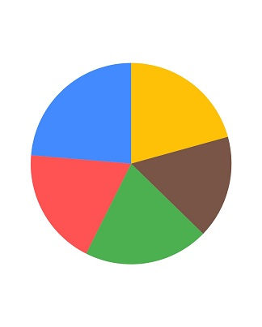
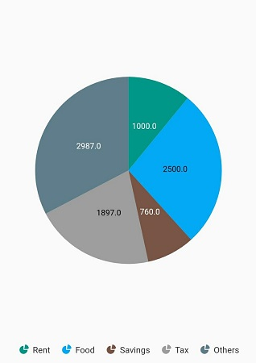
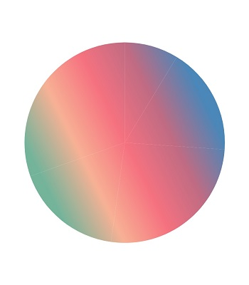
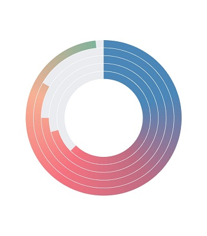
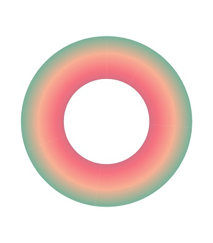
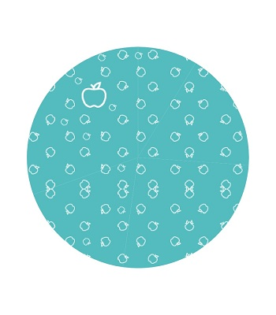
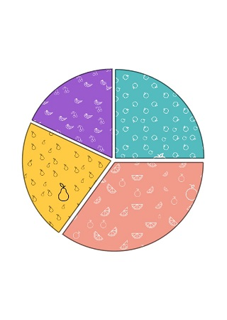
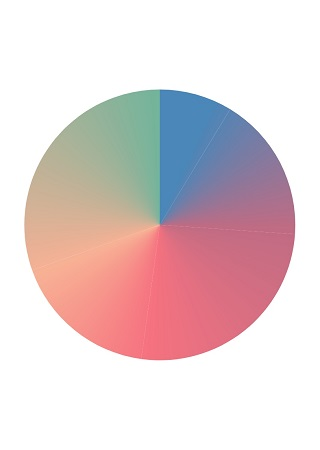
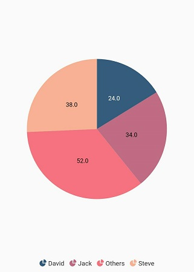

# Series customization in Flutter Circular Charts (SfCircularChart)

## Animation

[`SfCircularChart`](https://pub.dev/documentation/syncfusion_flutter_charts/latest/charts/SfCircularChart-class.html) provides animation support for the series. Series will be animated while rendering. Animation is enabled by default, you can also control the duration of the animation using [`animationDuration`](https://pub.dev/documentation/syncfusion_flutter_charts/latest/charts/CircularSeries/animationDuration.html) property. You can disable the animation by setting 0 value to that property.

 

    @override
    Widget build(BuildContext context) {
        return Scaffold(
            body: Center(
                child: Container(
                    child: SfCircularChart(
                        series: <CircularSeries<ChartData,String>>[
                            // Render pie chart
                            PieSeries<ChartData, String>(
                                dataSource: chartData,
                                pointColorMapper:(ChartData data,  _) => data.color,
                                xValueMapper: (ChartData data, _) => data.x,
                                yValueMapper: (ChartData data, _) => data.y,
                                animationDuration: 1000
                            )
                        ]
                    )
                )
            )
        );
    }



### Animation delay

The [`animationDelay`](https://pub.dev/documentation/syncfusion_flutter_charts/latest/charts/CircularSeries/animationDelay.html) property is used to specify the delay duration of the series animation. This takes milliseconds value as input. By default, the series will get animated for the specified duration. If [`animationDelay`](https://pub.dev/documentation/syncfusion_flutter_charts/latest/charts/CircularSeries/animationDelay.html) is specified, then the series will begin to animate after the specified duration. Defaults to `0`.


    
    @override
    Widget build(BuildContext context) {
        List<ChartData> data = [
            ChartData('Jan', 35),
            ChartData('Feb', 28),
            ChartData('Mar', 38),
            ChartData('Apr', 32),
            ChartData('May', 40)
        ];

        return Center(
            child: SfCircularChart(
                series: <CircularSeries<ChartData, String>>[
                    PieSeries<ChartData, String>(
                        dataSource: data,
                        animationDuration: 4500,
                        animationDelay: 2000,
                        xValueMapper: (ChartData data, _) => data.x,
                        yValueMapper: (ChartData data, _) => data.y,
                    )
                ]
            ),
        );
    }

    class ChartData {
      ChartData(this.x, this.y);
      final String x;
      final double y;
    }



### Dynamic animation

[`SfCircularChart`](https://pub.dev/documentation/syncfusion_flutter_charts/latest/charts/SfCircularChart-class.html) also provide the dynamic animation support for the series. The series can be dynamically added to the charts, it will animated by setting the timer value. when you set the [`animationDuration`](https://pub.dev/documentation/syncfusion_flutter_charts/latest/charts/CircularSeries/animationDuration.html) value to 0, the series won't be animated. 

## Color Palette

[`SfCircularChart`](https://pub.dev/documentation/syncfusion_flutter_charts/latest/charts/SfCircularChart-class.html) provides support for color palette property called [`palette`](https://pub.dev/documentation/syncfusion_flutter_charts/latest/charts/SfCircularChart/palette.html) for the data points in the chart series. If the series color is not specified, then the series will be rendered with appropriate palette color. Ten colors are available by default.

 

    @override
    Widget build(BuildContext context) {
        return Scaffold(
            body: Center(
                child: Container(
                    child: SfCircularChart(
                        palette: <Color>[Colors.amber, Colors.brown, Colors.green, Colors.redAccent, Colors.blueAccent, Colors.teal],
                        series: <CircularSeries<ChartData,String>>[
                            // Render pie chart
                            PieSeries<ChartData, String>(
                                dataSource: chartData,
                                pointColorMapper:(ChartData data,  _) => data.color,
                                xValueMapper: (ChartData data, _) => data.x,
                                yValueMapper: (ChartData data, _) => data.y,
                            )
                        ]
                    )
                )
            )
        );
    }



## Color mapping for data points   

The [`pointColorMapper`](https://pub.dev/documentation/syncfusion_flutter_charts/latest/charts/CircularSeries/pointColorMapper.html) property is used to map the color field from the data source. 

 

    @override
    Widget build(BuildContext context) {
        static List<ChartData> chartData = <ChartData>[
            ChartData('Rent', 1000,Colors.teal),
            ChartData('Food', 2500,Colors.lightBlue),
            ChartData('Savings', 760,Colors.brown),
            ChartData('Tax', 1897,Colors.grey),
            ChartData('Others', 2987,Colors.blueGrey)
        ];
        return Scaffold(
            body: Center(
                child: Container(
                    child: SfCircularChart(
                        primaryXAxis: CategoryAxis(),
                        series: <PieSeries<ChartData, String>>[
                            PieSeries<ChartData, String>(
                                dataSource: chartData,
              xValueMapper: (ChartData data, _) => data.x,
              yValueMapper: (ChartData data, _) => data.y,
              //map Color for each dataPoint datasource.
              pointColorMapper: (ChartData data,_) => data.color,
                            )
                        ]
                    )
                )
            )
        );
    }



## Gradient and image shader

The [`onCreateShader`](https://pub.dev/documentation/syncfusion_flutter_charts/latest/charts/SfCircularChart/onCreateShader.html) callback is used to fill the circular chart series data points with gradient and image shader. This callback is called once while rendering
the data points and legend.

>**Note**: All the data points of the circular chart are considered together as a single segment and the shader is applied commonly.

### Gradient fill

The data points of pie, doughnut and radial bar charts can be filled with three types of [`gradient`](https://api.flutter.dev/flutter/dart-ui/Gradient-class.html) such as [`Gradient.linear`](https://api.flutter.dev/flutter/dart-ui/Gradient/Gradient.linear.html), [`Gradient.sweep`](https://api.flutter.dev/flutter/dart-ui/Gradient/Gradient.sweep.html) and [`Gradient.radial`](https://api.flutter.dev/flutter/dart-ui/Gradient/Gradient.radial.html). All the data points in the circular chart are together considered as a single segment and the shader is applied commonly.

#### Linear gradient



    List<Color> colors = <Color>[
      const Color.fromRGBO(75, 135, 185, 1),
      const Color.fromRGBO(192, 108, 132, 1),
      const Color.fromRGBO(246, 114, 128, 1),
      const Color.fromRGBO(248, 177, 149, 1),
      const Color.fromRGBO(116, 180, 155, 1)
    ];

    List<double> stops = <double>[
      0.2,
      0.4,
      0.6,
      0.8,
      1,
    ];

    @override
    Widget build(BuildContext context) {
        return Container(
            child: SfCircularChart(
                onCreateShader: (ChartShaderDetails chartShaderDetails) {
                    return Gradient.linear(chartShaderDetails.outerRect.topRight,
                        chartShaderDetails.outerRect.centerLeft, colors, stops);
                },
                series: <CircularSeries<_ChartData, String>>[
                    PieSeries<_ChartData, String>(
                        dataSource: chartData,
                        xValueMapper: (_ChartData data, _) => data.x,
                        xValueMapper: (_ChartData data, _) => data.x,
                    )
                ]
            ));
    }   



#### Sweep gradient


    
    @override
    Widget build(BuildContext context) {
        return Container(
            child: SfCircularChart(
                onCreateShader: (ChartShaderDetails chartShaderDetails) {
                    return Gradient.sweep(
                        chartShaderDetails.outerRect.center,
                        colors,
                        stops,
                        TileMode.clamp,
                        _degreeToRadian(0),
                        _degreeToRadian(360),
                        _resolveTransform(chartShaderDetails.outerRect, TextDirection.ltr)
                    );
                },
                series: <CircularSeries<_ChartData, String>>[
                    RadialBarSeries<_ChartData, String>(
                        dataSource: chartData,
                        xValueMapper: (_ChartData data, _) => data.x,
                        xValueMapper: (_ChartData data, _) => data.x,
                    )
                ]
            )
        );
    }

    // Rotate the sweep gradient according to the start angle 
    Float64List _resolveTransform(Rect bounds, TextDirection textDirection) {
        final GradientTransform transform = GradientRotation(_degreeToRadian(-90));
        return transform.transform(bounds, textDirection: textDirection)!.storage;
    }

    // Convert degree to radian
    double _degreeToRadian(int deg) => deg * (3.141592653589793 / 180);



#### Radial gradient



    @override
    Widget build(BuildContext context) {
        return Container(
            child: SfCircularChart(
                onCreateShader: (ChartShaderDetails chartShaderDetails) {
                    return Gradient.radial(
                        chartShaderDetails.outerRect.center,
                        chartShaderDetails.outerRect.right - chartShaderDetails.outerRect.center.dx,
                        colors,
                        stops
                    );
                },
                series: <CircularSeries<_ChartData, String>>[
                    DoughnutSeries<_ChartData, String>(
                        dataSource: chartData,
                        xValueMapper: (_ChartData data, _) => data.x,
                        xValueMapper: (_ChartData data, _) => data.x,
                    )
                ]
            ));
    }  



### Image fill

The data points of pie, doughnut and radial bar charts can also be filled with image by returning [`ImageShader`](https://api.flutter.dev/flutter/dart-ui/ImageShader-class.html) with required parameters.



    /// Package import
    import 'dart:async';
    import 'dart:ui' as ui;

    ui.Image? image;

    Future<void> getImage() async {
        const ImageProvider imageProvider = AssetImage('assets/apple.png');
        final Completer<ImageInfo> completer = Completer<ImageInfo>();
        imageProvider.resolve(const ImageConfiguration()).addListener(ImageStreamListener((ImageInfo info, bool _) {
            completer.complete(info);
        }));
        final ImageInfo imageInfo = await completer.future;
        image = imageInfo.image;
        isLoadedImage = true;
    }

    @override
    Widget build(BuildContext context) {
        getImage();
        return Container(
            child: SfCircularChart(
                onCreateShader: (ChartShaderDetails chartShaderDetails) {
                    return ImageShader(
                                ui.image!,
                                TileMode.mirror,
                                TileMode.mirror,
                                Matrix4.identity().scaled(0.4).storage
                    );
                },
                series: <CircularSeries<_ChartData, String>>[
                    PieSeries<_ChartData, String>(
                        dataSource: chartData,
                        xValueMapper: (_ChartData data, _) => data.x,
                        xValueMapper: (_ChartData data, _) => data.x,
                    )
                ]
            ));
    }  



#### See Also 

* [How to fill the Flutter Pie Chart with gradient (SfCircularChart)](https://www.syncfusion.com/kb/12558/how-to-fill-the-flutter-pie-chart-with-gradient-sfcircularchart).

* [How to fill the Flutter Pie Chart with desired images (SfCircularChart)](https://www.syncfusion.com/kb/12533/how-to-fill-the-flutter-pie-chart-with-desired-images-sfcircularchart).

## Shader mapping for data points

The [`pointShaderMapper`](https://pub.dev/documentation/syncfusion_flutter_charts/latest/charts/CircularSeries/pointShaderMapper.html) property is used to map the shader field from the chart data source. You can map different [`gradient`](https://api.flutter.dev/flutter/dart-ui/Gradient-class.html) types and [`ImageShader`](https://api.flutter.dev/flutter/dart-ui/ImageShader-class.html) for individual data points using this mapper callback.



    /// Package import
    import 'dart:async';
    import 'dart:ui' as ui;

    ui.Image? image1;
    ui.Image? image2;
    ui.Image? image3;
    ui.Image? image4;

    // To get the images from asset folder
    void getImage() async {
        final Completer<ImageInfo> completer = Completer();
        final ImageProvider imageProvider = AssetImage('images/apple.png');
        imageProvider.resolve(const ImageConfiguration()).addListener(ImageStreamListener((ImageInfo info, bool _) async {
        completer.complete(info);
            final ImageInfo imageInfo = await completer.future;

            image1 = imageInfo.image;
        }));

        final Completer<ImageInfo> completer1 = Completer();
        final ImageProvider imageProvider1 = AssetImage('images/orange.png');
        imageProvider1.resolve(const ImageConfiguration()).addListener(ImageStreamListener((ImageInfo info, bool _) async {
            completer1.complete(info);
            final ImageInfo imageInfo1 = await completer1.future;
            image2 = imageInfo1.image;
        }));

        final Completer<ImageInfo> completer2 = Completer();
        final ImageProvider imageProvider2 = AssetImage('images/pears.png');
        imageProvider2.resolve(const ImageConfiguration()).addListener(ImageStreamListener((ImageInfo info, bool _) async {
            completer2.complete(info);
            final ImageInfo imageInfo2 = await completer2.future;

            image3 = imageInfo2.image;
        }));

        final Completer<ImageInfo> completer3 = Completer();
        final ImageProvider imageProvider3 = AssetImage('images/other_fruits.png');
        imageProvider3.resolve(const ImageConfiguration()).addListener(ImageStreamListener((ImageInfo info, bool _) async {
            completer3.complete(info);
            final ImageInfo imageInfo4 = await completer3.future;
            image4 = imageInfo4.image;
            if (mounted) {
                setState(() {});
            }
        }));
    }

    Widget? renderWidget;

    @override
    Widget build(BuildContext context) {
        getImage();
        if (image1 != null && image2 != null && image3 != null && image4 != null) {
            renderWidget = SfCircularChart(
                title: ChartTitle(text: 'Sales comparison of fruits in a shop'),
                series: <PieSeries<_ChartShaderData, String>>[
                    PieSeries<_ChartShaderData, String>(
                        dataSource: <_ChartShaderData>[
                            _ChartShaderData(
                                'Apple',
                                25,
                                '25%',
                                ui.ImageShader(
                                    image1!,
                                    TileMode.repeated,
                                    TileMode.repeated,
                                    Matrix4.identity().scaled(0.5).storage,
                                ),
                            ),
                            _ChartShaderData(
                                'Orange',
                                35,
                                '35%',
                                ui.ImageShader(
                                    image2!,
                                    TileMode.repeated,
                                    TileMode.repeated,
                                    Matrix4.identity().scaled(0.6).storage,
                                ),
                            ),
                            _ChartShaderData(
                                'Pears',
                                22,
                                '22%',
                                ui.ImageShader(
                                    image3!,
                                    TileMode.repeated,
                                    TileMode.repeated,
                                    Matrix4.identity().scaled(0.6).storage,
                                ),
                            ),
                            _ChartShaderData(
                                'Others',
                                18,
                                '18%',
                                ui.ImageShader(
                                    image4!,
                                    TileMode.repeated,
                                    TileMode.repeated,
                                    Matrix4.identity().scaled(0.5).storage,
                                ),
                            ),
                        ],
                        strokeColor: Colors.black.withOpacity(0.5),
                        strokeWidth: 1.5,
                        explodeAll: true,
                        explodeOffset: '3%',
                        explode: true,
                        xValueMapper: (_ChartShaderData data, _) => data.x,
                        yValueMapper: (_ChartShaderData data, _) => data.y,
                        dataLabelMapper: (_ChartShaderData data, _) => data.text,
                        // mapped the shader data from the chart's data source
                        pointShaderMapper: (_ChartShaderData data, _, Color color, Rect rect) => data.shader,
                        radius: '83%',
                    ),
                ],
            );
        } else {
            getImage();
            renderWidget = Center(child: CircularProgressIndicator());
        }
        return Scaffold(
            body: renderWidget!
        );
    }

    class _ChartShaderData {
        _ChartShaderData(this.x, this.y, this.text, this.shader);
        final String x;
        final num y;
        final String text;
        final Shader shader;
    }



## Point render mode

The [`pointRenderMode`](https://pub.dev/documentation/syncfusion_flutter_charts/latest/charts/CircularSeries/pointRenderMode.html) property is used to define the painting mode for the data points. The data points in the pie and doughnut chart can be filled either with solid colors or with sweep gradient by using this property. This property is not applicable for [`RadialBarSeries`](https://pub.dev/documentation/syncfusion_flutter_charts/latest/charts/RadialBarSeries-class.html).

* If [`PointRenderMode.segment`](https://pub.dev/documentation/syncfusion_flutter_charts/latest/charts/PointRenderMode.html) is specified, the data points are filled with solid colors from the palette or with the colors mentioned in [`pointColorMapper`](https://pub.dev/documentation/syncfusion_flutter_charts/latest/charts/CircularSeries/pointColorMapper.html) property.

*  If [`PointRenderMode.gradient`](https://pub.dev/documentation/syncfusion_flutter_charts/latest/charts/PointRenderMode.html) is specified, a sweep gradient is formed with the solid colors and fills the data points.

>**Note**: This property is applicable only if the [`onCreateShader`](https://pub.dev/documentation/syncfusion_flutter_charts/latest/charts/SfCircularChart/onCreateShader.html) and [`pointShaderMapper`](https://pub.dev/documentation/syncfusion_flutter_charts/latest/charts/CircularSeries/pointShaderMapper.html) are null.



    @override
    Widget build(BuildContext context) {
        getImage();
        return Container(
            child: SfCircularChart(
                series: <CircularSeries<_ChartData, String>>[
                    PieSeries<_ChartData, String>(
                        dataSource: chartData,
                        // Sweep gradient will be formed with default palette colors.
                        pointRenderMode: PointRenderMode.gradient,
                        xValueMapper: (_ChartData data, _) => data.x,
                        xValueMapper: (_ChartData data, _) => data.x,
                    )
                ]
            )
        );
    }



## Empty points

The data points that has null value are considered as empty points. Empty data points are ignored and not plotted in the chart. By using [`emptyPointSettings`](https://pub.dev/documentation/syncfusion_flutter_charts/latest/charts/CircularSeries/emptyPointSettings.html) property in series, you can decide the action taken for empty points. Available [`modes`](https://pub.dev/documentation/syncfusion_flutter_charts/latest/charts/EmptyPointMode.html) are [`EmptyPointMode.gap`](https://pub.dev/documentation/syncfusion_flutter_charts/latest/charts/EmptyPointMode.html), [`EmptyPointMode.zero`](https://pub.dev/documentation/syncfusion_flutter_charts/latest/charts/EmptyPointMode.html), [`EmptyPointMode.drop`](https://pub.dev/documentation/syncfusion_flutter_charts/latest/charts/EmptyPointMode.html) and [`EmptyPointMode.average`](https://pub.dev/documentation/syncfusion_flutter_charts/latest/charts/EmptyPointMode.html). Default mode of the empty point is [`EmptyPointMode.gap`](https://pub.dev/documentation/syncfusion_flutter_charts/latest/charts/EmptyPointMode.html).

 

    @override
    Widget build(BuildContext context) {
        
         final List<ChartData> chartData = [
            ChartData('David', null),
            ChartData('Steve', 38),
            ChartData('Jack', 34),
            ChartData('Others', 52)
        ];
        return Scaffold(
            body: Center(
                child: SfCircularChart(
                    series: <CircularSeries<ChartData,String>>[
                        // Render pie chart
                        PieSeries<ChartData, String>(
                            dataSource: chartData,
                            dataLabelSettings: DataLabelSettings(isVisible:true),
                            emptyPointSettings:
                      EmptyPointSettings(mode: EmptyPointMode.average),
                            pointColorMapper:(ChartData data,  _) => data.color,
                            xValueMapper: (ChartData data, _) => data.x,
                            yValueMapper: (ChartData data, _) => data.y,)
                    ]
                )
            )
        );
    }



### Empty point customization

Specific color for empty point can be set by [`color`](https://pub.dev/documentation/syncfusion_flutter_charts/latest/charts/EmptyPointSettings/color.html) property in [`emptyPointSettings`](https://pub.dev/documentation/syncfusion_flutter_charts/latest/charts/CircularSeries/emptyPointSettings.html). The [`borderWidth`](https://pub.dev/documentation/syncfusion_flutter_charts/latest/charts/EmptyPointSettings/borderWidth.html) property is used to change the stroke width of the empty point and [`borderColor`](https://pub.dev/documentation/syncfusion_flutter_charts/latest/charts/EmptyPointSettings/borderColor.html) is used to change the stroke color of the empty point.

 

    @override
    Widget build(BuildContext context) {
        final List<ChartData> chartData = [
        ChartData('David', null),
        ChartData('Steve', 38),
        ChartData('Jack', 34),
        ChartData('Others', 52)
        ];
        return Scaffold(
            body: Center(
                child: Container(
                    child: SfCircularChart(
                        series: <CircularSeries<ChartData, String>>[
                            PieSeries<ChartData, String>(
                            dataSource: chartData,
                            dataLabelSettings: DataLabelSettings(isVisible: true),
                            emptyPointSettings: EmptyPointSettings(
                                mode: EmptyPointMode.average,
                                color: Colors.red,
                                borderColor: Colors.black,
                                borderWidth: 2),
                            xValueMapper: (ChartData data, _) => data.x,
                            yValueMapper: (ChartData data, _) => data.y)
                        ]
                    )
                )
            )
        );
    }



## Sorting

The chart’s data source can be sorted using the [`sortingOrder`](https://pub.dev/documentation/syncfusion_flutter_charts/latest/charts/CircularSeries/sortingOrder.html) and [`sortFieldValueMapper`](https://pub.dev/documentation/syncfusion_flutter_charts/latest/charts/CircularSeries/sortFieldValueMapper.html) properties of series. The [`sortingOrder`](https://pub.dev/documentation/syncfusion_flutter_charts/latest/charts/CircularSeries/sortingOrder.html) property specifies the data points in the series can be sorted in [`SortingOrder.ascending`](https://pub.dev/documentation/syncfusion_flutter_charts/latest/charts/SortingOrder.html) or [`SortingOrder.descending`](https://pub.dev/documentation/syncfusion_flutter_charts/latest/charts/SortingOrder.html) order. The data points will be rendered in the specified order if [`sortingOrder`](https://pub.dev/documentation/syncfusion_flutter_charts/latest/charts/CircularSeries/sortingOrder.html) is set to [`SortingOrder.none`](https://pub.dev/documentation/syncfusion_flutter_charts/latest/charts/SortingOrder.html). The [`sortFieldValueMapper`](https://pub.dev/documentation/syncfusion_flutter_charts/latest/charts/CircularSeries/sortFieldValueMapper.html) specifies the field in the data source, which is considered for sorting the data points.

 

    @override
    Widget build(BuildContext context) {
        
        final List<ChartData> chartData = [
            ChartData('David', 25),
            ChartData('Steve', 38),
            ChartData('Jack', 34),
            ChartData('Others', 52)
        ];

        return Scaffold(
            body: Center(
                child: Container(
                    child: SfCircularChart(
                      series: <CircularSeries<ChartData,String>>[
                        // Render pie chart
                        PieSeries<ChartData, String>(
                            dataSource: chartData,
                            dataLabelSettings: DataLabelSettings(isVisible:true),
                            sortingOrder: SortingOrder.ascending,
                            sortFieldValueMapper: (ChartData data, _) => data.x,
                            pointColorMapper:(ChartData data,  _) => data.color,
                            xValueMapper: (ChartData data, _) => data.x,
                            yValueMapper: (ChartData data, _) => data.y,
                            animationDuration: 1000
                        )]))));
    }



#### See Also

* [Creating a circular drilldown chart using SfCircular charts](https://www.syncfusion.com/kb/11640/how-to-drilldown-with-syncfusion-flutter-chart-widget-sfcircularchart).
