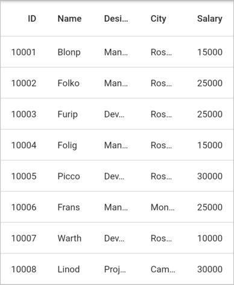

# Autofit Columns in Flutter DataGrid

[SfDataGrid](https://pub.dev/documentation/syncfusion_flutter_datagrid/latest/datagrid/SfDataGrid-class.html) allows to set the column widths based on certain logic using [SfDataGrid.columnWidthMode](https://pub.dev/documentation/syncfusion_flutter_datagrid/latest/datagrid/SfDataGrid/columnWidthMode.html) or [GridColumn.columnWidthMode](https://pub.dev/documentation/syncfusion_flutter_datagrid/latest/datagrid/GridColumn/columnWidthMode.html) property. Below are the list of predefined column sizing options available.

| Mode                      | Description                                         |
|---------------------------|-----------------------------------------------------|
| ColumnWidthMode.lastColumnFill | Applies default Column width to all the columns except last column which is visible and the remaining width from total width of SfDataGrid is set to last column. |
| ColumnWidthMode.fill      | Divides the total width equally for columns.         |
| ColumnWidthMode.none      | No sizing. Default column width or defined width set to column. |

> **NOTE**  
    [ColumnWidthMode](https://pub.dev/documentation/syncfusion_flutter_datagrid/latest/datagrid/ColumnWidthMode-class.html) will not work when the column width defined explicitly. `columnWidthMode` calculates column width based on miniumWidth and maximumWidth properties.

The following example shows how to set the width equally for column based on the view port size.


 

@override
Widget build(BuildContext context) {
  return Scaffold(
    body: SfDataGrid(
      source: _employeeDataSource,
      columnWidthMode: ColumnWidthMode.fill,
      columns: <GridColumn>[
        GridTextColumn(
          columnName: 'id',
          label: Container(
            padding: EdgeInsets.symmetric(horizontal: 16.0),
            alignment: Alignment.centerRight,
            child: Text(
              'ID',
              overflow: TextOverflow.ellipsis,
            ),
          ),
        ),
        GridTextColumn(
          columnName: 'name',
          label: Container(
            padding: EdgeInsets.symmetric(horizontal: 16.0),
            alignment: Alignment.centerLeft,
            child: Text(
              'Name',
              overflow: TextOverflow.ellipsis,
            ),
          ),
        ),
        GridTextColumn(
          columnName: 'designation',
          label: Container(
            padding: EdgeInsets.symmetric(horizontal: 16.0),
            alignment: Alignment.centerLeft,
            child: Text(
              'Designation',
              overflow: TextOverflow.ellipsis,
            ),
          ),
        ),
        GridTextColumn(
          columnName: 'city',
          label: Container(
            padding: EdgeInsets.symmetric(horizontal: 16.0),
            alignment: Alignment.centerLeft,
            child: Text(
              'city',
              overflow: TextOverflow.ellipsis,
            ),
          ),
        ),
        GridTextColumn(
          columnName: 'salary',
          label: Container(
            padding: EdgeInsets.symmetric(horizontal: 16.0),
            alignment: Alignment.centerRight,
            child: Text(
              'Salary',
              overflow: TextOverflow.ellipsis,
            ),
          ),
        ),
      ],
    ),
  );
}
  



> **NOTE**  
    The `GridColumn.columnWidthMode` takes higher priority than the `SfDataGrid.columnWidthMode`.

## Fill remaining width for any column

While setting `SfDataGrid.columnWidthMode` as `lastColumnFill` remaining width is applied to last column. The remaining width to specific column can be applied by setting `GridColumn.columnWidthMode` property.


 

@override
Widget build(BuildContext context) {
  return Scaffold(
    body: SfDataGrid(
      source: _employeeDataSource,
      columnWidthMode: ColumnWidthMode.lastColumnFill,
      columns: <GridColumn>[
        GridTextColumn(
          columnName: 'id',
          label: Container(
            padding: EdgeInsets.symmetric(horizontal: 16.0),
            alignment: Alignment.centerRight,
            child: Text(
              'ID',
              overflow: TextOverflow.ellipsis,
            ),
          ),
        ),
        GridTextColumn(
          columnName: 'name',
          label: Container(
            padding: EdgeInsets.symmetric(horizontal: 16.0),
            alignment: Alignment.centerLeft,
            child: Text(
              'Name',
              overflow: TextOverflow.ellipsis,
            ),
          ),
        ),
        GridTextColumn(
          columnName: 'salary',
          label: Container(
            padding: EdgeInsets.symmetric(horizontal: 16.0),
            alignment: Alignment.centerRight,
            child: Text(
              'Salary',
              overflow: TextOverflow.ellipsis,
            ),
          ),
        ),
        GridTextColumn(
          columnName: 'designation',
          label: Container(
            padding: EdgeInsets.symmetric(horizontal: 16.0),
            alignment: Alignment.centerLeft,
            child: Text(
              'Designation',
              overflow: TextOverflow.ellipsis,
            ),
          ),
        ),
      ],
    ),
  );
}




The below example shows Name column is set as `lastColumnFill` mode.


 
 
@override
Widget build(BuildContext context) {
  return Scaffold(
    body: SfDataGrid(
      source: _employeeDataSource,
      columns: <GridColumn>[
        GridTextColumn(
          columnName: 'id',
          label: Container(
            padding: EdgeInsets.symmetric(horizontal: 16.0),
            alignment: Alignment.centerRight,
            child: Text(
              'ID',
              overflow: TextOverflow.ellipsis,
            ),
          ),
        ),
        GridTextColumn(
          columnName: 'name',
          label: Container(
            padding: EdgeInsets.symmetric(horizontal: 16.0),
            alignment: Alignment.centerLeft,
            child: Text(
              'Name',
              overflow: TextOverflow.ellipsis,
            ),
          ),
        ),
        GridTextColumn(
          columnName: 'salary',
          columnWidthMode: ColumnWidthMode.lastColumnFill,
          label: Container(
            padding: EdgeInsets.symmetric(horizontal: 16.0),
            alignment: Alignment.centerRight,
            child: Text(
              'Salary',
              overflow: TextOverflow.ellipsis,
            ),
          ),
        ),
        GridTextColumn(
          columnName: 'designation',
          label: Container(
            padding: EdgeInsets.symmetric(horizontal: 16.0),
            alignment: Alignment.centerLeft,
            child: Text(
              'Designation',
              overflow: TextOverflow.ellipsis,
            ),
          ),
        ),
      ],
    ),
  );
}




## Recalculating column widths when datasource is changed

By default, column widths are calculated based on the `columnWidthMode` property on initial loading of datagrid. When the datasource is changed for same datagrid at run time, datagrid does not recalculate the column widths. To recalculate the column widths at run time when datasource is changed or data is updated, you can override the [shouldRecalculateColumnWidths](https://pub.dev/documentation/syncfusion_flutter_datagrid/latest/datagrid/DataGridSource/shouldRecalculateColumnWidths.html) method and return `true`. 
 
Returning true may impact performance as the column widths are recalculated again (whenever the notifyListeners is called). If you are aware that column widths are going to be same whenever underlying data changes, return `false` from this method.


 

class EmployeeDataSource extends DataGridSource {
  EmployeeDataSource() {
    dataGridRows = employees
        .map<DataGridRow>((dataGridRow) => DataGridRow(cells: [
              DataGridCell<int>(columnName: 'id', value: dataGridRow.id),
              DataGridCell<String>(columnName: 'name', value: dataGridRow.name),
              DataGridCell<int>(
                  columnName: 'salary', value: dataGridRow.salary),
              DataGridCell<String>(
                  columnName: 'designation', value: dataGridRow.designation),
            ]))
        .toList();
  }

  List<DataGridRow> dataGridRows;

  @override
  List<DataGridRow> get rows => dataGridRows;

  @override
  DataGridRowAdapter? buildRow(DataGridRow row) {
    return DataGridRowAdapter(
        cells: row.getCells().map<Widget>((dataGridCell) {
        return Container(
            alignment: (dataGridCell.columnName == 'id' ||
                  dataGridCell.columnName == 'salary')
                  ? Alignment.centerRight
                  : Alignment.centerLeft,
            padding: EdgeInsets.symmetric(horizontal: 16.0),
            child: Text(
            dataGridCell.value.toString(),
            overflow: TextOverflow.ellipsis,
            ));
    }).toList());
  }

  @override
  bool shouldRecalculateColumnWidths() {
    return true;
  }
}


