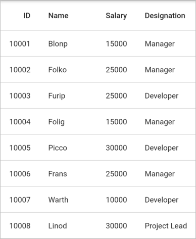

# Autofit Columns in Flutter DataGrid

SfDataGrid allows to set the column widths based on certain logic using `SfDataGrid.columnWidthMode` or `GridColumn.columnWidthMode` property. Below are the list of predefined column sizing options available.

| Mode                      | Description                                         |
|---------------------------|-----------------------------------------------------|
| ColumnWidthMode.auto      | Calculates the width of column based on header and cell contents. So, header and cell contents are not truncated.|
| ColumnWidthMode.cells     | Calculates the width of column based on cell contents. So, cell contents are not truncated. |
| ColumnWidthMode.header    | Calculates the width of column based on header content. So, header content is not truncated. |
| ColumnWidthMode.lastColumnFill | Applies `ColumnWidthMode.auto` width to all the columns except last column which is visible and the remaining width from total width of SfDataGrid is set to last column. |
| ColumnWidthMode.fill      | Divides the total width equally for columns.         |
| ColumnWidthMode.none      | No sizing. Default column width or defined width set to column. |

> **NOTE**  
    `ColumnWidthMode` will not work when the column width defined explicitly. `columnWidthMode` calculates column width based on miniumWidth and maximumWidth properties.

The following example shows how to set the width equally for column based on the view port size.


 

    @override
    Widget build(BuildContext context) {
      return Scaffold(
        body: SfDataGrid(
          source: _employeeDataSource,
          columnWidthMode: ColumnWidthMode.fill,
          columns: [
            GridNumericColumn(mappingName: 'id', headerText: 'ID'),
            GridTextColumn(mappingName: 'name', headerText: 'Name'),
            GridTextColumn(mappingName: 'designation', headerText: 'Designation'),
            GridTextColumn(mappingName: 'city', headerText: 'City'),
            GridNumericColumn(mappingName: 'salary', headerText: 'Salary'),
          ],
        ),
      );
    }




> **NOTE**  
    The `GridColumn.columnWidthMode` takes higher priority than the `SfDataGrid.columnWidthMode`.

## Fill remaining width for any column

While setting `SfDataGrid.columnWidthMode` as `lastColumnFill` remaining width is applied to last column. The remaining width to specific column can be applied by setting `GridColumn.columnWidthMode` property.


 

    @override
    Widget build(BuildContext context) {
      return Scaffold(
        body: SfDataGrid(
          source: _employeeDataSource,
          columnWidthMode: ColumnWidthMode.lastColumnFill,
          columns: [
            GridNumericColumn(mappingName: 'id', headerText: 'ID'),
            GridTextColumn(mappingName: 'name', headerText: 'Name'),
            GridNumericColumn(mappingName: 'salary', headerText: 'Salary'),
            GridTextColumn(mappingName: 'designation', headerText: 'Designation')
          ],
        ),
      );
    }




The below example shows Name column is set as `lastColumnFill` mode.


 
 
    @override
    Widget build(BuildContext context) {
      return Scaffold(
        body: SfDataGrid(
          source: _employeeDataSource,
          columnWidthMode: ColumnWidthMode.auto,
          columns: [
            GridNumericColumn(mappingName: 'id', headerText: 'ID'),
            GridTextColumn(mappingName: 'name', headerText: 'Name')
              ..columnWidthMode = ColumnWidthMode.lastColumnFill,
            GridTextColumn(mappingName: 'designation', headerText: 'Designation'),
            GridNumericColumn(mappingName: 'salary', headerText: 'Salary')
          ],
        ),
      );
    }




## Autofit based on string length

By default, the auto size of the column is calculated based on the string size. To improve the performance of the column auto sizing, the auto size calculation logic of column can be calculated based on the length of the cell value by using `SfDataGrid.columnWidthCalculationMode` property.
The default is `ColumnWidthCalculationMode.textSize` which calculates size for all the cell’s formatted text. The columns can also be auto sized based on string length of the cell using the `ColumnWidthCalculationMode.textLength` which calculates the size for the cell which has longest string.


 

    @override
    Widget build(BuildContext context) {
      return Scaffold(
        body: SfDataGrid(
          source: _employeeDataSource,
          columnWidthMode: ColumnWidthMode.auto,
          columnWidthCalculationMode: ColumnWidthCalculationMode.textLength,
          columns: [
            GridNumericColumn(mappingName: 'id', headerText: 'ID'),
            GridTextColumn(mappingName: 'name', headerText: 'Name'),
            GridTextColumn(mappingName: 'designation', headerText: 'Designation'),
            GridNumericColumn(mappingName: 'salary', headerText: 'Salary')
          ],
        ),
      );
    }




## Calculate the column width for all the rows

By default, the column auto size is calculated for the visible rows. The column auto size can be calculated for the all the available rows by using the `SfDataGrid.columnWidthCalculationRange` property.
The default is `ColumnWidthCalculationRange.visibleRows` which considers visible rows for auto sizing. The columns can also be auto sized by considering all the rows using the `ColumnWidthCalculationRange.allRows` mode.


 
 
    @override
    Widget build(BuildContext context) {
      return Scaffold(
        body: SfDataGrid(
          source: _employeeDataSource,
          columnWidthMode: ColumnWidthMode.auto,
          columnWidthCalculationRange: ColumnWidthCalculationRange.allRows,
          columns: [
            GridNumericColumn(mappingName: 'id', headerText: 'ID'),
            GridTextColumn(mappingName: 'name', headerText: 'Name'),
            GridTextColumn(mappingName: 'designation', headerText: 'Designation'),
            GridNumericColumn(mappingName: 'salary', headerText: 'Salary')
          ],
        ),
      );
    }




## Customizing built-in column sizing logic

The column auto sizing operations of the `SfDataGrid` is processed in the `ColumnSizer` class. The column sizing operations can be customized by overriding `ColumnSizer` and set it to `SfDataGrid.columnSizer` property.


 
    
    class CustomGridColumnSizer extends ColumnSizer {
      // Calculate width for column when ColumnWidthMode is auto.
      @override
      double calculateAllCellsWidth(GridColumn column, [bool isAuto = false]) {
        return super.calculateAllCellsWidth(column, isAuto);
      }
    
      // Calculate width for column when ColumnWidthMode is header.
      @override
      double calculateColumnHeaderWidth(GridColumn column, [bool setWidth = true]) {
        return super.calculateColumnHeaderWidth(column, setWidth);
      }
    
      // Calculate width for column when ColumnWidthMode is cells.
      @override
      double calculateAllCellsExceptHeaderWidth(GridColumn column,
          [bool setWidth = true]) {
        return super.calculateAllCellsExceptHeaderWidth(column, setWidth);
      }
    }

    final CustomGridColumnSizer _customGridColumnSizer = CustomGridColumnSizer();
  
    @override
    Widget build(BuildContext context) {
      return Scaffold(
        body: SfDataGrid(
          source: _employeeDataSource,
          columnSizer: _customGridColumnSizer,
          columnWidthMode: ColumnWidthMode.auto,
          columns: [
            GridNumericColumn(mappingName: 'id', headerText: 'ID'),
            GridTextColumn(mappingName: 'name', headerText: 'Name'),
            GridTextColumn(mappingName: 'designation', headerText: 'Designation'),
            GridNumericColumn(mappingName: 'salary', headerText: 'Salary')
          ],
        ),
      );
    }


