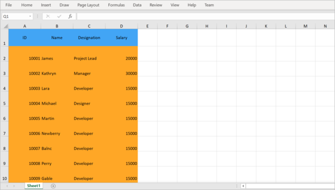
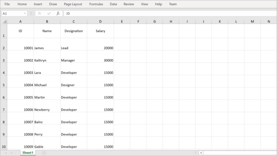

# Export to Excel in Flutter DataGrid (SfDataGrid)

The [SfDataGrid](https://pub.dev/documentation/syncfusion_flutter_datagrid/latest/datagrid/SfDataGrid-class.html) provides support to export the content to the Excel with several customization options.

**Add dependency**

The following dependencies must be added to your pubspec.yaml file for exporting to the Excel.
  
   

    dependencies:

    syncfusion_flutter_datagrid_export: ^xx.x.xx

  

  >**NOTE** Here, **xx.x.xx** denotes the current version of `Syncfusion Flutter DataGrid Export` package.

**Import package**

Import the following package in your Dart code.

 
  

    import 'package:syncfusion_flutter_datagrid_export/export.dart';

    import 'package:syncfusion_flutter_xlsio/xlsio.dart';

 
 

You can export the `SfDataGrid` to the Excel by using the following extension methods present in the `SfDataGridState` class.

* `exportToExcelWorkbook`
* `exportToExcelWorksheet`
  

**Add GlobalKey for the DataGrid**
 
Create the [GlobalKey](https://api.flutter.dev/flutter/widgets/GlobalKey-class.html) using the [SfDataGridState](https://pub.dev/documentation/syncfusion_flutter_datagrid/latest/datagrid/SfDataGridState-class.html) class. Exporting related methods are available in the `SfDataGridState` class.

Set the created `GlobalKey` to the `SfDataGrid`.




final GlobalKey<SfDataGridState> key = GlobalKey<SfDataGridState>();
    



The following code illustrates how to create and export a `SfDataGrid` to the Excel using the global key.

 
 

final GlobalKey<SfDataGridState> _key = GlobalKey<SfDataGridState>();

@override
Widget build(BuildContext context) {
  return Scaffold(
    appBar: AppBar(
      title: const Text(
        'Syncfusion Flutter DataGrid Export',
        overflow: TextOverflow.ellipsis,
      ),
    ),
    body: Column(
      crossAxisAlignment: CrossAxisAlignment.start,
      children: <Widget>[
        Container(
          height: 50.0,
          width: 150.0,
          padding: const EdgeInsets.all(10.0),
          child: MaterialButton(
              color: Colors.blue,
              child: const Center(
                  child: Text(
                'Export to Excel',
                style: TextStyle(color: Colors.white),
              )),
              onPressed: () async {
                final Workbook workbook =
                    _key.currentState!.exportToExcelWorkbook();
                final List<int> bytes = workbook.saveAsStream();
                workbook.dispose();
                await helper.saveAndLaunchFile(bytes, 'DataGrid.xlsx');
              }),
        ),
        Expanded(
          child: SfDataGrid(
            key: _key,
            source: employeeDataSource,
            columns: <GridColumn>[
              GridColumn(
                  columnName: 'ID',
                  label: Container(
                      padding: const EdgeInsets.all(16.0),
                      alignment: Alignment.center,
                      child: const Text(
                        'ID',
                      ))),
              GridColumn(
                  columnName: 'Name',
                  label: Container(
                      padding: const EdgeInsets.all(8.0),
                      alignment: Alignment.center,
                      child: const Text('Name'))),
              GridColumn(
                  columnName: 'Designation',
                  label: Container(
                      padding: const EdgeInsets.all(8.0),
                      alignment: Alignment.center,
                      child: const Text(
                        'Designation',
                        overflow: TextOverflow.ellipsis,
                      ))),
              GridColumn(
                  columnName: 'Salary',
                  label: Container(
                      padding: const EdgeInsets.all(8.0),
                      alignment: Alignment.center,
                      child: const Text('Salary'))),
            ],
          ),
        ),
      ],
    ),
  );
}




## Export DataGrid to Excel workbook

You can export the data to [Excel Workbook](https://pub.dev/documentation/syncfusion_flutter_xlsio/latest/xlsio/Workbook-class.html) by using the `exportToExcelWorkbook` method from the `key.currentState` of the DataGrid.




final Workbook workbook = key.currentState!.exportToExcelWorkbook();
final List<int> bytes = workbook.saveAsStream();
File('DataGrid.xlsx').writeAsBytes(bytes, flush: true);
  



## Export DataGrid to Excel sheet

You can export the data to [Excel Worksheet](https://pub.dev/documentation/syncfusion_flutter_xlsio/latest/xlsio/Worksheet-class.html) by using the `exportToExcelWorksheet` method from `key.currentState` of the DataGrid.




    final Workbook workbook = Workbook();
    final Worksheet worksheet = workbook.worksheets[0];
    key.currentState!.exportToExcelWorksheet(worksheet);
    final List<int> bytes = workbook.saveAsStream();
    File('DataGrid.xlsx').writeAsBytes(bytes, flush: true);
  



## Exporting options 

### Exclude columns when exporting

By default, all the columns in the `SfDataGrid` is exported to Excel. To exclude certain columns when exporting to Excel, add those column names to the `excludeColumns` parameter.




Workbook workbook = _key.currentState!
    .exportToExcelWorkbook(excludeColumns: ['Name']);
final List<int> bytes = workbook.saveAsStream();
     



### Exclude table summaries when exporting

By default, table summaries in `SfDataGrid` is exported to Excel. You can set `exportTableSummaries` parameter as `false` to export the `SfDataGrid` without table summaries.




Workbook workbook = _key.currentState!
    .exportToExcelWorkbook(exportTableSummaries: false);
final List<int> bytes = workbook.saveAsStream();




### Exclude stacked headers when exporting

By default, stacked headers in `SfDataGrid` is exported to Excel. You can set `exportStackedHeaders` parameter as `false` to export the `SfDataGrid` without stacked headers.




Workbook workbook = _key.currentState!
    .exportToExcelWorkbook(exportStackedHeaders: false);
final List<int> bytes = workbook.saveAsStream();




### Change start row and column index when exporting

By default, the DataGrid is exported from (0,0) index in Excel sheet. You can export the data from specific row and column index in Excel worksheet by setting the `startColumnIndex` and `startRowIndex` properties.




Workbook workbook = _key.currentState!
    .exportToExcelWorkbook(startRowIndex: 3, startColumnIndex: 2);
final List<int> bytes = workbook.saveAsStream();




## Export the selected rows to Excel

By default, the entire grid is exported to Excel. You can export selected rows only by passing `dataGridController.selectedRows` to `rows` parameter in `exportToExcelWorksheet` and `exportToExcelWorkbook` methods.




Workbook workbook = _key.currentState!
    .exportToExcelWorkbook(rows: dataGridController.selectedRows);
final List<int> bytes = workbook.saveAsStream();




## Row height and column width customization

By default, [SfDataGrid.rowHeight](https://pub.dev/documentation/syncfusion_flutter_datagrid/latest/datagrid/SfDataGrid/rowHeight.html) and [SfDataGrid.defaultColumnWidth](https://pub.dev/documentation/syncfusion_flutter_datagrid/latest/datagrid/SfDataGrid/defaultColumnWidth.html) properties will be set to the cells in the Excel sheet. To customize the row height and column width in Excel, you can use the `defaultRowHeight` and `defaultColumnWidth` properties. But these properties are only applicable when the `exportRowHeight` and `exportColumnWidth` properties are `false`.

If the `exportRowHeight` and `exportColumnWidth` properties are `true`, the `SfDataGrid.headerRowHeight` and `SfDataGrid.rowHeight` properties are considered for row heights in Excel and the actual width of the column is considered for columns in Excel.




Workbook workbook = _key.currentState!.exportToExcelWorkbook(
    exportRowHeight: false,
    exportColumnWidth: false,
    defaultRowHeight: 35,
    defaultColumnWidth: 120);
final List<int> bytes = workbook.saveAsStream();




## Styling cells based on the cell type in Excel

You can customize the cell styles based on cell type using `cellExport` parameter which is a callback in `exportToExcelWorkbook` and `exportToExcelWorksheet` methods.




final Workbook workbook = _key.currentState!.exportToExcelWorkbook(
    cellExport: (DataGridCellExcelExportDetails details) {
  if (details.cellType == DataGridExportCellType.columnHeader) {
    details.excelRange.cellStyle.backColor = '#42A5F5';
  } else if (details.cellType == DataGridExportCellType.row) {
    details.excelRange.cellStyle.backColor = '#FFA726';
  }
});
final List<int> bytes = workbook.saveAsStream();




## Cell customization when exporting

### Customize cell values while exporting

The cell value can be customized while exporting to Excel by directly setting the cell value of a cell to the `excelRange.value` property available in the argument of `cellExport` callback.




final Workbook workbook = _key.currentState!.exportToExcelWorkbook(
    cellExport: (DataGridCellExcelExportDetails details) {
  if (details.cellType == DataGridExportCellType.row &&
      details.cellValue == 'Project Lead') {
    details.excelRange.value = 'Lead';
  }
});
final List<int> bytes = workbook.saveAsStream();




### Customize the cells based on column

You can customize the column style based on the column name when exporting to Excel by using the `cellExport` parameter.




final Workbook workbook = _key.currentState!.exportToExcelWorkbook(
    cellExport: (DataGridCellExcelExportDetails details) {
  if (details.cellType == DataGridExportCellType.row &&
      details.columnName == 'Name') {
    details.excelRange.cellStyle
      ..bold = true
      ..fontColor = '#F44336';
  }
});
final List<int> bytes = workbook.saveAsStream();




## Customize Exporting Behavior 

You can customize the exporting behavior by overriding the available methods in `DataGridToExcelConverter` class and setting the instance of custom excel converter to the `converter` parameter in `exportToExcelWorksheet` or `exportToExcelWorkbook` method.




class CustomDataGridToExcelConverter extends DataGridToExcelConverter {
  @override
  void exportColumnHeader(SfDataGrid dataGrid, GridColumn column,
      String columnName, Worksheet worksheet) {
    // TODO: Add your requirements in exportColumnHeader
    super.exportColumnHeader(dataGrid, column, columnName, worksheet);
  }

  @override
  void exportColumnHeaders(SfDataGrid dataGrid, Worksheet worksheet) {
    // TODO: Add your requirements in exportColumnHeaders
    super.exportColumnHeaders(dataGrid, worksheet);
  }

  @override
  void exportRow(SfDataGrid dataGrid, DataGridRow row, GridColumn column,
      Worksheet worksheet) {
    // TODO: Add your requirements in exportRow
    super.exportRow(dataGrid, row, column, worksheet);
  }

  @override
  void exportRows(
      SfDataGrid dataGrid, List<DataGridRow> rows, Worksheet worksheet) {
    // TODO: Add your requirements in exportRows
    super.exportRows(dataGrid, rows, worksheet);
  }

  @override
  void exportStackedHeaderRow(SfDataGrid dataGrid,
      StackedHeaderRow stackedHeaderRow, Worksheet worksheet) {
    // TODO: Add your requirements in exportStackedHeaderRow
    super.exportStackedHeaderRow(dataGrid, stackedHeaderRow, worksheet);
  }

  @override
  void exportStackedHeaderRows(SfDataGrid dataGrid, Worksheet worksheet) {
    // TODO: Add your requirements in exportStackedHeaderRows
    super.exportStackedHeaderRows(dataGrid, worksheet);
  }

  @override
  void exportTableSummaryRow(SfDataGrid dataGrid,
      GridTableSummaryRow summaryRow, Worksheet worksheet) {
    // TODO: Add your requirements in exportTableSummaryRow
    super.exportTableSummaryRow(dataGrid, summaryRow, worksheet);
  }

  @override
  void exportTableSummaryRows(SfDataGrid dataGrid,
      GridTableSummaryRowPosition position, Worksheet worksheet) {
    // TODO: Add your requirements in exportTableSummaryRows
    super.exportTableSummaryRows(dataGrid, position, worksheet);
  }

  @override
  Object? getCellValue(DataGridRow row, GridColumn column) {
    // TODO: Add your requirements in getCellValue
    super.getCellValue(row, column);
  }
}




The following code snippet illustrates how to create an instance of `CustomDataGridToExcelConverter` class and setting the instance to `converter` parameter in `exportToExcelWorksheet` or `exportToExcelWorkbook` method.




CustomDataGridToExcelConverter converter = CustomDataGridToExcelConverter();
Workbook workbook = _key.currentState!.exportToExcelWorkbook(converter: converter);
final List<int> bytes = workbook.saveAsStream();


