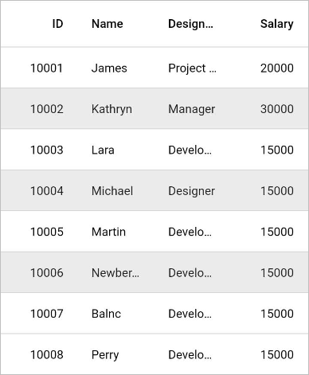

# Getting Started with Flutter DataGrid (SfDataGrid)

This section explains the steps required to add the DataGrid widget and its features. This section covers only basic features needed to get started with the Syncfusion Flutter DataGrid widget. 

## Add Flutter DataGrid to an application

Create a simple project using the instruction given in the  [Getting Started with your first Flutter app](https://flutter.dev/docs/get-started/test-drive?tab=vscode#create-app) documentation.

**Add dependency**

Add the Syncfusion Flutter DataGrid dependency to your pubspec.yaml file.

 

    dependencies:

    syncfusion_flutter_datagrid: ^xx.x.xx



N> Here **xx.x.xx** denotes the current version of [`Syncfusion Flutter DataGrid`](https://pub.dev/packages/syncfusion_flutter_datagrid/versions) package.

**Get packages**

Run the following command to get the required packages.

 

    $ flutter pub get



**Import package**

Import the following package in your Dart code.


 

    import 'package:syncfusion_flutter_datagrid/datagrid.dart';




## Initialize DataGrid

Add the SfDataGrid widget as a child of any widget. [SfDataGrid](https://pub.dev/documentation/syncfusion_flutter_datagrid/latest/datagrid/SfDataGrid-class.html) requires the [source](https://pub.dev/documentation/syncfusion_flutter_datagrid/latest/datagrid/SfDataGrid/source.html) and [columns](https://pub.dev/documentation/syncfusion_flutter_datagrid/latest/datagrid/SfDataGrid/columns.html) properties. You can find the more details on these properties in further topics.


 

@override
Widget build(BuildContext context) {
  return Scaffold(
    body: SfDataGrid(
      source: _employeeDataSource,
      columns: [
        GridTextColumn(columnName: 'id', label: Text('ID')),
        GridTextColumn(columnName: 'name', label: Text('Name')),
        GridTextColumn(columnName: 'designation', label: Text('Designation')),
        GridTextColumn(columnName: 'salary', label: Text('Salary')),
      ],
    ),
  );
}



## Creating Data for an application

The `SfDataGrid` is depending upon the data. Create a simple datasource for `SfDataGrid` as shown in the following code example.


 

class Employee {
  Employee(this.id, this.name, this.designation, this.salary);
  final int id;
  final String name;
  final String designation;
  final int salary;
}




Create the collection of Employee data with the required number of data objects. Here, the `getEmployeeData` method which is used to populate the data objects is initialized in `initState()`.


 
   
List<Employee> _employees = <Employee>[];
EmployeeDataSource _employeeDataSource;
  
@override
void initState() {
  super.initState();
  _employees = getEmployeeData();
  employeeDataSource = EmployeeDataSource(employeeData: _employees);
}
  
List<Employee> getEmployeeData() {
  return [
    Employee(10001, 'James', 'Project Lead', 20000),
    Employee(10002, 'Kathryn', 'Manager', 30000),
    Employee(10003, 'Lara', 'Developer', 15000),
    Employee(10004, 'Michael', 'Designer', 15000),
    Employee(10005, 'Martin', 'Developer', 15000),
    Employee(10006, 'Newberry', 'Developer', 15000),
    Employee(10007, 'Balnc', 'Developer', 15000),
    Employee(10008, 'Perry', 'Developer', 15000),
    Employee(10009, 'Gable', 'Developer', 15000),
    Employee(10010, 'Grimes', 'Developer', 15000)
  ];
}




## Creating DataSource for DataGrid

[DataGridSource](https://pub.dev/documentation/syncfusion_flutter_datagrid/latest/datagrid/DataGridSource-class.html) is used to obtain the row data for the `SfDataGrid`. So, create the DataSource from the DataGridSource and override the following APIs in it,

* **`rows`** - To fetch the number of rows available for data population. Also, it is used to fetch the corresponding data object to process the selection.
* **`buildRow`** - To fetch the widget for each cell using the [DataGridRowAdapter]().

`DataGridSource` objects are expected to be long-lived, not recreated with each build.


 

class EmployeeDataSource extends DataGridSource {
  List<DataGridRow> _employeeData;
  EmployeeDataSource({List<Employee> employeeData}) {
    _employeeData = employeeData
        .map<DataGridRow>((e) => DataGridRow(cells: [
              DataGridCell<int>(columnName: 'id', value: e.id),
              DataGridCell<String>(columnName: 'name', value: e.name),
              DataGridCell<String>(
                  columnName: 'designation', value: e.designation),
              DataGridCell<int>(columnName: 'salary', value: e.salary)
            ]))
        .toList();
  }

  @override
  List<DataGridRow> get rows => _employeeData;
  
  @override
  DataGridRowAdapter buildRow(DataGridRow row) {
    return DataGridRowAdapter(
        cells: row.getCells().map<Widget>((e) {
      return Container(
        alignment: Alignment.center,
        padding: EdgeInsets.all(8.0),
        child: Text(e.value.toString()),
      );
    }).toList());
  }
}




Create an instance of `DataGridSource` and set this object to `source` property of `SfDataGrid`.


 

@override
Widget build(BuildContext context) {
  return Scaffold(
      body: SfDataGrid(
      source: _employeeDataSource,
  ));
}




## Defining columns

`SfDataGrid` supports to add any widget in a column using the [GridTextColumn]() property. You can add the column collection to the `columns` property.


 

final EmployeeDataSource _employeeDataSource = EmployeeDataSource(employeeData: _employees);
  
@override
Widget build(BuildContext context) {
  return Scaffold(
    body: SfDataGrid(
      source: _employeeDataSource,
      columns: [
        GridTextColumn(columnName: 'id', label: Text('ID')),
        GridTextColumn(columnName: 'name', label: Text('Name')),
        GridTextColumn(columnName: 'designation', label: Text('Designation')),
        GridTextColumn(columnName: 'salary', label: Text('Salary')),
      ],
    ),
  );
}




## Selection

`SfDataGrid` allows you to select one or more rows. The [selectionMode](https://pub.dev/documentation/syncfusion_flutter_datagrid/latest/datagrid/SfDataGrid/selectionMode.html) property can be set to specify whether a user can select single row, or multiple rows. 


 
    
final EmployeeDataSource _employeeDataSource = EmployeeDataSource(employeeData: _employees);

@override
Widget build(BuildContext context) {
  return Scaffold(
    body: SfDataGrid(
      source: _employeeDataSource,
      columns: [
        GridTextColumn(columnName: 'id', label: Text('ID')),
        GridTextColumn(columnName: 'name', label: Text('Name')),
        GridTextColumn(columnName: 'designation', label: Text('Designation')),
        GridTextColumn(columnName: 'salary', label: Text('Salary')),
      ],
      selectionMode: SelectionMode.multiple,
    ),
  );
}




The information about the rows that are selected can be retrieved using [selectedIndex](https://pub.dev/documentation/syncfusion_flutter_datagrid/latest/datagrid/DataGridController/selectedIndex.html), [selectedRow](https://pub.dev/documentation/syncfusion_flutter_datagrid/latest/datagrid/DataGridController/selectedRow.html) and [selectedRows](https://pub.dev/documentation/syncfusion_flutter_datagrid/latest/datagrid/DataGridController/selectedRows.html) properties in [DataGridController](https://pub.dev/documentation/syncfusion_flutter_datagrid/latest/datagrid/DataGridController-class.html). You need to initialize the `DataGridController` object to the [controller](https://pub.dev/documentation/syncfusion_flutter_datagrid/latest/datagrid/SfDataGrid/controller.html) property of `SfDataGrid`.

`DataGridController` objects are expected to be long-lived, not recreated with each build.


 

final EmployeeDataSource _employeeDataSource = EmployeeDataSource(employeeData: _employees);

final DataGridController _controller = DataGridController();

@override
Widget build(BuildContext context) {
  return Scaffold(
    body: Column(
      children: [
        RaisedButton(
            child: Text('Get Selection Information'),
            onPressed: () {
              int selectedIndex = _controller.selectedIndex;
              Object selectedRow = _controller.selectedRow;
              List<Object> selectedRows = _controller.selectedRows;
              print(selectedIndex);
              print(selectedRow);
              print(selectedRows);
            }),
        Expanded(
          child: SfDataGrid(
            source: _employeeDataSource,
            columns: [
              GridTextColumn(columnName: 'id', label: Text('ID')),
              GridTextColumn(columnName: 'name', label: Text('Name')),
              GridTextColumn(columnName: 'designation', label: Text('Designation')),
              GridTextColumn(columnName: 'salary', label: Text('Salary')),
            ],
            controller: _controller,
            selectionMode: SelectionMode.multiple,
          ),
        ),
      ],
    ),
  );
}




>**NOTE**  
  `SfDataGrid` supports selection via keyboard interaction for the Web platform when `selectionMode` is not `none`.
