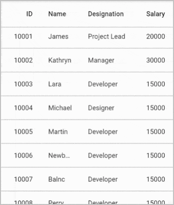

# Load more in Flutter Datagrid

The datagrid provides support to display an interactive view when the grid reaches its maximum offset while scrolling down. You can use `loadMoreViewBuilder` builder to display the view at bottom of datagrid. 

You should override the `DataGridSource.handleLoadMoreRows` method to load more rows and then notify the datagrid about the changes. The `DataGridSource.handleLoadMoreRows` can be called to load more rows from this builder by using the `loadMoreRows` function which is passed as a parameter to this builder.

## Infinite scrolling

Infinite Scrolling is an approach that can be used to load more rows to the datagrid whenever the datagrid reaches the bottom without user interaction.

The following example demonstrates infinite scrolling by showing the circular progress indicator until the rows are loaded when the datagrid reaches the bottom,


 

import 'package:syncfusion_flutter_datagrid/datagrid.dart';

@override
Widget build(BuildContext context) {
  return SfDataGrid(
    source: employeeDataSource,
    loadMoreViewBuilder: (BuildContext context, LoadMoreRows loadMoreRows) {
      Future<String> loadRows() async {
        await loadMoreRows();
        return Future<String>.value('Completed');
      }

      return FutureBuilder<String>(
        initialData: 'loading',
        future: loadRows(),
        builder: (context, snapShot) {
          if (snapShot.data == 'loading') {
            return Container(
                height: 60.0,
                width: double.infinity,
                decoration: BoxDecoration(
                    color: Colors.white,
                    border: BorderDirectional(
                        top: BorderSide(
                            width: 1.0,
                            color: Color.fromRGBO(0, 0, 0, 0.26)))),
                alignment: Alignment.center,
                child: CircularProgressIndicator(
                    valueColor: AlwaysStoppedAnimation(Colors.deepPurple)));
          } else {
            return SizedBox.fromSize(size: Size.zero);
          }
        },
      );
    },
    columns: <GridColumn>[
      GridNumericColumn(mappingName: 'id', headerText: 'ID'),
      GridTextColumn(mappingName: 'name', headerText: 'Name'),
      GridTextColumn(mappingName: 'designation', headerText: 'Designation'),
      GridNumericColumn(mappingName: 'salary', headerText: 'Salary'),
    ],
  );
}

class EmployeeDataSource extends DataGridSource<Employee> {
  @override
  List<Employee> get dataSource => employees;

  @override
  Object getValue(Employee employee, String columnName) {
    switch (columnName) {
      case 'id':
        return employee.id;
        break;
      case 'name':
        return employee.name;
        break;
      case 'salary':
        return employee.salary;
        break;
      case 'designation':
        return employee.designation;
        break;
      default:
        return ' ';
        break;
    }
  }

  @override
  Future<void> handleLoadMoreRows() async {
    await Future.delayed(Duration(seconds: 5));
    employees.addAll([
      Employee(10012, 'Kathryn', 'Manager', 30000),
      Employee(10013, 'Lara', 'Developer', 15000),
      Employee(10014, 'Michael', 'Designer', 15000),
      Employee(10015, 'Martin', 'Developer', 15000),
      Employee(10016, 'Newberry', 'Developer', 15000),
      Employee(10017, 'Balnc', 'Developer', 15000),
      Employee(10018, 'Perry', 'Developer', 15000),
      Employee(10019, 'James', 'Project Lead', 20000),
      Employee(10020, 'Kathryn', 'Manager', 30000)
    ]);
    notifyListeners();
  }
}




## Load more button

Showing load more button is an approach that can be used to load more rows to the datagrid by tapping a button that you load from the `SfDataGrid.loadMoreViewBuilder` builder. The button will be loaded when vertical scrolling is reached at the end of the datagrid.

The following example demonstrates how to show the button when vertical scrolling is reached at the end of the datagrid and display the circular indicator until the rows are loaded when you tap that button. In the onPressed flat button callback, you can call the `loadMoreRows` function to add more rows,


 

import 'package:syncfusion_flutter_datagrid/datagrid.dart';

@override
Widget build(BuildContext context) {
  return SfDataGrid(
    source: employeeDataSource,
    loadMoreViewBuilder: (BuildContext context, LoadMoreRows loadMoreRows) {
      bool showIndicator = false;
      return StatefulBuilder(
          builder: (BuildContext context, StateSetter setState) {
        if (showIndicator) {
          return Container(
              height: 60.0,
              width: double.infinity,
              alignment: Alignment.center,
              decoration: BoxDecoration(
                  color: Colors.white,
                  border: BorderDirectional(
                      top: BorderSide(
                          width: 1.0, color: Color.fromRGBO(0, 0, 0, 0.26)))),
              child: CircularProgressIndicator(
                  valueColor: AlwaysStoppedAnimation(Colors.deepPurple)));
        } else {
          return Container(
            height: 60.0,
            width: double.infinity,
            alignment: Alignment.center,
            decoration: BoxDecoration(
                color: Colors.white,
                border: BorderDirectional(
                    top: BorderSide(
                        width: 1.0, color: Color.fromRGBO(0, 0, 0, 0.26)))),
            child: Container(
              height: 36.0,
              width: 142.0,
              child: FlatButton(
                color: Colors.deepPurple,
                child:
                    Text('LOAD MORE', style: TextStyle(color: Colors.white)),
                onPressed: () async {
                  if (context is StatefulElement &&
                      context.state != null &&
                      context.state.mounted) {
                    setState(() {
                      showIndicator = true;
                    });
                  }
                  await loadMoreRows();
                  if (context is StatefulElement &&
                      context.state != null &&
                      context.state.mounted) {
                    setState(() {
                      showIndicator = false;
                    });
                  }
                },
              ),
            ),
          );
        }
      });
    },
    columns: <GridColumn>[
      GridNumericColumn(mappingName: 'id', headerText: 'ID'),
      GridTextColumn(mappingName: 'name', headerText: 'Name'),
      GridTextColumn(mappingName: 'designation', headerText: 'Designation'),
      GridNumericColumn(mappingName: 'salary', headerText: 'Salary'),
    ],
  );
}

class EmployeeDataSource extends DataGridSource<Employee> {
  @override
  List<Employee> get dataSource => employees;

  @override
  Object getValue(Employee employee, String columnName) {
    switch (columnName) {
      case 'id':
        return employee.id;
        break;
      case 'name':
        return employee.name;
        break;
      case 'salary':
        return employee.salary;
        break;
      case 'designation':
        return employee.designation;
        break;
      default:
        return ' ';
        break;
    }
  }

  @override
  Future<void> handleLoadMoreRows() async {
    await Future.delayed(Duration(seconds: 5));
    employees.addAll([
      Employee(10012, 'Kathryn', 'Manager', 30000),
      Employee(10013, 'Lara', 'Developer', 15000),
      Employee(10014, 'Michael', 'Designer', 15000),
      Employee(10015, 'Martin', 'Developer', 15000),
      Employee(10016, 'Newberry', 'Developer', 15000),
      Employee(10017, 'Balnc', 'Developer', 15000),
      Employee(10018, 'Perry', 'Developer', 15000),
      Employee(10019, 'James', 'Project Lead', 20000),
      Employee(10020, 'Kathryn', 'Manager', 30000)
    ]);
    notifyListeners();
  }
}




