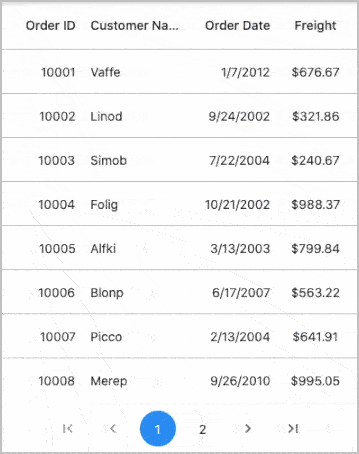

# Paging in Flutter (SfDataGrid)

The data grid interactively supports the manipulation of data using [SfDataPager] control. This provides to load data in segments when dealing with large volumes of data. `SfDataPager` can be placed above or below based on the requirement to easily manage data paging.

The data grid performs paging of data using the `SfDataPager`. To enable paging, follow the procedure:

* Create a new `SfDataPager` widget, and bind the `SfDataGrid.DataGridSource` to the `SfDataPager.delegate` property.
* Set the number of rows to be displayed on a page by setting the `SfDataPager.rowsPerPage` property.
* Set the number of buttons that should be displayed in view by setting the `SfDataPager.visibleItemsCount` property.
* Extent `SfDataPager.delegate.rowCount` property and `SfDataPager.delegate.handlePageChanges` method in `SfDataGrid.DataGridSource`.

N> The `SfDataPager.visibleItemsCount` property default value is 5.

The following code example illustrates using `SfDataPager` with the data grid control:




List<OrderInfo> paginatedDataSource = [];

final OrderInfoDataSource _orderInfoDataSource = OrderInfoDataSource();

@override
Widget build(BuildContext context) {
  return Scaffold(
    body: LayoutBuilder(
      builder: (context, constraint) {
        return Column(
          children: [
            SizedBox(
              height: constraint.maxHeight - 60,
              width: constraint.maxWidth,
              child: SfDataGrid(
                  source: _orderInfoDataSource,
                  columnWidthMode: ColumnWidthMode.fill,
                  columns: <GridColumn>[
                    GridNumericColumn(
                        mappingName: 'orderID', headerText: 'Order ID'),
                    GridTextColumn(
                        mappingName: 'customerID',
                        headerText: 'Customer Name'),
                    GridDateTimeColumn(
                        mappingName: 'orderDate', headerText: 'Order Date'),
                    GridNumericColumn(
                        mappingName: 'freight', headerText: 'Freight'),
                  ]),
            ),
            Container(
              height: 60,
              child: SfDataPager(
                delegate: _orderInfoDataSource,
                rowsPerPage: 20,
                direction: Axis.horizontal,
              ),
            )
          ],
        );
      },
    ),
  );
}

class OrderInfoDataSource extends DataGridSource<OrderInfo> {
  @override
  List<OrderInfo> get dataSource => paginatedDataSource;

  @override
  Object getValue(OrderInfo orderInfos, String columnName) {
    switch (columnName) {
      case 'orderID':
        return orderInfos.orderID;
        break;
      case 'customerID':
        return orderInfos.customerID;
        break;
      case 'freight':
        return orderInfos.freight;
        break;
      case 'orderDate':
        return orderInfos.orderData;
        break;
      default:
        return '';
        break;
    }
  }

  @override
  int get rowCount => orderInfos.length;

  @override
  Future<bool> handlePageChange(int oldPageIndex, int newPageIndex,
      int startRowIndex, int rowsPerPage) async {
    int endIndex = startRowIndex + rowsPerPage;
    if (endIndex > orderInfos.length) {
      endIndex = orderInfos.length - 1;
    }
    
    paginatedDataSource = List.from(
        orderInfos.getRange(startRowIndex, endIndex).toList(growable: false));
    notifyDataSourceListeners();
    return true;
  }
}




## Asynchronous data loading

Data to the SfDataPager can be loaded asynchronously using the ProgressIndicator from the `SfDataPager.delegate.handlePageChange` method.




class OrderInfoDataSource extends DataGridSource<OrderInfo> {
  @override
  Future<bool> handlePageChange(int oldPageIndex, int newPageIndex,
      int startRowIndex, int rowsPerPage) async {
    int endIndex = startRowIndex + rowsPerPage;
    if (endIndex > orderInfos.length) {
      endIndex = orderInfos.length - 1;
    }

    // Show the circle progress indicator
    showLoadingIndicator = true;
    notifyListeners();
    await Future.delayed(Duration(milliseconds: 2000));

    // hide the circle progress indicator
    showLoadingIndicator = false;
    notifyListeners();

    paginatedDataSource = List.from(
        orderInfos.getRange(startRowIndex, endIndex).toList(growable: false));
    notifyDataSourceListeners();
    return true;
  }
}




You can download the source code of asynchronous data loading sample [here]()

## Orientation

SfDataPager allows you to arrange the child elements either horizontally or vertically. This can be achieved by using the [SfDataPager.direction] Property. [SfDataPager.direction] is an Enum type.

<table>
<tr>
<th>
Enum 
</th>
<th>
Description</th>
</tr>
<tr>
<td>
horizontal
</td>
<td>
This is the default enum value for direction. Arranges all the navigation buttons and numeric buttons horizontally..
{{''|markdownify}}
</td>
</tr>
<tr>
<td>
vertical
</td>
<td>
Arranges all the navigation buttons and numeric buttons vertically by setting [Axis.vertical] to direction property.
{{''|markdownify}}
</td>
</tr>
</table>

## Appearance

SfDataPager allows to customize the appearance of the data pager through [SfDataPagerTheme.SfDataPagerThemeData] property.




@override
Widget build(BuildContext context) {
  return Scaffold(
    body: SfDataPagerTheme(
    data: SfDataPagerThemeData(
      itemColor: Colors.white,
      selectedItemColor: Colors.lightGreen,
      itemBorderRadius: BorderRadius.circular(5),
      backgroundColor: Colors.teal,
    ),
    child: SfDataPager(
      delegate: _orderInfoDataSource,
      rowsPerPage: 20,
      direction: Axis.horizontal,
    ),
  ));
}




