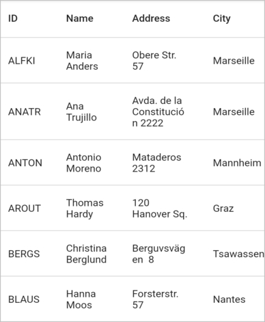

# Row Height Customization in Flutter DataGrid (SfDataGrid)

This section explains about options to customize the header row height and the row height of all the grid rows or particular row based on your requirements.

## Set height for header row

[SfDataGrid](https://pub.dev/documentation/syncfusion_flutter_datagrid/latest/datagrid/SfDataGrid-class.html) allows you to customize the height of the header row by using the [headerRowHeight](https://pub.dev/documentation/syncfusion_flutter_datagrid/latest/datagrid/SfDataGrid/headerRowHeight.html) property.


 

@override
Widget build(BuildContext context) {
  return Scaffold(
      body: SfDataGrid(
    source: _employeeDatasource,
    headerRowHeight: 70,
    columns: <GridColumn>[
      GridNumericColumn(mappingName: 'id')..headerText = 'ID',
      GridTextColumn(mappingName: 'name')..headerText = 'Name',
      GridTextColumn(mappingName: 'designation')..headerText = 'Designation',
      GridNumericColumn(mappingName: 'salary')..headerText = 'Salary',
    ],
  ));
}




## Set height for rows except header row

You can customize the height of the grid rows in `SfDataGrid` by using the [rowHeight](https://pub.dev/documentation/syncfusion_flutter_datagrid/latest/datagrid/SfDataGrid/rowHeight.html) property.


 
        
@override
Widget build(BuildContext context) {
  return Scaffold(
      body: SfDataGrid(
    source: _employeeDatasource,
    rowHeight: 60,
    columns: <GridColumn>[
      GridNumericColumn(mappingName: 'id')..headerText = 'ID',
      GridTextColumn(mappingName: 'name')..headerText = 'Name',
      GridTextColumn(mappingName: 'designation')..headerText = 'Designation',
      GridNumericColumn(mappingName: 'salary')..headerText = 'Salary',
    ],
  ));
}




## Fit row height based on its content

The row height can be fitted based on its content in [onQueryRowHeight](https://pub.dev/documentation/syncfusion_flutter_datagrid/latest/datagrid/SfDataGrid/onQueryRowHeight.html) callback using [getAutoRowHeight](https://pub.dev/documentation/syncfusion_flutter_datagrid/latest/datagrid/ColumnSizer/getAutoRowHeight.html) method which is available in [ColumnSizer](https://pub.dev/documentation/syncfusion_flutter_datagrid/latest/datagrid/ColumnSizer-class.html).

To access the `getAutoRowHeight` method, create an instance of `ColumnSizer`, set this instance in `columnSizer` property and use it in `onQueryRowHeight` callback. 

`ColumnSizer` objects are expected to be long-lived, not recreated with each build. 
 
>**NOTE**
    By default, the display text’s overflow behavior is ellipsis. So, to enable the wrap for the display text, set the `softWrap` property as `true` and `overflow` property as clip.


 

final ColumnSizer _columnSizer = ColumnSizer();

@override
Widget build(BuildContext context) {
  return Scaffold(
      body: SfDataGrid(
          source: _employeeDatasource,
          columnSizer: _columnSizer,
          onQueryRowHeight: (rowIndex) {
            double height = _columnSizer.getAutoRowHeight(rowIndex);
            return height;
          },
          columns: <GridColumn>[
        GridTextColumn(mappingName: 'id')
          ..softWrap = true
          ..overflow = TextOverflow.clip
          ..headerText = 'ID',
        GridTextColumn(mappingName: 'contactName')
          ..softWrap = true
          ..overflow = TextOverflow.clip
          ..headerText = 'Contact Name',
        GridTextColumn(mappingName: 'companyName')
          ..softWrap = true
          ..overflow = TextOverflow.clip
          ..headerText = 'Company Name',
        GridTextColumn(mappingName: 'city')
          ..softWrap = true
          ..overflow = TextOverflow.clip
          ..headerText = 'City',
        GridTextColumn(mappingName: 'address')
          ..softWrap = true
          ..overflow = TextOverflow.clip
          ..headerText = 'Address',
        GridTextColumn(mappingName: 'designation')
          ..softWrap = true
          ..overflow = TextOverflow.clip
          ..headerText = 'Designation',
        GridTextColumn(mappingName: 'country')
          ..softWrap = true
          ..overflow = TextOverflow.clip
          ..headerText = 'Country',
      ]));
}




### Auto fit row height options

#### Exclude the certain columns from auto-fit row calculation
                
By default, `getAutoRowHeight` method calculates the row height based on all columns. To skip the specific columns from the row height calculation, add that columns to the `excludeColumns` parameter in `getAutoRowHeight` method.


 

final List<String> _excludeColumns = [
  'designation',
  'address',
  'city',
];

final ColumnSizer _columnSizer = ColumnSizer();

@override
Widget build(BuildContext context) {
  return Scaffold(
      body: SfDataGrid(
          source: _autoRowHeightDataGridSource,
          columnSizer: _columnSizer,
          onQueryRowHeight: (int rowIndex) {
            final double height = _columnSizer.getAutoRowHeight(rowIndex,
                excludedColumns: _excludeColumns);
            return height;
          },
          columns: <GridColumn>[
        GridTextColumn(mappingName: 'id')
          ..softWrap = true
          ..overflow = TextOverflow.clip
          ..headerText = 'ID',
        GridTextColumn(mappingName: 'contactName')
          ..softWrap = true
          ..overflow = TextOverflow.clip
          ..headerText = 'Contact Name',
        GridTextColumn(mappingName: 'companyName')
          ..softWrap = true
          ..overflow = TextOverflow.clip
          ..headerText = 'Company Name',
        GridTextColumn(mappingName: 'address')
          ..softWrap = true
          ..overflow = TextOverflow.clip
          ..headerText = 'Address',
        GridTextColumn(mappingName: 'city')
          ..softWrap = true
          ..overflow = TextOverflow.clip
          ..headerText = 'City',
        GridTextColumn(mappingName: 'designation')
          ..softWrap = true
          ..overflow = TextOverflow.clip
          ..headerText = 'Designation',
        GridTextColumn(mappingName: 'country')
          ..softWrap = true
          ..overflow = TextOverflow.clip
          ..headerText = 'Country',
      ]));
}




#### Include the hidden columns in auto-fit row calculation

The hidden columns can also be considered for the row height calculation by using the `canIncludeHiddenColumns` parameter in 
`getAutoRowHeight` method.


 

final ColumnSizer _columnSizer = ColumnSizer();

@override
Widget build(BuildContext context) {
  return Scaffold(
      body: SfDataGrid(
          source: _autoRowHeightDataGridSource,
          columnSizer: _columnSizer,
          onQueryRowHeight: (int rowIndex) {
            final double height = _columnSizer.getAutoRowHeight(rowIndex,
                canIncludeHiddenColumns: true);
            return height;
          },
          columns: <GridColumn>[
        GridTextColumn(mappingName: 'id')
          ..softWrap = true
          ..overflow = TextOverflow.clip
          ..headerText = 'ID',
        GridTextColumn(mappingName: 'contactName')
          ..softWrap = true
          ..overflow = TextOverflow.clip
          ..headerText = 'Contact Name',
        GridTextColumn(mappingName: 'companyName')
          ..softWrap = true
          ..overflow = TextOverflow.clip
          ..headerText = 'Company Name',
        GridTextColumn(mappingName: 'country')
          ..softWrap = true
          ..overflow = TextOverflow.clip
          ..headerText = 'Country',
        GridTextColumn(mappingName: 'address')
          ..softWrap = true
          ..isHidden = true
          ..overflow = TextOverflow.clip
          ..headerText = 'Address',
        GridTextColumn(mappingName: 'city')
          ..softWrap = true
          ..isHidden = true
          ..overflow = TextOverflow.clip
          ..headerText = 'City',
        GridTextColumn(mappingName: 'designation')
          ..softWrap = true
          ..isHidden = true
          ..overflow = TextOverflow.clip
          ..headerText = 'Designation',
      ]));
}




