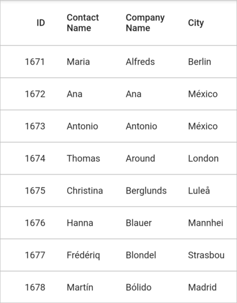
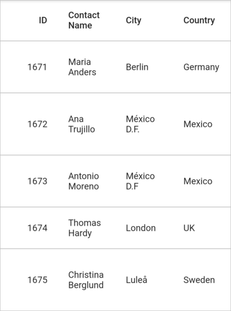
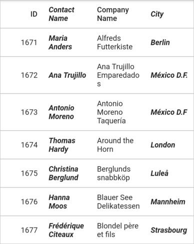
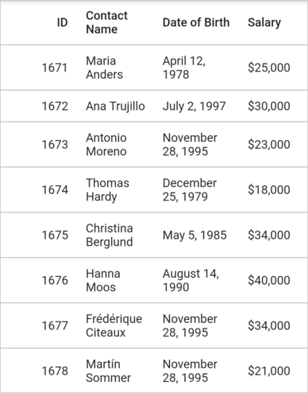
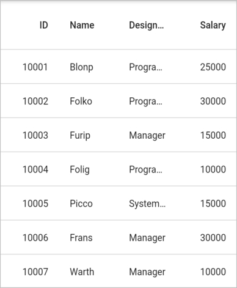
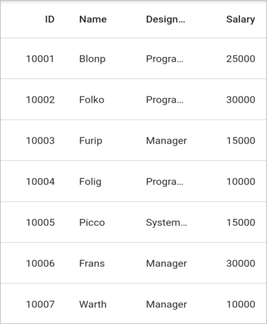

# Row Height Customization in Flutter DataGrid (SfDataGrid)

This section explains about options to customize the header row height and the row height of all the grid rows or particular row based on your requirements.

## Set the height for specific row

The row height of particular row can be set by using the `SfDataGrid.onQueryRowHeight` callback.


 

@override
Widget build(BuildContext context) {
  return SfDataGrid(
    source: rowHeightDataGridSource,
    onQueryRowHeight: (details) {
      // Set the row height as 70.0 to the column header row.
      return details.rowIndex == 0 ? 70.0 : 49.0;
    },
    columns: <GridColumn>[
      GridColumn(
        columnName: 'ID',
        label: Container(
          padding: EdgeInsets.all(16.0),
          alignment: Alignment.centerRight,
          child: Text(
            'ID',
            softWrap: true,
          ),
        ),
      ),
      GridColumn(
        columnName: 'Contact Name',
        label: Container(
          padding: EdgeInsets.all(16.0),
          alignment: Alignment.centerLeft,
          child: Text(
            'Contact Name',
            softWrap: true,
          ),
        ),
      ),
      GridColumn(
        columnName: 'Company Name',
        label: Container(
          padding: EdgeInsets.all(16.0),
          alignment: Alignment.centerLeft,
          child: Text(
            'Company Name',
            softWrap: true,
          ),
        ),
      ),
      GridColumn(
        columnName: 'City',
        label: Container(
          padding: EdgeInsets.all(16.0),
          alignment: Alignment.centerLeft,
          child: Text(
            'City',
            softWrap: true,
          ),
        ),
      ),
    ],
  );
}




## Fit the row height based on its content

The row height can be autofit based on its content in the `SfDataGrid.onQueryRowHeight` callback and using the `RowHeightDetails.getIntrinsicRowHeight` method.


 

@override
Widget build(BuildContext context) {
  return SfDataGrid(
    source: rowHeightDataGridSource,
    onQueryRowHeight: (details) {
      return details.getIntrinsicRowHeight(details.rowIndex);
    },
    columns: <GridColumn>[
      GridColumn(
        columnName: 'ID',
        label: Container(
          padding: EdgeInsets.all(16.0),
          alignment: Alignment.centerRight,
          child: Text(
            'ID',
            softWrap: true,
          ),
        ),
      ),
      GridColumn(
        columnName: 'Contact Name',
        label: Container(
          padding: EdgeInsets.all(16.0),
          alignment: Alignment.centerLeft,
          child: Text(
            'Contact Name',
            softWrap: true,
          ),
        ),
      ),
      GridColumn(
        columnName: 'Company Name',
        label: Container(
          padding: EdgeInsets.all(16.0),
          alignment: Alignment.centerLeft,
          child: Text(
            'Company Name',
            softWrap: true,
          ),
        ),
      ),
      GridColumn(
        columnName: 'City',
        label: Container(
          padding: EdgeInsets.all(16.0),
          alignment: Alignment.centerLeft,
          child: Text(
            'City',
            softWrap: true,
          ),
        ),
      ),
    ],
  );
}




The `RowHeightDetails.getIntrinsicRowHeight` method provides some properties to customize the autofit calculation,

* excludeColumns – By default, the `getIntrinsicRowHeight` method calculates the row height based on all columns. To skip the specific columns from the row height calculation, add that column's `GridColumn.columnName` to the `excludeColumns` collection.

* canIncludeHiddenColumns – The hidden columns can also be consider for the row height calculation by setting the `canIncludeHiddenColumns` as true.




@override
Widget build(BuildContext context) {
  return SfDataGrid(
    source: rowHeightDataGridSource,
    onQueryRowHeight: (details) {
      return details.getIntrinsicRowHeight(details.rowIndex,
          excludedColumns: ['Cotact Name'], canIncludeHiddenColumns: true);
    },
    columns: <GridColumn>[
      GridColumn(
        columnName: 'ID',
        autoFitPadding: EdgeInsets.all(16.0),
        label: Container(
          alignment: Alignment.centerRight,
          child: Text(
            'ID',
            softWrap: true,
          ),
        ),
      ),
      GridColumn(
        columnName: 'Contact Name',
        autoFitPadding: EdgeInsets.all(16.0),
        label: Container(
          alignment: Alignment.centerLeft,
          child: Text(
            'Contact Name',
            softWrap: true,
          ),
        ),
      ),
      GridColumn(
        columnName: 'Company Name',
        visible: false,
        autoFitPadding: EdgeInsets.all(16.0),
        width: 100.0,
        label: Container(
          alignment: Alignment.centerLeft,
          child: Text(
            'Company Name',
            softWrap: true,
          ),
        ),
      ),
      GridColumn(
        columnName: 'City',
        label: Container(
          padding: EdgeInsets.all(16.0),
          alignment: Alignment.centerLeft,
          child: Text(
            'City',
            softWrap: true,
          ),
        ),
      ),
      GridColumn(
        columnName: 'Country',
        label: Container(
          padding: EdgeInsets.all(16.0),
          alignment: Alignment.centerLeft,
          child: Text(
            'Country',
            softWrap: true,
          ),
        ),
      ),
    ],
  );
}




## Fit the row based on different TextStyle

By default, the cell height is calculated based on the default text style. To calculate the cell height based on different [TextStyle](https://api.flutter.dev/flutter/painting/TextStyle-class.html), just override the `computeHeaderCellHeight` method for header and `computeCellHeight` method for cell and return the super method with the required `TextStyle`.




final CustomColumnSizer _customColumnSizer = CustomColumnSizer();

@override
Widget build(BuildContext context) {
  return SfDataGrid(
    source: employeeDataSource,
    columnSizer: _customColumnSizer,
    onQueryRowHeight: (details) {
      return details.getIntrinsicRowHeight(details.rowIndex);
    },
    columns: <GridColumn>[
      GridColumn(
        columnName: 'ID',
        autoFitPadding: EdgeInsets.all(10.0),
        label: Container(
          padding: EdgeInsets.all(10.0),
          alignment: Alignment.centerRight,
          child: Text(
            'ID',
            softWrap: true,
          ),
        ),
      ),
      GridColumn(
        columnName: 'Contact Name',
        autoFitPadding: EdgeInsets.all(10.0),
        label: Container(
          padding: EdgeInsets.all(10.0),
          alignment: Alignment.centerLeft,
          child: Text(
            'Contact Name',
            softWrap: true,
            style: TextStyle(
                fontWeight: FontWeight.bold, fontStyle: FontStyle.italic),
          ),
        ),
      ),
      GridColumn(
        columnName: 'Company Name',
        visible: true,
        autoFitPadding: EdgeInsets.all(10.0),
        width: 100.0,
        label: Container(
          padding: EdgeInsets.all(10.0),
          alignment: Alignment.centerLeft,
          child: Text(
            'Company Name',
            softWrap: true,
          ),
        ),
      ),
      GridColumn(
        columnName: 'City',
        autoFitPadding: EdgeInsets.all(10.0)EdgeInsets.all(10.0),
        label: Container(
          padding: EdgeInsets.all(10.0)EdgeInsets.all(10.0),
          alignment: Alignment.centerLeft,
          child: Text(
            'City',
            softWrap: true,
            style: TextStyle(
                fontWeight: FontWeight.bold, fontStyle: FontStyle.italic),
          ),
        ),
      ),
    ],
  );
}

class EmployeeDataSource extends DataGridSource {
  EmployeeDataSource({required List<_Employee> employees}) {
    dataGridRows = employees.map<DataGridRow>((dataGridRow) {
      return DataGridRow(cells: [
        DataGridCell<int>(columnName: 'ID', value: dataGridRow.id),
        DataGridCell<String>(
            columnName: 'Contact Name', value: dataGridRow.contactName),
        DataGridCell<String>(
            columnName: 'Company Name', value: dataGridRow.companyName),
        DataGridCell<String>(columnName: 'City', value: dataGridRow.city),
      ]);
    }).toList();
  }

  List<DataGridRow> dataGridRows = [];

  @override
  List<DataGridRow> get rows => dataGridRows;

  @override
  DataGridRowAdapter buildRow(DataGridRow row) {
    return DataGridRowAdapter(
        cells: row.getCells().map<Widget>((dataCell) {
      return Container(
        padding: EdgeInsets.all(10.0),
        alignment: dataCell.columnName == 'ID'
            ? Alignment.centerRight
            : Alignment.centerLeft,
        child: Text(
          dataCell.value.toString(),
          style: (dataCell.columnName == 'City' ||
                  dataCell.columnName == 'Contact Name')
              ? TextStyle(
                  fontWeight: FontWeight.bold, fontStyle: FontStyle.italic)
              : null,
        ),
      );
    }).toList());
  }
}

class CustomColumnSizer extends ColumnSizer {
  @override
  double computeHeaderCellHeight(GridColumn column, TextStyle textStyle) {
    if (column.columnName == 'Contact Name' || column.columnName == 'City') {
      textStyle =
          TextStyle(fontWeight: FontWeight.bold, fontStyle: FontStyle.italic);
    }
    return super.computeHeaderCellHeight(column, textStyle);
  }

  @override
  double computeCellHeight(GridColumn column, DataGridRow row,
      Object? cellValue, TextStyle textStyle) {
    if (column.columnName == 'Contact Name' || column.columnName == 'City') {
      textStyle =
          TextStyle(fontWeight: FontWeight.bold, fontStyle: FontStyle.italic);
    }
    return super.computeCellHeight(column, row, cellValue, textStyle);
  }
}




## Fit the row based on formatted value

By default, the cell height is calculated based on the `DataGridCell.value` property. To autofit the cell height based on the displayed formatted value (i.e, DateFormat and NumberFormat), simply override the `computeCellHeight` method and return the super method with the required `cellValue`.




final CustomColumnSizer _customColumnSizer = CustomColumnSizer();

@override
Widget build(BuildContext context) {
  return SfDataGrid(
    source: employeeDataSource,
    columnSizer: _customColumnSizer,
    onQueryRowHeight: (details) {
      return details.getIntrinsicRowHeight(details.rowIndex);
    },
    columns: <GridColumn>[
      GridColumn(
        columnName: 'ID',
        autoFitPadding: EdgeInsets.all(10.0),
        label: Container(
          padding: EdgeInsets.all(10.0),
          alignment: Alignment.centerRight,
          child: Text(
            'ID',
            softWrap: true,
          ),
        ),
      ),
      GridColumn(
        columnName: 'Contact Name',
        autoFitPadding: EdgeInsets.all(10.0),
        label: Container(
          padding: EdgeInsets.all(10.0),
          alignment: Alignment.centerLeft,
          child: Text(
            'Contact Name',
            softWrap: true,
          ),
        ),
      ),
      GridColumn(
        columnName: 'Date of Birth',
        visible: true,
        autoFitPadding: EdgeInsets.all(10.0),
        width: 100.0,
        label: Container(
          padding: EdgeInsets.all(10.0),
          alignment: Alignment.centerLeft,
          child: Text(
            'Date of Birth',
            softWrap: true,
          ),
        ),
      ),
      GridColumn(
        columnName: 'Salary',
        autoFitPadding: EdgeInsets.all(10.0),
        label: Container(
          padding: EdgeInsets.all(10.0),
          alignment: Alignment.centerLeft,
          child: Text(
            'Salary',
            softWrap: true,
          ),
        ),
      ),
    ],
  );
}

class EmployeeDataSource extends DataGridSource {
  EmployeeDataSource({required List<_Employee> employees}) {
    dataGridRows = employees.map<DataGridRow>((dataGridRow) {
      return DataGridRow(cells: [
        DataGridCell<int>(columnName: 'ID', value: dataGridRow.id),
        DataGridCell<String>(
            columnName: 'Contact Name', value: dataGridRow.contactName),
        DataGridCell<DateTime>(
            columnName: 'Date of Birth', value: dataGridRow.dob),
        DataGridCell<int>(columnName: 'Salary', value: dataGridRow.salary),
      ]);
    }).toList();
  }

  List<DataGridRow> dataGridRows = [];

  @override
  List<DataGridRow> get rows => dataGridRows;

  @override
  DataGridRowAdapter buildRow(DataGridRow row) {
    return DataGridRowAdapter(
        cells: row.getCells().map<Widget>((dataCell) {
      late String cellValue;
      if (dataCell.columnName == 'Date of Birth') {
        cellValue = DateFormat.yMMMMd('en_US').format(dataCell.value);
      } else if (dataCell.columnName == 'Salary') {
        cellValue = NumberFormat.simpleCurrency(decimalDigits: 0)
            .format(dataCell.value);
      } else {
        cellValue = dataCell.value.toString();
      }

      return Container(
        padding: EdgeInsets.all(10.0),
        alignment: dataCell.columnName == 'ID'
            ? Alignment.centerRight
            : Alignment.centerLeft,
        child: Text(cellValue),
      );
    }).toList());
  }
}

class CustomColumnSizer extends ColumnSizer {
  @override
  double computeCellHeight(GridColumn column, DataGridRow row,
      Object? cellValue, TextStyle textStyle) {
    if (column.columnName == 'Date of Birth') {
      cellValue = DateFormat.yMMMMd('en_US').format(cellValue as DateTime);
    } else if (column.columnName == 'Salary') {
      cellValue =
          NumberFormat.simpleCurrency(decimalDigits: 0).format(cellValue);
    }

    return super.computeCellHeight(column, row, cellValue, textStyle);
  }
}




## Set height for header row

[SfDataGrid](https://pub.dev/documentation/syncfusion_flutter_datagrid/latest/datagrid/SfDataGrid-class.html) allows you to customize the height of the header row by using the [headerRowHeight](https://pub.dev/documentation/syncfusion_flutter_datagrid/latest/datagrid/SfDataGrid/headerRowHeight.html) property.


 

@override
Widget build(BuildContext context) {
  return Scaffold(
      body: SfDataGrid(
    source: _employeeDatasource,
    headerRowHeight: 70,
    columns: <GridColumn>[
      GridTextColumn(
        columnName: 'id',
        label: Container(
          padding: EdgeInsets.symmetric(horizontal: 16.0),
          alignment: Alignment.centerRight,
          child: Text(
            'ID',
            overflow: TextOverflow.ellipsis,
          ))),
      GridTextColumn(
        columnName: 'name',
        label: Container(
          padding: EdgeInsets.symmetric(horizontal: 16.0),
          alignment: Alignment.centerLeft,
          child: Text(
            'Name',
            overflow: TextOverflow.ellipsis,
          ))),
      GridTextColumn(
        columnName: 'designation',
        label: Container(
          padding: EdgeInsets.symmetric(horizontal: 16.0),
          alignment: Alignment.centerLeft,
          child: Text(
            'Designation',
            overflow: TextOverflow.ellipsis,
          ))),
      GridTextColumn(
        columnName: 'salary',
        label: Container(
          padding: EdgeInsets.symmetric(horizontal: 16.0),
          alignment: Alignment.centerRight,
          child: Text(
            'Salary',
            overflow: TextOverflow.ellipsis,
          ))),
    ],
  ));
}




## Set height for rows except header row

You can customize the height of the grid rows in `SfDataGrid` by using the [rowHeight](https://pub.dev/documentation/syncfusion_flutter_datagrid/latest/datagrid/SfDataGrid/rowHeight.html) property.


 
        
@override
Widget build(BuildContext context) {
  return Scaffold(
      body: SfDataGrid(
    source: _employeeDatasource,
    rowHeight: 60,
    columns: <GridColumn>[
      GridTextColumn(
        columnName: 'id',
        label: Container(
          padding: EdgeInsets.symmetric(horizontal: 16.0),
          alignment: Alignment.centerRight,
          child: Text(
            'ID',
            overflow: TextOverflow.ellipsis,
          ))),
      GridTextColumn(
        columnName: 'name',
        label: Container(
          padding: EdgeInsets.symmetric(horizontal: 16.0),
          alignment: Alignment.centerLeft,
          child: Text(
            'Name',
            overflow: TextOverflow.ellipsis,
          ))),
      GridTextColumn(
        columnName: 'designation',
        label: Container(
          padding: EdgeInsets.symmetric(horizontal: 16.0),
          alignment: Alignment.centerLeft,
          child: Text(
            'Designation',
            overflow: TextOverflow.ellipsis,
          ))),
      GridTextColumn(
        columnName: 'salary',
        label: Container(
          padding: EdgeInsets.symmetric(horizontal: 16.0),
          alignment: Alignment.centerRight,
          child: Text(
            'Salary',
            overflow: TextOverflow.ellipsis,
          ))),
    ],
  ));
}




## Refresh row height for specific row

The `SfDataGrid` allows you to update or refresh specific row and it's height when 
an underlying data is updated.

You can refresh a specific row and its height by using the [DataGridController.refreshRow](https://pub.dev/documentation/syncfusion_flutter_datagrid/latest/datagrid/DataGridController/refreshRow.html) method. This method has following two arguments,

* **rowIndex**- Specify the required row index which is required to refresh. If you specify this, the data alone will be refreshed for a row.

* **recalculateRowHeight** - Decides whether a height of a row should be refreshed along with the data.

If you call `refreshRow` method, `onQueryRowHeight` callback will called for that specific row. So, auto-calculation of height can be recalculated for that row.

In the below example, row data is updated when the `refreshRow` is called in `onPressed` callback of the `FlatButton`.


 

List<Employee> _employees = [];

final EmployeeDataSource _employeeDataSource = EmployeeDataSource();

final DataGridController _controller = DataGridController();

@override
Widget build(BuildContext context) {
  return Scaffold(
    appBar: AppBar(
      title: const Text('Syncfusion Flutter DataGrid'),
    ),
    body: Column(
      children: [
        FlatButton(
          child: const Text('Update cell value),
              onPressed: () {
                _employees[0].id=1010;
                _employeeData[0].name = 'Maria Anders';
                _employeeData[0].designation = 'Sales Representative';
                _employees[0].salary = 25000;
                _controller.refreshRow(0);
                _employeeDataSource.getData(_employees);
                _employeeDataSource.updateDataSource();
              }),
          SfDataGrid(
            source: _employeeDataSource,
            controller: _controller,
            columnSizer: _columnSizer,
            onQueryRowHeight: (RowHeightDetails details) {
              if (details.rowIndex == 0) {
                return 100.0;
              }
              
              return 50.0; 
            },
            columns: <GridColumn>[
              GridTextColumn(
                columnName: 'id',
                label: Container(
                  padding: EdgeInsets.symmetric(horizontal: 16.0),
                  alignment: Alignment.centerRight,
                  child: Text(
                    'ID',
                    overflow: TextOverflow.ellipsis,
                  ))),
              GridTextColumn(
                columnName: 'name',
                label: Container(
                  padding: EdgeInsets.symmetric(horizontal: 16.0),
                  alignment: Alignment.centerLeft,
                  child: Text(
                    'Name',
                    overflow: TextOverflow.ellipsis,
                  ))),
              GridTextColumn(
                columnName: 'designation',
                label: Container(
                  padding: EdgeInsets.symmetric(horizontal: 16.0),
                  alignment: Alignment.centerLeft,
                  child: Text(
                    'Designation',
                    overflow: TextOverflow.ellipsis,
                  ))),
              GridTextColumn(
                columnName: 'salary',
                label: Container(
                  padding: EdgeInsets.symmetric(horizontal: 16.0),
                  alignment: Alignment.centerRight,
                  child: Text(
                    'Salary',
                    overflow: TextOverflow.ellipsis,
                  ))),
            ],
          ),
        ],
      ),
    );
  }




In the below example, row data is refreshed along with its row height when the `refreshRow` is called in `onPressed` callback of the `FlatButton`.


 

List<Employee> _employees = [];

final EmployeeDataSource _employeeDataSource = EmployeeDataSource();;

final DataGridController _controller = DataGridController();

@override
Widget build(BuildContext context) {
  return Scaffold(
    appBar: AppBar(
      title: const Text('Syncfusion Flutter DataGrid'),
    ),
    body: Column(
      children: [
        FlatButton(
          child: const Text('Update cell value),
              onPressed: () {
                _employees[0].id=1010;
                _employeeData[0].name = 'Maria Anders';
                _employeeData[0].designation = 'Sales Representative';
                _employees[0].salary = 25000;
                _controller.refreshRow(0, recalculateRowHeight: true);
                _employeeDataSource.getData(_employees);
                _employeeDataSource.updateDataSource();
              }),
          SfDataGrid(
            source: _employeeDataSource,
            controller: _controller,
            columnSizer: _columnSizer,
            onQueryRowHeight: (RowHeightDetails details) {
              if (details.rowIndex == 0) {
                return 100;
              }
              return 50.0;  
            },
            columns: <GridColumn>[
              GridTextColumn(
                columnName: 'id',
                label: Container(
                  padding: EdgeInsets.symmetric(horizontal: 16.0),
                  alignment: Alignment.centerRight,
                  child: Text(
                    'ID',
                    overflow: TextOverflow.ellipsis,
                  ))),
              GridTextColumn(
                columnName: 'name',
                label: Container(
                  padding: EdgeInsets.symmetric(horizontal: 16.0),
                  alignment: Alignment.centerLeft,
                  child: Text(
                    'Name',
                    overflow: TextOverflow.ellipsis,
                  ))),
              GridTextColumn(
                columnName: 'designation',
                label: Container(
                  padding: EdgeInsets.symmetric(horizontal: 16.0),
                  alignment: Alignment.centerLeft,
                  child: Text(
                    'Designation',
                    overflow: TextOverflow.ellipsis,
                  ))),
              GridTextColumn(
                columnName: 'salary',
                label: Container(
                  padding: EdgeInsets.symmetric(horizontal: 16.0),
                  alignment: Alignment.centerRight,
                  child: Text(
                    'Salary',
                    overflow: TextOverflow.ellipsis,
                  ))),
            ],
          ),
        ],
      ),
    );
  }



