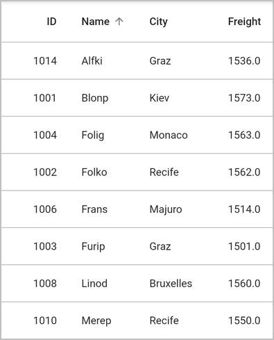
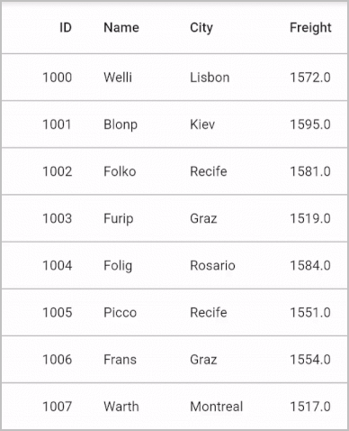
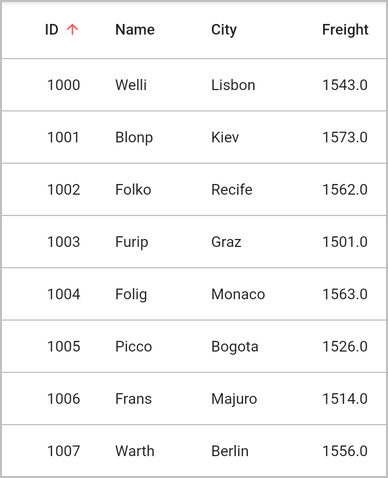
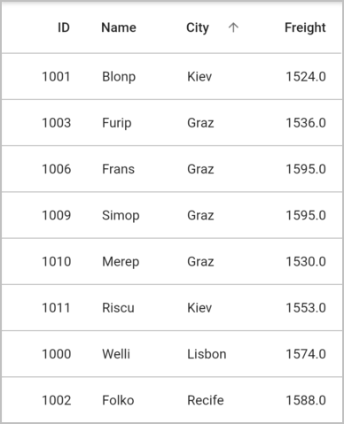

# Sorting in Flutter Datagrid (SfDataGrid)

The datagrid provides the built-in support to sort one or more columns by setting the [SfDataGrid.allowSorting](https://pub.dev/documentation/syncfusion_flutter_datagrid/latest/datagrid/SfDataGrid/allowSorting.html) property to true. When sorting is applied, the datagrid automatically rearranges the data to match with the current sort criteria. When `SfDataGrid.allowSorting` is true, you can sort the data simply by tapping the column header. Once sorting is applied, the datagrid shows a sort icon in the respective column header indicating the sort direction.

## Programmatic sorting

The datagrid provides support to sort the columns programmatically. You can manually define the [SortColumnDetails](https://pub.dev/documentation/syncfusion_flutter_datagrid/latest/datagrid/SortColumnDetails-class.html) objects, and add it in the [SfDataGrid.source.sortedColumns](https://pub.dev/documentation/syncfusion_flutter_datagrid/latest/datagrid/DataGridSource/sortedColumns.html) collection. The datagrid sorts the data based on the `SortColumnDetails` objects added to this collection. If you want to perform sorting at run time, you should call [SfDataGrid.source.sort()](https://pub.dev/documentation/syncfusion_flutter_datagrid/latest/datagrid/DataGridSource/sort.html) method after adding the `SortColumnDetails` to the `SfDataGrid.source.sortedColumns` collection. 

The `SortColumnDetails` object holds the following two properties:

* [name](https://pub.dev/documentation/syncfusion_flutter_datagrid/latest/datagrid/SortColumnDetails/name.html) : Name of the column to be sorted.
* [sortDirection](https://pub.dev/documentation/syncfusion_flutter_datagrid/latest/datagrid/SortColumnDetails/sortDirection.html) : Specifies the ascending or descending direction.


 

import 'package:syncfusion_flutter_datagrid/datagrid.dart';

@override
Widget build(BuildContext context) {
  return Scaffold(
    body: Column(
      mainAxisAlignment: MainAxisAlignment.center,
      children: [
        SfDataGrid(
          source: _employeeDataSource,
          columns: [
            GridTextColumn(
              columnName: 'id',
              label: Container(
                padding: EdgeInsets.symmetric(horizontal: 16.0),
                alignment: Alignment.centerRight,
                child: Text(
                  'ID',
                  overflow: TextOverflow.ellipsis,
                ))),
            GridTextColumn(
              columnName: 'name',
              label: Container(
                padding: EdgeInsets.symmetric(horizontal: 16.0),
                alignment: Alignment.centerLeft,
                child: Text(
                  'Name',
                  overflow: TextOverflow.ellipsis,
                ))),
            GridTextColumn(
              columnName: 'city',
              label: Container(
                padding: EdgeInsets.symmetric(horizontal: 16.0),
                alignment: Alignment.centerLeft,
                child: Text(
                  'City',
                  overflow: TextOverflow.ellipsis,
                ))),
            GridTextColumn(
              columnName: 'freight',
              label: Container(
                padding: EdgeInsets.symmetric(horizontal: 16.0),
                alignment: Alignment.centerRight,
                child: Text(
                  'Freight',
                  overflow: TextOverflow.ellipsis,
                ))),
          ],
        ),
        Padding(
          padding: EdgeInsets.symmetric(horizontal: 16.0),
          child: FlatButton(
              onPressed: () {
                _employeeDataSource.sortedColumns.add(SortColumnDetails(
                    name: 'name',
                    sortDirection: DataGridSortDirection.ascending));
                _employeeDataSource.sort();
              },
              child: Text('Apply sort')),
        )
      ],
    ),
  );
}




## Multi-column sorting

The datagrid sorts the data against more than one columns by setting the [SfDataGrid.allowMultiColumnSorting](https://pub.dev/documentation/syncfusion_flutter_datagrid/latest/datagrid/SfDataGrid/allowMultiColumnSorting.html) property to true. The number of columns by which the data can be sorted is unlimited. To apply sorting for multiple columns, tap the desired column headers after setting the `SfDataGrid.allowMultiColumnSorting` property.

To apply sorting for multiple columns in web and desktop, you can click the column header by pressing the <kbd>Ctrl</kbd> key.


 

import 'package:syncfusion_flutter_datagrid/datagrid.dart';

@override
Widget build(BuildContext context) {
  return Scaffold(
      body: SfDataGrid(
    source: _employeeDataSource,
    allowSorting: true,
    allowMultiColumnSorting: true,
    columns: [
      GridTextColumn(
        columnName: 'id',
        label: Container(
          padding: EdgeInsets.symmetric(horizontal: 16.0),
          alignment: Alignment.centerRight,
          child: Text(
            'ID',
            overflow: TextOverflow.ellipsis,
          ))),
      GridTextColumn(
        columnName: 'name',
        label: Container(
          padding: EdgeInsets.symmetric(horizontal: 16.0),
          alignment: Alignment.centerLeft,
          child: Text(
            'Name',
            overflow: TextOverflow.ellipsis,
          ))),
      GridTextColumn(
        columnName: 'city',
        label: Container(
          padding: EdgeInsets.symmetric(horizontal: 16.0),
          alignment: Alignment.centerLeft,
          child: Text(
            'City',
            overflow: TextOverflow.ellipsis,
          ))),
      GridTextColumn(
        columnName: 'freight',
        label: Container(
          padding: EdgeInsets.symmetric(horizontal: 16.0),
          alignment: Alignment.centerRight,
          child: Text(
            'Freight',
            overflow: TextOverflow.ellipsis,
          ))),
    ],
  ));
}




## Tri-state sorting

In addition to sort the data in ascending/descending order, the SfDataGrid unsort the data in the original order by clicking the header again after sorting to descending order by setting the [SfDataGrid.allowTriStateSorting](https://pub.dev/documentation/syncfusion_flutter_datagrid/latest/datagrid/SfDataGrid/allowTriStateSorting.html) property to true. When this property is set, sorting in each column iterates through three sort states: ascending, descending, and unsort.


 

import 'package:syncfusion_flutter_datagrid/datagrid.dart';

@override
Widget build(BuildContext context) {
  return Scaffold(
      body: SfDataGrid(
    source: _employeeDataSource,
    allowSorting: true,
    allowMultiColumnSorting: true,
    allowTriStateSorting: true,
    columns: [
      GridTextColumn(
        columnName: 'id',
        label: Container(
          padding: EdgeInsets.symmetric(horizontal: 16.0),
          alignment: Alignment.centerRight,
          child: Text(
            'ID',
            overflow: TextOverflow.ellipsis,
          ))),
      GridTextColumn(
        columnName: 'name',
        label: Container(
          padding: EdgeInsets.symmetric(horizontal: 16.0),
          alignment: Alignment.centerLeft,
          child: Text(
            'Name',
            overflow: TextOverflow.ellipsis,
          ))),
      GridTextColumn(
        columnName: 'city',
        label: Container(
          padding: EdgeInsets.symmetric(horizontal: 16.0),
          alignment: Alignment.centerLeft,
          child: Text(
            'City',
            overflow: TextOverflow.ellipsis,
          ))),
      GridTextColumn(
        columnName: 'freight',
        label: Container(
          padding: EdgeInsets.symmetric(horizontal: 16.0),
          alignment: Alignment.centerRight,
          child: Text(
            'Freight',
            overflow: TextOverflow.ellipsis,
          ))),
    ],
  ));
}




## Sort column in double tap

By default, column gets sorted when column header clicked. This behavior can be changed to sort the column in double click action by setting [SfDataGrid.sortingGestureType](https://pub.dev/documentation/syncfusion_flutter_datagrid/latest/datagrid/SfDataGrid/sortingGestureType.html) property to `doubleTap`.


 

import 'package:syncfusion_flutter_datagrid/datagrid.dart';

@override
Widget build(BuildContext context) {
  return Scaffold(
      body: SfDataGrid(
    source: _employeeDataSource,
    allowSorting: true,
    sortingGestureType: SortingGestureType.doubleTap,
    columns: [
      GridTextColumn(
        columnName: 'id',
        label: Container(
          padding: EdgeInsets.symmetric(horizontal: 16.0),
          alignment: Alignment.centerRight,
          child: Text(
            'ID',
            overflow: TextOverflow.ellipsis,
          ))),
      GridTextColumn(
        columnName: 'name',
        label: Container(
          padding: EdgeInsets.symmetric(horizontal: 16.0),
          alignment: Alignment.centerLeft,
          child: Text(
            'Name',
            overflow: TextOverflow.ellipsis,
          ))),
      GridTextColumn(
        columnName: 'city',
        label: Container(
          padding: EdgeInsets.symmetric(horizontal: 16.0),
          alignment: Alignment.centerLeft,
          child: Text(
            'City',
            overflow: TextOverflow.ellipsis,
          ))),
      GridTextColumn(
        columnName: 'freight',
        label: Container(
          padding: EdgeInsets.symmetric(horizontal: 16.0),
          alignment: Alignment.centerRight,
          child: Text(
            'Freight',
            overflow: TextOverflow.ellipsis,
          ))),
    ],
  ));
}




## Show sort number

The datagrid provides support the sequence numbers to display the sorted columns during multi-column sorting by setting [SfDataGrid.showSortNumbers](https://pub.dev/documentation/syncfusion_flutter_datagrid/latest/datagrid/SfDataGrid/showSortNumbers.html) is set to true. This is applicable when the `SfDataGrid.allowMultiColumnSorting` property is enabled.


 

import 'package:syncfusion_flutter_datagrid/datagrid.dart';

@override
Widget build(BuildContext context) {
  return Scaffold(
      body: SfDataGrid(
    source: _employeeDataSource,
    allowSorting: true,
    allowMultiColumnSorting: true,
    showSortNumbers: true,
    columns: [
      GridTextColumn(
        columnName: 'id',
        label: Container(
          padding: EdgeInsets.symmetric(horizontal: 16.0),
          alignment: Alignment.centerRight,
          child: Text(
            'ID',
            overflow: TextOverflow.ellipsis,
          ))),
      GridTextColumn(
        columnName: 'name',
        label: Container(
          padding: EdgeInsets.symmetric(horizontal: 16.0),
          alignment: Alignment.centerLeft,
          child: Text(
            'Name',
            overflow: TextOverflow.ellipsis,
          ))),
      GridTextColumn(
        columnName: 'city',
        label: Container(
          padding: EdgeInsets.symmetric(horizontal: 16.0),
          alignment: Alignment.centerLeft,
          child: Text(
            'City',
            overflow: TextOverflow.ellipsis,
          ))),
      GridTextColumn(
        columnName: 'freight',
        label: Container(
          padding: EdgeInsets.symmetric(horizontal: 16.0),
          alignment: Alignment.centerRight,
          child: Text(
            'Freight',
            overflow: TextOverflow.ellipsis,
          ))),
    ],
  ));
}
  



## Disable sorting for an individual column

The data grid disables sorting for an individual column by setting the [GridColumn.allowSorting](https://pub.dev/documentation/syncfusion_flutter_datagrid/latest/datagrid/GridColumn/allowSorting.html) property to false. The default value of this property is true. So all the columns in the [SfDataGrid.columns](https://pub.dev/documentation/syncfusion_flutter_datagrid/latest/datagrid/SfDataGrid/columns.html) collection can be sorted when `SfDataGrid.allowSorting` is set to true.


 

import 'package:syncfusion_flutter_datagrid/datagrid.dart';

@override
Widget build(BuildContext context) {
  return Scaffold(
      body: SfDataGrid(
    source: _employeeDataSource,
    allowSorting: true,
    columns: [
      GridTextColumn(
        columnName: 'id',
        label: Container(
          padding: EdgeInsets.symmetric(horizontal: 16.0),
          alignment: Alignment.centerRight,
          child: Text(
            'ID',
            overflow: TextOverflow.ellipsis,
          ))),
      GridTextColumn(
        columnName: 'name',
        allowSorting: false,
        label: Container(
          padding: EdgeInsets.symmetric(horizontal: 16.0),
          alignment: Alignment.centerLeft,
          child: Text(
            'Name',
            overflow: TextOverflow.ellipsis,
          ))),
      GridTextColumn(
        columnName: 'city',
        label: Container(
          padding: EdgeInsets.symmetric(horizontal: 16.0),
          alignment: Alignment.centerLeft,
          child: Text(
            'City',
            overflow: TextOverflow.ellipsis,
          ))),
      GridTextColumn(
        columnName: 'freight',
        label: Container(
          padding: EdgeInsets.symmetric(horizontal: 16.0),
          alignment: Alignment.centerRight,
          child: Text(
            'Freight',
            overflow: TextOverflow.ellipsis,
          ))),
    ],
  ));
}
  



## Change the color of sort icon

The color of sort icon can be customized by using [SfDataGridThemeData.sortIconColor]().

The following code describes how to change sort icon color by using [SfDataGridTheme](https://pub.dev/documentation/syncfusion_flutter_core/latest/theme/SfDataGridTheme-class.html).


 

import 'package:syncfusion_flutter_datagrid/datagrid.dart';
import 'package:syncfusion_flutter_core/theme.dart';

@override
Widget build(BuildContext context) {
  return Scaffold(
      body: SfDataGridTheme(
    data: SfDataGridThemeData(
      sortIconColor: Colors.redAccent),
    child: SfDataGrid(
      source: _employeeDataSource,
      allowSorting: true,
      allowMultiColumnSorting: true,
      columns: [
        GridTextColumn(
          columnName: 'id',
          label: Container(
            padding: EdgeInsets.symmetric(horizontal: 16.0),
            alignment: Alignment.centerRight,
            child: Text(
              'ID',
              overflow: TextOverflow.ellipsis,
            ))),
        GridTextColumn(
          columnName: 'name',
          label: Container(
            padding: EdgeInsets.symmetric(horizontal: 16.0),
            alignment: Alignment.centerLeft,
            child: Text(
              'Name',
              overflow: TextOverflow.ellipsis,
            ))),
        GridTextColumn(
          columnName: 'city',
          label: Container(
            padding: EdgeInsets.symmetric(horizontal: 16.0),
            alignment: Alignment.centerLeft,
            child: Text(
              'City',
              overflow: TextOverflow.ellipsis,
            ))),
        GridTextColumn(
          columnName: 'freight',
          label: Container(
            padding: EdgeInsets.symmetric(horizontal: 16.0),
            alignment: Alignment.centerRight,
            child: Text(
              'Freight',
              overflow: TextOverflow.ellipsis,
            ))),
      ],
    ),
  ));
}
  



## Custom sorting

The datagrid allows to sort columns based on custom logic. For each column, you can provide different sorting criteria by overriding the following methods from [DataGridSource](https://pub.dev/documentation/syncfusion_flutter_datagrid/latest/datagrid/DataGridSource-class.html),

* **[handleSort](https://pub.dev/documentation/syncfusion_flutter_datagrid/latest/datagrid/DataGridSource/handleSort.html)** : This method will be called when you tap the column header and sorting is being applied. You can override this method to provide the entire logic for sorting for columns.
* **[compare](https://pub.dev/documentation/syncfusion_flutter_datagrid/latest/datagrid/DataGridSource/compare.html)** : You can override this method to compare two objects and return the sorting order based on the criteria.

### Sort column based on string length

The following code shows how to perform custom sorting for the columns based on the string length by overriding the `compare` method.


 

import 'package:syncfusion_flutter_datagrid/datagrid.dart';

class EmployeeDataSource extends DataGridSource {
  EmployeeDataSource({List<Employee> employeesData}) {
    dataGridRows = employeesData
        .map<DataGridRow>((dataGridRow) => DataGridRow(cells: [
              DataGridCell<int>(columnName: 'id', value: dataGridRow.id),
              DataGridCell<String>(columnName: 'name', value: dataGridRow.name),
              DataGridCell<String>(
                  columnName: 'designation', value: dataGridRow.designation),
              DataGridCell<int>(columnName: 'salary', value: dataGridRow.salary)
            ]))
        .toList();
  }

  List<DataGridRow> dataGridRows = [];

  @override
  List<DataGridRow> get rows => dataGridRows;

  @override
  DataGridRowAdapter? buildRow(DataGridRow row) {
    return DataGridRowAdapter(
        cells: row.getCells().map<Widget>((dataGridCell) {
        return Container(
            alignment: (dataGridCell.columnName == 'id' ||
                  dataGridCell.columnName == 'salary')
                  ? Alignment.centerRight
                  : Alignment.centerLeft,
            padding: EdgeInsets.symmetric(horizontal: 16.0),
            child: Text(
            dataGridCell.value.toString(),
            overflow: TextOverflow.ellipsis,
            ));
    }).toList());
  }

  @override
  int compare(DataGridRow? a, DataGridRow? b, SortColumnDetails sortColumn) {
      final String? value1 = a
            ?.getCells()
            .firstWhereOrNull((element) => element.columnName == sortColumn.name)
            ?.value;
      final String? value2 = b
            ?.getCells()
            .firstWhereOrNull((element) => element.columnName == sortColumn.name)
            ?.value;
  
      int? aLength = value1?.length;
      int? bLength = value2?.length;
  
      if (aLength == null || bLength == null) {
        return 0;
      }
  
      if (aLength.compareTo(bLength) > 0) {
        return sortColumn.sortDirection == DataGridSortDirection.ascending
            ? 1
            : -1;
      } else if (aLength.compareTo(bLength) == -1) {
        return sortColumn.sortDirection == DataGridSortDirection.ascending
            ? -1
            : 1;
      } else {
        return 0;
      }
  }
}




>**NOTE**  
  Download demo application from [GitHub](https://github.com/SyncfusionExamples/how-to-sort-the-columns-based-on-length-of-the-text-in-Flutter-datagrid).

### Case-insensitive sorting

The following code shows how to perform custom sorting for the columns based on the case-insensitive by overriding the `compare` method.


 

import 'package:syncfusion_flutter_datagrid/datagrid.dart';

class EmployeeDataSource extends DataGridSource<Employee> {
  EmployeeDataSource({List<Employee> employeesData}) {
    dataGridRows = employeesData
        .map<DataGridRow>((dataGridRow) => DataGridRow(cells: [
              DataGridCell<int>(columnName: 'id', value: dataGridRow.id),
              DataGridCell<String>(columnName: 'name', value: dataGridRow.name),
              DataGridCell<String>(
                  columnName: 'designation', value: dataGridRow.designation),
              DataGridCell<int>(columnName: 'salary', value: dataGridRow.salary)
            ]))
        .toList();
  }

  List<DataGridRow> dataGridRows = [];

  @override
  List<DataGridRow> get rows => dataGridRows;
  
  @override
  DataGridRowAdapter? buildRow(DataGridRow row) {
    return DataGridRowAdapter(
        cells: row.getCells().map<Widget>((dataGridCell) {
        return Container(
            alignment: (dataGridCell.columnName == 'id' ||
                  dataGridCell.columnName == 'salary')
                  ? Alignment.centerRight
                  : Alignment.centerLeft,
            padding: EdgeInsets.symmetric(horizontal: 16.0),
            child: Text(
            dataGridCell.value.toString(),
            overflow: TextOverflow.ellipsis,
            ));
    }).toList());
  }

  @override
  int compare(DataGridRow? a, DataGridRow? b, SortColumnDetails sortColumn) {
     if (sortColumn.name == 'name') {
        final String? value1 = a
            ?.getCells()
            .firstWhereOrNull((element) => element.columnName == sortColumn.name)
            ?.value
            .toString();
        final String? value2 = b
            ?.getCells()
            .firstWhereOrNull((element) => element.columnName == sortColumn.name)
            ?.value
            .toString();
  
        if (value1 == null || value2 == null) {
          return 0;
        }
  
        if (sortColumn.sortDirection == DataGridSortDirection.ascending) {
          return value1.toLowerCase().compareTo(value2.toLowerCase());
        } else {
          return value2.toLowerCase().compareTo(value1.toLowerCase());
        }
     }
     
     return super.compare(a, b, sortColumn);
  }
}




>**NOTE**  
  Download demo application from [GitHub](https://github.com/SyncfusionExamples/how-to-perform-case-insensitive-sorting-in-flutter-datagrid).

