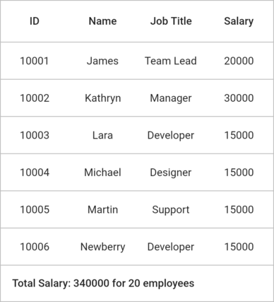
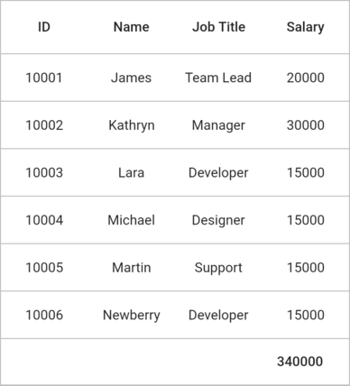
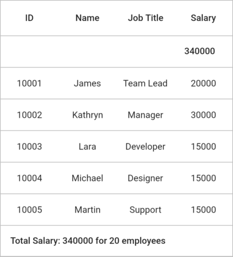
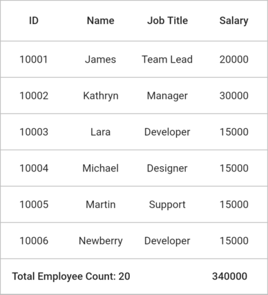
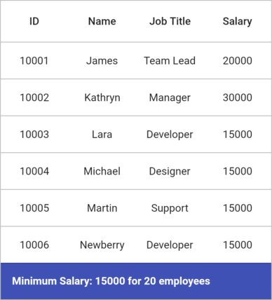
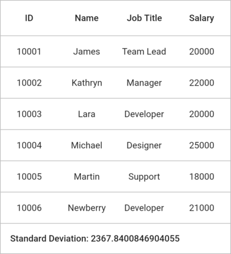

# Summaries in Flutter DataGrid (SfDataGrid)

## Table summaries

The `SfDataGrid` provides built-in support to display concise information about the `DataGridSource.rows` by using table summary rows. The table summary value is calculated based on all the data grid rows in the `DataGridSource.rows` property. You can add a table summary row to the data grid by adding the `GridTableSummaryRow` to the `SfDataGrid.tableSummaryRows` collection. 

The calculated summary value will be passed as a parameter to the `DataGridSource.buildTableSummaryCellWidget` method. You have to set a widget for the table summary column by overriding the `DataGridSource.buildTableSummaryCellWidget`.

### Display table summary for row

The summary information can be displayed in a row by setting the `GridTableSummaryRow.showSummaryInRow` property to `true` and define summary columns. The `GridTableSummaryRow.title` content will be displayed to the corresponding row. You have to define the `GridTableSummaryRow.title` based on the `GridSummaryColumn.name` property to customize the summary value.




@override
Widget build(BuildContext context) {
  return Scaffold(
    appBar: AppBar(
      title: const Text('Syncfusion Flutter DataGrid'),
    ),
    body: SfDataGrid(
      source: employeeDataSource,
      tableSummaryRows: [
        GridTableSummaryRow(
            showSummaryInRow: true,
            title: 'Total Salary: {Sum} for 20 employees',
            columns: [
              GridSummaryColumn(
                  name: 'Sum',
                  columnName: 'salary',
                  summaryType: GridSummaryType.sum)
            ],
            position: GridTableSummaryRowPosition.bottom)
      ],
      columns: <GridColumn>[
        GridColumn(
            columnName: 'id',
            label: Container(
                padding: EdgeInsets.all(16.0),
                alignment: Alignment.center,
                child: Text(
                  'ID',
                ))),
        GridColumn(
            columnName: 'name',
            label: Container(
                padding: EdgeInsets.all(8.0),
                alignment: Alignment.center,
                child: Text('Name'))),
        GridColumn(
            columnName: 'designation',
            label: Container(
                padding: EdgeInsets.all(8.0),
                alignment: Alignment.center,
                child: Text(
                  'Job Title',
                  overflow: TextOverflow.ellipsis,
                ))),
        GridColumn(
            columnName: 'salary',
            label: Container(
                padding: EdgeInsets.all(8.0),
                alignment: Alignment.center,
                child: Text('Salary'))),
      ],
    ),
  );
}

class EmployeeDataSource extends DataGridSource {
  EmployeeDataSource({required List<Employee> employeeData}) {
    _employeeData = employeeData
        .map<DataGridRow>((e) => DataGridRow(cells: [
              DataGridCell<int>(columnName: 'id', value: e.id),
              DataGridCell<String>(columnName: 'name', value: e.name),
              DataGridCell<String>(
                  columnName: 'designation', value: e.designation),
              DataGridCell<int>(columnName: 'salary', value: e.salary),
            ]))
        .toList();
  }

  List<DataGridRow> _employeeData = [];

  @override
  List<DataGridRow> get rows => _employeeData;

  @override
  Widget? buildTableSummaryCellWidget(
      GridTableSummaryRow summaryRow,
      GridSummaryColumn? summaryColumn,
      RowColumnIndex rowColumnIndex,
      String summaryValue) {
    return Container(
      padding: EdgeInsets.all(15.0),
      child: Text(summaryValue),
    );
  }

  @override
  DataGridRowAdapter buildRow(DataGridRow row) {
    return DataGridRowAdapter(
        cells: row.getCells().map<Widget>((e) {
      return Container(
        alignment: Alignment.center,
        padding: EdgeInsets.all(8.0),
        child: Text(e.value.toString()),
      );
    }).toList());
  }
}




### Display table summary for column

The summary information can be displayed in a column by setting the `GridTableSummaryRow.showSummaryInRow` property to `false`. You can define summary columns to the `GridTableSummaryRow` by addding `GridSummaryColumn` to the `GridTableSummaryRow.summaryColumns` collection. The `GridSummaryColumn` contains the following required properties,

* **`name`**: Defines name of the `GridSummaryColumn` to denote the `GridSummaryColumn` in `GridTableSummaryRow` with title.
* **`columnName`**: Defines the corresponding column name for the summary calculation.
* **`summaryType`**: Defines the summary calculation type.




@override
Widget build(BuildContext context) {
  return Scaffold(
    appBar: AppBar(
      title: const Text('Syncfusion Flutter DataGrid'),
    ),
    body: SfDataGrid(
      source: employeeDataSource,
      tableSummaryRows: [
        GridTableSummaryRow(
            showSummaryInRow: false,
            columns: [
              GridSummaryColumn(
                  name: 'Sum',
                  columnName: 'salary',
                  summaryType: GridSummaryType.sum)
            ],
            position: GridTableSummaryRowPosition.bottom)
      ],
      columns: <GridColumn>[
        GridColumn(
            columnName: 'id',
            label: Container(
                padding: EdgeInsets.all(16.0),
                alignment: Alignment.center,
                child: Text(
                  'ID',
                ))),
        GridColumn(
            columnName: 'name',
            label: Container(
                padding: EdgeInsets.all(8.0),
                alignment: Alignment.center,
                child: Text('Name'))),
        GridColumn(
            columnName: 'designation',
            label: Container(
                padding: EdgeInsets.all(8.0),
                alignment: Alignment.center,
                child: Text(
                  'Job Title',
                  overflow: TextOverflow.ellipsis,
                ))),
        GridColumn(
            columnName: 'salary',
            label: Container(
                padding: EdgeInsets.all(8.0),
                alignment: Alignment.center,
                child: Text('Salary'))),
      ],
    ),
  );
}

class EmployeeDataSource extends DataGridSource {
  EmployeeDataSource({required List<Employee> employeeData}) {
    _employeeData = employeeData
        .map<DataGridRow>((e) => DataGridRow(cells: [
              DataGridCell<int>(columnName: 'id', value: e.id),
              DataGridCell<String>(columnName: 'name', value: e.name),
              DataGridCell<String>(
                  columnName: 'designation', value: e.designation),
              DataGridCell<int>(columnName: 'salary', value: e.salary),
            ]))
        .toList();
  }

  List<DataGridRow> _employeeData = [];

  @override
  List<DataGridRow> get rows => _employeeData;

  @override
  Widget? buildTableSummaryCellWidget(
      GridTableSummaryRow summaryRow,
      GridSummaryColumn? summaryColumn,
      RowColumnIndex rowColumnIndex,
      String summaryValue) {
    return Container(
      padding: EdgeInsets.all(15.0),
      child: Text(summaryValue),
    );
  }

  @override
  DataGridRowAdapter buildRow(DataGridRow row) {
    return DataGridRowAdapter(
        cells: row.getCells().map<Widget>((e) {
      return Container(
        alignment: Alignment.center,
        padding: EdgeInsets.all(8.0),
        child: Text(e.value.toString()),
      );
    }).toList());
  }
} 




### Positioning table summary row

The `SfDataGrid` provides the support to show the table summary row at either top or bottom position by using the `GridTableSummaryRow.position` property.




@override
Widget build(BuildContext context) {
  return Scaffold(
    appBar: AppBar(
      title: const Text('Syncfusion Flutter DataGrid'),
    ),
    body: SfDataGrid(
      source: employeeDataSource,
      tableSummaryRows: [
        GridTableSummaryRow(
            showSummaryInRow: false,
            columns: [
              GridSummaryColumn(
                  name: 'Sum',
                  columnName: 'salary',
                  summaryType: GridSummaryType.sum)
            ],
            position: GridTableSummaryRowPosition.top),
        GridTableSummaryRow(
            showSummaryInRow: true,
            title: 'Total Salary: {Sum} for 20 employees',
            columns: [
              GridSummaryColumn(
                  name: 'Sum',
                  columnName: 'salary',
                  summaryType: GridSummaryType.sum)
            ],
            position: GridTableSummaryRowPosition.bottom)
      ],
      columns: <GridColumn>[
        GridColumn(
            columnName: 'id',
            label: Container(
                padding: EdgeInsets.all(16.0),
                alignment: Alignment.center,
                child: Text(
                  'ID',
                ))),
        GridColumn(
            columnName: 'name',
            label: Container(
                padding: EdgeInsets.all(8.0),
                alignment: Alignment.center,
                child: Text('Name'))),
        GridColumn(
            columnName: 'designation',
            label: Container(
                padding: EdgeInsets.all(8.0),
                alignment: Alignment.center,
                child: Text(
                  'Job Title',
                  overflow: TextOverflow.ellipsis,
                ))),
        GridColumn(
            columnName: 'salary',
            label: Container(
                padding: EdgeInsets.all(8.0),
                alignment: Alignment.center,
                child: Text('Salary'))),
      ],
    ),
  );
}

class EmployeeDataSource extends DataGridSource {
  EmployeeDataSource({required List<Employee> employeeData}) {
    _employeeData = employeeData
        .map<DataGridRow>((e) => DataGridRow(cells: [
              DataGridCell<int>(columnName: 'id', value: e.id),
              DataGridCell<String>(columnName: 'name', value: e.name),
              DataGridCell<String>(
                  columnName: 'designation', value: e.designation),
              DataGridCell<int>(columnName: 'salary', value: e.salary),
            ]))
        .toList();
  }

  List<DataGridRow> _employeeData = [];

  @override
  List<DataGridRow> get rows => _employeeData;

  @override
  Widget? buildTableSummaryCellWidget(
      GridTableSummaryRow summaryRow,
      GridSummaryColumn? summaryColumn,
      RowColumnIndex rowColumnIndex,
      String summaryValue) {
    return Container(
      padding: EdgeInsets.all(15.0),
      child: Text(summaryValue),
    );
  }

  @override
  DataGridRowAdapter buildRow(DataGridRow row) {
    return DataGridRowAdapter(
        cells: row.getCells().map<Widget>((e) {
      return Container(
        alignment: Alignment.center,
        padding: EdgeInsets.all(8.0),
        child: Text(e.value.toString()),
      );
    }).toList());
  }
}




### Summary calculation types

The summary calculation of the `GridSummaryColumn` can be calculated by the following summary types,

* **`Sum`**: Defines the sum of the specific summary column.
* **`Average`**: Defines the average of the summary column. 
* **`Count`**: Defines the count of rows available in `SfDataGrid`.
* **`Maximum`**:  Defines the maximum value of the specific summary column.
* **`Minimum`**:  Defines the minimum value of the specific summary column.

### Display table summary row with title

`SfDataGrid` supports to display column's summary along with the title simultaneously. You can display column summary along with title by defining the `GridTableSummaryRow.title` and `GridTableSummaryRow.titleColumnCount` property along with define summary columns. Showing column summary with the title can be supported only if the `GridSummaryRow.showSummaryInRow` is `false`. The `GridTableSummaryRow.titleColumnCount` property defines that how long the title should be spanned in the corresponding summary row.




@override
Widget build(BuildContext context) {
  return Scaffold(
    appBar: AppBar(
      title: const Text('Syncfusion Flutter DataGrid'),
    ),
    body: SfDataGrid(
      source: employeeDataSource,
      tableSummaryRows: [
        GridTableSummaryRow(
            showSummaryInRow: false,
            title: 'Total Employee Count: {Count}',
            titleColumnSpan: 3,
            columns: [
              GridSummaryColumn(
                  name: 'Count',
                  columnName: 'id',
                  summaryType: GridSummaryType.count),
              GridSummaryColumn(
                  name: 'Sum',
                  columnName: 'salary',
                  summaryType: GridSummaryType.sum)
            ],
            position: GridTableSummaryRowPosition.bottom),
      ],
      columns: <GridColumn>[
        GridColumn(
            columnName: 'id',
            label: Container(
                padding: EdgeInsets.all(16.0),
                alignment: Alignment.center,
                child: Text(
                  'ID',
                ))),
        GridColumn(
            columnName: 'name',
            label: Container(
                padding: EdgeInsets.all(8.0),
                alignment: Alignment.center,
                child: Text('Name'))),
        GridColumn(
            columnName: 'designation',
            label: Container(
                padding: EdgeInsets.all(8.0),
                alignment: Alignment.center,
                child: Text(
                  'Job Title',
                  overflow: TextOverflow.ellipsis,
                ))),
        GridColumn(
            columnName: 'salary',
            label: Container(
                padding: EdgeInsets.all(8.0),
                alignment: Alignment.center,
                child: Text('Salary'))),
      ],
    ),
  );
}

class EmployeeDataSource extends DataGridSource {
  EmployeeDataSource({required List<Employee> employeeData}) {
    _employeeData = employeeData
        .map<DataGridRow>((e) => DataGridRow(cells: [
              DataGridCell<int>(columnName: 'id', value: e.id),
              DataGridCell<String>(columnName: 'name', value: e.name),
              DataGridCell<String>(
                  columnName: 'designation', value: e.designation),
              DataGridCell<int>(columnName: 'salary', value: e.salary),
            ]))
        .toList();
  }

  List<DataGridRow> _employeeData = [];

  @override
  List<DataGridRow> get rows => _employeeData;

  @override
  Widget? buildTableSummaryCellWidget(
      GridTableSummaryRow summaryRow,
      GridSummaryColumn? summaryColumn,
      RowColumnIndex rowColumnIndex,
      String summaryValue) {
    return Container(
      padding: EdgeInsets.all(15.0),
      child: Text(summaryValue),
    );
  }

  @override
  DataGridRowAdapter buildRow(DataGridRow row) {
    return DataGridRowAdapter(
        cells: row.getCells().map<Widget>((e) {
      return Container(
        alignment: Alignment.center,
        padding: EdgeInsets.all(8.0),
        child: Text(e.value.toString()),
      );
    }).toList());
  }
}




### Limitations

Following limitations are applicable if displaying column summary along with title simultaneously in `GridTableSummaryRow`:

* If `SfDataGrid.frozenColumnsCount` is defined lesser than `GridTableSummaryRow.titleColumnCount`, the title summary will be spanned to `frozenColumnsCount` range, since spanned range and frozen range cannot be vary.
* Summary columns defined in the `GridSummaryRow.titleColumnCount` range will not be shown.

### Set background color for the table summary row

The `GridTableSummaryRow` color can be customized by using the `GridTableSummaryRow.color` property.




@override
Widget build(BuildContext context) {
  return Scaffold(
    appBar: AppBar(
      title: const Text('Syncfusion Flutter DataGrid'),
    ),
    body: SfDataGrid(
      source: employeeDataSource,
      tableSummaryRows: [
        GridTableSummaryRow(
            color: Colors.indigo,
            showSummaryInRow: true,
            title: 'Minimum Salary: {Minimum} for 20 employees',
            columns: [
              GridSummaryColumn(
                  name: 'Minimum',
                  columnName: 'salary',
                  summaryType: GridSummaryType.minimum)
            ],
            position: GridTableSummaryRowPosition.bottom),
      ],
      columns: <GridColumn>[
        GridColumn(
            columnName: 'id',
            label: Container(
                padding: EdgeInsets.all(16.0),
                alignment: Alignment.center,
                child: Text(
                  'ID',
                ))),
        GridColumn(
            columnName: 'name',
            label: Container(
                padding: EdgeInsets.all(8.0),
                alignment: Alignment.center,
                child: Text('Name'))),
        GridColumn(
            columnName: 'designation',
            label: Container(
                padding: EdgeInsets.all(8.0),
                alignment: Alignment.center,
                child: Text(
                  'Job Title',
                  overflow: TextOverflow.ellipsis,
                ))),
        GridColumn(
            columnName: 'salary',
            label: Container(
                padding: EdgeInsets.all(8.0),
                alignment: Alignment.center,
                child: Text('Salary'))),
      ],
    ),
  );
}

class EmployeeDataSource extends DataGridSource {
  EmployeeDataSource({required List<Employee> employeeData}) {
    _employeeData = employeeData
        .map<DataGridRow>((e) => DataGridRow(cells: [
              DataGridCell<int>(columnName: 'id', value: e.id),
              DataGridCell<String>(columnName: 'name', value: e.name),
              DataGridCell<String>(
                  columnName: 'designation', value: e.designation),
              DataGridCell<int>(columnName: 'salary', value: e.salary),
            ]))
        .toList();
  }

  List<DataGridRow> _employeeData = [];

  @override
  List<DataGridRow> get rows => _employeeData;

  @override
  Widget? buildTableSummaryCellWidget(
      GridTableSummaryRow summaryRow,
      GridSummaryColumn? summaryColumn,
      RowColumnIndex rowColumnIndex,
      String summaryValue) {
    return Container(
      padding: EdgeInsets.all(15.0),
      child: Text(
        summaryValue,
        style: TextStyle(fontWeight: FontWeight.bold, color: Colors.white),
      ),
    );
  }

  @override
  DataGridRowAdapter buildRow(DataGridRow row) {
    return DataGridRowAdapter(
        cells: row.getCells().map<Widget>((e) {
      return Container(
        alignment: Alignment.center,
        padding: EdgeInsets.all(8.0),
        child: Text(e.value.toString()),
      );
    }).toList());
  }
}




### Customize table summary calculation

SfDataGrid provides support to customize the summary calculation. You can be overriding the `DataGridSource.calculateSummaryColumn` method to write custom logic for your custom summary calculation. The `summaryColumn` parameter will be null for the spanned table summary column.

The following example demonstrates how to customize the summary calculation to find one employee's salary.




  @override
  Widget build(BuildContext context) {
    return Scaffold(
      appBar: AppBar(
        title: const Text('Syncfusion Flutter DataGrid'),
      ),
      body: SfDataGrid(
        source: employeeDataSource,
        tableSummaryRows: [
          GridTableSummaryRow(
              showSummaryInRow: true,
              title: 'Salary of James: {Salary}',
              columns: [
                GridSummaryColumn(
                    name: 'Salary',
                    columnName: 'salary',
                    summaryType: GridSummaryType.sum)
              ],
              position: GridTableSummaryRowPosition.bottom),
        ],
        columns: <GridColumn>[
          GridColumn(
              columnName: 'id',
              label: Container(
                  padding: EdgeInsets.all(16.0),
                  alignment: Alignment.center,
                  child: Text(
                    'ID',
                  ))),
          GridColumn(
              columnName: 'name',
              label: Container(
                  padding: EdgeInsets.all(8.0),
                  alignment: Alignment.center,
                  child: Text('Name'))),
          GridColumn(
              columnName: 'designation',
              label: Container(
                  padding: EdgeInsets.all(8.0),
                  alignment: Alignment.center,
                  child: Text(
                    'Job Title',
                    overflow: TextOverflow.ellipsis,
                  ))),
          GridColumn(
              columnName: 'salary',
              label: Container(
                  padding: EdgeInsets.all(8.0),
                  alignment: Alignment.center,
                  child: Text('Salary'))),
        ],
      ),
    );
  }

class EmployeeDataSource extends DataGridSource {
  EmployeeDataSource({required List<Employee> employeeData}) {
    _employeeData = employeeData
        .map<DataGridRow>((e) => DataGridRow(cells: [
              DataGridCell<int>(columnName: 'id', value: e.id),
              DataGridCell<String>(columnName: 'name', value: e.name),
              DataGridCell<String>(
                  columnName: 'designation', value: e.designation),
              DataGridCell<int>(columnName: 'salary', value: e.salary),
            ]))
        .toList();
  }

  List<DataGridRow> _employeeData = [];

  @override
  List<DataGridRow> get rows => _employeeData;

  @override
  String calculateSummaryValue(GridTableSummaryRow summaryRow,
      GridSummaryColumn? summaryColumn, RowColumnIndex rowColumnIndex) {
    String? title = summaryRow.title;
    if (title != null) {
      if (title.contains('Salary')) {
        final DataGridRow? row = rows.firstWhereOrNull((element) => element
            .getCells()
            .any((element) =>
                element.columnName == 'name' && element.value == 'James'));
        if (row != null) {
          final int salary = row
              .getCells()
              .firstWhere((element) => element.columnName == 'salary')
              .value;
          title = title.replaceAll('{Salary}', salary.toString());
        }
      }
    }
    return title ?? '';
  }

  @override
  Widget? buildTableSummaryCellWidget(
      GridTableSummaryRow summaryRow,
      GridSummaryColumn? summaryColumn,
      RowColumnIndex rowColumnIndex,
      String summaryValue) {
    return Container(
      padding: EdgeInsets.all(15.0),
      child: Text(summaryValue),
    );
  }

  @override
  DataGridRowAdapter buildRow(DataGridRow row) {
    return DataGridRowAdapter(
        cells: row.getCells().map<Widget>((e) {
      return Container(
        alignment: Alignment.center,
        padding: EdgeInsets.all(8.0),
        child: Text(e.value.toString()),
      );
    }).toList());
  }
}




