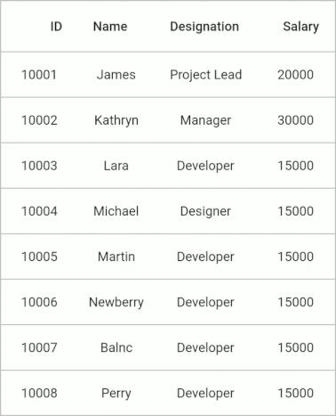
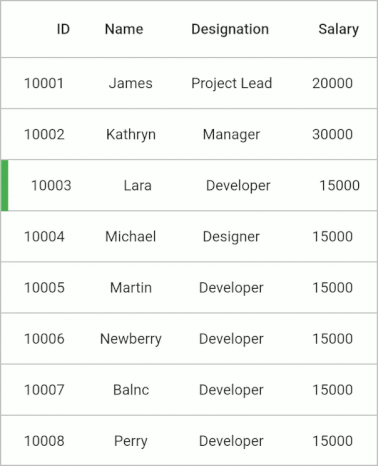

# Swiping in Flutter DataGrid

The Flutter DataTable provides support to swipe a row by setting the `SfDataGrid.allowSwiping` property to true. Swipe actions will be displayed when swiping a row from `left to right` or `right to left` direction. The swipe dragging gesture can be restricted to a certain point on the row by setting the `SfDataGrid.maxSwipeOffset` property.

## Swipe action builders

The Flutter DataTable enables you to load the desired widget behind the swiped row by using `SfDataGrid.startSwipeActionsBuilder` and `SfDataGrid.endSwipeActionsBuilder` properties. The swipe widget's width that loads from the actions builder is arranged based on the `SfDataGrid.maxSwipeOffset` property and it takes height based on the current swiping row height.


 

import 'package:syncfusion_flutter_datagrid/datagrid.dart';

@override
Widget build(BuildContext context) {
  return SfDataGrid(
    allowSwiping: true,
    source: employeeDataSource,
    startSwipeActionsBuilder: (BuildContext context, int rowIndex) {
      return GestureDetector(
        onTap: () {
          employees.insert(
              rowIndex, Employee(1011, 'Tom Bass', 'Developer', 20000));
          employeeDataSource.notifyListeners();
        },
        child: Container(
          color: Colors.greenAccent,
          child: Center(
            child: Icon(Icons.add),
          ),
        ),
      );
    },
    endSwipeActionsBuilder: (BuildContext context, int rowIndex) {
      return GestureDetector(
        onTap: () {
          employees.removeAt(rowIndex);
          employeeDataSource.notifyListeners();
        },
        child: Container(
          color: Colors.redAccent,
          child: Center(
            child: Icon(Icons.delete),
          ),
        ),
      );
    },
    columns: <GridColumn>[
      GridNumericColumn(mappingName: 'id', headerText: 'ID'),
      GridTextColumn(mappingName: 'name', headerText: 'Name'),
      GridTextColumn(mappingName: 'designation', headerText: 'Designation'),
      GridNumericColumn(mappingName: 'salary', headerText: 'Salary'),
    ],
  );
}




## Swipe callbacks

The data grid provides the following callbacks to notify the swiping stages:  

* `onSwipeStart`: Called when the swipe offset changes from its initial value. The swipe action can be canceled by return `false`.
* `onSwipeUpdate`: Called while swiping a row is in progress. The swipe action can be canceled by return `false`.
* `onSwipeEnd`: called when the swipe offset value reaches the `SfDataGrid.maxSwipeOffset` indicating that the swipe action is completed.

The swipe callbacks provide the following properties in their arguments:

* `RowIndex`: Defines the swiping row index.
* `SwipeDirection`: Defines the swipe direction of the swiped row.
* `SwipeOffset`: Defines the current swipe offset of the row being swiped.

By handling the swipe callbacks, you can use these properties value from the arguments to perform any desired action such as deleting the row, editing the data, etc.

## Customized swipes delete functionality

You can perform customized swipe functionality using the swiping callbacks. The below example shows how to delete a row when swiping a data row from one to another end.


 

import 'package:syncfusion_flutter_datagrid/datagrid.dart';

@override
Widget build(BuildContext context) {
  return LayoutBuilder(builder: (context, constraints) {
    return SfDataGrid(
      allowSwiping: true,
      swipeMaxOffset: constraints.maxWidth,
      source: employeeDataSource,
      startSwipeActionsBuilder: (BuildContext context, int rowIndex) {
        return GestureDetector(
          onTap: () {
            employees.removeAt(rowIndex);
            employeeDataSource.notifyListeners();
          },
          child: Container(
            color: Colors.greenAccent,
            child: Center(
              child: Text('Deleted', style: TextStyle(color: Colors.white)),
            ),
          ),
        );
      },
      onSwipeUpdate: (details) {
        isReachedCenter =
            (details.swipeOffset >= constraints.maxWidth / 2) ? true : false;
        return true;
      },
      onSwipeEnd: (details) async {
        if (isReachedCenter &&
            employeeDataSource.dataSource.isNotEmpty) {
          employeeDataSource.dataSource.removeAt(details.rowIndex);
          employeeDataSource.notifyListeners();
          isReachedCenter = false;
        }
      },
      columns: <GridColumn>[
        GridNumericColumn(mappingName: 'id', headerText: 'ID'),
        GridTextColumn(mappingName: 'name', headerText: 'Name'),
        GridTextColumn(mappingName: 'designation', headerText: 'Designation'),
        GridNumericColumn(mappingName: 'salary', headerText: 'Salary'),
      ],
    );
  });
}




