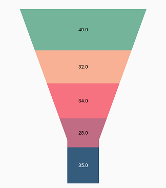
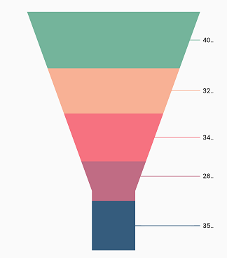
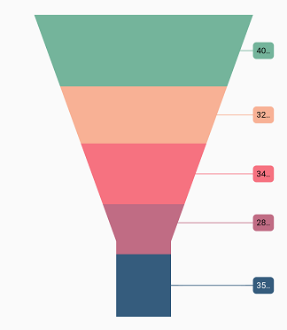
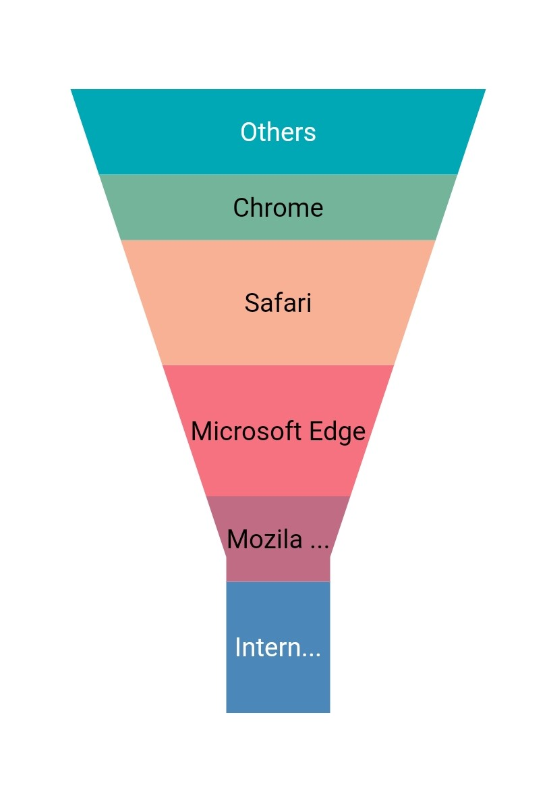

# Data label in Flutter Funnel Chart (SfFunnelChart)

Data label can be added to a chart series by enabling the [`isVisible`](https://pub.dev/documentation/syncfusion_flutter_charts/latest/charts/DataLabelSettings/isVisible.html) option in the [`dataLabelSettings`](https://pub.dev/documentation/syncfusion_flutter_charts/latest/charts/FunnelSeries/dataLabelSettings.html). You can use the following properties to customize the appearance.

* [`color`](https://pub.dev/documentation/syncfusion_flutter_charts/latest/charts/DataLabelSettings/color.html) - used to change the background color of the data label shape.
* [`borderWidth`](https://pub.dev/documentation/syncfusion_flutter_charts/latest/charts/DataLabelSettings/borderWidth.html) - used to change the stroke width of the data label shape.
* [`borderColor`](https://pub.dev/documentation/syncfusion_flutter_charts/latest/charts/DataLabelSettings/borderColor.html) - used to change the stroke color of the data label shape.
* [`alignment`](https://pub.dev/documentation/syncfusion_flutter_charts/latest/charts/DataLabelSettings/alignment.html) - aligns the data label text to [`ChartAlignment.near`](https://pub.dev/documentation/syncfusion_flutter_charts/latest/charts/ChartAlignment.html), [`ChartAlignment.center`](https://pub.dev/documentation/syncfusion_flutter_charts/latest/charts/ChartAlignment.html) and [`ChartAlignment.far`](https://pub.dev/documentation/syncfusion_flutter_charts/latest/charts/ChartAlignment.html).
* [`textStyle`](https://pub.dev/documentation/syncfusion_flutter_charts/latest/charts/DataLabelSettings/textStyle.html) - used to change the data label text color, size, font family, font style, and font weight.
* [`color`](https://pub.dev/documentation/syncfusion_flutter_charts/latest/charts/DataLabelSettings/color.html) - used to change the color of the data label.
* [`fontFamily`](https://api.flutter.dev/flutter/painting/TextStyle/fontFamily.html) - used to change the font family for the data label.
* [`fontStyle`](https://api.flutter.dev/flutter/painting/TextStyle/fontStyle.html) - used to change the font style for the data label.
* [`fontWeight`](https://api.flutter.dev/flutter/painting/TextStyle/fontWeight.html) - used to change the font weight for the data label.
* [`fontSize`](https://api.flutter.dev/flutter/painting/TextStyle/fontSize.html) - used to change the font size for the data label.
* [`margin`](https://pub.dev/documentation/syncfusion_flutter_charts/latest/charts/DataLabelSettings/margin.html) - used to change the margin size for data labels.
* [`opacity`](https://pub.dev/documentation/syncfusion_flutter_charts/latest/charts/DataLabelSettings/opacity.html) - used to control the transparency of the data label.
* [`labelAlignment`](https://pub.dev/documentation/syncfusion_flutter_charts/latest/charts/DataLabelSettings/labelAlignment.html) - used to align the Funnel data label positions. The available options to customize the positions are [`ChartDataLabelAlignment.outer`](https://pub.dev/documentation/syncfusion_flutter_charts/latest/charts/ChartDataLabelAlignment.html), [`ChartDataLabelAlignment.auto`](https://pub.dev/documentation/syncfusion_flutter_charts/latest/charts/ChartDataLabelAlignment.html), [`ChartDataLabelAlignment.top`](https://pub.dev/documentation/syncfusion_flutter_charts/latest/charts/ChartDataLabelAlignment.html), [`ChartDataLabelAlignment.bottom`](https://pub.dev/documentation/syncfusion_flutter_charts/latest/charts/ChartDataLabelAlignment.html) and [`ChartDataLabelAlignment.middle`](https://pub.dev/documentation/syncfusion_flutter_charts/latest/charts/ChartDataLabelAlignment.html).
* [`borderRadius`](https://pub.dev/documentation/syncfusion_flutter_charts/latest/charts/DataLabelSettings/borderRadius.html) - used to add the rounded corners to the data label shape.
* [`angle`](https://pub.dev/documentation/syncfusion_flutter_charts/latest/charts/DataLabelSettings/angle.html)  - used to rotate the labels.

 

    @override
    Widget build(BuildContext context) {
        List<ChartData> chartData = [
            ChartData('Jan', 35),
            ChartData('Feb', 28),
            ChartData('Mar', 38),
            ChartData('Apr', 32),
            ChartData('May', 40)
        ];
        return Scaffold(
            body: Center(
                child: Container(
                    child: SfFunnelChart(
                        series: FunnelSeries<ChartData, String>(
                                dataSource: chartData,
                                xValueMapper: (ChartData data, _) => data.x,
                                yValueMapper: (ChartData data, _) => data.y,
                                dataLabelSettings: DataLabelSettings(
                                    // Renders the data label
                                    isVisible: true
                                )
                            )
                    )
                )
            )
        );
    }
    class ChartData{
        ChartData(this.x, this.y);
        final String x;
        final double? y;
    }



## Positioning the labels

The [`labelAlignment`](https://pub.dev/documentation/syncfusion_flutter_charts/latest/charts/DataLabelSettings/labelAlignment.html) property is used to position the Funnel chart type data labels at [`ChartDataLabelAlignment.top`](https://pub.dev/documentation/syncfusion_flutter_charts/latest/charts/ChartDataLabelAlignment.html), [`ChartDataLabelAlignment.bottom`](https://pub.dev/documentation/syncfusion_flutter_charts/latest/charts/ChartDataLabelAlignment.html), [`ChartDataLabelAlignment.auto`](https://pub.dev/documentation/syncfusion_flutter_charts/latest/charts/ChartDataLabelAlignment.html), [`ChartDataLabelAlignment.outer`](https://pub.dev/documentation/syncfusion_flutter_charts/latest/charts/ChartDataLabelAlignment.html) and [`ChartDataLabelAlignment.middle`](https://pub.dev/documentation/syncfusion_flutter_charts/latest/charts/ChartDataLabelAlignment.html) position of the actual data point position. By default, labels are [`ChartDataLabelAlignment.auto`](https://pub.dev/documentation/syncfusion_flutter_charts/latest/charts/ChartDataLabelAlignment.html) positioned. You can move the labels horizontally and vertically using OffsetX and OffsetY properties respectively.

The [`labelPosition`](https://pub.dev/documentation/syncfusion_flutter_charts/latest/charts/DataLabelSettings/labelPosition.html) property is used to place the Funnel series data labels either [`ChartDataLabelPosition.inside`](https://pub.dev/documentation/syncfusion_flutter_charts/latest/charts/ChartDataLabelPosition.html) or [`ChartDataLabelPosition.outside`](https://pub.dev/documentation/syncfusion_flutter_charts/latest/charts/ChartDataLabelPosition.html). By default the label of Funnel chart is placed [`ChartDataLabelPosition.inside`](https://pub.dev/documentation/syncfusion_flutter_charts/latest/charts/ChartDataLabelPosition.html) the series.

 

    @override
    Widget build(BuildContext context) {
        return Scaffold(
            body: Center(
                child: Container(
                    child: SfFunnelChart(
                        series: FunnelSeries<ChartData, String>(
                                dataSource: chartData,
                                xValueMapper: (ChartData data, _) => data.x,
                                yValueMapper: (ChartData data, _) => data.y,
                                dataLabelSettings: DataLabelSettings(
                                    isVisible: true,
                                    // Positioning the data label
                                    labelPosition: ChartDataLabelPosition.outside
                                )
                            )
                    )
                )
            )
        );
    }



>**Note**: The [`labelAlignment`](https://pub.dev/documentation/syncfusion_flutter_charts/latest/charts/DataLabelSettings/labelAlignment.html) property is used to position the Funnel chart labels whereas [`labelPosition`](https://pub.dev/documentation/syncfusion_flutter_charts/latest/charts/DataLabelSettings/labelPosition.html) property is used to position the Funnel chart labels.

## Apply series color

The [`useSeriesColor`](https://pub.dev/documentation/syncfusion_flutter_charts/latest/charts/DataLabelSettings/useSeriesColor.html) property is used to apply the series color to background color of the data labels. The default value of this property is `false`.

 

    @override
    Widget build(BuildContext context) {
        return Scaffold(
            body: Center(
                child: Container(
                    child: SfFunnelChart(
                        series: FunnelSeries<ChartData, String>(
                                dataSource: chartData,
                                xValueMapper: (ChartData data, _) => data.x,
                                yValueMapper: (ChartData data, _) => data.y,
                                dataLabelSettings: DataLabelSettings(
                                    isVisible: true,
                                    // Positioning the data label
                                    labelPosition: ChartDataLabelPosition.outside,
                                    // Renders background rectangle and fills it with series color
                                    useSeriesColor: true
                                )
                            )
                    )
                )
            )
        );
    }



## Hide data label for 0 value

Data label and its connector line in the Funnel charts for the point value 0 can be hidden using the [`showZeroValue`](https://pub.dev/documentation/syncfusion_flutter_charts/latest/charts/DataLabelSettings/showZeroValue.html) property. This defaults to `true`.

 

    @override
    Widget build(BuildContext context) {
        return Scaffold(
            body: Center(
                    child:SfFunnelChart(
                        series: FunnelSeries<ChartData, num>(
                            dataSource: [
                                ChartData(11, 35),
                                ChartData(12, 28),
                                ChartData(13, 0),
                                ChartData(14, 32),
                                ChartData(15, 40)
                            ],
                            xValueMapper: (ChartData data, _) => data.xValue,
                            yValueMapper: (ChartData data, _) => data.yValue,
                            dataLabelSettings: DataLabelSettings(
                                showZeroValue: false,
                                isVisible: true
                            ),
                        )
                    )
            )
        );
    }


## Data label saturation color

If the user didn’t provide text color to the data label, then by default, the saturation color is applied to the data label text. i.e., if the data points background color intensity is dark, then the data label will render in white color (#FFFFFF) and if the data points background color intensity is light, data label will render in black color (#000000).

## Overflow mode

Action on data labels when it’s overflowing from its region area. The overflowing data label rendering behavior can be changed based on this. If [`overflowMode`](https://pub.dev/documentation/syncfusion_flutter_charts/latest/charts/DataLabelSettings/overflowMode.html) property is set to [`OverflowMode.none`](https://pub.dev/documentation/syncfusion_flutter_charts/latest/charts/DataLabelSettings/overflowMode.html) then the [`labelIntersectAction`](https://pub.dev/documentation/syncfusion_flutter_charts/latest/charts/DataLabelSettings/labelIntersectAction.html) takes the priority, else [`overflowMode`](https://pub.dev/documentation/syncfusion_flutter_charts/latest/charts/DataLabelSettings/overflowMode.html) takes the priority.

Defaults to [`OverflowMode.none`](https://pub.dev/documentation/syncfusion_flutter_charts/latest/charts/DataLabelSettings/overflowMode.html).
  
>**Note**: This is applicable for pie, doughnut, pyramid, and funnel series types alone.



    Widget build(BuildContext context) {
        return Container(
            child: SfFunnelChart(
            series: FunnelSeries<ChartData, String>(
             dataLabelSettings: DataLabelSettings(
               isVisible: true,
               overflowMode: OverflowMode.trim
                    ),
                ),
            ),
        );
    }


