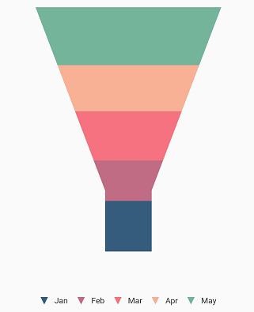
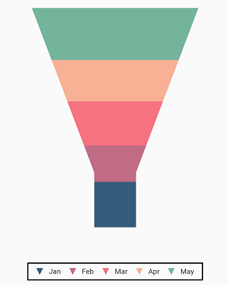
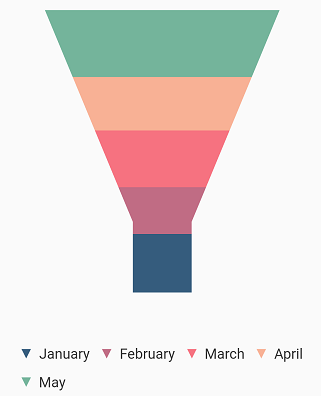
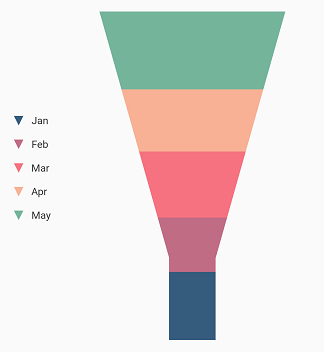

# Legend in Flutter Funnel Chart (SfFunnelChart)

The [`legend`](https://pub.dev/documentation/syncfusion_flutter_charts/latest/charts/SfFunnelChart/legend.html) contains list of chart series/data points in chart. The information provided in each legend item helps to identify the corresponding data series in chart.

 

      @override
      Widget build(BuildContext context) {
        List<ChartData> chartData = [
            ChartData('Jan', 35),
            ChartData('Feb', 28),
            ChartData('Mar', 38),
            ChartData('Apr', 32),
            ChartData('May', 40)
        ];
        return Scaffold(
          body: Center(
            child: Container(
              child: SfFunnelChart(
              legend: Legend(isVisible: true),
              series: FunnelSeries<ChartData, String>(
                    dataSource:chartData,
                    xValueMapper: (ChartData data, _) =>   data.x,
                    yValueMapper: (ChartData data, _) => data.y
                  )
              )
            )
          )
        );
      }
    class ChartData {
      ChartData(this.x, this.y);
      final String x;
      final double y;
    }




## Customizing legend 

The [`name`](https://pub.dev/documentation/syncfusion_flutter_charts/latest/charts/FunnelSeries/name.html) property of [`FunnelSeries`](https://pub.dev/documentation/syncfusion_flutter_charts/latest/charts/FunnelSeries-class.html) is used to define the label for the corresponding series legend item and for [`FunnelSeries`](https://pub.dev/documentation/syncfusion_flutter_charts/latest/charts/FunnelSeries-class.html) type chart by default values mapped with [`xValueMapper`](https://pub.dev/documentation/syncfusion_flutter_charts/latest/charts/FunnelSeries/xValueMapper.html) will be displayed. The appearance of the label can be customized using the below properties.
* [`borderWidth`](https://pub.dev/documentation/syncfusion_flutter_charts/latest/charts/Legend/borderWidth.html) - used to change the stroke width of the legend shape.
* [`borderColor`](https://pub.dev/documentation/syncfusion_flutter_charts/latest/charts/Legend/borderColor.html) - used to change the stroke color of the legend shape.
* [`backgroundColor`](https://pub.dev/documentation/syncfusion_flutter_charts/latest/charts/Legend/backgroundColor.html) - used to change the background color of legend shape.
* [`opacity`](https://pub.dev/documentation/syncfusion_flutter_charts/latest/charts/Legend/opacity.html) - used to control the transparency of the legend icon shape.
* [`padding`](https://pub.dev/documentation/syncfusion_flutter_charts/latest/charts/Legend/padding.html) - used to add padding between the icon shape and the text.
* [`iconHeight`](https://pub.dev/documentation/syncfusion_flutter_charts/latest/charts/Legend/iconHeight.html) - used to change the height of the icon shape.
* [`iconWidth`](https://pub.dev/documentation/syncfusion_flutter_charts/latest/charts/Legend/iconWidth.html) - used to change the width of the icon shape.
* [`borderWidth`](https://pub.dev/documentation/syncfusion_flutter_charts/latest/charts/Legend/borderWidth.html) - used to change the stroke width of the legend icon shape.
* [`iconBorderColor`](https://pub.dev/documentation/syncfusion_flutter_charts/latest/charts/Legend/iconBorderColor.html) - used to change the stroke color of the legend icon shape.
* [`itemPadding`](https://pub.dev/documentation/syncfusion_flutter_charts/latest/charts/Legend/itemPadding.html) - used to add padding between the first legend text and the second legend icon shape.


 

      @override
      Widget build(BuildContext context) {
        return Scaffold(
          appBar: AppBar(actions: <Widget>[Text('')],),
          body: Center(
            child: Container(
              child: SfFunnelChart(
              legend: Legend(isVisible: true,
              // Border color and border width of legend
                borderColor: Colors.black,
                borderWidth: 2
              ),
              series: FunnelSeries<ChartData, String>(
                    dataSource:chartData,
                    xValueMapper: (ChartData data, _) =>   data.x,
                    yValueMapper: (ChartData data, _) => data.y
                  )
              )
            )
          )
        );
      }




## Legend title

The following properties can be used to define and customize the [`title`](https://pub.dev/documentation/syncfusion_flutter_charts/latest/charts/Legend/title.html) of [`legend`](https://pub.dev/documentation/syncfusion_flutter_charts/latest/charts/SfFunnelChart/legend.html).

* [`text`](https://pub.dev/documentation/syncfusion_flutter_charts/latest/charts/LegendTitle/text.html) - used to change the text of the title.
* [`textStyle`](https://pub.dev/documentation/syncfusion_flutter_charts/latest/charts/Legend/textStyle.html) - used to change the text color, size, font family, fontStyle, and font weight.
* [`color`](https://api.flutter.dev/flutter/painting/TextStyle/color.html) - used to change the color of the text.
* [`fontFamily`](https://api.flutter.dev/flutter/painting/TextStyle/fontFamily.html) - used to change the font family for legend text. 
* [`fontStyle`](https://api.flutter.dev/flutter/painting/TextStyle/fontStyle.html) - used to change the font style for the legend text.
* [`fontSize`](https://api.flutter.dev/flutter/painting/TextStyle/fontSize.html) - used to change the font size for the legend text.
* [`alignment`](https://pub.dev/documentation/syncfusion_flutter_charts/latest/charts/Legend/alignment.html) - used to change the alignment of the title text. It can be near, center, or far.


 

      @override
      Widget build(BuildContext context) {
        return Scaffold(
          appBar: AppBar(actions: <Widget>[Text('')],),
          body: Center(
            child: Container(
              child: SfFunnelChart(
              legend: Legend(isVisible: true,
              title: LegendTitle(
                      text:'Months',
                      textStyle: TextStyle(
                      color: Colors.red,
                      fontSize: 15,
                      fontStyle: FontStyle.italic,
                      fontWeight: FontWeight.w900
                    )
                  ),
              ),
              series: FunnelSeries<ChartData, String>(
                    dataSource:chartData,
                    xValueMapper: (ChartData data, _) =>   data.x,
                    yValueMapper: (ChartData data, _) => data.y
                  )
              )
            )
          )
        );
      }




## Toggles the series visibility

You can control the visibility of the series by tapping the legend item. You can enable this feature by enabling the [`toggleSeriesVisibility`](https://pub.dev/documentation/syncfusion_flutter_charts/latest/charts/Legend/toggleSeriesVisibility.html) property.

 

      @override
      Widget build(BuildContext context) {
        return Scaffold(
          appBar: AppBar(actions: <Widget>[Text('')],),
          body: Center(
            child: Container(
              child: SfFunnelChart(
              legend: Legend(isVisible: true,
               // Toogles the series visibility on tapping the legend item
                toggleSeriesVisibility: true
              ),
              series: FunnelSeries<ChartData, String>(
                    dataSource:chartData,
                    xValueMapper: (ChartData data, _) =>   data.x,
                    yValueMapper: (ChartData data, _) => data.y
                  )
              )
            )
          )
        );
      }




## Legend visibility

The [`isVisible`](https://pub.dev/documentation/syncfusion_flutter_charts/latest/charts/Legend/isVisible.html) property of [`legend`](https://pub.dev/documentation/syncfusion_flutter_charts/latest/charts/SfFunnelChart/legend.html) is used to toggle the visibility of legend.

 

      @override
      Widget build(BuildContext context) {
        return Scaffold(
          appBar: AppBar(actions: <Widget>[Text('')],),
          body: Center(
            child: Container(
              child: SfFunnelChart(
              legend: Legend(
                // Visibility of legend
                isVisible: false
              ),
              series: FunnelSeries<ChartData, String>(
                    dataSource:chartData,
                    xValueMapper: (ChartData data, _) =>   data.x,
                    yValueMapper: (ChartData data, _) => data.y
                  )
              )
            )
          )
        );
      }




## Legend overflow

The legend items can be placed in multiple rows or scroll can be enabled using the [`overflowMode`](https://pub.dev/documentation/syncfusion_flutter_charts/latest/charts/Legend/overflowMode.html) property if size of the total legend items exceeds the available size. The default value of the [`overflowMode`](https://pub.dev/documentation/syncfusion_flutter_charts/latest/charts/Legend/overflowMode.html) property is [`LegendItemOverflowMode.scroll`](https://pub.dev/documentation/syncfusion_flutter_charts/latest/charts/LegendItemOverflowMode.html).

 

      @override
      Widget build(BuildContext context) {
        return Scaffold(
          appBar: AppBar(actions: <Widget>[Text('')],),
          body: Center(
            child: Container(
              child: SfFunnelChart(
              legend: Legend(
                isVisible: true,
                // Overflowing legend content will be wraped
                overflowMode: LegendItemOverflowMode.wrap
              ),
              series: FunnelSeries<ChartData, String>(
                    dataSource:chartData,
                    xValueMapper: (ChartData data, _) =>   data.x,
                    yValueMapper: (ChartData data, _) => data.y
                  )
              )
            )
          )
        );
      }




## Positioning the legend

You can change the position of the legend inside the chart. The following properties are used to customize the position of legend. **auto** position will place the legend at the right, if the chart's width is greater than the chart's height. Else the legend will be placed at the bottom position.

* [`position`](https://pub.dev/documentation/syncfusion_flutter_charts/latest/charts/Legend/position.html) - used to position the legend relatively. The available options are auto, bottom, left, right, and top. Defaults to [`LegendPosition.auto`](https://pub.dev/documentation/syncfusion_flutter_charts/latest/charts/LegendPosition.html).
* [`orientation`](https://pub.dev/documentation/syncfusion_flutter_charts/latest/charts/Legend/orientation.html) - used to change the orientation of the legend, the default value is [`LegendItemOrientation.auto`](https://pub.dev/documentation/syncfusion_flutter_charts/latest/charts/LegendItemOrientation.html). Also you can set [`LegendItemOrientation.horizontal`](https://pub.dev/documentation/syncfusion_flutter_charts/latest/charts/LegendItemOrientation.html) or [`LegendItemOrientation.vertical`](https://pub.dev/documentation/syncfusion_flutter_charts/latest/charts/LegendItemOrientation.html).

 

      @override
      Widget build(BuildContext context) {
        return Scaffold(
          appBar: AppBar(actions: <Widget>[Text('')],),
          body: Center(
            child: Container(
              child: SfFunnelChart(
              legend: Legend(
                isVisible: true,
                // Legend will be placed at the left
                position: LegendPosition.left
              ),
              series: FunnelSeries<ChartData, String>(
                    dataSource:chartData,
                    xValueMapper: (ChartData data, _) =>   data.x,
                    yValueMapper: (ChartData data, _) => data.y
                  )
              )
            )
          )
        );
      }




## Floating legend

Places the legend in custom position. If the [`offset`](https://pub.dev/documentation/syncfusion_flutter_charts/latest/charts/Legend/offset.html) has been set, the legend is moved from its actual position. For example, if the [`position`](https://pub.dev/documentation/syncfusion_flutter_charts/latest/charts/Legend/position.html) is [`LegendPosition.top`](https://pub.dev/documentation/syncfusion_flutter_charts/latest/charts/LegendPosition.html), then the legend will be placed in the top but in the position added to the actual top position. 
Also, the legend will not take a dedicated position for it and will be drawn on the top of the chart's plot area.



    @override
    Widget build(BuildContext context) {
      return Scaffold(
          body: Center(
            child: Container(
              child: SfFunnelChart(
                legend: Legend(
                  isVisible: true,
                  // Legend will placed at the specified offset
                  offset: Offset(20, 40)),
            series: FunnelSeries<ChartData, String>(
                dataSource: chartData,
                xValueMapper: (ChartData data, _) => data.x,
                yValueMapper: (ChartData data, _) => data.y),
          ))));
    }

    class ChartData {
        ChartData(this.x, this.y);
        final String x;
        final double? y;
    }




## Legend item template

You can customize the appearance of legend items with your template by using [`legendItemBuilder`](https://pub.dev/documentation/syncfusion_flutter_charts/latest/charts/Legend/legendItemBuilder.html) property of [`legend`](https://pub.dev/documentation/syncfusion_flutter_charts/latest/charts/SfFunnelChart/legend.html). Here you can specify the content that needs to be displayed in the legend text as widget.


 

      @override
      Widget build(BuildContext context) {
        return Scaffold(
          appBar: AppBar(actions: <Widget>[Text('')],),
          body: Center(
            child: Container(
              child: SfFunnelChart(
              legend: Legend(
                isVisible: true,
                // Templating the legend item
                legendItemBuilder: (String name, dynamic series, dynamic point, int index) {
                  return Container(
                    height: 20,
                    width: 10,
                    child: Container(child: Text(point.y.toString()))
                  );
                }
              ),
              series: FunnelSeries<ChartData, String>(
                    dataSource:chartData,
                    xValueMapper: (ChartData data, _) =>   data.x,
                    yValueMapper: (ChartData data, _) => data.y
                  )
              )
            )
          )
        );
      }



