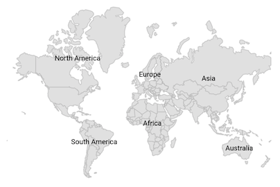
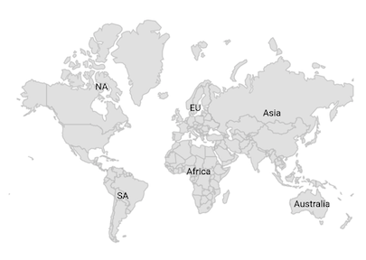
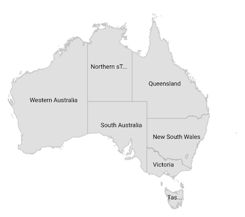

# Data labels in the Flutter Maps

Data labels provides identification for the shapes by displaying their names. Trim or hide the labels if they exceed shape bounds.

## Show data labels

You can show data labels in the map using the `showDataLabels` property in the `MapShapeLayer`. By default, the data labels are rendered based on the value of `shapeDataField` property.




@override
Widget build(BuildContext context) {
  return Scaffold(
    body: Center(
      child: Container(
        height: 350,
        child: Padding(
          padding: EdgeInsets.only(left: 15, right: 15),
          child: SfMaps(
            layers: [
              MapShapeLayer(
                delegate: MapShapeLayerDelegate(
                    shapeFile: "assets/world_map.json",
                    shapeDataField: "continent",
                ),
                showDataLabels: true,
              ),
            ],
          ),
        ),
      ),
    ),
  );
}




## Data labels customization

You can customize the data labels by setting value to the `dataLabelMapper` property based on the value given in the underlying model.




List<Model> data;

@override
void initState() {
    super.initState();
    data = const <Model>[
      Model('Asia', 'Asia'),
      Model('Europe', 'EU'),
      Model('North America', 'NA'),
      Model('South America', 'SA'),
      Model('Australia', 'Australia'),
      Model('Africa', 'Africa')
    ];
}

@override
Widget build(BuildContext context) {
    return Scaffold(
      body: Center(
        child: Container(
          height: 350,
          child: Padding(
            padding: EdgeInsets.only(left: 15, right: 15),
            child: SfMaps(
              layers: [
                MapShapeLayer(
                  delegate: MapShapeLayerDelegate(
                      shapeFile: "assets/world_map.json",
                      shapeDataField: "continent",
                    dataCount: data.length,
                    primaryValueMapper: (int index) => data[index].continent,
                    dataLabelMapper: (int index) => data[index].code,
                  ),
                  showDataLabels: true,
                ),
              ],
            ),
          ),
        ),
      ),
   );
}

class Model {
  const Model(this.continent, this.code);

  final String continent;
  final String code;
}




## Overflow mode

You can trim or remove the data label when it is overflowed from the shape using the `overflowMode` property in the `dataLabelSettings` property. The default value of the `overflowMode` property is `MapLabelOverflowMode.none`.

By default, the data labels will render even if it overflows from the shape. Using this property, it is possible to remove or trim the data labels based on the available space.




List<Model> data;

@override
void initState() {
    data = <Model>[
      Model('New South Wales', 'New South Wales'),
      Model('Queensland', 'Queensland'),
      Model('Northern Territory', 'Northern sTerritory'),
      Model('Victoria', 'Victoria'),
      Model('South Australia', 'South Australia'),
      Model('Western Australia', 'Western Australia'),
      Model('Tasmania', 'Tasmania'),
    ];
    super.initState();
}

@override
Widget build(BuildContext context) {
    return Scaffold(
      body: Center(
        child: Container(
          height: 350,
          child: Padding(
            padding: EdgeInsets.only(left: 15, right: 15),
            child: SfMaps(
              layers: [
                MapShapeLayer(
                  delegate: MapShapeLayerDelegate(
                    shapeFile: 'assets/australia.json',
                    shapeDataField: 'STATE_NAME',
                    dataCount: data.length,
                    primaryValueMapper: (int index) => data[index].state,
                    dataLabelMapper: (int index) => data[index].dataLabel,
                  ),
                  showDataLabels: true,
                  dataLabelSettings: MapDataLabelSettings(
                    overflowMode: MapLabelOverflowMode.trim,
                    textStyle: TextStyle(fontStyle: FontStyle.italic, color: Colors.black),
                  ),
                ),
              ],
            ),
          ),
        ),
      ),
   );
}

class Model {
  Model(this.state, this.dataLabel);

  String state;
  String dataLabel;
}




