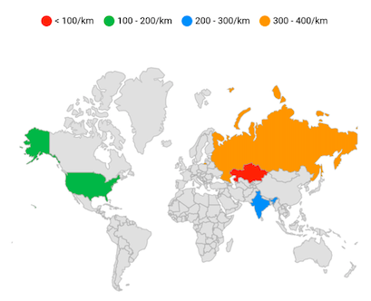
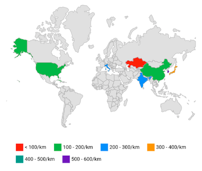

# Legend in the Flutter Maps

You can provide clear information on the data plotted on the map using legend.

## Show legend

You can show legend using the `showLegend` property in the `MapShapeLayer`. By default, the legend item's text is rendered based on the value of `shapeDataField` property. The default value of the `showLegend` property is `false`.




@override
Widget build(BuildContext context) {
    return Scaffold(
      body: Center(
        child: Container(
          height: 350,
          child: Padding(
            padding: EdgeInsets.only(left: 15, right: 15),
            child: SfMaps(
              layers: [
                MapShapeLayer(
                  delegate: MapShapeLayerDelegate(
                    shapeFile: "assets/world_map.json",
                    shapeDataField: "continent",
                  ),
                  showLegend: true,
                ),
              ],
            ),
          ),
        ),
      ),
   );
}




## Legend icon and text customization

The icon color of the legend is applied based on the color returned from the `MapShapeLayerDelegate.shapeColorValueMapper` property and the text is taken from the `shapeDataField`. It is possible to customize the legend item's color and text using the `MapColorMapper.color` and `MapColorMapper.text` properties based on the `MapColorMapper.value` or `MapColorMapper.from` and `MapColorMapper.to` properties.




List<Model> data;

@override
void initState() {
    super.initState();
    data = <Model>[
      Model('India', 280),
      Model('United States of America', 190),
      Model('Kazakhstan', 37),
      Model('Russia', 310)
    ];
}

@override
Widget build(BuildContext context) {
    return Scaffold(
      body: Center(
        child: Container(
          height: 350,
          child: Padding(
            padding: EdgeInsets.only(left: 15, right: 15),
            child: SfMaps(
              layers: [
                MapShapeLayer(
                  delegate: MapShapeLayerDelegate(
                      shapeFile: "assets/world_map.json",
                      shapeDataField: "name",
                      dataCount: data.length,
                      primaryValueMapper: (int index) => data[index].country,
                      shapeColorValueMapper: (int index) => data[index].density,
                      shapeColorMappers: [
                        MapColorMapper(from: 0, to: 100, color: Colors.red, text: '< 100/km'),
                        MapColorMapper(from: 101, to: 200, color: Colors.green, text:'100 - 200/km'),
                        MapColorMapper(from: 201, to: 300, color: Colors.blue, text:'200 - 300/km'),
                        MapColorMapper(from: 301, to: 400, color: Colors.orange, text:'300 - 400/km'),
                      ]
                  ),
                  showLegend: true,
                )
              ],
            ),
          ),
        ),
      ),
   );
}

class Model {
  const Model(this.country, this.density);

  final String country;
  final double density;
}




## Legend position

You can position the legend items in different directions using the `position` property. The default value of the `position` property is `MapLegendPosition.top`. The possibles values are `left`, `right`, `top`, and `bottom`.




List<Model> data;

@override
void initState() {
  super.initState();
  data = <Model>[
      Model('India', 280),
      Model('United States of America', 190),
      Model('Kazakhstan', 37),
      Model('Italy', 201),
      Model('Korea', 512),
      Model('Japan', 335),
      Model('Cuba', 103),
      Model('China', 148)
  ];
}

@override
Widget build(BuildContext context) {
    return Scaffold(
      body: Center(
        child: Container(
          height: 350,
          child: Padding(
            padding: EdgeInsets.only(left: 15, right: 15),
            child: SfMaps(
              layers: [
                MapShapeLayer(
                  delegate: MapShapeLayerDelegate(
                      shapeFile: "assets/world_map.json",
                      shapeDataField: "name",
                      dataCount: data.length,
                      primaryValueMapper: (int index) => data[index].country,
                      shapeColorValueMapper: (int index) => data[index].density,
                      shapeColorMappers: [
                        MapColorMapper(from: 0,
                            to: 100,
                            color: Colors.red,
                            text: '< 100/km'),
                        MapColorMapper(from: 101,
                            to: 200,
                            color: Colors.green,
                            text: '100 - 200/km'),
                        MapColorMapper(from: 201,
                            to: 300,
                            color: Colors.blue,
                            text: '200 - 300/km'),
                        MapColorMapper(from: 301,
                            to: 400,
                            color: Colors.orange,
                            text: '300 - 400/km'),
                        MapColorMapper(from: 401,
                            to: 500,
                            color: Colors.teal,
                            text: '400 - 500/km'),
                        MapColorMapper(from: 501,
                            to: 600,
                            color: Colors.deepPurple,
                            text: '500 - 600/km'),
                      ]
                  ),
                  showLegend: true,
                  legendSettings: MapLegendSettings(
                    position: MapLegendPosition.right,
                  ),
                )
              ],
            ),
          ),
        ),
      ),
   );
}

class Model {
  const Model(this.country, this.density);

  final String country;
  final double density;
}




## Overflow mode

You can wrap or scroll the legend items using the `overflowMode` property. The default value of the `overflowMode` property is `MapLegendOverflowMode.wrap`. The possible values such as `scroll` and `wrap`.

If the legend position is `left` or `right`, then the default scroll direction is vertical.

If the legend position is `top` or `bottom`, then the default scroll direction is horizontal.




List<Model> data;

@override
void initState() {
   super.initState();
   data = <Model>[
      Model('India', 280),
      Model('United States of America', 190),
      Model('Kazakhstan', 37),
      Model('Italy', 201),
      Model('Korea', 512),
      Model('Japan', 335),
      Model('Cuba', 103),
      Model('China', 148)
   ];
}

@override
Widget build(BuildContext context) {
    return Scaffold(
      body: Center(
        child: Container(
          height: 350,
          child: Padding(
            padding: EdgeInsets.only(left: 15, right: 15),
            child: SfMaps(
              layers: [
                MapShapeLayer(
                  delegate: MapShapeLayerDelegate(
                      shapeFile: "assets/world_map.json",
                      shapeDataField: "name",
                      dataCount: data.length,
                      primaryValueMapper: (int index) => data[index].country,
                      shapeColorValueMapper: (int index) => data[index].density,
                      shapeColorMappers: [
                        MapColorMapper(from: 0,
                            to: 100,
                            color: Colors.red,
                            text: '< 100/km'),
                        MapColorMapper(from: 101,
                            to: 200,
                            color: Colors.green,
                            text: '100 - 200/km'),
                        MapColorMapper(from: 201,
                            to: 300,
                            color: Colors.blue,
                            text: '200 - 300/km'),
                        MapColorMapper(from: 301,
                            to: 400,
                            color: Colors.orange,
                            text: '300 - 400/km'),
                        MapColorMapper(from: 401,
                            to: 500,
                            color: Colors.teal,
                            text: '400 - 500/km'),
                        MapColorMapper(from: 501,
                            to: 600,
                            color: Colors.deepPurple,
                            text: '500 - 600/km'),
                      ]
                  ),
                  showLegend: true,
                  legendSettings: MapLegendSettings(
                    position: MapLegendPosition.bottom,
                    overflowMode: MapLegendOverflowMode.wrap
                  ),
                )
              ],
            ),
          ),
        ),
      ),
   );
}

class Model {
  const Model(this.country, this.density);

  final String country;
  final double density;
}




## Toggles the legend items

You can enable toggling the legend items and the corresponding shapes using the `enableToggleInteraction` property. The default value of the `enableToggleInteraction` property is `false`. You can customize the toggled shapes using the following properties:

* **toggledShapeColor** - Used to set the color for the toggled legend item's icon and it's shape.
* **toggledShapeStrokeColor** - Used to set the stroke color which applies to the toggled legend item's shape.
* **toggledShapeStrokeWidth** - Used to set the stroke width which applies to the toggled legend item's shape.
* **toggledShapeOpacity** - Used to set the opacity to the toggled legend item's shape.



List<Model> data;

@override
void initState() {
   super.initState();
   data = <Model>[
      Model('India', 280),
      Model('United States of America', 190),
      Model('Kazakhstan', 37),
      Model('Italy', 201),
      Model('Korea', 512),
      Model('Japan', 335),
      Model('Cuba', 103),
      Model('China', 148)
   ];
}

@override
Widget build(BuildContext context) {
    return Scaffold(
      body: Center(
        child: Container(
          height: 350,
          child: Padding(
            padding: EdgeInsets.only(left: 15, right: 15),
            child: SfMaps(
              layers: [
                MapShapeLayer(
                  delegate: MapShapeLayerDelegate(
                      shapeFile: "assets/world_map.json",
                      shapeDataField: "name",
                      dataCount: data.length,
                      primaryValueMapper: (int index) => data[index].country,
                      shapeColorValueMapper: (int index) => data[index].density,
                      shapeColorMappers: [
                        MapColorMapper(from: 0,
                            to: 100,
                            color: Colors.red,
                            text: '< 100/km'),
                        MapColorMapper(from: 101,
                            to: 200,
                            color: Colors.green,
                            text: '100 - 200/km'),
                        MapColorMapper(from: 201,
                            to: 300,
                            color: Colors.blue,
                            text: '200 - 300/km'),
                        MapColorMapper(from: 301,
                            to: 400,
                            color: Colors.orange,
                            text: '300 - 400/km'),
                        MapColorMapper(from: 401,
                            to: 500,
                            color: Colors.teal,
                            text: '400 - 500/km'),
                        MapColorMapper(from: 501,
                            to: 600,
                            color: Colors.deepPurple,
                            text: '500 - 600/km'),
                      ]
                  ),
                  showLegend: true,
                  legendSettings: MapLegendSettings(
                    position: MapLegendPosition.bottom,
                    overflowMode: MapLegendOverflowMode.wrap,
                    enableToggleInteraction: true,
                    toggledShapeColor: Colors.grey,
                    toggledShapeStrokeWidth: 3,
                    toggledShapeStrokeColor: Colors.black,
                  ),
                )
              ],
            ),
          ),
        ),
      ),
   );
}

class Model {
  const Model(this.country, this.density);

  final String country;
  final double density;
}




## Legend customization

You can customize the legend items using the following properties.

* **showIcon** - Used to show or hide the legend icons. The default value of the `showIcon` property is `true`.
* **iconType** - Used to change the icon shape. The default value of the `iconType` property is `MapIconType.circle`. The possible values are `circle`, `square`, `triangle`, and `diamond`.
* **iconSize** - Used to change the size of the icon. The default value is `Size(12.0, 12.0)`.
* **offset** - Used to place the legend in custom position. The default value of the `offset` property is `null`.
* **itemsSpacing** - Used to provide space between the each legend items. The default value of the `itemsSpacing` is `10.0`.
* **direction** - Used to arrange the legend items in either horizontal or vertical direction. It defaults to `horizontal`, if the value of the `position` property is `top`, `bottom` and defaults to `vertical`, if the value of the `position` property is `left` or `right`.
* **padding** - Used to set padding around the legend. The default value of the `padding` property is `EdgeInsets.all(10.0)`.
* **textStyle** - Used to customize the legend item's text style.




List<Model> data;

@override
void initState() {
    super.initState();
    data = <Model>[
      Model('India', 280),
      Model('United States of America', 190),
      Model('Kazakhstan', 37),
      Model('Italy', 201),
      Model('Korea', 512),
      Model('Japan', 335),
      Model('Cuba', 103),
      Model('China', 148)
    ];
}

@override
Widget build(BuildContext context) {
    return Scaffold(
      body: Center(
        child: Container(
          height: 350,
          child: Padding(
            padding: EdgeInsets.only(left: 15, right: 15),
            child: SfMaps(
              layers: [
                MapShapeLayer(
                  delegate: MapShapeLayerDelegate(
                      shapeFile: "assets/world_map.json",
                      shapeDataField: "name",
                      dataCount: data.length,
                      primaryValueMapper: (int index) => data[index].country,
                      shapeColorValueMapper: (int index) => data[index].density,
                      shapeColorMappers: [
                        MapColorMapper(from: 0, to: 100, color: Colors.red, text: '< 100/km'),
                        MapColorMapper(from: 101, to: 200, color: Colors.green, text:'100 - 200/km'),
                        MapColorMapper(from: 201, to: 300, color: Colors.blue, text:'200 - 300/km'),
                        MapColorMapper(from: 301, to: 400, color: Colors.orange, text:'300 - 400/km'),
                        MapColorMapper(from: 401, to: 500, color: Colors.teal, text:'400 - 500/km'),
                        MapColorMapper(from: 501, to: 600, color: Colors.deepPurple, text:'500 - 600/km'),
                      ]
                  ),
                  showLegend: true,
                  legendSettings: MapLegendSettings(
                    position: MapLegendPosition.bottom,
                    overflowMode: MapLegendOverflowMode.wrap,
                    iconType: MapIconType.square,
                    iconSize: Size(15.0, 15.0),
                    itemsSpacing: 15,
                    textStyle: TextStyle(fontStyle: FontStyle.italic, color: Colors.black)
                  ),
                )
              ],
            ),
          ),
        ),
      ),
   );
}

class Model {
  const Model(this.country, this.density);

  final String country;
  final double density;
}




