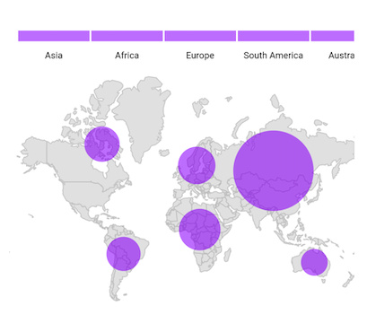
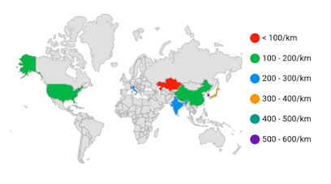
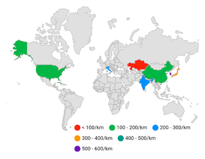
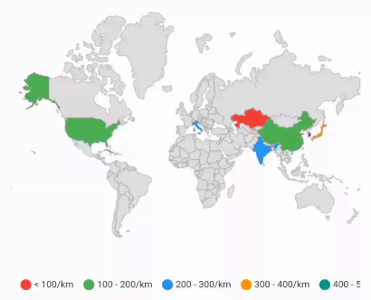
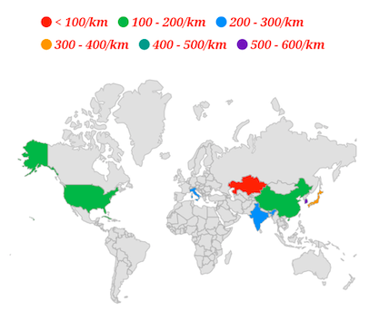
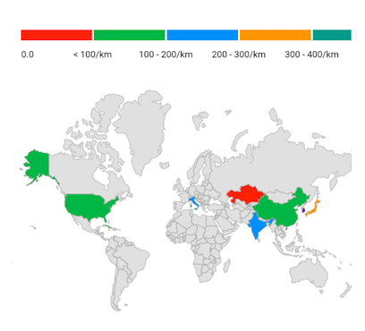
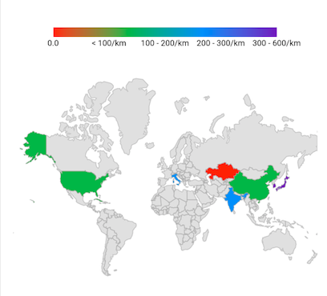
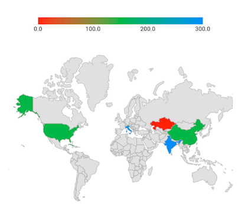
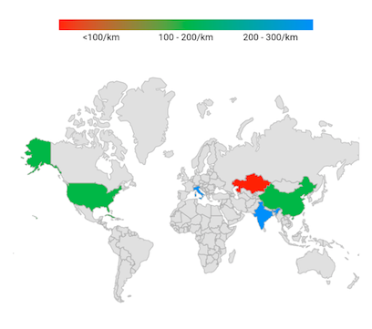

# Legend in the Flutter Maps

You can provide clear information on the data plotted on the map using legend.

## Shape legend

You can show shape legend by setting the [`MapShapeLayer.legend`](https://pub.dev/documentation/syncfusion_flutter_maps/latest/maps/MapLegend-class.html) property as `MapLegend(MapElement.shape)`. By default, the legend item's text is rendered based on the value of [`shapeDataField`](https://pub.dev/documentation/syncfusion_flutter_maps/latest/maps/MapShapeSource/shapeDataField.html) property. The default value of the [`legend`](https://pub.dev/documentation/syncfusion_flutter_maps/latest/maps/MapLegend-class.html) property is `null` and hence the legend will not be shown by default.




MapShapeSource _shapeSource;

@override
void initState() {
  super.initState();

  _shapeSource = MapShapeSource.asset(
    "assets/world_map.json",
    shapeDataField: "continent",
  );
}

@override
Widget build(BuildContext context) {
    return Scaffold(
      body: Center(
        child: Container(
          height: 350,
          child: Padding(
            padding: const EdgeInsets.only(left: 15, right: 15),
            child: SfMaps(
              layers: [
                MapShapeLayer(
                  source: _shapeSource,
                  legend: MapLegend(MapElement.shape),
                ),
              ],
            ),
          ),
        ),
      ),
   );
}




N>
* Refer the [`MapLegend.bar`](https://pub.dev/documentation/syncfusion_flutter_maps/latest/maps/MapLegend/MapLegend.bar.html), for showing bar legend.

## Bubble legend

You can show bubble legend by setting the [`MapShapeLayer.legend`](https://pub.dev/documentation/syncfusion_flutter_maps/latest/maps/MapLegend-class.html) property as `MapLegend(MapElement.bubble)`. By default, the legend item's text is rendered based on the value of [`shapeDataField`](https://pub.dev/documentation/syncfusion_flutter_maps/latest/maps/MapShapeSource/shapeDataField.html) property.




List<Model> _data;
MapShapeSource _shapeSource;

@override
void initState() {
  super.initState();
  _data = <Model>[
    Model('Asia', 150),
    Model('Africa', 45),
    Model('Europe', 34),
    Model('North America', 28),
    Model('South America', 25),
    Model('Australia', 5),
  ];

  _shapeSource = MapShapeSource.asset(
    "assets/world_map.json",
    shapeDataField: "continent",
    dataCount: _data.length,
    primaryValueMapper: (int index) => _data[index].continent,
    bubbleSizeMapper: (int index) => _data[index].populationDensityPerSqKm,
  );
}

@override
Widget build(BuildContext context) {
  return Scaffold(
    body: Center(
      child: Container(
        padding: const EdgeInsets.only(left: 10, right: 15, top: 30),
        height: 350,
        child: SfMaps(
          layers: [
            MapShapeLayer(
              source: _shapeSource,
              legend: MapLegend(MapElement.bubble),
              bubbleSettings: const MapBubbleSettings(
                maxRadius: 45,
                minRadius: 15,
              ),
            )
          ],
        ),
      ),
    ),
  );
}

class Model {
  const Model(this.continent, this.populationDensityPerSqKm);

  final String continent;
  final double populationDensityPerSqKm;
}




N>
* Refer the [`MapLegend.bar`](https://pub.dev/documentation/syncfusion_flutter_maps/latest/maps/MapLegend/MapLegend.bar.html), for showing bar legend.

## Bar shape legend

You can show bar shape legend by setting the [`MapShapeLayer.legend`](https://pub.dev/documentation/syncfusion_flutter_maps/latest/maps/MapLegend/MapLegend.bar.html) property as `MapLegend.bar(MapElement.shape)`. By default, the legend item's text is rendered based on the value of [`shapeDataField`](https://pub.dev/documentation/syncfusion_flutter_maps/latest/maps/MapShapeSource/shapeDataField.html) property.




MapShapeSource _shapeSource;

@override
void initState() {
  super.initState();

  _shapeSource = MapShapeSource.asset(
    "assets/world_map.json",
    shapeDataField: "continent",
  );
}

@override
Widget build(BuildContext context) {
    return Scaffold(
      body: Center(
        child: Container(
          height: 350,
          child: Padding(
            padding: const EdgeInsets.only(left: 15, right: 15),
            child: SfMaps(
              layers: [
                MapShapeLayer(
                  source: _shapeSource,
                  legend: MapLegend.bar(MapElement.shape),
                ),
              ],
            ),
          ),
        ),
      ),
   );
}




N>
* Refer the [`MapLegend`](https://pub.dev/documentation/syncfusion_flutter_maps/latest/maps/MapLegend/MapLegend.html), for showing default legend.

## Bar bubble legend

You can show bar bubble legend by setting the [`MapShapeLayer.legend`](https://pub.dev/documentation/syncfusion_flutter_maps/latest/maps/MapLegend/MapLegend.bar.html) property as `MapLegend.bar(MapElement.bubble)`. By default, the legend item's text is rendered based on the value of [`shapeDataField`](https://pub.dev/documentation/syncfusion_flutter_maps/latest/maps/MapShapeSource/shapeDataField.html) property.




List<Model> _data;
MapShapeSource _shapeSource;

@override
void initState() {
  super.initState();
  _data = <Model>[
    Model('Asia', 150),
    Model('Africa', 45),
    Model('Europe', 34),
    Model('North America', 28),
    Model('South America', 25),
    Model('Australia', 5),
  ];

  _shapeSource = MapShapeSource.asset(
    "assets/world_map.json",
    shapeDataField: "continent",
    dataCount: _data.length,
    primaryValueMapper: (int index) => _data[index].continent,
    bubbleSizeMapper: (int index) => _data[index].populationDensityPerSqKm,
  );
}

@override
Widget build(BuildContext context) {
  return Scaffold(
    body: Center(
      child: Container(
        padding: const EdgeInsets.only(left: 10, right: 15, top: 30),
        height: 350,
        child: SfMaps(
          layers: [
            MapShapeLayer(
              source: _shapeSource,
              legend: MapLegend.bar(MapElement.bubble),
              bubbleSettings: const MapBubbleSettings(
                maxRadius: 45,
                minRadius: 15,
              ),
            )
          ],
        ),
      ),
    ),
  );
}

class Model {
  const Model(this.continent, this.populationDensityPerSqKm);

  final String continent;
  final double populationDensityPerSqKm;
}




N>
* Refer the [`MapLegend`](https://pub.dev/documentation/syncfusion_flutter_maps/latest/maps/MapLegend/MapLegend.html), for showing default legend.

## Icon and text customization

The icons color of the legend is applied based on the colors returned from the [`MapShapeLayerDelegate.shapeColorValueMapper`](https://pub.dev/documentation/syncfusion_flutter_maps/latest/maps/MapShapeSource/shapeColorValueMapper.html) property and the text is taken from the [`shapeDataField`](https://pub.dev/documentation/syncfusion_flutter_maps/latest/maps/MapShapeSource/shapeDataField.html). It is possible to customize the legend icons color and texts using the [`MapColorMapper.color`](https://pub.dev/documentation/syncfusion_flutter_maps/latest/maps/MapColorMapper/color.html) and [`MapColorMapper.text`](https://pub.dev/documentation/syncfusion_flutter_maps/latest/maps/MapColorMapper/text.html) properties based on the [`MapColorMapper.value`](https://pub.dev/documentation/syncfusion_flutter_maps/latest/maps/MapColorMapper/value.html) or [`MapColorMapper.from`](https://pub.dev/documentation/syncfusion_flutter_maps/latest/maps/MapColorMapper/from.html) and [`MapColorMapper.to`](https://pub.dev/documentation/syncfusion_flutter_maps/latest/maps/MapColorMapper/to.html) properties.




List<Model> _data;
MapShapeSource _shapeSource;

@override
void initState() {
  super.initState();
  _data = <Model>[
      Model('India', 280),
      Model('United States of America', 190),
      Model('Kazakhstan', 37),
      Model('Russia', 310)
  ];

  _shapeSource = MapShapeSource.asset("assets/world_map.json",
        shapeDataField: "name",
        dataCount: _data.length,
        primaryValueMapper: (int index) => _data[index].country,
        shapeColorValueMapper: (int index) => _data[index].density,
        shapeColorMappers: [
          MapColorMapper(from: 0, to: 100, color: Colors.red, text: '< 100/km'),
          MapColorMapper(
              from: 101, to: 200, color: Colors.green, text: '100 - 200/km'),
          MapColorMapper(
              from: 201, to: 300, color: Colors.blue, text: '200 - 300/km'),
          MapColorMapper(
              from: 301, to: 400, color: Colors.orange, text: '300 - 400/km'),
  ]);
}

@override
Widget build(BuildContext context) {
    return Scaffold(
      body: Center(
        child: Container(
          height: 350,
          child: Padding(
            padding: const EdgeInsets.only(left: 15, right: 15),
            child: SfMaps(
              layers: [
                MapShapeLayer(
                  source: _shapeSource,
                  legend: MapLegend(MapElement.shape),
                )
              ],
            ),
          ),
        ),
      ),
   );
}

class Model {
  const Model(this.country, this.density);

  final String country;
  final double density;
}




## Position

You can position the legend items in different directions using the [`MapLegend.position`](https://pub.dev/documentation/syncfusion_flutter_maps/latest/maps/MapLegend/position.html) property. The default value of the [`position`](https://pub.dev/documentation/syncfusion_flutter_maps/latest/maps/MapLegend/position.html) property is `MapLegendPosition.top`. The possible values are `left`, `right`, `top`, and `bottom`.




List<Model> _data;
MapShapeSource _shapeSource;

@override
void initState() {
  super.initState();
  _data = <Model>[
      Model('India', 280),
      Model('United States of America', 190),
      Model('Kazakhstan', 37),
      Model('Italy', 201),
      Model('Korea', 512),
      Model('Japan', 335),
      Model('Cuba', 103),
      Model('China', 148)
  ];

  _shapeSource = MapShapeSource.asset("assets/world_map.json",
        shapeDataField: "name",
        dataCount: _data.length,
        primaryValueMapper: (int index) => _data[index].country,
        shapeColorValueMapper: (int index) => _data[index].density,
        shapeColorMappers: [
          MapColorMapper(from: 0, to: 100, color: Colors.red, text: '< 100/km'),
          MapColorMapper(
              from: 101, to: 200, color: Colors.green, text: '100 - 200/km'),
          MapColorMapper(
              from: 201, to: 300, color: Colors.blue, text: '200 - 300/km'),
          MapColorMapper(
              from: 301, to: 400, color: Colors.orange, text: '300 - 400/km'),
          MapColorMapper(
              from: 401, to: 500, color: Colors.teal, text: '400 - 500/km'),
          MapColorMapper(
              from: 501,
              to: 600,
              color: Colors.deepPurple,
              text: '500 - 600/km'),
    ]);
}

@override
Widget build(BuildContext context) {
    return Scaffold(
      body: Center(
        child: Container(
          height: 350,
          child: Padding(
            padding: const EdgeInsets.only(left: 15, right: 15),
            child: SfMaps(
              layers: [
                MapShapeLayer(
                  source: _shapeSource,
                  legend: MapLegend(
                    MapElement.shape,
                    position: MapLegendPosition.right,
                  ),
                )
              ],
            ),
          ),
        ),
      ),
   );
}

class Model {
  const Model(this.country, this.density);

  final String country;
  final double density;
}




N>
* Refer the [`offset`](https://pub.dev/documentation/syncfusion_flutter_maps/latest/maps/MapLegend/offset.html), for placing the legend in custom position.

## Offset

You can place the legend in custom position using the [`MapLegend.offset`](https://pub.dev/documentation/syncfusion_flutter_maps/latest/maps/MapLegend/offset.html) property. The default value of the [`offset`](https://pub.dev/documentation/syncfusion_flutter_maps/latest/maps/MapLegend/offset.html) property is `null`.

If the property [`MapLegend.offset`](https://pub.dev/documentation/syncfusion_flutter_maps/latest/maps/MapLegend/offset.html) has been set with the property [`MapLegend.position`](https://pub.dev/documentation/syncfusion_flutter_maps/latest/maps/MapLegend/position.html) as top, then the legend will be placed in top but with absolute position, i.e. legend will not take dedicated position for it and will be drawn at the top of the map.




List<Model> _data;
MapShapeSource _shapeSource;

@override
void initState() {
    super.initState();
    _data = <Model>[
      Model('India', 280),
      Model('United States of America', 190),
      Model('Kazakhstan', 37),
      Model('Italy', 201),
      Model('Korea', 512),
      Model('Japan', 335),
      Model('Cuba', 103),
      Model('China', 148)
    ];

    _shapeSource = MapShapeSource.asset("assets/world_map.json",
        shapeDataField: "name",
        dataCount: _data.length,
        primaryValueMapper: (int index) => _data[index].country,
        shapeColorValueMapper: (int index) => _data[index].density,
        shapeColorMappers: [
          MapColorMapper(from: 0, to: 100, color: Colors.red, text: '< 100/km'),
          MapColorMapper(
              from: 101, to: 200, color: Colors.green, text: '100 - 200/km'),
          MapColorMapper(
              from: 201, to: 300, color: Colors.blue, text: '200 - 300/km'),
          MapColorMapper(
              from: 301, to: 400, color: Colors.orange, text: '300 - 400/km'),
          MapColorMapper(
              from: 401, to: 500, color: Colors.teal, text: '400 - 500/km'),
          MapColorMapper(
              from: 501,
              to: 600,
              color: Colors.deepPurple,
              text: '500 - 600/km'),
    ]);
}

@override
Widget build(BuildContext context) {
    return Scaffold(
      body: Center(
        child: Container(
          height: 350,
          child: Padding(
            padding: const EdgeInsets.only(left: 15, right: 15),
            child: SfMaps(
              layers: [
                MapShapeLayer(
                  source: _shapeSource,
                  legend: MapLegend(
                    MapElement.shape,
                    offset: Offset(60, 275)),
                )
              ],
            ),
          ),
        ),
      ),
   );
}

class Model {
  const Model(this.country, this.density);

  final String country;
  final double density;
}




## Overflow mode

<b>For default legend</b>

You can wrap or scroll the legend items using the [`MapLegend.overflowMode`](https://pub.dev/documentation/syncfusion_flutter_maps/latest/maps/MapLegend/overflowMode.html) property. The default value of the [`overflowMode`](https://pub.dev/documentation/syncfusion_flutter_maps/latest/maps/MapLegend/overflowMode.html) property is `MapLegendOverflowMode.wrap`. The possible values are `scroll` and `wrap`.

If the legend position is `left` or `right`, then the default scroll direction is `vertical`.

If the legend position is `top` or `bottom`, then the default scroll direction is `horizontal`.




List<Model> _data;
MapShapeSource _shapeSource;

@override
void initState() {
   super.initState();
   _data = <Model>[
      Model('India', 280),
      Model('United States of America', 190),
      Model('Kazakhstan', 37),
      Model('Italy', 201),
      Model('Korea', 512),
      Model('Japan', 335),
      Model('Cuba', 103),
      Model('China', 148)
   ];

   _shapeSource = MapShapeSource.asset("assets/world_map.json",
        shapeDataField: "name",
        dataCount: _data.length,
        primaryValueMapper: (int index) => _data[index].country,
        shapeColorValueMapper: (int index) => _data[index].density,
        shapeColorMappers: [
          MapColorMapper(from: 0, to: 100, color: Colors.red, text: '< 100/km'),
          MapColorMapper(
              from: 101, to: 200, color: Colors.green, text: '100 - 200/km'),
          MapColorMapper(
              from: 201, to: 300, color: Colors.blue, text: '200 - 300/km'),
          MapColorMapper(
              from: 301, to: 400, color: Colors.orange, text: '300 - 400/km'),
          MapColorMapper(
              from: 401, to: 500, color: Colors.teal, text: '400 - 500/km'),
          MapColorMapper(
              from: 501,
              to: 600,
              color: Colors.deepPurple,
              text: '500 - 600/km'),
        ]);
}

@override
Widget build(BuildContext context) {
    return Scaffold(
      body: Center(
        child: Container(
          height: 350,
          child: Padding(
            padding: const EdgeInsets.only(left: 15, right: 15),
            child: SfMaps(
              layers: [
                MapShapeLayer(
                  source: _shapeSource,
                  legend: MapLegend(
                    MapElement.shape,
                    position: MapLegendPosition.bottom,
                    overflowMode: MapLegendOverflowMode.wrap,
                  ),
                )
              ],
            ),
          ),
        ),
      ),
   );
}

class Model {
  const Model(this.country, this.density);

  final String country;
  final double density;
}




<b>For bar legend</b>

You can wrap or scroll the bar legend items using the [`MapLegend.overflowMode`](https://pub.dev/documentation/syncfusion_flutter_maps/latest/maps/MapLegend/overflowMode.html) property. The default value of the [`overflowMode`](https://pub.dev/documentation/syncfusion_flutter_maps/latest/maps/MapLegend/overflowMode.html) property is `MapLegendOverflowMode.scroll`. The possible values are `scroll` and `wrap`.

If the legend position is `left` or `right`, then the default scroll direction is `vertical`.

If the legend position is `top` or `bottom`, then the default scroll direction is `horizontal`.




List<Model> _data;
MapShapeSource _shapeSource;

@override
void initState() {
   super.initState();
   _data = <Model>[
      Model('India', 280),
      Model('United States of America', 190),
      Model('Kazakhstan', 37),
      Model('Italy', 201),
      Model('Korea', 512),
      Model('Japan', 335),
      Model('Cuba', 103),
      Model('China', 148)
   ];

   _shapeSource = MapShapeSource.asset("assets/world_map.json",
        shapeDataField: "name",
        dataCount: _data.length,
        primaryValueMapper: (int index) => _data[index].country,
        shapeColorValueMapper: (int index) => _data[index].density,
        shapeColorMappers: [
          MapColorMapper(from: 0, to: 100, color: Colors.red, text: '< 100/km'),
          MapColorMapper(
              from: 101, to: 200, color: Colors.green, text: '100 - 200/km'),
          MapColorMapper(
              from: 201, to: 300, color: Colors.blue, text: '200 - 300/km'),
          MapColorMapper(
              from: 301, to: 400, color: Colors.orange, text: '300 - 400/km'),
          MapColorMapper(
              from: 401, to: 500, color: Colors.teal, text: '400 - 500/km'),
          MapColorMapper(
              from: 501,
              to: 600,
              color: Colors.deepPurple,
              text: '500 - 600/km'),
        ]);
}

@override
Widget build(BuildContext context) {
    return Scaffold(
      body: Center(
        child: Container(
          height: 350,
          child: Padding(
            padding: const EdgeInsets.only(left: 15, right: 15),
            child: SfMaps(
              layers: [
                MapShapeLayer(
                  source: _shapeSource,
                  legend: MapLegend.bar(
                    MapElement.shape,
                    position: MapLegendPosition.bottom,
                    edgeLabelsPlacement: MapLegendEdgeLabelsPlacement.center,
                    overflowMode: MapLegendOverflowMode.scroll,
                  ),
                )
              ],
            ),
          ),
        ),
      ),
   );
}

class Model {
  const Model(this.country, this.density);

  final String country;
  final double density;
}




N>
* Refer the [`iconSize`](https://pub.dev/documentation/syncfusion_flutter_maps/latest/maps/MapLegend/MapLegend.html), for setting the size of the icon.

## Legend toggling

N> Legend toggling is not applicable for bar type legend.

You can enable toggling the legend items and the corresponding shapes or bubbles using the [`enableToggleInteraction`](https://pub.dev/documentation/syncfusion_flutter_maps/latest/maps/MapLegend/MapLegend.html) argument in the [`constructor`](https://pub.dev/documentation/syncfusion_flutter_maps/latest/maps/MapLegend/MapLegend.html). The default value of the [`enableToggleInteraction`](https://pub.dev/documentation/syncfusion_flutter_maps/latest/maps/MapLegend/MapLegend.html) argument in the [`constructor`](https://pub.dev/documentation/syncfusion_flutter_maps/latest/maps/MapLegend/MapLegend.html) is `false`. You can customize the toggled shapes or bubbles using the following properties:

* **Toggled item color** - Change the color for the toggled legend item's icon and it's shape or bubble using the [`toggledItemColor`](https://pub.dev/documentation/syncfusion_flutter_maps/latest/maps/MapLegend/MapLegend.html) argument in the [`constructor`](https://pub.dev/documentation/syncfusion_flutter_maps/latest/maps/MapLegend/MapLegend.html).
* **Toggled item stroke color** - Change the stroke color which applies to the toggled legend item's shape or bubble using the [`toggledItemStrokeColor`](https://pub.dev/documentation/syncfusion_flutter_maps/latest/maps/MapLegend/MapLegend.html) argument in the [`constructor`](https://pub.dev/documentation/syncfusion_flutter_maps/latest/maps/MapLegend/MapLegend.html).
* **Toggled item stroke width** - Change the stroke width which applies to the toggled legend item's shape or bubble using the [`toggledItemStrokeWidth`](https://pub.dev/documentation/syncfusion_flutter_maps/latest/maps/MapLegend/MapLegend.html) argument in the [`constructor`](https://pub.dev/documentation/syncfusion_flutter_maps/latest/maps/MapLegend/MapLegend.html).
* **Toggled item opacity** - Change the opacity of the toggled legend item's shape or bubble using the [`toggledItemOpacity`](https://pub.dev/documentation/syncfusion_flutter_maps/latest/maps/MapLegend/MapLegend.html) argument in the [`constructor`](https://pub.dev/documentation/syncfusion_flutter_maps/latest/maps/MapLegend/MapLegend.html).




List<Model> _data;
MapShapeSource _shapeSource;

@override
void initState() {
   super.initState();
   _data = <Model>[
      Model('India', 280),
      Model('United States of America', 190),
      Model('Kazakhstan', 37),
      Model('Italy', 201),
      Model('Korea', 512),
      Model('Japan', 335),
      Model('Cuba', 103),
      Model('China', 148)
   ];

   _shapeSource = MapShapeSource.asset("assets/world_map.json",
        shapeDataField: "name",
        dataCount: _data.length,
        primaryValueMapper: (int index) => _data[index].country,
        shapeColorValueMapper: (int index) => _data[index].density,
        shapeColorMappers: [
          MapColorMapper(from: 0, to: 100, color: Colors.red, text: '< 100/km'),
          MapColorMapper(
              from: 101, to: 200, color: Colors.green, text: '100 - 200/km'),
          MapColorMapper(
              from: 201, to: 300, color: Colors.blue, text: '200 - 300/km'),
          MapColorMapper(
              from: 301, to: 400, color: Colors.orange, text: '300 - 400/km'),
          MapColorMapper(
              from: 401, to: 500, color: Colors.teal, text: '400 - 500/km'),
          MapColorMapper(
              from: 501,
              to: 600,
              color: Colors.deepPurple,
              text: '500 - 600/km'),
    ]);
}

@override
Widget build(BuildContext context) {
    return Scaffold(
      body: Center(
        child: Container(
          height: 350,
          child: Padding(
            padding: const EdgeInsets.only(left: 15, right: 15),
            child: SfMaps(
              layers: [
                MapShapeLayer(
                  source: _shapeSource,
                  legend: MapLegend(
                    MapElement.shape,
                    enableToggleInteraction: true,
                    toggledItemColor: Colors.grey,
                    toggledItemStrokeWidth: 3,
                    toggledItemStrokeColor: Colors.black,
                  ),
                )
              ],
            ),
          ),
        ),
      ),
   );
}

class Model {
  const Model(this.country, this.density);

  final String country;
  final double density;
}




<b>Using SfMapsTheme</b>

You can also customize the below appearance of the legend using [`SfMapsTheme`](https://pub.dev/documentation/syncfusion_flutter_core/latest/theme/SfMapsTheme-class.html).

* **Toggled item color** - Change the color for the toggled legend item's icon and it's shape or bubble using the [`SfMapsThemeData.toggledItemColor`](https://pub.dev/documentation/syncfusion_flutter_core/latest/theme/SfMapsThemeData/toggledItemColor.html) property.
* **Toggled item stroke color** - Change the stroke color which applies to the toggled legend item's shape or bubble using the [`SfMapsThemeData.toggledItemStrokeColor`](https://pub.dev/documentation/syncfusion_flutter_core/latest/theme/SfMapsThemeData/toggledItemStrokeColor.html) property.
* **Toggled item stroke width** - Change the stroke width which applies to the toggled legend item's shape or bubble using the [`SfMapsThemeData.toggledItemStrokeWidth`](https://pub.dev/documentation/syncfusion_flutter_core/latest/theme/SfMapsThemeData/toggledItemStrokeWidth.html) property.

N> You must import the `theme.dart` library from the [`Core`](https://pub.dev/packages/syncfusion_flutter_core) package to use [`SfMapsTheme`](https://pub.dev/documentation/syncfusion_flutter_core/latest/theme/SfMapsTheme-class.html).




List<Model> _data;
MapShapeSource _shapeSource;

@override
void initState() {
    super.initState();
    _data = <Model>[
      Model('India', 280),
      Model('United States of America', 190),
      Model('Kazakhstan', 37),
      Model('Italy', 201),
      Model('Korea', 512),
      Model('Japan', 335),
      Model('Cuba', 103),
      Model('China', 148)
   ];

   _shapeSource = MapShapeSource.asset("assets/world_map.json",
        shapeDataField: "name",
        dataCount: _data.length,
        primaryValueMapper: (int index) => _data[index].country,
        shapeColorValueMapper: (int index) => _data[index].density,
        shapeColorMappers: [
          MapColorMapper(from: 0, to: 100, color: Colors.red, text: '< 100/km'),
          MapColorMapper(
              from: 101, to: 200, color: Colors.green, text: '100 - 200/km'),
          MapColorMapper(
              from: 201, to: 300, color: Colors.blue, text: '200 - 300/km'),
          MapColorMapper(
              from: 301, to: 400, color: Colors.orange, text: '300 - 400/km'),
          MapColorMapper(
              from: 401, to: 500, color: Colors.teal, text: '400 - 500/km'),
          MapColorMapper(
              from: 501,
              to: 600,
              color: Colors.deepPurple,
              text: '500 - 600/km'),
    ]);
}

@override
Widget build(BuildContext context) {
    return Scaffold(
      body: Center(
        child: Container(
          height: 350,
          child: Padding(
            padding: const EdgeInsets.only(left: 15, right: 15),
            child: SfMapsTheme(
              data: SfMapsThemeData(
                toggledItemColor: Colors.grey,
                toggledItemStrokeWidth: 3,
                toggledItemStrokeColor: Colors.black,
              ),
              child: SfMaps(
                layers: [
                  MapShapeLayer(
                    source: _shapeSource,
                    legend: MapLegend(
                      MapElement.shape,
                      enableToggleInteraction: true,
                    ),
                  )
                ],
              ),
            ),
          ),
        ),
      ),
   );
}

class Model {
   Model(this.country, this.density);

   final String country;
   final double density;
}




## Text style

You can customize the legend item's text style using the [`MapLegend.textStyle`](https://pub.dev/documentation/syncfusion_flutter_maps/latest/maps/MapLegend/textStyle.html) property.




List<Model> _data;
MapShapeSource _shapeSource;

@override
void initState() {
    super.initState();
    _data = <Model>[
      Model('India', 280),
      Model('United States of America', 190),
      Model('Kazakhstan', 37),
      Model('Italy', 201),
      Model('Korea', 512),
      Model('Japan', 335),
      Model('Cuba', 103),
      Model('China', 148)
   ];

   _shapeSource = MapShapeSource.asset("assets/world_map.json",
        shapeDataField: "name",
        dataCount: _data.length,
        primaryValueMapper: (int index) => _data[index].country,
        shapeColorValueMapper: (int index) => _data[index].density,
        shapeColorMappers: [
          MapColorMapper(from: 0, to: 100, color: Colors.red, text: '< 100/km'),
          MapColorMapper(
              from: 101, to: 200, color: Colors.green, text: '100 - 200/km'),
          MapColorMapper(
              from: 201, to: 300, color: Colors.blue, text: '200 - 300/km'),
          MapColorMapper(
              from: 301, to: 400, color: Colors.orange, text: '300 - 400/km'),
          MapColorMapper(
              from: 401, to: 500, color: Colors.teal, text: '400 - 500/km'),
          MapColorMapper(
              from: 501,
              to: 600,
              color: Colors.deepPurple,
              text: '500 - 600/km'),
        ]);
}

@override
Widget build(BuildContext context) {
    return Scaffold(
      body: Center(
        child: Container(
          height: 350,
          child: Padding(
            padding: const EdgeInsets.only(left: 15, right: 15),
            child: SfMaps(
              layers: [
                MapShapeLayer(
                  source: _shapeSource,
                  legend: MapLegend(
                    MapElement.shape,
                    textStyle: const TextStyle(
                        color: Colors.red,
                        fontSize: 16,
                        fontWeight: FontWeight.bold,
                        fontStyle: FontStyle.italic,
                        fontFamily: 'Times'
                    ),
                  ),
                )
              ],
            ),
          ),
        ),
      ),
   );
}

class Model {
  Model(this.country, this.density);

  final String country;
  final double density;
}




<b>Using SfMapsTheme</b>

You can also customize the legend item's text style using the [`SfMapsThemeData.legendTextStyle`](https://pub.dev/documentation/syncfusion_flutter_core/latest/theme/SfMapsThemeData/legendTextStyle.html) property in [`SfMapsTheme`](https://pub.dev/documentation/syncfusion_flutter_core/latest/theme/SfMapsTheme-class.html).

N> You must import the `theme.dart` library from the [`Core`](https://pub.dev/packages/syncfusion_flutter_core) package to use [`SfMapsTheme`](https://pub.dev/documentation/syncfusion_flutter_core/latest/theme/SfMapsTheme-class.html).




List<Model> _data;
MapShapeSource _shapeSource;

@override
void initState() {
    super.initState();
    _data = <Model>[
      Model('India', 280),
      Model('United States of America', 190),
      Model('Kazakhstan', 37),
      Model('Italy', 201),
      Model('Korea', 512),
      Model('Japan', 335),
      Model('Cuba', 103),
      Model('China', 148)
   ];

   _shapeSource = MapShapeSource.asset("assets/world_map.json",
        shapeDataField: "name",
        dataCount: _data.length,
        primaryValueMapper: (int index) => _data[index].country,
        shapeColorValueMapper: (int index) => _data[index].density,
        shapeColorMappers: [
          MapColorMapper(from: 0, to: 100, color: Colors.red, text: '< 100/km'),
          MapColorMapper(
              from: 101, to: 200, color: Colors.green, text: '100 - 200/km'),
          MapColorMapper(
              from: 201, to: 300, color: Colors.blue, text: '200 - 300/km'),
          MapColorMapper(
              from: 301, to: 400, color: Colors.orange, text: '300 - 400/km'),
          MapColorMapper(
              from: 401, to: 500, color: Colors.teal, text: '400 - 500/km'),
          MapColorMapper(
              from: 501,
              to: 600,
              color: Colors.deepPurple,
              text: '500 - 600/km'),
        ]);
}

@override
Widget build(BuildContext context) {
    return Scaffold(
      body: Center(
        child: Container(
          height: 350,
          child: Padding(
            padding: const EdgeInsets.only(left: 15, right: 15),
            child: SfMapsTheme(
              data: SfMapsThemeData(
                legendTextStyle: TextStyle(
                    color: Colors.red,
                    fontSize: 16,
                    fontWeight: FontWeight.bold,
                    fontStyle: FontStyle.italic,
                    fontFamily: 'Times'
                ),
              ),
              child: SfMaps(
                layers: [
                  MapShapeLayer(
                    source: _shapeSource,
                    legend: MapLegend(MapElement.shape),
                  )
                ],
              ),
            ),
          ),
        ),
      ),
    );
  }
}

class Model {
  const Model(this.country, this.density);

  final String country;
  final double density;
}




## Default legend appearance customization

You can customize the legend items using the following properties.

* **iconType** - Used to change the icon shape. The default value of the [`iconType`](https://pub.dev/documentation/syncfusion_flutter_maps/latest/maps/MapLegend/MapLegend.html) argument in the [`constructor`](https://pub.dev/documentation/syncfusion_flutter_maps/latest/maps/MapLegend/MapLegend.html) is `MapIconType.circle`. The possible values are `circle`, `rectangle`, `triangle`, and `diamond`.
* **iconSize** - Used to change the size of the icon. The default value of [`iconSize`](https://pub.dev/documentation/syncfusion_flutter_maps/latest/maps/MapLegend/MapLegend.html) argument in the [`constructor`](https://pub.dev/documentation/syncfusion_flutter_maps/latest/maps/MapLegend/MapLegend.html) is `Size(12.0, 12.0)`.
* **spacing** - Used to provide space between the each legend items. The default value of the [`spacing`](https://pub.dev/documentation/syncfusion_flutter_maps/latest/maps/MapLegend/MapLegend.html) argument in the [`constructor`](https://pub.dev/documentation/syncfusion_flutter_maps/latest/maps/MapLegend/MapLegend.html) is `10.0`.
* **direction** - Used to arrange the legend items in either horizontal or vertical direction. The default value of [`direction`](https://pub.dev/documentation/syncfusion_flutter_maps/latest/maps/MapLegend/MapLegend.html) property is `horizontal`, if the value of the [`position`](https://pub.dev/documentation/syncfusion_flutter_maps/latest/maps/MapLegend/MapLegend.html) property is `top`, `bottom` and defaults to `vertical`, if the value of the [`position`](https://pub.dev/documentation/syncfusion_flutter_maps/latest/maps/MapLegend/MapLegend.html) property is `left` or `right`.
* **padding** - Used to set padding around the legend. The default value of the [`padding`](https://pub.dev/documentation/syncfusion_flutter_maps/latest/maps/MapLegend/MapLegend.html) property is `EdgeInsets.all(10.0)`.




List<Model> _data;
MapShapeSource _shapeSource;

@override
void initState() {
    super.initState();
    _data = <Model>[
      Model('India', 280),
      Model('United States of America', 190),
      Model('Kazakhstan', 37),
      Model('Italy', 201),
      Model('Korea', 512),
      Model('Japan', 335),
      Model('Cuba', 103),
      Model('China', 148)
    ];

    _shapeSource = MapShapeSource.asset("assets/world_map.json",
        shapeDataField: "name",
        dataCount: _data.length,
        primaryValueMapper: (int index) => _data[index].country,
        shapeColorValueMapper: (int index) => _data[index].density,
        shapeColorMappers: [
          MapColorMapper(from: 0, to: 100, color: Colors.red, text: '< 100/km'),
          MapColorMapper(
              from: 101, to: 200, color: Colors.green, text: '100 - 200/km'),
          MapColorMapper(
              from: 201, to: 300, color: Colors.blue, text: '200 - 300/km'),
          MapColorMapper(
              from: 301, to: 400, color: Colors.orange, text: '300 - 400/km'),
          MapColorMapper(
              from: 401, to: 500, color: Colors.teal, text: '400 - 500/km'),
          MapColorMapper(
              from: 501,
              to: 600,
              color: Colors.deepPurple,
              text: '500 - 600/km'),
        ]);
}

@override
Widget build(BuildContext context) {
    return Scaffold(
      body: Center(
        child: Container(
          height: 350,
          child: Padding(
            padding: const EdgeInsets.only(left: 15, right: 15),
            child: SfMaps(
              layers: [
                MapShapeLayer(
                  source: _shapeSource,
                  legend: MapLegend(
                    MapElement.shape,
                    position: MapLegendPosition.bottom,
                    overflowMode: MapLegendOverflowMode.wrap,
                    iconType: MapIconType.square,
                    iconSize: Size(15.0, 15.0),
                    itemsSpacing: 15,
                  ),
                )
              ],
            ),
          ),
        ),
      ),
   );
}

class Model {
  const Model(this.country, this.density);

  final String country;
  final double density;
}




N>
* Refer the [`position`](https://pub.dev/documentation/syncfusion_flutter_maps/latest/maps/MapLegend/position.html), for setting the position of the legend.

## Bar legend segment painting style

### Solid

You can set solid color for the bar by using the [MapLegendPaintingStyle.solid](https://pub.dev/documentation/syncfusion_flutter_maps/latest/maps/MapLegendPaintingStyle-class.html). By defaults [MapLegendPaintingStyle](https://pub.dev/documentation/syncfusion_flutter_maps/latest/maps/MapLegend/MapLegend.bar.html) will be `solid`.




List<Model> _data;
MapShapeSource _shapeSource;

@override
void initState() {
   super.initState();
   _data = <Model>[
      Model('India', 280),
      Model('United States of America', 190),
      Model('Kazakhstan', 37),
      Model('Italy', 201),
      Model('Korea', 512),
      Model('Japan', 335),
      Model('Cuba', 103),
      Model('China', 148)
   ];

   _shapeSource = MapShapeSource.asset("assets/world_map.json",
        shapeDataField: "name",
        dataCount: _data.length,
        primaryValueMapper: (int index) => _data[index].country,
        shapeColorValueMapper: (int index) => _data[index].density,
        shapeColorMappers: [
          MapColorMapper(from: 0, to: 100, color: Colors.red, text: '< 100/km'),
          MapColorMapper(
              from: 101, to: 200, color: Colors.green, text: '100 - 200/km'),
          MapColorMapper(
              from: 201, to: 300, color: Colors.blue, text: '200 - 300/km'),
          MapColorMapper(
              from: 301, to: 400, color: Colors.orange, text: '300 - 400/km'),
          MapColorMapper(
              from: 401, to: 500, color: Colors.teal, text: '400 - 500/km'),
          MapColorMapper(
              from: 501,
              to: 600,
              color: Colors.deepPurple,
              text: '500 - 600/km'),
        ]);
}

@override
Widget build(BuildContext context) {
    return Scaffold(
      body: Center(
        child: Container(
          height: 350,
          child: Padding(
            padding: EdgeInsets.only(left: 15, right: 15),
            child: SfMaps(
              layers: [
                MapShapeLayer(
                  source: _shapeSource,
                  legend: MapLegend.bar(
                    MapElement.shape,
                    segmentPaintingStyle: MapLegendPaintingStyle.solid,
                  ),
                )
              ],
            ),
          ),
        ),
      ),
   );
}

class Model {
  const Model(this.country, this.density);

  final String country;
  final double density;
}




### Gradient

You can set gradient color for the bar by using the [MapLegendPaintingStyle.gradient](https://pub.dev/documentation/syncfusion_flutter_maps/latest/maps/MapLegendPaintingStyle-class.html).




List<Model> _data;
MapShapeSource _shapeSource;

@override
void initState() {
   super.initState();
   _data = <Model>[
      Model('India', 280),
      Model('United States of America', 190),
      Model('Kazakhstan', 37),
      Model('Italy', 201),
      Model('Korea', 512),
      Model('Japan', 335),
      Model('Cuba', 103),
      Model('China', 148)
   ];

    _shapeSource = MapShapeSource.asset("assets/world_map.json",
           shapeDataField: "name",
           dataCount: _data.length,
           primaryValueMapper: (int index) => _data[index].country,
           shapeColorValueMapper: (int index) => _data[index].density,
           shapeColorMappers: [
             MapColorMapper(from: 0, to: 100, color: Colors.red, text: '< 100/km'),
             MapColorMapper(
                 from: 101, to: 200, color: Colors.green, text: '100 - 200/km'),
             MapColorMapper(
                 from: 201, to: 300, color: Colors.blue, text: '200 - 300/km'),
             MapColorMapper(
                 from: 301,
                 to: 600,
                 color: Colors.deepPurple,
                 text: '300 - 600/km'),
    ]);
}

@override
Widget build(BuildContext context) {
    return Scaffold(
      body: Center(
        child: Container(
          height: 350,
          child: Padding(
            padding: EdgeInsets.only(left: 15, right: 15),
            child: SfMaps(
              layers: [
                MapShapeLayer(
                  source: _shapeSource,
                  legend: MapLegend.bar(
                    MapElement.shape,
                    labelsPlacement: MapLegendLabelsPlacement.betweenItems,
                    edgeLabelsPlacement: MapLegendEdgeLabelsPlacement.center,
                    segmentPaintingStyle: MapLegendPaintingStyle.gradient,
                  ),
                )
              ],
            ),
          ),
        ),
      ),
   );
}

class Model {
  const Model(this.country, this.density);

  final String country;
  final double density;
}




## Bar legend appearance customization

You can customize the legend items using the following properties.

* **segmentSize** - Used to change the size of individual bar segments. When gradient paint style is applied, `segmentSize` argument in the [`constructor`](https://pub.dev/documentation/syncfusion_flutter_maps/latest/maps/MapLegend/MapLegend.bar.html) will update the whole bar.
* **labelOverflow** - Used to remove or trim the legend labels based on the bar legend size.The default value of the [`labelOverflow`](https://pub.dev/documentation/syncfusion_flutter_maps/latest/maps/MapLegend/MapLegend.bar.html) argument in the [`constructor`](https://pub.dev/documentation/syncfusion_flutter_maps/latest/maps/MapLegend/MapLegend.bar.html) will be `MapLabelOverflow.hide`.
* **edgeLabelsPlacement** - Used to place the edge labels either inside or outside of the bar legend. The default value of the [`edgeLabelsPlacement`](https://pub.dev/documentation/syncfusion_flutter_maps/latest/maps/MapLegend/MapLegend.bar.html) argument in the [`constructor`](https://pub.dev/documentation/syncfusion_flutter_maps/latest/maps/MapLegend/MapLegend.bar.html) will be `MapLegendEdgeLabelsPlacement.inside`.
* **spacing** - Used to provide space between the each legend items. The default value of the [`spacing`](https://pub.dev/documentation/syncfusion_flutter_maps/latest/maps/MapLegend/spacing.html) is `2.0`. This is not applicable for gradient legend.
* **direction** - Used to arrange the legend items in either horizontal or vertical direction. The default value of [`direction`](https://pub.dev/documentation/syncfusion_flutter_maps/latest/maps/MapLegend/direction.html) property is `horizontal`, if the value of the [`position`](https://pub.dev/documentation/syncfusion_flutter_maps/latest/maps/MapLegend/position.html) property is `top`, `bottom` and defaults to `vertical`, if the value of the [`position`](https://pub.dev/documentation/syncfusion_flutter_maps/latest/maps/MapLegend/position.html) property is `left` or `right`.
* **padding** - Used to set padding around the legend. The default value of the [`padding`](https://pub.dev/documentation/syncfusion_flutter_maps/latest/maps/MapLegend/padding.html) property is `EdgeInsets.all(10.0)`.




List<Model> _data;
MapShapeSource _shapeSource;

@override
void initState() {
   super.initState();
   _data = <Model>[
      Model('India', 280),
      Model('United States of America', 190),
      Model('Kazakhstan', 37),
      Model('Italy', 201),
      Model('Korea', 512),
      Model('Japan', 335),
      Model('Cuba', 103),
      Model('China', 148)
   ];

    _shapeSource = MapShapeSource.asset("assets/world_map.json",
           shapeDataField: "name",
           dataCount: _data.length,
           primaryValueMapper: (int index) => _data[index].country,
           shapeColorValueMapper: (int index) => _data[index].density,
           shapeColorMappers: [
             MapColorMapper(from: 0, to: 100, color: Colors.red, text: '< 100/km'),
             MapColorMapper(
                 from: 101, to: 200, color: Colors.green, text: '100 - 200/km'),
             MapColorMapper(
                 from: 201, to: 300, color: Colors.blue, text: '200 - 300/km'),
             MapColorMapper(
                 from: 301,
                 to: 600,
                 color: Colors.deepPurple,
                 text: '300 - 600/km'),
    ]);
}

@override
Widget build(BuildContext context) {
    return Scaffold(
      body: Center(
        child: Container(
          height: 350,
          child: Padding(
            padding: EdgeInsets.only(left: 15, right: 15),
            child: SfMaps(
              layers: [
                MapShapeLayer(
                  source: _shapeSource,
                  legend: MapLegend.bar(
                    MapElement.shape,
                    labelsPlacement: MapLegendLabelsPlacement.betweenItems,
                    edgeLabelsPlacement: MapLegendEdgeLabelsPlacement.center,
                    segmentPaintingStyle: MapLegendPaintingStyle.gradient,
                    labelOverflow: MapLabelOverflow.ellipsis,
                  ),
                )
              ],
            ),
          ),
        ),
      ),
   );
}

class Model {
  const Model(this.country, this.density);

  final String country;
  final double density;
}




## Bar legend label placement appearance

You can place the labels either between the segments or on the segments using the [`labelsPlacement`](https://pub.dev/documentation/syncfusion_flutter_maps/latest/maps/MapLegendLabelsPlacement-class.html) property.

</b>Labels positioning at range color mapper</b>

The labels are positioned between the segments when setting range color mapper without setting color mapper [`MapColorMapper.text`](https://pub.dev/documentation/syncfusion_flutter_maps/latest/maps/MapColorMapper/text.html) property. The [`MapColorMapper.from`](https://pub.dev/documentation/syncfusion_flutter_maps/latest/maps/MapColorMapper/from.html) value of the first item is positioned at starting point of the first segment and the [`MapColorMapper.to`](https://pub.dev/documentation/syncfusion_flutter_maps/latest/maps/MapColorMapper/to.html) value of the first item is placed at the first segment end position. For other segments, the values of [`MapColorMapper.to`](https://pub.dev/documentation/syncfusion_flutter_maps/latest/maps/MapColorMapper/to.html) is positioned as label between the other segments.




List<Model> _data;
MapShapeSource _shapeSource;

@override
void initState() {
  super.initState();
  _data = <Model>[
    Model('India', 280),
    Model('United States of America', 190),
    Model('Kazakhstan', 37),
    Model('Italy', 201),
    Model('Cuba', 103),
    Model('China', 148),
];

_shapeSource = MapShapeSource.asset("assets/world_map.json",
    shapeDataField: "name",
    dataCount: _data.length,
    primaryValueMapper: (int index) => _data[index].country,
    shapeColorValueMapper: (int index) => _data[index].density,
    shapeColorMappers: [
      MapColorMapper(from: 0, to: 100, color: Colors.red),
      MapColorMapper(
              from: 101, to: 200, color: Colors.green),
      MapColorMapper(
              from: 201, to: 300, color: Colors.blue),
    ]
  );
}

@override
Widget build(BuildContext context) {
  return Scaffold(
      body: Center(
        child: Container(
          height: 350,
          child: Padding(
            padding: EdgeInsets.only(left: 15, right: 15),
            child: SfMaps(
              layers: [
                MapShapeLayer(
                  source: _shapeSource,
                  legend: MapLegend.bar(
                    MapElement.shape,
                    labelsPlacement: MapLegendLabelsPlacement.betweenItems,
                    segmentPaintingStyle: MapLegendPaintingStyle.gradient,
                  ),
                )
              ],
            ),
          ),
        ),
     ),
  );
}

class Model {
  const Model(this.country, this.density);

  final String country;
  final double density;
}




The labels are positioned between the segments when setting range color mapper along with setting color mapper [`MapColorMapper.text`](https://pub.dev/documentation/syncfusion_flutter_maps/latest/maps/MapColorMapper/text.html) property. The [`MapColorMapper.from`] value of the first item is positioned at starting point of the first segment and the [`MapColorMapper.text`] value of the first item is placed at the first segment end position. For Other segments, the value of [`MapColorMapper.text`] is positioned as label between the segments.




List<Model> _data;
MapShapeSource _shapeSource;

@override
void initState() {
  super.initState();
  _data = <Model>[
    Model('India', 280),
    Model('United States of America', 190),
    Model('Kazakhstan', 37),
    Model('Italy', 201),
    Model('Cuba', 103),
    Model('China', 148),
  ];

  _shapeSource = MapShapeSource.asset("assets/world_map.json",
    shapeDataField: "name",
    dataCount: _data.length,
    primaryValueMapper: (int index) => _data[index].country,
    shapeColorValueMapper: (int index) => _data[index].density,
    shapeColorMappers: [
        MapColorMapper(from: 0, to: 100, color: Colors.red, text: '<100/km'),
        MapColorMapper(from: 101, to: 200, color: Colors.green, text: '100 - 200/km'),
        MapColorMapper(from: 201, to: 300, color: Colors.blue, text: '200 - 300/km'),
    ]
  );
}

@override
Widget build(BuildContext context) {
  return Scaffold(
      body: Center(
        child: Container(
          height: 350,
          child: Padding(
            padding: EdgeInsets.only(left: 15, right: 15),
            child: SfMaps(
              layers: [
                MapShapeLayer(
                  source: _shapeSource,
                  legend: MapLegend.bar(
                    MapElement.shape,
                    labelsPlacement: MapLegendLabelsPlacement.betweenItems,
                    segmentPaintingStyle: MapLegendPaintingStyle.gradient,
                  ),
                )
              ],
            ),
          ),
        ),
     ),
  );
}

class Model {
  const Model(this.country, this.density);

  final String country;
  final double density;
}




The labels are positioned at the center of the segments when setting the [`labelsPlacement`](https://pub.dev/documentation/syncfusion_flutter_maps/latest/maps/MapLegendLabelsPlacement-class.html) property to `MapLegendLabelsPlacement.onItem`. The labels calculated based on the value of [MapColorMapper.text](https://pub.dev/documentation/syncfusion_flutter_maps/latest/maps/MapColorMapper/text.html) property. If the value of [MapColorMapper.text](https://pub.dev/documentation/syncfusion_flutter_maps/latest/maps/MapColorMapper/text.html) property is null, labels calculated based on the values of [`MapColorMapper.from`](https://pub.dev/documentation/syncfusion_flutter_maps/latest/maps/MapColorMapper/from.html) and [`MapColorMapper.to`](https://pub.dev/documentation/syncfusion_flutter_maps/latest/maps/MapColorMapper/to.html) properties.




List<Model> _data;
MapShapeSource _shapeSource;

@override
void initState() {
  super.initState();
  _data = <Model>[
    Model('India', 280),
    Model('United States of America', 190),
    Model('Kazakhstan', 37),
    Model('Italy', 201),
    Model('Cuba', 103),
    Model('China', 148),
];

_shapeSource = MapShapeSource.asset("assets/world_map.json",
    shapeDataField: "name",
    dataCount: _data.length,
    primaryValueMapper: (int index) => _data[index].country,
    shapeColorValueMapper: (int index) => _data[index].density,
    shapeColorMappers: [
        MapColorMapper(from: 0, to: 100, color: Colors.red, text: '<100/km'),
        MapColorMapper(from: 101, to: 200, color: Colors.green, text: '100 - 200/km'),
        MapColorMapper(from: 201, to: 300, color: Colors.blue, text: '200 - 300/km'),
    ]
  );
}

@override
Widget build(BuildContext context) {
  return Scaffold(
      body: Center(
        child: Container(
          height: 350,
          child: Padding(
            padding: EdgeInsets.only(left: 15, right: 15),
            child: SfMaps(
              layers: [
                MapShapeLayer(
                  source: _shapeSource,
                  legend: MapLegend.bar(
                    MapElement.shape,
                    labelsPlacement: MapLegendLabelsPlacement.onItem,
                    edgeLabelsPlacement: MapLegendEdgeLabelsPlacement.center,
                    segmentPaintingStyle: MapLegendPaintingStyle.gradient,
                  ),
                )
              ],
            ),
          ),
        ),
     ),
  );
}

class Model {
  const Model(this.country, this.density);

  final String country;
  final double density;
}




</b>Labels positioning at equal color mapper</b>

The `labelsPlacement` option is not applicable for the shape/bubble applied with equal color mapper. By default, the labels are positioned at center of the segment.




List<Model> _data;
MapShapeSource _dataSource;

@override
void initState() {
  _data = <Model>[
    Model('India', "Low"),
    Model('United States of America', "High"),
    Model('Pakistan', "Low"),
    Model('Brazil', "Medium"),
  ];

   _dataSource = MapShapeSource.asset(
     "assets/world_map.json",
     shapeDataField: "name",
     dataCount: _data.length,
     primaryValueMapper: (int index) {
        return _data[index].country;
     },
     shapeColorValueMapper: (int index) {
       return _data[index].storage;
     },
     shapeColorMappers: [
        MapColorMapper(value: "Low", color: Colors.green),
        MapColorMapper(value: "Medium", color: Colors.blue),
        MapColorMapper(value: "High", color: Colors.red),
     ],
  );
  super.initState();
}

@override
Widget build(BuildContext context) {
  return Scaffold(
    body: Center(
       child: Container(
          height: 350,
          child: Padding(
            padding: EdgeInsets.only(left: 15, right: 15),
            child: SfMaps(
              layers: <MapShapeLayer>[
                MapShapeLayer(
                  source: _dataSource,
                  legend: MapLegend.bar(
                    MapElement.shape,
                    edgeLabelsPlacement: MapLegendEdgeLabelsPlacement.center,
                    segmentPaintingStyle: MapLegendPaintingStyle.gradient,
                  ),
                ),
              ],
            ),
          ),
        ),
     ),
  );
}

class Model {
  const Model(this.country, this.storage);

  final String country;
  final String storage;
}




